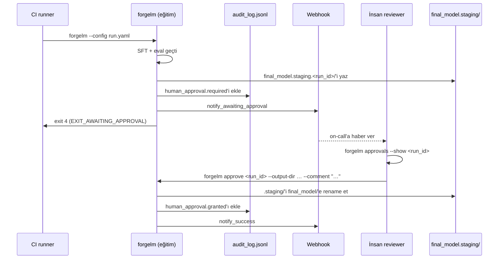

# İnsan Onay Kapısı Rehberi (`forgelm approve` / `reject` / `approvals`)

> **EU AI Act Madde 14**, yüksek-riskli AI sistemlerinin yaşam
> döngüleri boyunca etkili insan gözetimine olanak vermesini gerektirir.
> ForgeLM bunu, bir insan reviewer tamper-evident audit zincirine
> `approve` veya `reject` kararını imzalayana kadar model terfisini
> duraklatan config-güdümlü bir kapı olarak uygular.

Bu rehber deployer-yüzlü walkthrough'tur: kapı uçtan uca neye benzer, etrafında CI nasıl kurulur ve kapının audit kanıtı nasıl doğrulanır. Daha kısa olan [`docs/usermanuals/tr/compliance/human-oversight.md`](../usermanuals/tr/compliance/human-oversight.md) operatör hızlı-referansıdır; bu rehber [`iso_soc2_deployer_guide-tr.md`](iso_soc2_deployer_guide-tr.md) ile eşleşen daha derin tamamlayıcıdır.

## Kapı neyi yapar (ve neyi yapmaz)

**Yapar:**

- Eval başarılı olduktan sonra, model terfisinden önce pipeline'ı duraklatır (`final_model.staging/` mevcut; `final_model/` değil).
- Kod 4 (`EXIT_AWAITING_APPROVAL`) ile çıkar; CI job'ı duraklamayı başarısızlık olarak değil, duraklama olarak tanır.
- Audit log'a `run_id`, staged metric'ler ve staging path'i taşıyan `human_approval.required`'i yayar.
- İnsanın terminal kararını (`granted` / `rejected`) `forgelm approve` veya `forgelm reject` üzerinden aynı zincire kaydeder — onaylayan kimliği ve opsiyonel reviewer yorumu dahil.
- Kapı açıldığında bir webhook (`notify_awaiting_approval`) fırlatır; reviewer haber alır.

**Yapmaz:**

- Modeli kendi başına terfi ettirmez. `granted` event'i olmadan model `final_model.staging/`'den asla çıkmaz.
- Reviewer'ın insan olduğunu doğrulamaz. ForgeLM, `FORGELM_OPERATOR`'a verilen string'e güvenir; insanı authenticate eden deployer'ın IdP / SSO substrat'ıdır (bkz. §6).
- Görev ayrılığını zorlamaz. Trainer'ın `FORGELM_OPERATOR`'ı ile onaylayanın `FORGELM_OPERATOR`'ı farklı OLMALIDIR (ISO 27001:2022 A.5.3, SOC 2 CC1.5), ancak ForgeLM yalnızca her ikisini kaydeder. Audit zinciri deployer'ın ihlalleri post-hoc tespit etmesine olanak verir (§6).

## Uçtan uca akış



Reddetme için aynı şekil: `forgelm reject` `human_approval.rejected`'ı kaydeder ve `notify_failure`'ı fırlatır; staging dizini forensik inceleme için diskte korunur ve sonra `forgelm purge --run-id <id> --kind staging` ile temizlenir.

## 1. Kapıyı etkinleştir

```yaml
evaluation:
  require_human_approval: true
```

O tek flag, bu config'i tüketen her koşum için kapıyı açmaya yeter. Kapı eval başarılı olduktan sonra ateşlenir (yani başarısız bir eval yine 3 / `EXIT_EVAL_FAILURE` ile çıkar ve onay aşamasına asla ulaşmaz).

## 2. Trainer'ın CI runner'ını yapılandır

`forgelm`'i çalıştıran CI runner `FORGELM_OPERATOR`'ı makineokunabilir bir kimliğe SET ETMELİDİR (per [`../qms/access_control.md`](../qms/access_control.md) §3.2):

```yaml
# .github/workflows/train.yml
env:
  FORGELM_OPERATOR: gha:${{ github.repository }}:${{ github.workflow }}:run-${{ github.run_id }}
  FORGELM_AUDIT_SECRET: ${{ secrets.FORGELM_AUDIT_SECRET }}
steps:
  - id: train
    run: forgelm --config run.yaml
    continue-on-error: true     # exit 4 bir duraklamadır, başarısızlık değil
  - if: ${{ steps.train.outcome == 'success' || steps.train.outcome == 'failure' }}
    run: |
      # `outcome` exit 0 (success) VE exit 4 (pause) durumlarını
      # birlikte kapsar; `continue-on-error: true` non-zero'yu
      # downstream bir `if:` için "failure" outcome'una toplar.
      # Sonraki approvals-keşif adımı, audit log'da bu run_id'ye
      # bağlı `human_approval.required` event'i arayarak ikisini
      # ayırt eder.
      echo "::notice::Eğitim adımı bitti — bekleyen onay kontrol ediliyor"
```

`continue-on-error` adımı kilit unsurdur: workflow'un build'i başarısız kılmadan exit 4'ü kaydetmesini sağlar. Sonraki bir kapı-keşif adımı (veya downstream cron) `forgelm approvals --pending` çağırarak koşumu bulur; audit chain run'ın paused / succeeded / failed olduğunu söyleyen tek doğruluk kaynağıdır (GitHub Actions'ın `steps.<id>.exit_code` alanı belgelenmiş bir context değildir, doğrudan ona güvenmeyin — audit zincirini okuyun).

## 3. Reviewer'a haber ver

İki tamamlayıcı mekanizma:

**Webhook (push).** Run config'inde `webhook.url_env: SLACK_WEBHOOK_URL` set et. Trainer `notify_awaiting_approval`'ı run id ve metric özetiyle fırlatır; Slack/Teams on-call rotasyonuna yönlendirir. Webhook secret hijyeni için bkz. [`../qms/access_control.md`](../qms/access_control.md) §7.

**Keşif (pull).** Zamanlanmış bir CI job'ı:

```bash
forgelm approvals --pending --output-dir ./outputs --output-format json \
  | jq -r '.pending[] | select(.age | test("^[0-9]+d")) | .run_id' \
  | xargs -I {} echo "::warning::{} 24h+ pending"
```

İkisini birden kullan: webhook kapı açıldığı anı yakalar; polling check kaçırılmış bir bildirimi yakalar.

## 4. Reviewer'ın akışı

Reviewer önce audit bağlamını çeker, sonra kararı imzalar:

```bash
# 1. Talebi oku — operatör, metric'ler, staging path.
forgelm approvals --show fg-abc123def456 --output-dir ./outputs

# 2. (Opsiyonel) staged model dosyalarını incele.
ls -la outputs/run42/final_model.staging.fg-abc123def456/

# 3. Reviewer'ın kendi kimliği altında kararı imzala.
FORGELM_OPERATOR="alice@acme.example" \
    forgelm approve fg-abc123def456 \
        --output-dir ./outputs \
        --comment "Eval raporunu inceledim; S5 max 0.04 kabul edilebilir. Ticket #4711."
```

`approve` ve `reject` **positional `run_id`** alır (`--run-id` DEĞİL). `--comment` metni zincire kaydedilir — auditor'lar okuyacak.

Reddetmeye karar veren bir reviewer:

```bash
FORGELM_OPERATOR="alice@acme.example" \
    forgelm reject fg-abc123def456 \
        --output-dir ./outputs \
        --comment "eval/balanced-bias 0.08 üzerinde bias regresyonu; ticket #4712."
```

`reject` staging dizinini SİLMEZ. Artefact'lar forensik inceleme için diskte kalır; operatör sonra `forgelm purge --run-id <id> --kind staging` ile temizler (bkz. [`gdpr_erasure-tr.md`](gdpr_erasure-tr.md)).

## 5. Audit zinciri ne gösterir

Onaydan sonra üç satır kapının tam yaşam döngüsünü tarif eder: ilki trainer'ın duraklatma event'idir (`human_approval.required`), ikincisi inceleyenin terminal kararıdır (`human_approval.granted` veya `.rejected`) ve üçüncüsü staging dizinini terfi edilen `final_model/`'e bağlayan terfi-sonrası artifact kaydıdır (`compliance.artifacts_exported`); bu üçlü uçtan uca forensik korelasyonu sağlar:

```jsonl
{"event":"human_approval.required","run_id":"fg-abc123def456","operator":"gha:Acme/pipelines:training:run-42","staging_path":"outputs/run42/final_model.staging.fg-abc123def456","metrics":{...}}
{"event":"human_approval.granted","run_id":"fg-abc123def456","operator":"alice@acme.example","approver":"alice@acme.example","comment":"Eval raporunu inceledim; S5 max 0.04 kabul edilebilir. Ticket #4711.","promote_strategy":"rename"}
{"event":"compliance.artifacts_exported","run_id":"fg-abc123def456","operator":"alice@acme.example","artifact_kind":"final_model","source":"final_model.staging.fg-abc123def456","destination":"final_model"}
```

Her satır önceki satıra bağlayan bir `prev_hash` (SHA-256) ve `FORGELM_AUDIT_SECRET` set olduğunda bir `_hmac` taşır. `forgelm verify-audit ./outputs/audit_log.jsonl --require-hmac` zincirin tamamını doğrular — sahte operatör id'siyle yeniden imzalanan bir satır doğrulamayı bozar.

## 6. Görev ayrılığı (Madde 14 + ISO A.5.3 + SOC 2 CC1.5)

Onaylayanın `FORGELM_OPERATOR`'ı trainer'ınkinden FARKLI OLMALIDIR. ForgeLM bunu zorunlu kılmaz — bu deployer-tarafı IdP kontrolüdür — ancak audit zinciri her ikisini kaydeder; ihlal post-hoc tespit edilebilir.

Kanonik tespit cookbook'u [`../qms/access_control.md`](../qms/access_control.md) §6'da bulunur. Kolaylık için burada da:

```bash
# 1. Önce zincir bütünlüğünü doğrula (positional log_path; bu subcommand'da
#    --output-dir / --json flag'leri bilerek yok).
forgelm verify-audit ./outputs/audit_log.jsonl --require-hmac

# 2. Tek-geçişli jq: audit log'u slurp et, trainer'ları + onayları
#    project'le, in-memory join.  Çıktı: onaylayanın koşumun trainer'ıyla
#    eşleştiği her onaylamanın TSV satırları (segregation ihlali).
jq -rs '
    (map(select(.event == "training.started"))) as $trainers |
    map(select(.event == "human_approval.granted"))[] |
    . as $a |
    $trainers[] |
    select(.run_id == $a.run_id and .operator == $a.operator) |
    [.run_id, .operator] | @tsv
' ./outputs/audit_log.jsonl
```

Yazdırılan herhangi bir satır ihlaldir. Temiz bir koşumda hiçbir şey yazdırılmaz. `jq -rs` formu operatör tanımlayıcılarını paylaşılan `/tmp/` dosyalarından uzak tutar (multi-tenant host'larda 0644 / world-readable iner ve bazı deployer'ların `FORGELM_OPERATOR` olarak set ettiği e-postaları sızdırır).

## 7. Timeout politikası

ForgeLM bugün kapıda otomatik timeout zorunlu kılmaz (Phase 9 kapıyı ship eder; Phase 9.5 / v0.6.0+ auto-fail timer'ını ekler). Bugün CI kuran operatörler bekleyen koşumları stale durumdayken uyarmak için §3'teki polling deseni kullanmalı:

```bash
# CI cron — herhangi bir onay 24h+ pending ise eskalasyon.
stale=$(forgelm approvals --pending --output-dir ./outputs --output-format json \
        | jq '[.pending[] | select(.age | test("^[0-9]+d"))] | length')
[ "$stale" -gt 0 ] && page-oncall "ForgeLM onayları gecikti: $stale"
```

Auto-fail timer ship olduğunda, `human_approval.timeout` event'ı yayacak ve exit 4 → 1 geçişi yapacak; o zamana kadar polling deseni sözleşmedir.

## 8. Kapının kanıtını doğrulama

Auditor'lar ve self-reviewer'lar kapının kanıtını üç adımda yürür:

```bash
# 1. Zincir bütünlüğü (HMAC-strict).
forgelm verify-audit ./outputs/audit_log.jsonl --require-hmac

# 2. Onay eşleşmesi — her required event'in eşleşen bir terminal kararı var.
jq -rs '
    (map(select(.event == "human_approval.required")) | map(.run_id)) as $req |
    (map(select(.event | startswith("human_approval.")) | select(.event != "human_approval.required")) | map(.run_id)) as $dec |
    ($req - $dec) as $unmatched |
    if ($unmatched | length) == 0 then "OK: her required event'in bir kararı var."
    else "PENDING:\n" + ($unmatched | join("\n")) end
' ./outputs/audit_log.jsonl

# 3. Görev ayrılığı (§6 cookbook'u).
```

## Sık hatalar

:::warn
**Exit 4'ü başarısızlık olarak ele almak.** Bu kontrollü bir duraklamadır. CI eğitim adımında `continue-on-error: true` (veya runner'ınızdaki eşdeğeri) kullanmalı ve deploy adımını eğitim adımının exit kodu yerine bir `forgelm approvals` check'iyle gate'lemelidir.
:::

:::warn
**`approve` / `reject` için `--run-id` kullanmak.** İki subcommand da **positional** `run_id` alır. `--run-id` trainer-tarafı flag'idir (ve `forgelm purge --run-id` flag'idir); approve / reject onu adopt etmedi. Wave 4 round-1 deployer dokümanlarında ve `qms/access_control.md` §6'da bu drift'i düzeltti — bu örnekleri yansıt.
:::

:::warn
**Trainer ve onaylayan arasında `FORGELM_OPERATOR`'ı paylaşmak.** Audit zinciri her ikisini kaydeder, dolayısıyla ihlal tespit edilebilir, ama yine de ihlaldir. CI runner'ları makine-okunabilir kimlik kullanır (`gha:…:run-42`); reviewer'lar kendi kimliklerini kullanır (e-posta veya LDAP user). §6 cookbook'u herhangi bir örtüşmeyi flag'ler.
:::

:::tip
**Reviewer kimlik bilgilerini önceden hazırla.** Reviewer `approve` / `reject` çağırdığında `FORGELM_OPERATOR`'ı set olarak ihtiyaç duyar. Bunu reviewer'ın shell profiline veya IdP'nizin environment-injection katmanına bake et; reviewer'ın manuel `export` etmeyi hatırlamasına güvenme.
:::

## Bkz.

- [`../usermanuals/tr/compliance/human-oversight.md`](../usermanuals/tr/compliance/human-oversight.md) — operatör hızlı-referans tamamlayıcısı.
- [`../usermanuals/tr/compliance/human-approval-gate.md`](../usermanuals/tr/compliance/human-approval-gate.md) — bu rehberle eşleşen deployer-yüzlü kullanıcı kılavuzu sayfası.
- [`../reference/approve_subcommand-tr.md`](../reference/approve_subcommand-tr.md) — `approve` / `reject` için flag-başına, event-başına referans.
- [`../reference/approvals_subcommand-tr.md`](../reference/approvals_subcommand-tr.md) — `approvals` için flag-başına, event-başına referans.
- [`../qms/access_control.md`](../qms/access_control.md) §6 — kanonik segregation-of-duties cookbook.
- [`iso_soc2_deployer_guide-tr.md`](iso_soc2_deployer_guide-tr.md) §"Q5" — kapının kanıtını tüketen auditor walkthrough.
- [`gdpr_erasure-tr.md`](gdpr_erasure-tr.md) — GDPR Madde 15 + 17 için kardeş akış.
