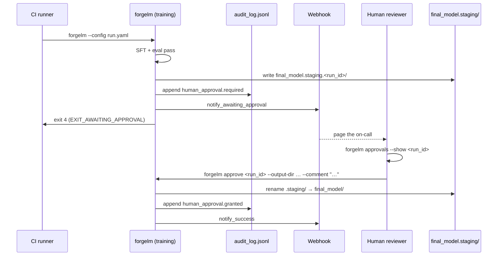

# Human Approval Gate Guide (`forgelm approve` / `reject` / `approvals`)

> **EU AI Act Article 14** requires high-risk AI systems to permit
> effective human oversight throughout their lifecycle. ForgeLM
> implements this as a config-driven gate that pauses model promotion
> until a human reviewer signs an `approve` or `reject` decision into
> the tamper-evident audit chain.

This guide is the deployer-facing walkthrough: what the gate looks like end-to-end, how to wire CI around it, and how to verify the gate's audit evidence. The shorter [`docs/usermanuals/en/compliance/human-oversight.md`](../usermanuals/en/compliance/human-oversight.md) is the operator quick-reference; this guide is the deeper companion that pairs with [`iso_soc2_deployer_guide.md`](iso_soc2_deployer_guide.md).

## What the gate does (and does not)

**Does:**

- Pauses the pipeline after evaluation succeeds, before model promotion (`final_model.staging/` exists; `final_model/` does not).
- Exits with code 4 (`EXIT_AWAITING_APPROVAL`) so a CI job recognises the pause without treating it as a failure.
- Emits `human_approval.required` to `audit_log.jsonl` carrying the `run_id`, the staged metrics, and the staging path.
- Records the human's terminal decision (`granted` / `rejected`) on the same chain via `forgelm approve` or `forgelm reject` — including the approver identity and an optional reviewer comment.
- Fires a webhook (`notify_awaiting_approval`) when the gate opens, so the reviewer is paged.

**Does not:**

- Promote the model on its own. Without a `granted` event the model never moves out of `final_model.staging/`.
- Verify the reviewer is human. ForgeLM trusts whatever string `FORGELM_OPERATOR` is set to; it is the deployer's IdP / SSO substrate that authenticates the human (see §6 below).
- Enforce segregation of duties. The trainer's `FORGELM_OPERATOR` and the approver's `FORGELM_OPERATOR` MUST differ (ISO 27001:2022 A.5.3, SOC 2 CC1.5), but ForgeLM only records both. The audit chain lets the deployer detect violations after the fact (§6).

## End-to-end flow



The same shape for rejection: `forgelm reject` records `human_approval.rejected` and fires `notify_failure`; the staging directory is preserved on disk for forensic review and is cleaned up later via `forgelm purge --run-id <id> --kind staging`.

## 1. Enable the gate

```yaml
evaluation:
  require_human_approval: true
```

That single flag is enough to switch the gate on for every run that consumes this config. The gate fires after evaluation succeeds (so a failing eval still exits 3 / `EXIT_EVAL_FAILURE` and never reaches the approval stage).

## 2. Configure the trainer's CI runner

The CI runner that runs `forgelm` MUST set `FORGELM_OPERATOR` to a machine-readable identity (per [`../qms/access_control.md`](../qms/access_control.md) §3.2):

```yaml
# .github/workflows/train.yml
env:
  FORGELM_OPERATOR: gha:${{ github.repository }}:${{ github.workflow }}:run-${{ github.run_id }}
  FORGELM_AUDIT_SECRET: ${{ secrets.FORGELM_AUDIT_SECRET }}
steps:
  - id: train
    run: forgelm --config run.yaml
    continue-on-error: true     # exit 4 is a pause, not a failure
  - if: ${{ steps.train.outcome == 'success' || steps.train.outcome == 'failure' }}
    run: |
      # `outcome` covers exit 0 (success) AND exit 4 (pause)
      # since `continue-on-error: true` collapses non-zero into
      # the "failure" outcome for a downstream `if:`.  The
      # subsequent approvals-discovery step is what tells the
      # two apart by inspecting the audit log for a
      # `human_approval.required` event tied to this run_id.
      echo "::notice::Train step finished — checking for pending approval"
```

The `continue-on-error` step is the trick: it lets the workflow record exit 4 without failing the build. A subsequent gate-discovery step (or a downstream cron) calls `forgelm approvals --pending` to find the run; the audit log is the source of truth for whether the run paused vs. succeeded vs. failed (GitHub Actions's `steps.<id>.exit_code` field is not a documented context, so don't depend on it directly — read the audit chain instead).

## 3. Page the reviewer

Two complementary mechanisms:

**Webhook (push).** Set `webhook.url_env: SLACK_WEBHOOK_URL` in the run config. The trainer fires `notify_awaiting_approval` with the run id and metrics summary; Slack/Teams routes it to your on-call rotation. See [`../qms/access_control.md`](../qms/access_control.md) §7 for webhook secret hygiene.

**Discovery (pull).** A scheduled CI job runs:

```bash
forgelm approvals --pending --output-dir ./outputs --output-format json \
  | jq -r '.pending[] | select(.age | test("^[0-9]+d")) | .run_id' \
  | xargs -I {} echo "::warning::{} pending >24h"
```

Use both: the webhook catches the moment the gate opens; the polling check catches the moment a notification was missed.

## 4. The reviewer's flow

The reviewer pulls the audit context first, then signs the decision:

```bash
# 1. Read the request — operator, metrics, staging path.
forgelm approvals --show fg-abc123def456 --output-dir ./outputs

# 2. (Optional) inspect the staged model files.
ls -la outputs/run42/final_model.staging.fg-abc123def456/

# 3. Sign the decision under the reviewer's own identity.
FORGELM_OPERATOR="alice@acme.example" \
    forgelm approve fg-abc123def456 \
        --output-dir ./outputs \
        --comment "Reviewed eval report; S5 max 0.04 acceptable. Ticket #4711."
```

`approve` and `reject` take a **positional `run_id`** (NOT `--run-id`). The `--comment` text is recorded in the chain — auditors will read it.

A reviewer who decides to reject:

```bash
FORGELM_OPERATOR="alice@acme.example" \
    forgelm reject fg-abc123def456 \
        --output-dir ./outputs \
        --comment "Bias regression on eval/balanced-bias above 0.08; ticket #4712."
```

`reject` does NOT delete the staging directory. The artefacts stay on disk for forensic review; the operator cleans them up later via `forgelm purge --run-id <id> --kind staging` (see [`gdpr_erasure.md`](gdpr_erasure.md)).

## 5. What the audit chain shows

After approval, three rows describe the gate's full lifecycle: the first is the trainer's pause event (`human_approval.required`), the second is the reviewer's terminal decision (`human_approval.granted` or `.rejected`), and the third is the post-promotion artefact record (`compliance.artifacts_exported`) that ties the staging directory to the promoted `final_model/` for end-to-end forensic correlation:

```jsonl
{"event":"human_approval.required","run_id":"fg-abc123def456","operator":"gha:Acme/pipelines:training:run-42","staging_path":"outputs/run42/final_model.staging.fg-abc123def456","metrics":{...}}
{"event":"human_approval.granted","run_id":"fg-abc123def456","operator":"alice@acme.example","approver":"alice@acme.example","comment":"Reviewed eval report; S5 max 0.04 acceptable. Ticket #4711.","promote_strategy":"rename"}
{"event":"compliance.artifacts_exported","run_id":"fg-abc123def456","operator":"alice@acme.example","artifact_kind":"final_model","source":"final_model.staging.fg-abc123def456","destination":"final_model"}
```

Each line carries a `prev_hash` linking it to the previous one (SHA-256), and an `_hmac` when `FORGELM_AUDIT_SECRET` is set. `forgelm verify-audit ./outputs/audit_log.jsonl --require-hmac` validates the full chain — a re-signed line with a forged operator id breaks verification.

## 6. Segregation of duties (Article 14 + ISO A.5.3 + SOC 2 CC1.5)

The approver's `FORGELM_OPERATOR` MUST differ from the trainer's. ForgeLM does not enforce this — it is a deployer-side IdP control — but the audit chain records both, so a violation is detectable post-hoc.

The canonical detection cookbook lives in [`../qms/access_control.md`](../qms/access_control.md) §6. Reproduced here for convenience:

```bash
# 1. Verify the chain integrity first (positional log_path; no
#    --output-dir / --json flags exist on this subcommand by design).
forgelm verify-audit ./outputs/audit_log.jsonl --require-hmac

# 2. Single-pass jq: slurp the audit log, project trainers + approvals,
#    join in-memory.  Output: TSV rows of every approval where the
#    approver matches the run's trainer (segregation violation).
jq -rs '
    (map(select(.event == "training.started"))) as $trainers |
    map(select(.event == "human_approval.granted"))[] |
    . as $a |
    $trainers[] |
    select(.run_id == $a.run_id and .operator == $a.operator) |
    [.run_id, .operator] | @tsv
' ./outputs/audit_log.jsonl
```

Any rows printed are violations. A clean run prints nothing. The `jq -rs` form keeps operator identifiers out of any shared `/tmp/` file (which would land 0644 / world-readable on a multi-tenant host and leak the e-mail addresses some deployers set as `FORGELM_OPERATOR`).

## 7. Timeout policy

ForgeLM does **not** enforce an automatic timeout on the gate today (Phase 9 ships the gate; Phase 9.5 / v0.6.0+ adds the auto-fail timer). Operators wiring CI today should use the polling pattern from §3 to alert on stale pending runs:

```bash
# CI cron — escalate if any approval has been pending >24h.
stale=$(forgelm approvals --pending --output-dir ./outputs --output-format json \
        | jq '[.pending[] | select(.age | test("^[0-9]+d"))] | length')
[ "$stale" -gt 0 ] && page-oncall "ForgeLM approvals overdue: $stale"
```

When the auto-fail timer ships, it will emit a `human_approval.timeout` event and exit 4 → 1 transition; until then, the polling pattern is the contract.

## 8. Verifying the gate's evidence

Auditors and self-reviewers walk the gate's evidence in three steps:

```bash
# 1. Chain integrity (HMAC-strict).
forgelm verify-audit ./outputs/audit_log.jsonl --require-hmac

# 2. Approval pairing — every required event has a matching terminal decision.
jq -rs '
    (map(select(.event == "human_approval.required")) | map(.run_id)) as $req |
    (map(select(.event | startswith("human_approval.")) | select(.event != "human_approval.required")) | map(.run_id)) as $dec |
    ($req - $dec) as $unmatched |
    if ($unmatched | length) == 0 then "OK: every required event has a decision."
    else "PENDING:\n" + ($unmatched | join("\n")) end
' ./outputs/audit_log.jsonl

# 3. Segregation of duties (the §6 cookbook).
```

## Common pitfalls

:::warn
**Treating exit 4 as a failure.** It is a controlled pause. CI must use `continue-on-error: true` (or the equivalent in your runner) on the training step and gate the deploy step on a `forgelm approvals` check, not on the training step's exit code.
:::

:::warn
**Using `--run-id` for `approve` / `reject`.** Both subcommands take a **positional** `run_id`. `--run-id` is the trainer-side flag (and the `forgelm purge --run-id` flag); approve / reject did not adopt it. Wave 4 round-1 corrected this drift in the deployer docs and `qms/access_control.md` §6 — mirror those examples.
:::

:::warn
**Sharing `FORGELM_OPERATOR` between trainer and approver.** The audit chain records both, so the violation is detectable, but it is still a violation. CI runners use a machine-readable identity (`gha:…:run-42`); reviewers use their own identity (e-mail or LDAP user). The §6 cookbook flags any overlap.
:::

:::tip
**Pre-stage the reviewer credentials.** The reviewer needs `FORGELM_OPERATOR` set when they invoke `approve` / `reject`. Bake this into the reviewer's shell profile or your IdP's environment-injection layer; do not rely on the reviewer remembering to `export` it manually.
:::

## See also

- [`../usermanuals/en/compliance/human-oversight.md`](../usermanuals/en/compliance/human-oversight.md) — the operator quick-reference companion.
- [`../usermanuals/en/compliance/human-approval-gate.md`](../usermanuals/en/compliance/human-approval-gate.md) — the deployer-facing user-manual page paired with this guide.
- [`../reference/approve_subcommand.md`](../reference/approve_subcommand.md) — per-flag, per-event reference for `approve` / `reject`.
- [`../reference/approvals_subcommand.md`](../reference/approvals_subcommand.md) — per-flag, per-event reference for `approvals`.
- [`../qms/access_control.md`](../qms/access_control.md) §6 — canonical segregation-of-duties cookbook.
- [`iso_soc2_deployer_guide.md`](iso_soc2_deployer_guide.md) §"Q5" — the auditor walkthrough that consumes the gate's evidence.
- [`gdpr_erasure.md`](gdpr_erasure.md) — sister flow for GDPR Article 15 + 17.
