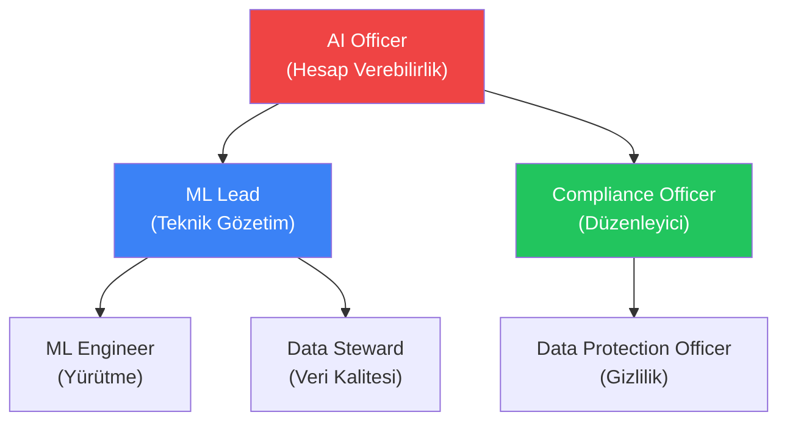

# AI Model Yönetimi için Roller & Sorumluluklar

> EU AI Act Referansı: Madde 17(1)(m)
> Kurumunuzun yapısına uyarlayın.

## Rol Matrisi

## Rol Tanımları

### AI Officer

| | |
|---|---|
| **Rapor Verir** | CTO / Yönetim Kurulu |
| **Sorumluluk** | AI sistemleri uyumluluğunun genel hesap verebilirliği |
| **Onaylar** | Yüksek-riskli model dağıtımları, risk değerlendirmeleri, olay yükseltmeleri |
| **ForgeLM eşleşmesi** | `risk_assessment.json` inceler, `require_human_approval` gate'ini onaylar |

### ML Lead / Reviewer

| | |
|---|---|
| **Rapor Verir** | AI Officer |
| **Sorumluluk** | Eğitim pipeline'ı ve model kalitesinin teknik gözetimi |
| **Onaylar** | Eğitim configleri (PR review), değerlendirme sonuçları, küçük değişimler |
| **ForgeLM eşleşmesi** | `compliance_report.json`, `benchmark_results.json`, `safety_results.json` inceler |

### ML Engineer

| | |
|---|---|
| **Rapor Verir** | ML Lead |
| **Sorumluluk** | Config hazırlama, eğitim yürütme, model değerlendirme |
| **Yürütür** | `forgelm --config`, veri hazırlama, debug |
| **ForgeLM eşleşmesi** | YAML configleri oluşturur, eğitim çalıştırır, webhook'ları izler |

### Data Steward

| | |
|---|---|
| **Rapor Verir** | ML Lead |
| **Sorumluluk** | Veri kalitesi, yönetişim uyumluluğu, bias değerlendirmesi |
| **Doğrular** | Veri kümesi kalitesi, annotation süreci, temsil edicilik |
| **ForgeLM eşleşmesi** | `data.governance:` config bölümünü doldurur, `data_provenance.json` inceler |

### Compliance Officer

| | |
|---|---|
| **Rapor Verir** | AI Officer / Yasal |
| **Sorumluluk** | EU AI Act uyumluluğu, denetim hazırlığı, düzenleyici raporlama |
| **İnceler** | Uyumluluk artefaktları, risk değerlendirmeleri, olay raporları |
| **ForgeLM eşleşmesi** | Evidence bundle (`--compliance-export`) inceler, QMS dokümantasyonunu yürütür |

### Data Protection Officer (DPO)

| | |
|---|---|
| **Rapor Verir** | Yasal / Yönetim Kurulu |
| **Sorumluluk** | Kişisel veri koruması, DPIA gözetimi |
| **İnceler** | Veri yönetişim configi (`personal_data_included`, `dpia_completed`) |
| **ForgeLM eşleşmesi** | `data.governance:` kişisel veri alanlarını doğrular |

## Onay Matrisi

| Eylem | ML Engineer | ML Lead | AI Officer | Compliance |
|--------|:-----------:|:-------:|:----------:|:----------:|
| Eğitim configi oluştur | ✅ | İncele | — | — |
| Eğitim yürüt (minimal-risk) | ✅ | — | — | — |
| Eğitim yürüt (high-risk) | ✅ | Onayla | Onayla | İncele |
| Model dağıt (minimal-risk) | — | ✅ | — | — |
| Model dağıt (high-risk) | — | ✅ | ✅ | ✅ |
| Olay yönet (Critical) | Soruştur | Koordine et | Karar ver | Rapor et |
| Risk değerlendirmesini güncelle | Taslak | İncele | Onayla | Doğrula |
| Güvenlik eşiklerini değiştir | — | ✅ | Bildir | — |

## Eğitim Gereksinimleri

| Rol | Gerekli Eğitim |
|------|------------------|
| Tüm roller | EU AI Act farkındalığı (yıllık) |
| ML Engineer | ForgeLM tooling, güvenlik değerlendirmesi |
| Data Steward | Veri yönetişimi, bias değerlendirmesi |
| AI Officer | Risk yönetimi, düzenleyici uyumluluk |
| Compliance Officer | EU AI Act detaylı gereksinimleri, denetim prosedürleri |
