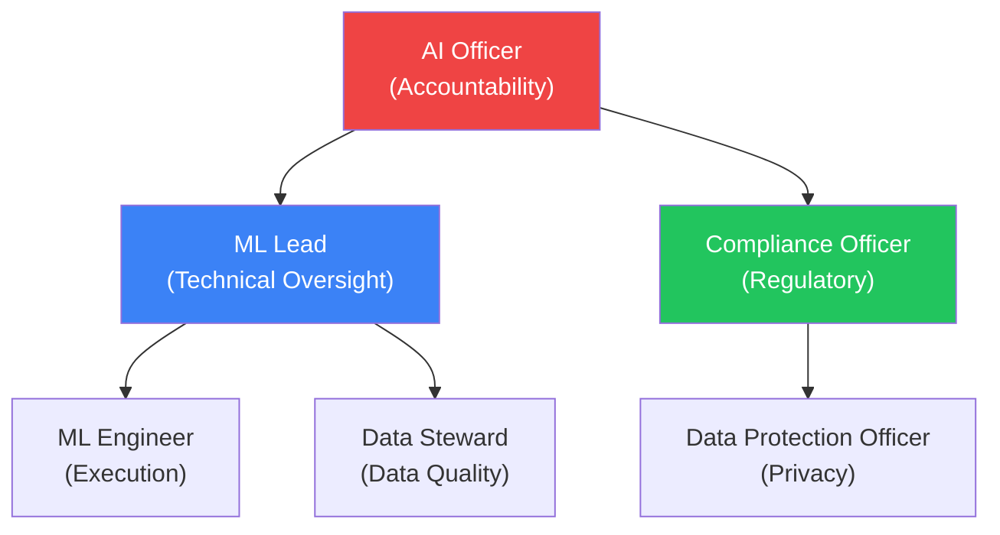

# Roles & Responsibilities for AI Model Management

> EU AI Act Reference: Article 17(1)(m)
> Adapt to your organization's structure.

## Role Matrix

## Role Definitions

### AI Officer

| | |
|---|---|
| **Reports to** | CTO / Board |
| **Responsibility** | Overall accountability for AI systems compliance |
| **Approves** | High-risk model deployments, risk assessments, incident escalations |
| **ForgeLM mapping** | Reviews `risk_assessment.json`, approves `require_human_approval` gate |

### ML Lead / Reviewer

| | |
|---|---|
| **Reports to** | AI Officer |
| **Responsibility** | Technical oversight of training pipeline and model quality |
| **Approves** | Training configs (PR review), evaluation results, minor changes |
| **ForgeLM mapping** | Reviews `compliance_report.json`, `benchmark_results.json`, `safety_results.json` |

### ML Engineer

| | |
|---|---|
| **Reports to** | ML Lead |
| **Responsibility** | Config preparation, training execution, model evaluation |
| **Executes** | `forgelm --config`, data preparation, debugging |
| **ForgeLM mapping** | Creates YAML configs, runs training, monitors webhooks |

### Data Steward

| | |
|---|---|
| **Reports to** | ML Lead |
| **Responsibility** | Data quality, governance compliance, bias assessment |
| **Validates** | Dataset quality, annotation process, representativeness |
| **ForgeLM mapping** | Fills `data.governance:` config section, reviews `data_provenance.json` |

### Compliance Officer

| | |
|---|---|
| **Reports to** | AI Officer / Legal |
| **Responsibility** | EU AI Act compliance, audit readiness, regulatory reporting |
| **Reviews** | Compliance artifacts, risk assessments, incident reports |
| **ForgeLM mapping** | Reviews evidence bundle (`forgelm --config job.yaml --compliance-export ./archive/`), maintains QMS documentation |

### Data Protection Officer (DPO)

| | |
|---|---|
| **Reports to** | Legal / Board |
| **Responsibility** | Personal data protection, DPIA oversight |
| **Reviews** | Data governance config (`personal_data_included`, `dpia_completed`) |
| **ForgeLM mapping** | Validates `data.governance:` personal data fields |

## Approval Matrix

| Action | ML Engineer | ML Lead | AI Officer | Compliance |
|--------|:-----------:|:-------:|:----------:|:----------:|
| Create training config | ✅ | Review | — | — |
| Execute training (minimal-risk) | ✅ | — | — | — |
| Execute training (high-risk) | ✅ | Approve | Approve | Review |
| Deploy model (minimal-risk) | — | ✅ | — | — |
| Deploy model (high-risk) | — | ✅ | ✅ | ✅ |
| Handle incident (Critical) | Investigate | Coordinate | Decide | Report |
| Update risk assessment | Draft | Review | Approve | Validate |
| Modify safety thresholds | — | ✅ | Notify | — |

## Training Requirements

| Role | Required Training |
|------|------------------|
| All roles | EU AI Act awareness (annual) |
| ML Engineer | ForgeLM tooling, safety evaluation |
| Data Steward | Data governance, bias assessment |
| AI Officer | Risk management, regulatory compliance |
| Compliance Officer | EU AI Act detailed requirements, audit procedures |
