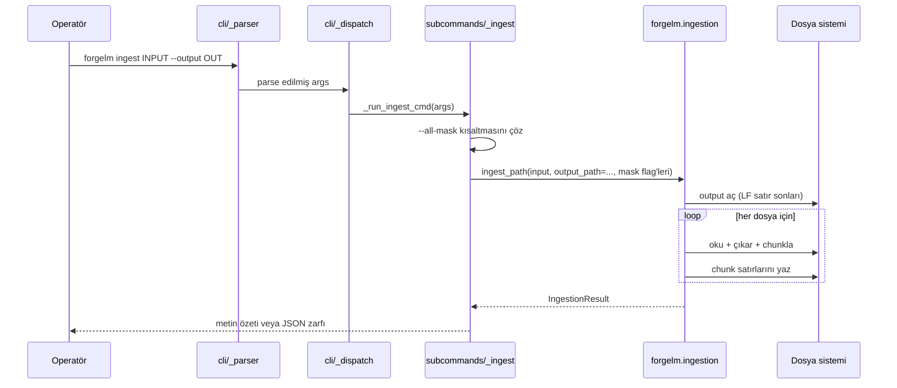

# Veri Ingestion (Alım) Mimarisi

> **Kapsam.** ForgeLM'in ham doküman → SFT-JSONL ingestion pipeline'ının
> (`forgelm ingest` ve `forgelm.ingestion.ingest_path`) iç mimarisi ve
> trainer-tarafı veri yükleyiciye (`forgelm.data.prepare_dataset`)
> devirleme akışı. Hedef kitle: bir PDF'ten gelen baytların nasıl
> eğitim satırına dönüştüğünü, doğrulama kapılarının nerede tetiklendiğini
> ve her aşamayı hangi modülün sahiplendiğini anlaması gereken katkı
> sağlayıcılar ve entegratörler.
>
> Operatör odaklı kullanım (CLI bayrakları, tarifler, sorun giderme) için
> [Doküman Ingestion Rehberi](../guides/ingestion-tr.md). SFT satır şeması
> referansı için [data_preparation-tr.md](data_preparation-tr.md). Aşağı
> akıştaki audit pipeline'ı için [Veri Seti Audit Rehberi](../guides/data_audit-tr.md).

## Genel Bakış

Ingestion pipeline'ı doğrusal, tek-process bir akıştır ve beş katmanda
düzenlenmiştir. Ağır ML bağımlılıkları (HuggingFace tokenizer'lar,
pypdf, python-docx, ebooklib) tembel (lazy) yüklenir; böylece
`import forgelm.ingestion` ucuz kalır.

```mermaid
graph LR
    INPUT[Girdi yolu<br/>dosya veya dizin] --> DISCOVERY[Dosya keşfi<br/>SUPPORTED_EXTENSIONS]
    DISCOVERY --> EXTRACT[Format çıkarıcıları<br/>PDF / DOCX / EPUB / TXT / MD]
    EXTRACT --> DEDUP[PDF üstbilgi / altbilgi dedup]
    DEDUP --> CHUNK[Chunk stratejisi<br/>paragraph / sliding / markdown]
    CHUNK --> MASK[Opsiyonel maskeleme<br/>önce secrets sonra PII]
    MASK --> WRITE[JSONL yazıcı<br/>satır başına text anahtarı]
    WRITE --> RESULT[IngestionResult<br/>sayaçlar ve yapısal notlar]

    style EXTRACT fill:#002244,stroke:#00aaff
    style CHUNK fill:#002244,stroke:#00aaff
    style MASK fill:#002244,stroke:#00aaff
```



Tek giriş noktası: [`forgelm.ingestion.ingest_path`](../../forgelm/ingestion.py),
satır `1200`. CLI alt komutu
[`forgelm/cli/subcommands/_ingest.py`](../../forgelm/cli/subcommands/_ingest.py)
ince bir argparse adaptörüdür — `--all-mask` bayrağını alttaki iki boolean'a
çözer ve geri kalan her şeyi `ingest_path`'e devreder.

## Modül haritası

| Sorumluluk | Modül | Public yüzey |
|---|---|---|
| Pipeline orkestrasyonu | [`forgelm/ingestion.py`](../../forgelm/ingestion.py) | `ingest_path`, `IngestionResult`, `OptionalDependencyError`, `list_supported_formats`, `describe_strategies`, `summarize_result`, `DEFAULT_CHUNK_SIZE`, `DEFAULT_SLIDING_OVERLAP` |
| CLI dispatcher | [`forgelm/cli/subcommands/_ingest.py`](../../forgelm/cli/subcommands/_ingest.py) | `_run_ingest_cmd` |
| CLI argüman şeması | [`forgelm/cli/_parser.py`](../../forgelm/cli/_parser.py) | `_add_ingest_subcommand` |
| PII algılama / maskeleme | [`forgelm/data_audit/_pii_regex.py`](../../forgelm/data_audit/_pii_regex.py) | `detect_pii`, `mask_pii` |
| Secrets algılama / maskeleme | [`forgelm/data_audit/_secrets.py`](../../forgelm/data_audit/_secrets.py) | `detect_secrets`, `mask_secrets` |
| Trainer-tarafı dataset yükleyici | [`forgelm/data.py`](../../forgelm/data.py) | `prepare_dataset` |

PII / secrets detector'ları `data_audit/` altında yaşar çünkü audit
alt komutu aynı regex setini raporlama geçişinde tüketir. Ingestion
modülü onları tembel import eder — audit paketi `sys.modules`'a yalnızca
maskeleme gerçekten istendiğinde girer.

## Pipeline aşamaları

Pipeline dosya başına sıralı çalışır; tüm batch boyunca tek bir output
file handle açık tutulur. Üst düzey çağrı grafiği:

```mermaid
graph TD
    A[ingest_path] --> B[Yolları ve varsayılanları çöz]
    B --> C[mask_pii / mask_secrets'i tembel yükle]
    C --> D[chunk_tokens varsa AutoTokenizer tembel yükle]
    D --> E[Girdi dosyalarını keşfet]
    E --> F{Her dosya için}
    F --> G[_process_one_file]
    G --> H[Uzantıya göre _select_extractor]
    H --> I[_extract_text_for_ingest]
    I --> J[_select_chunks_iter]
    J --> K[_emit_chunk]
    K --> L[_FileOutcome sayaçlarını güncelle]
    L --> F
    F -- bitti --> M[Sayaçları topla]
    M --> N[extra_notes ve notes_structured'u kur]
    N --> O[IngestionResult döndür]

    style A fill:#002244,stroke:#00aaff
    style O fill:#002244,stroke:#00aaff
```



`ingest_path` içinde, ilk dosyaya dokunulmadan önce uygulanan kritik
değişmezler:

1. **`chunk_size` çözümü** — açık değer ya da `DEFAULT_CHUNK_SIZE`
   (2048). "Operatör bunu açıkça verdi mi?" tespiti `--chunk-tokens`
   override uyarısını sürer.
2. **`overlap` çözümü** — sliding için `min(DEFAULT_SLIDING_OVERLAP,
   chunk_size // 2)`, paragraph ve markdown için `0`. Yarı-pencere clamp'i
   küçük `--chunk-size` değerlerinde kuadratik chunk patlamasını önler.
3. **Tokenizer ön-yükleme** — `chunk_tokens` ayarlıysa tokenizer üstte
   bir kez çözülür; böylece `--tokenizer`'daki bir yazım hatası ilk dosya
   açılmadan hızlı başarısız olur.
4. **Output dizini oluşturma** — `dst.parent.mkdir(parents=True,
   exist_ok=True)`; eksik ara dizinler çalışmayı yarıda kesmesin.
5. **LF satır sonları** — `open(... newline="\n")` satır sonlarını
   platformdan bağımsız LF'e sabitler; JSONL Lines spec LF gerektirir ve
   CRLF aşağı akış `jq -c` / `wc -l` tüketicilerini tökezletir.

## Dosya keşfi

`_iter_input_files` sıralı, deterministik bir dosya listesi üretir:

- Tek dosya girdisi yalnızca o yolu verir.
- Bir dizin, `SUPPORTED_EXTENSIONS` (`.pdf`, `.docx`, `.epub`, `.txt`,
  `.md`) ile eşleşen girdileri leksikografik sırada verir — aynı girdi
  + aynı bayraklar birden çok çalıştırmada bayt-bayt aynı JSONL üretir.
- `--recursive` glob desenini `*`'tan `**/*`'e çevirir.
- Boş sonuç → desteklenen uzantıları yazdıran bir `FileNotFoundError`.

Desteklenmeyen uzantılı dosyalar sessizce atlanır (`_select_extractor`
`None` döner); desteklenen uzantılı ama metin çıkarılamayan dosyalar
uyarıyla atlanır ve `files_skipped` artar.

## Format çıkarıcıları

Her çıkarıcı düz metin döndürür ya da `ValueError` fırlatır. Opsiyonel
bağımlılıklar (`pypdf`, `python-docx`, `ebooklib` / `bs4`) çıkarıcı
gövdesi içinde tembel import edilir ve `OptionalDependencyError` (dar
bir `ImportError` alt sınıfı) tipine dönüştürülür; bu sayede CLI
"extra kurulu değil" ile "gerçek import bug" durumlarını ayırt eder.

```mermaid
graph LR
    PDF[.pdf] --> EXTRACT_PDF[_extract_pdf<br/>pypdf]
    DOCX[.docx] --> EXTRACT_DOCX[_extract_docx<br/>python-docx]
    EPUB[.epub] --> EXTRACT_EPUB[_extract_epub<br/>ebooklib + bs4]
    TXT[.txt] --> EXTRACT_TXT[_extract_text]
    MD[.md] --> EXTRACT_TXT
    EXTRACT_PDF --> DEDUP[_strip_repeating_page_lines]
    EXTRACT_DOCX --> TEXT[Birleştirilmiş gövde metni]
    EXTRACT_EPUB --> TEXT
    EXTRACT_TXT --> TEXT
    DEDUP --> TEXT

    style DEDUP fill:#002244,stroke:#00aaff
```



### PDF (`_extract_pdf`)

İç akış üç adımdır: aç + (opsiyonel) decrypt → sayfa başına metin →
üstbilgi/altbilgi dedup.

- **Şifreleme** — `reader.is_encrypted` `_try_pdf_decrypt`'i tetikler;
  bu da boş parolayla decrypt dener (owner-encrypted okunabilir PDF'ler).
  Gerçek parolalar kapsam dışıdır: bir CLI bayrağı kurmak parolayı
  shell history'sine düşürürdü. Başarısızlık `qpdf --decrypt` / `pdftk`'i
  işaret eden bir `ValueError` fırlatır.
- **Sayfa başına çıkarım** — `_read_pdf_pages` her `page.extract_text()`
  çağrısını geniş bir `try/except Exception` içine alır; tek bir bozuk
  sayfa 500 sayfalık bir dökümanı durdurmasın diye. Başarısız sayfalar
  dosya adı ve sayfa indeksini belirten uyarı loglar.
- **Üstbilgi / altbilgi dedup** — `_strip_repeating_page_lines`. Sonraki
  bölüme bakın.

Sıfır sayfa üreten dökümanlar "muhtemelen taranmış PDF, önce OCR
çalıştırın" uyarısı verir ve boş string döner.

### DOCX (`_extract_docx`)

`_iter_docx_blocks` ile `<w:body>` XML elementini doküman sırasında
yürür; `Paragraph` ve `Table` nesnelerini göründükleri konumda verir.
Varsayılan `doc.paragraphs` / `doc.tables` koleksiyonları sıralamayı
kaybeder — bir paragrafı tanıtan bir tablo, bağımlı metinden önce
yerine dosya sonunda görünürdü.

Tablolar `_docx_table_to_markdown` üzerinden render edilir:

- İlk boş olmayan satır başlık olur.
- Onu bir `---` ayraç satırı izler.
- Hücrelerdeki `|` ve `\` karakterleri CommonMark'a göre escape edilir.
- Hücre içindeki yeni satırlar boşluğa çökertilir — çok satırlı bir hücre
  tek markdown tablo satırında ifade edilemez.
- Eşit olmayan satırlar boş hücrelerle sağdan doldurulur.

Markdown tablo çıktısı `--strategy markdown` ile doğal olarak birlikte
çalışır: başlık-farkındalıklı chunklama tabloyu tek bölüm içinde sağlam
tutar.

### EPUB (`_extract_epub`)

EPUB'u `ignore_ncx=True` ve `ignore_missing_css=True` ile açar; ebooklib'in
en gürültülü iki deprecation uyarısı susturulur. Her `ITEM_DOCUMENT`
parçası BeautifulSoup'tan separator=`\n` ile geçer; stripped metin
`\n\n` ayraçlarıyla birleştirilir.

### TXT / MD (`_extract_text`)

`Path.read_text(encoding="utf-8", errors="replace")` — UTF-8 olmayan
girdi Unicode replacement karakterlerine dönüşür. Bir ikili-kontaminasyon
guard'ı dosyanın %1'inden fazlası `U+FFFD` olduğunda uyarır; "birisi bir
zip'i .txt olarak yeniden adlandırdı" türü yaygın hataları çalışmayı
engellemeden yakalar.

## PDF sayfa üstbilgi / altbilgi dedup

Çıkarım ile chunklama arasındaki ayrı bir aşama. Sayfa düzeyindeki
üstbilgiler (şirket filigranı, döküman başlığı) ve altbilgiler (sayfa
numarası, telif satırı) her PDF sayfasının ilk / son satırına oturur ve
aşağı akış audit'inin near-duplicate sayımını şişirir.

```mermaid
graph TD
    PAGES[sayfa başına metin] --> SPLIT[Satırlara böl]
    SPLIT --> WINDOW[Sayfa başına üst-3 / alt-3 satırı incele<br/>_PDF_EDGE_WINDOW = 3]
    WINDOW --> COUNT[Tüm sayfalarda satır<br/>frekansını say]
    COUNT --> CHECK{">= yüzde 70 sayfa?"}
    CHECK -- evet --> POP[Eşleşen window satırlarını çıkar<br/>window içinde herhangi bir offset]
    POP --> WINDOW
    CHECK -- hayır --> JOIN[Sayfaları çift yeni satırla birleştir]
    JOIN --> PACK[strip_paragraph_packed_headers<br/>chunk blokları üzerinde ikinci pas dedup]
    PACK --> OUT[Temizlenmiş PDF metni]

    style CHECK fill:#002244,stroke:#00aaff
    style WINDOW fill:#002244,stroke:#00aaff
    style PACK fill:#002244,stroke:#00aaff
```



[`_strip_repeating_page_lines`](../../forgelm/ingestion.py) uygulama
notları:

- `_PDF_REPEAT_MIN_PAGES`'ten (3) kısa PDF'lerde atlanır — istatistiksel
  sinyal çok zayıf.
- Eşik `max(2, math.ceil(_PDF_REPEAT_THRESHOLD * page_count))`; böylece
  %70 kuralı tam %70'te tetiklenir, integer kesmesi altında %60'ta değil.
- **Faz 15 Görev 1** incelemeyi katı en-dış satırdan sayfa başına
  **üst-3 / alt-3 satıra** genişletir (`_PDF_EDGE_WINDOW = 3`); böylece
  değişken-dış-satırlı (her bölümde farklı başlık) ama bir alttaki
  satırı sabit (yayıncı kimliği) bir corpus, dedup'ı bir-satır-daha-derin
  sabiti soymadan dışarı kilitlenemez. Bug, döngünün *exit condition*'ıydı,
  en-dış-satır kontrolü değildi — Faz 15 öncesi iterator, katı en-dış
  pozisyonda recurrence bulunmadığında hemen kırılıyordu. Çözüm bir
  window kontrolüdür, ek bir pas değildir.
- Paragraph paketlemenin ardından **ikinci bir pas**
  (`strip_paragraph_packed_headers`) chunker'ın orta-bloğa yapıştırdığı
  sağ-kalan header'ları temizler. `notes_structured`'da
  `pdf_paragraph_packed_lines_stripped` olarak görünür.
- Toplam sıyrılan satır sayısı `IngestionResult.notes_structured` altında
  `pdf_header_footer_lines_stripped` anahtarıyla görünür.

### Faz 15 sınırlamaları özeti

Çok-kolonlu PDF'ler, OCR (yalnızca taranmış) PDF'leri ve RTL
script'leri v0.6.0'da desteklenmemeye devam eder:

- **Çok-kolon** — `_maybe_warn_multi_column` yalnızca WARNING tetikler;
  okuma sırası pypdf üzerinden hâlâ sol-üst-dan-sağ-alta serileştirilir.
  Faz 16+ yeni bir `[ingestion-tables]` extra altında camelot-py /
  pdfplumber fallback'i ekleyebilir.
- **OCR** — text-layer-tespit retry'ı yok. Audit'in mevcut "Taranmış
  PDF'lerle çalışma (OCR teslim akışı)" tarifi
  [`docs/guides/ingestion-tr.md`](../guides/ingestion-tr.md) içindedir;
  otomatik `ocrmypdf` önerisi Wave 3'e ertelendi (audit §6).
- **RTL** — Arapça / İbranice için ekstraksiyon-sıralama normalizasyonu
  Wave 3'e ertelendi. RTL corpus'lar üzerinde çalışan operatörler bugün
  ters-glyph sırası beklemeli ve layout-bilen bir araçla ön-işlemeli.

## Chunk stratejileri

`CHUNK_STRATEGIES` içinde dört kayıtlı strateji; üçü CLI `--strategy`
seçeneğinde açıkken `semantic` gizlidir çünkü bugün
`NotImplementedError` fırlatır.

```mermaid
graph TD
    TEXT[Çıkarılmış metin] --> DISPATCH{Strateji}
    DISPATCH -- paragraph --> PARAGRAPH[_chunk_paragraph<br/>açgözlü paragraf paketleyici]
    DISPATCH -- sliding --> SLIDING[_chunk_sliding<br/>örtüşmeli sabit pencere]
    DISPATCH -- markdown --> MARKDOWN[_chunk_markdown<br/>başlık-farkındalıklı ayırıcı]
    DISPATCH -- semantic --> SEMANTIC[NotImplementedError]

    PARAGRAPH --> CHUNKS[Chunk dizgi iterable'ı]
    SLIDING --> CHUNKS
    MARKDOWN --> CHUNKS

    style DISPATCH fill:#002244,stroke:#00aaff
    style SEMANTIC fill:#440000,stroke:#ff6666
```



Yönlendirme `_strategy_dispatch` (karakter modu) veya
`_strategy_dispatch_tokens` (token modu) içinde gerçekleşir. İkisi de
strateji adını doğrular ve eşleşen chunker'a yönlendirir.

### `paragraph` (varsayılan)

`_chunk_paragraph` — `\n\n` üzerinde böler ve sonraki paragraf
`max_chunk_size`'ı aşana kadar paragrafları paketler. Cap'i aşan
paragraflar kendi başına yayınlanır; yani cap yumuşak bir sınırdır.
Cümle sınırları tasarım gereği korunur.

Örtüşmesizdir. Paragraflar bölünemezlik birimidir. CLI bu strateji
üzerinde `--overlap-tokens` ayarlandığında bilgilendirme notu loglar.

### `sliding`

`_chunk_sliding` — örtüşmeli sabit karakter penceresi. İki guard:

- `overlap` `[0, chunk_size)` aralığında olmalı.
- `overlap` `<= chunk_size // 2` olmalı. Bu clamp olmasa `overlap=199`
  ve `chunk_size=200` karakter başına ~bir chunk verirdi.

Döngü, mevcut pencere metnin sonunu kapladığı anda biter; aksi halde
yalnız bir önceki chunk'ın önek kopyası olan kısa kuyruk chunk'lar
audit'in near-duplicate istatistiklerini kirletir.

### `markdown` (Phase 12)

`_chunk_markdown` — markdown bölüm omurgasını gözeten başlık-farkındalıklı
ayırıcı:


- Sınırlar `_MARKDOWN_HEADING_PATTERN` ile algılanan ATX başlıklarıdır
  (`#` … `######`). Desen lineer eşleştirmeyi koruyacak şekilde iki uçta
  da boşluksuz karaktere demirlenir (SonarCloud python:S5852'nin
  uyardığı `O(n²)` backtracking'i önler).
- Fence algılama regex değil, bir state machine'dir (`_parse_md_fence` +
  `_advance_fence_state`); CommonMark §4.5'i uygular — "kapatan fence
  açıcıyla en az aynı sayıda karaktere sahip olmalı ve info string
  taşımamalı" kuralı dahil. Bir fence bloğu içindeki başlık-şekilli
  satırlar bölüm sınırı olarak yorumlanmaz.
- Her chunk üstüne **kapsayan-başlık ekmek kırıntısını** koyar; böylece
  SFT loss'u doküman bağlamını görür (örn. bölüm gövdesinin önüne
  `# Proje Notları / ## Arkaplan` eklenir).
- Cap'ten uzun bölümler bütün halinde yayınlanır — tablo bütünlüğü uzun
  paragrafları koruyan kuralla korunur.
- **Tasarım gereği örtüşmesiz.** Bu stratejide overlap
  `ValueError(_MARKDOWN_OVERLAP_UNSUPPORTED_MSG)` fırlatır çünkü
  bölüm-ortası kesim ekmek kırıntısı değişmezini kırar.

### `semantic` (ertelenmiş)

`_chunk_semantic` `NotImplementedError` fırlatır. Embedding-kümeli
chunklama hava-boşluklu Annex IV tekrarlanabilirlik garantisi ile
çatışır (runtime embedding modeli bağımlılığı pipeline'ı donanım arası
deterministik olmaktan çıkarırdı) ve closure planı C-52 altında, gelecekteki
`[chunking-semantic]` extra'sı ile izlenir.

## Token-farkındalıklı mod (Phase 11.5)

Karakter tabanlı chunklama yoğun metinde modelin `max_length` bütçesini
patlatabilir. Token modu, chunk'ları trainer'ın kullanacağı gerçek
tokenizer'a karşı boyutlandırır.

```mermaid
graph LR
    A[--chunk-tokens N] --> B[--tokenizer MODEL_NAME zorunlu]
    B --> C[_load_tokenizer<br/>AutoTokenizer, trust_remote_code=False]
    C --> D[_strategy_dispatch_tokens]
    D --> E[_chunk_paragraph_tokens / _chunk_sliding_tokens / _chunk_markdown_tokens]

    style C fill:#002244,stroke:#00aaff
```



Etkinleştirme: `ingest_path`'e `chunk_tokens` geçmek (ya da CLI'da
`--chunk-tokens`). Ayarlandığında `chunk_size` sessizce yok sayılır;
operatör *açık* bir `chunk_size` da verdiyse bilgi seviyesinde bir log
patlar — override görünür kalır ama yaygın durumda spam yapmaz.

Üç token-mod chunker'ı karakter-mod setinin aynasıdır:

| Token-mod chunker | Karakter-mod ikizi | Notlar |
|---|---|---|
| `_chunk_sliding_tokens` | `_chunk_sliding` | Aynı yarı-pencere cap'i; bir kez encode eder, token ID'lerinin üzerinde kayar, her dilimi `skip_special_tokens=True` ile decode eder. |
| `_chunk_paragraph_tokens` | `_chunk_paragraph` | `_count_section_tokens` üzerinden paragrafları tek seferde batch-tokenleştirir; paketleme sırasında `"\n\n"` ayracını (`sep_tokens`) hesaba katar — çoğu BPE tokenizer onu 1–2 token'a eşler. |
| `_chunk_markdown_tokens` | `_chunk_markdown` | Aynı atomik-bölüm anlamı. Sıfırdan farklı overlap bu gövdeye ulaşmadan reddedilir. |

`_count_section_tokens` paylaşılan batch-encoding yardımcısıdır.
`tokenizer(blocks, add_special_tokens=False)` çağrısını bir kez yapar
ve dönen şekli doğrular (mapping, `input_ids` uzunluğu girdiyle eşleşir).
List girdisini reddeden eski / minimal tokenizer'lar blok başına
encoding'e geri düşer; *diğer* her başarısızlık yeniden fırlatılır —
yavaş yol gerçek bug'ları maskelemez.

`_load_tokenizer` `trust_remote_code=False`'u pin'ler — token-farkındalıklı
chunklama özel tokenizer sınıfına ihtiyaç duymamalı, ve açık tutmak HF
Hub repo'larının ingestion sırasında config audit'i olmadan kod
çalıştırmasına izin verirdi.

## Maskeleme katmanı

İki bağımsız detector; ikisi de `forgelm.data_audit`'ten tembel import
edilir. CLI shorthand `--all-mask` (Phase 12.5) ile birleştirilir.

```mermaid
graph TD
    CHUNK[Chunk dizgisi] --> S{secrets_mask?}
    S -- evet --> SCRUB[mask_secrets<br/>REDACTED-SECRET]
    S -- hayır --> P{pii_mask?}
    SCRUB --> P
    P -- evet --> PSCRUB[mask_pii<br/>REDACTED]
    P -- hayır --> EMIT[json.dumps + satır yaz]
    PSCRUB --> EMIT
    EMIT --> COUNT[Sonuç sayaçlarını güncelle]

    style SCRUB fill:#002244,stroke:#00aaff
    style PSCRUB fill:#002244,stroke:#00aaff
```



### `mask_secrets`

[`forgelm/data_audit/_secrets.py`](../../forgelm/data_audit/_secrets.py)
içinde tanımlı. Dokuz önek-demirli desen: AWS access key (`AKIA…`),
GitHub PAT (`ghp_…` ve dostları), Slack token, OpenAI API key (`sk-…` /
`sk-proj-…`), Google API key (`AIza…`), JWT,
OpenSSH/RSA/DSA/EC/PGP private-key blok başlıkları, Azure storage
connection string.

Yer değiştirme token'ı: `[REDACTED-SECRET]`. Sayımlar chunk başına
`{kind: count}` olarak dönülür ve
`IngestionResult.secrets_redaction_counts` altında toplanır.

### `mask_pii`

[`forgelm/data_audit/_pii_regex.py`](../../forgelm/data_audit/_pii_regex.py)
içinde tanımlı. İlk-eşleşen-kazanır önceliği — desen sözlüğü iterasyon
sırası aynı zamanda maske önceliğidir; iki kategoriye eşleşebilen bir
span en dar olana atfedilir (bir SSN aynı zamanda bir basamak dizisidir;
`phone` değil `us_ssn` olarak işaretlemek isteriz).

Algılanan kategoriler: email, IBAN, kredi kartı (Luhn-doğrulamalı),
US SSN, FR INSEE, TR Kimlik No (`_is_tr_id` checksum), DE
Personalausweis, telefon. Yer değiştirme token'ı: `[REDACTED]`.

### Maske sırası — önce secrets

`_emit_chunk` sırayı zorlar: önce secrets geçişi, sonra PII geçişi. İki
neden ([`ingestion.py:1098`](../../forgelm/ingestion.py)'da docstring
yorumu olarak kodlanmıştır):

1. Secrets PII'den daha yüksek şiddettedir. Eğitim verisindeki sızdırılmış
   bir AWS anahtarı geri dönülemezdir; bir telefon numarası opt-out
   akışlarıyla geri kurtarılabilir. Sıralama herhangi bir noktada önemli
   hale geliyorsa, secrets geçişini kayırmalı.
2. Gelecekteki PII / secret regex eklemeleri meşru biçimde örtüşebilir
   (örn. IBAN'a benzeyen bir Azure connection-string alt dizgisi). Bu
   sıralama o durumu operatör müdahalesi olmadan geleceğe hazırlar.

Mevcut regex setleri shipped fixture'larda ölçülebilir detector-arası
örtüşme **üretmez**, yani sıralama yük-taşıyıcı değil savunmacıdır.

### `--all-mask` (Phase 12.5)

Sadece-CLI kısaltma: `_run_ingest_cmd`
`pii_mask = args.pii_mask or args.all_mask` ve
`secrets_mask = args.secrets_mask or args.all_mask` hesaplar.
`ingest_path` API'sinin kendisi yalnızca iki boolean'ı kabul eder —
kısaltma CLI sınırında kalır, kütüphane yüzeyi dar kalır.

## JSONL çıktı sözleşmesi

Satır başına bir chunk; `json.dumps({"text": chunk},
ensure_ascii=False) + "\n"` ile yazılır. Dosya `newline="\n"` ile
açılır; JSONL her platformda LF sonludur.

```json
{"text": "AB Yapay Zekâ Yasası Madde 10 yüksek-risk YZ sağlayıcılarından ..."}
{"text": "Veri kalitesi kriterleri ilgililik, temsil edilebilirlik ..."}
```

`ensure_ascii=False` ASCII olmayan metni (Türkçe karakterler, em-dash,
emoji) olduğu gibi tutar — `\uXXXX`'e escape etmek aşağı akıştaki BPE
modellerinin literal ve escape formlarına ayrı token ID'leri ayırması
nedeniyle tokenlemeyi sessizce değiştirirdi.

`forgelm/data.py`'deki trainer-tarafı yükleyici `{"text": ...}`'i
önceden formatlanmış SFT sütunu olarak tanır ve daha fazla dönüşüm
olmadan `_process_text_format`'a yönlendirir (aşağıdaki "Trainer-tarafı
devirleme" bölümüne bakın).

## `IngestionResult` ve yapısal notlar

`IngestionResult` (dataclass) hem operatör-dostu serbest metin
(`extra_notes`) hem de makine-okur yapısal payload (`notes_structured`)
taşır. Pipeline'lar yapısal formu tüketmelidir; serbest-metin listesi
aynı gerçekleri yeniden ifade edebilir ve API-stabil değildir.

| Alan | Tip | Kaynak |
|---|---|---|
| `output_path` | `Path` | çözülmüş `--output` |
| `chunk_count` | `int` | dosya başına `chunks_written` toplamı |
| `files_processed` | `int` | başarılı çıkarım sayısı |
| `files_skipped` | `int` | desteklenmeyen uzantı, boş metin veya çıkarım hatası |
| `total_chars` | `int` | maskeleme **sonrası** chunk uzunlukları toplamı |
| `format_counts` | `Dict[str, int]` | uzantı bazında (`.pdf`, `.docx`, …) |
| `pii_redaction_counts` | `Dict[str, int]` | kategori başına maskelenen PII span sayısı |
| `secrets_redaction_counts` | `Dict[str, int]` | kategori başına maskelenen secret sayısı |
| `extra_notes` | `List[str]` | insan-okur özet satırlar |
| `notes_structured` | `Dict[str, Any]` | makine-okur özet (stabil) |
| `pdf_header_footer_lines_stripped` | `int` | PDF dedup tarafından sıyrılan toplam satır sayısı |

`notes_structured` `IngestionResult`'ın ilkel alanlarına ek olarak strateji
adını ve (aktifse) `chunk_tokens` + `tokenizer`'ı yansıtır. Karakter-modu
chunk boyutu chunk sayımlarından dolaylı olarak çıkar; alanın varlığı
CI / CD pipeline'larının bir JSONL'i üreten tam yapılandırmayı
denetleyebilmesi içindir.

## CLI entegrasyonu



CLI dispatcher dar bir exception kümesini yakalar ve
[error-handling standardına](../standards/error-handling.md) göre exit
kodlarına çevirir:

| Exception | Exit kodu |
|---|---|
| `FileNotFoundError`, `ValueError`, `PermissionError`, `IsADirectoryError`, `OSError` | `EXIT_CONFIG_ERROR` (1) |
| `OptionalDependencyError` | `EXIT_TRAINING_ERROR` (2) |

Düz `ImportError` yakalanmaz — `forgelm` içindeki gerçek bir import
bug'ı orijinal traceback'iyle yayılmalı, genel install hint'i altına
gömülmemelidir. Dar `OptionalDependencyError` alt sınıfı tam olarak bu
iki durumu ayırmak için vardır.

`--output-format json` stdout'a yapısal bir zarf yazar:

```json
{
  "success": true,
  "output_path": "data/policies.jsonl",
  "chunk_count": 2843,
  "files_processed": 17,
  "files_skipped": 0,
  "total_chars": 5824103,
  "format_counts": {".pdf": 12, ".docx": 5},
  "pii_redaction_counts": {"email": 4, "phone": 1},
  "secrets_redaction_counts": {},
  "pdf_header_footer_lines_stripped": 41,
  "notes": [...],
  "notes_structured": {...}
}
```

CI / CD pipeline'ları önce `success`'i parse edip yapısal alanlara
düşmelidir. Hatalar `{"success": false, "error": "..."}` döner.

## Trainer-tarafı devirleme

Ingestion çıktısı veri yolunun yarısıdır; trainer onu
`forgelm.data.prepare_dataset` üzerinden geri okur ve trainer-başına
formatter zincirini çalıştırır.

```mermaid
graph TD
    JSONL[ingestion JSONL] --> LOAD[_load_single_dataset<br/>HuggingFace datasets]
    LOAD --> MIX{extra_datasets?}
    MIX -- evet --> MERGE[_merge_extra_datasets<br/>opsiyonel mix_ratio]
    MIX -- hayır --> SPLIT[_ensure_validation_split]
    MERGE --> SPLIT
    SPLIT --> DETECT[_detect_dataset_format]
    DETECT --> VALIDATE[_validate_trainer_columns]
    VALIDATE --> ROUTE{trainer_type}
    ROUTE -- dpo / simpo / orpo / kto / grpo --> RAW[_shuffle_and_passthrough<br/>ham preference / KTO / GRPO sütunları]
    ROUTE -- sft --> FORMAT[_format_sft_dataset]
    FORMAT --> PROCESSOR{algılanan şema}
    PROCESSOR -- text sütunu --> TEXT[_process_text_format]
    PROCESSOR -- messages listesi --> MESSAGES[_process_messages_format]
    PROCESSOR -- User / Assistant --> UA[_process_user_assistant_format]

    style DETECT fill:#002244,stroke:#00aaff
    style VALIDATE fill:#002244,stroke:#00aaff
```



Format algılama (`_detect_dataset_format`) sabit öncelikli sütun-adı
sezgilerini kullanır:

| Mevcut sütunlar | Algılanan format | Önerilen trainer |
|---|---|---|
| `chosen` + `rejected` | preference | `dpo` |
| `completion` + `label` | binary feedback | `kto` |
| `messages` | conversational | `sft` |
| yalnız `prompt` | prompt-only | `grpo` |
| `User` / `instruction` + `Assistant` / `output` / `response` | instruction-tuning | `sft` |
| `text` | önceden formatlanmış | `sft` |

`_validate_trainer_columns`, yapılandırılan trainer sütun şekliyle
uyuşmadığında algılanan format ipucu ve önerilen `trainer_type` ile
`KeyError` fırlatır. Preference / KTO / GRPO trainer'lar veri setini
formatlanmamış alır (`_passthrough_for_trainer` split'leri olduğu gibi
döner); yalnızca SFT chat-template processor zincirini çalıştırır.

Validation-split otomatik türetme: ne `validation` ne de `test` varsa,
`_ensure_validation_split` eğitim setinden `min(0.1, 2000 / train_size)`
(taban `0.01`) oranında bir parça keser; `seed=42`. Bölme INFO
seviyesinde loglanır — çalışma izinde görünür.

Multimodal VLM veri setleri formatter'ı tümden atlatır:
`_passthrough_multimodal` veri setini değişmemiş döner ve
`AutoProcessor`-tabanlı trainer kendi image+text formatlamasını
uygular.

## Determinism ve tekrarlanabilirlik

Ingestion pipeline'ı aynı girdi ve bayraklar için deterministiktir:

- Dosya keşfi `sorted(glob)` kullanır — OS ve dosya sistemi arası
  leksikografik sıralama.
- Tüm chunklama stratejileri metin + parametrelerinin saf fonksiyonudur;
  rastgelelik yok, saat bağımlılığı yok.
- PII / secrets regex'leri modül-seviyesi sabittir — çalışma başına
  state yok.
- PDF dedup sabit eşikler kullanır (%70, en az 3 sayfa, `math.ceil`).
- Tokenizer yüklemesi `use_fast=True, trust_remote_code=False` kullanır —
  tam tokenizer davranışı HF Hub revizyonuyla pin'lenir.
- Çıktı LF-sonlu, UTF-8, `ensure_ascii=False`.

Trainer-tarafı veri yolu iki seed'li rastgele operasyon ekler
(`shuffle(seed=42)` ve `train_test_split(seed=42)`). İkisi de
deterministik ama operatör-görünür: aynı JSONL üzerinde `prepare_dataset`
yeniden çalıştırıldığında aynı split'ler üretilir.

## Hata yönetimi referansı

| Aşama | Exception | Davranış |
|---|---|---|
| Dosya keşfi, eşleşme yok | `FileNotFoundError` | Çalışmayı durdurur |
| Desteklenmeyen uzantı (karışık dizin) | yok — sessiz atla | `files_skipped` artar |
| Şifreli PDF, boş parola başarısız | `_try_pdf_decrypt`'ten `ValueError` | Loglanır, dosya atlanır |
| Sayfa başına PDF çıkarım hatası | yutulur | Uyarı logu, sayfa atlanır |
| Dosya başına çıkarım hatası (non-`ImportError`) | `_extract_text_for_ingest` yutar | Uyarı logu, dosya atlanır |
| Eksik opsiyonel extra | `OptionalDependencyError` (ImportError alt sınıfı) | CLI'ya yayılır → exit 2 |
| Geçersiz chunklama parametresi | `ValueError` | CLI'ya yayılır → exit 1 |
| Tokenizer modu `--tokenizer` olmadan | `ValueError` | Ön-uçuş, dosya açılmadan |
| Markdown stratejisi + overlap | `ValueError(_MARKDOWN_OVERLAP_UNSUPPORTED_MSG)` | Ön-uçuş |
| Trainer şema uyuşmazlığı (aşağı akış) | `_validate_trainer_columns`'tan `KeyError` | Trainer dataset yüklemede durur |

"Bireysel dosya hatalarını yut, ama eksik opsiyonel extra'ları ve geçersiz
parametreleri yay" politikası kasıtlıdır: çok bin dosyalı bir korpus
ingest'i tek bir bozuk PDF sayfası yüzünden durmamalı, ama operatör
`pip install 'forgelm[ingestion]'` kurmayı unuttuğunda da sessizce
başarılı olmamalıdır.

## İlgili

- [Doküman Ingestion Rehberi](../guides/ingestion-tr.md) — operatör odaklı
  CLI kullanımı, tarifler, sorun giderme.
- [Veri Seti Audit Rehberi](../guides/data_audit-tr.md) — aşağı akış
  ön-uçuş kapısı (PII, secrets, near-duplicate, leakage, quality).
- [Veri Hazırlama Rehberi](data_preparation-tr.md) — trainer tarafı için
  SFT satır şeması referansı.
- [Kütüphane API Referansı](library_api_reference-tr.md) — Python giriş
  noktaları (`ingest_path`, `prepare_dataset`, `audit_dataset`).
- [Yapılandırma Referansı](configuration-tr.md) — `data.governance` dahil
  `data.*` config bloğu (EU AI Act Madde 10).
- [Mimari](architecture-tr.md) — üst düzey bileşen haritası.
