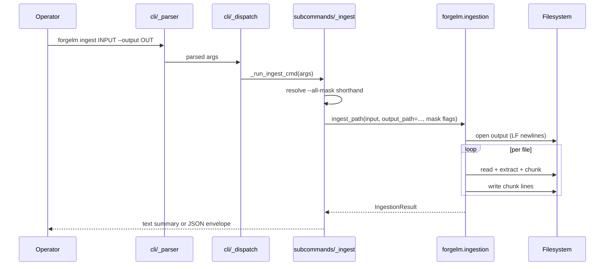

# Data Ingestion Architecture

> **Scope.** Internal architecture of ForgeLM's raw-document → SFT-JSONL
> ingestion pipeline (`forgelm ingest` and `forgelm.ingestion.ingest_path`)
> plus its handoff to the trainer-side dataset loader
> (`forgelm.data.prepare_dataset`). Audience: contributors and integrators
> who need to understand how bytes from a PDF turn into a training row,
> where validation gates fire, and which module owns each stage.
>
> For operator-facing usage (CLI flags, recipes, troubleshooting) see the
> [Document Ingestion Guide](../guides/ingestion.md). For SFT row-schema
> reference see [data_preparation.md](data_preparation.md). For the
> downstream audit pipeline see the [Dataset Audit Guide](../guides/data_audit.md).

## Overview

The ingestion pipeline is a linear, single-process pipeline organised in
five layers. Heavy ML dependencies (HuggingFace tokenizers, pypdf,
python-docx, ebooklib) are loaded lazily so `import forgelm.ingestion`
stays cheap.

```mermaid
graph LR
    INPUT[Input path<br/>file or directory] --> DISCOVERY[File discovery<br/>SUPPORTED_EXTENSIONS]
    DISCOVERY --> EXTRACT[Format extractors<br/>PDF / DOCX / EPUB / TXT / MD]
    EXTRACT --> DEDUP[PDF header / footer dedup]
    DEDUP --> CHUNK[Chunking strategy<br/>paragraph / sliding / markdown]
    CHUNK --> MASK[Optional masking<br/>secrets then PII]
    MASK --> WRITE[JSONL writer<br/>text key per line]
    WRITE --> RESULT[IngestionResult<br/>counters and structured notes]

    style EXTRACT fill:#002244,stroke:#00aaff
    style CHUNK fill:#002244,stroke:#00aaff
    style MASK fill:#002244,stroke:#00aaff
```



Single entry point: [`forgelm.ingestion.ingest_path`](../../forgelm/ingestion.py)
at line `1200`. The CLI subcommand
[`forgelm/cli/subcommands/_ingest.py`](../../forgelm/cli/subcommands/_ingest.py)
is a thin argparse adapter — it resolves `--all-mask` into the two
underlying booleans and delegates everything else to `ingest_path`.

## Module map

| Concern | Module | Public surface |
|---|---|---|
| Pipeline orchestration | [`forgelm/ingestion.py`](../../forgelm/ingestion.py) | `ingest_path`, `IngestionResult`, `OptionalDependencyError`, `list_supported_formats`, `describe_strategies`, `summarize_result`, `DEFAULT_CHUNK_SIZE`, `DEFAULT_SLIDING_OVERLAP` |
| CLI dispatcher | [`forgelm/cli/subcommands/_ingest.py`](../../forgelm/cli/subcommands/_ingest.py) | `_run_ingest_cmd` |
| CLI argument schema | [`forgelm/cli/_parser.py`](../../forgelm/cli/_parser.py) | `_add_ingest_subcommand` |
| PII detection / masking | [`forgelm/data_audit/_pii_regex.py`](../../forgelm/data_audit/_pii_regex.py) | `detect_pii`, `mask_pii` |
| Secrets detection / masking | [`forgelm/data_audit/_secrets.py`](../../forgelm/data_audit/_secrets.py) | `detect_secrets`, `mask_secrets` |
| Trainer-side dataset loader | [`forgelm/data.py`](../../forgelm/data.py) | `prepare_dataset` |

The PII / secrets detectors live under `data_audit/` because the audit
subcommand consumes the same regex set for its reporting pass. The
ingestion module imports them lazily — the audit package only enters
`sys.modules` when masking is actually requested.

## Pipeline stages

The pipeline runs sequentially per file, with a single output file handle
held open across the whole batch. The high-level call graph:

```mermaid
graph TD
    A[ingest_path] --> B[Resolve paths and defaults]
    B --> C[Lazy-load mask_pii / mask_secrets]
    C --> D[Lazy-load AutoTokenizer if chunk_tokens set]
    D --> E[Discover input files]
    E --> F{For each file}
    F --> G[_process_one_file]
    G --> H[_select_extractor by suffix]
    H --> I[_extract_text_for_ingest]
    I --> J[_select_chunks_iter]
    J --> K[_emit_chunk]
    K --> L[Update _FileOutcome counters]
    L --> F
    F -- done --> M[Aggregate counters]
    M --> N[Build extra_notes and notes_structured]
    N --> O[Return IngestionResult]

    style A fill:#002244,stroke:#00aaff
    style O fill:#002244,stroke:#00aaff
```



Key invariants enforced inside `ingest_path` before any file is touched:

1. **`chunk_size` resolution** — explicit value or `DEFAULT_CHUNK_SIZE`
   (2048). The "did the operator pass it?" detection drives the
   `--chunk-tokens` override warning.
2. **`overlap` resolution** — defaults to `min(DEFAULT_SLIDING_OVERLAP,
   chunk_size // 2)` for sliding, `0` for paragraph and markdown. The
   half-window clamp prevents quadratic chunk explosion on small
   `--chunk-size` values.
3. **Tokenizer pre-load** — when `chunk_tokens` is set, the tokenizer is
   resolved once at the top so a typo in `--tokenizer` fails fast before
   the first file is opened.
4. **Output directory creation** — `dst.parent.mkdir(parents=True,
   exist_ok=True)` so missing intermediate dirs don't abort mid-run.
5. **LF newlines** — `open(... newline="\n")` pins line endings to LF
   regardless of platform; the JSONL Lines spec requires LF and CRLF
   trips downstream `jq -c` / `wc -l` consumers.

## File discovery

`_iter_input_files` produces a sorted, deterministic file list:

- A single-file input yields just that path.
- A directory yields entries matching `SUPPORTED_EXTENSIONS` (`.pdf`,
  `.docx`, `.epub`, `.txt`, `.md`), sorted lexicographically — same
  input + same flags produces byte-identical JSONL across runs.
- `--recursive` switches the glob pattern from `*` to `**/*`.
- Empty result → `FileNotFoundError` with the supported-extensions
  list printed.

Files with unsupported extensions are silently skipped (return `None`
from `_select_extractor`); files with supported extensions but no
extractable text skip with a warning and bump `files_skipped`.

## Format extractors

Each extractor returns plain text or raises a `ValueError`. Optional
dependencies (`pypdf`, `python-docx`, `ebooklib` / `bs4`) are imported
lazily inside the extractor body and converted to
`OptionalDependencyError` (a narrow `ImportError` subclass) so the CLI
can distinguish "extra not installed" from "real import bug".

```mermaid
graph LR
    PDF[.pdf] --> EXTRACT_PDF[_extract_pdf<br/>pypdf]
    DOCX[.docx] --> EXTRACT_DOCX[_extract_docx<br/>python-docx]
    EPUB[.epub] --> EXTRACT_EPUB[_extract_epub<br/>ebooklib + bs4]
    TXT[.txt] --> EXTRACT_TXT[_extract_text]
    MD[.md] --> EXTRACT_TXT
    EXTRACT_PDF --> DEDUP[_strip_repeating_page_lines]
    EXTRACT_DOCX --> TEXT[Concatenated body text]
    EXTRACT_EPUB --> TEXT
    EXTRACT_TXT --> TEXT
    DEDUP --> TEXT

    style DEDUP fill:#002244,stroke:#00aaff
```



### PDF (`_extract_pdf`)

Three internal steps: open + (optional) decrypt → per-page text →
header/footer dedup.

- **Encryption** — `reader.is_encrypted` triggers `_try_pdf_decrypt`,
  which attempts an empty-password decrypt (owner-encrypted readable
  PDFs). Real passwords are out of scope: wiring a CLI flag would put
  credentials in shell history. Failure raises `ValueError` pointing to
  `qpdf --decrypt` / `pdftk`.
- **Per-page extraction** — `_read_pdf_pages` calls
  `page.extract_text()` inside a wide `try/except Exception` so a single
  malformed page does not abort a 500-page document. Failing pages log
  a warning naming the file and page index.
- **Header / footer dedup** — `_strip_repeating_page_lines`. See the
  next section.

Documents that produce zero pages emit a "likely scanned PDF, run OCR
first" warning and return an empty string.

### DOCX (`_extract_docx`)

Walks the `<w:body>` XML element in document order via
`_iter_docx_blocks`, yielding `Paragraph` and `Table` objects in the
position they appear. The default `doc.paragraphs` / `doc.tables`
collections lose ordering — a table that introduces a paragraph would
appear at the end of the file instead of before its dependent text.

Tables are rendered through `_docx_table_to_markdown`:

- First non-empty row becomes the header.
- A `---` separator line follows.
- `|` and `\` cell characters are CommonMark-escaped.
- Newlines inside cells collapse to spaces — a multi-line cell cannot
  be expressed inside one markdown table row.
- Uneven rows are right-padded with empty cells.

Markdown table output composes naturally with `--strategy markdown`:
heading-aware chunking keeps the table intact in one section.

### EPUB (`_extract_epub`)

Opens the EPUB with `ignore_ncx=True` and `ignore_missing_css=True` to
silence ebooklib's two noisiest deprecation warnings. Each
`ITEM_DOCUMENT` chunk runs through BeautifulSoup with separator=`\n`,
the stripped text is concatenated with `\n\n` separators.

### TXT / MD (`_extract_text`)

`Path.read_text(encoding="utf-8", errors="replace")` — non-UTF-8 input
becomes Unicode replacement characters. A binary-contamination guard
warns when more than 1 % of the file is `U+FFFD`, catching common
"someone renamed a zip to .txt" mistakes without blocking the run.

## PDF page header / footer dedup

A separate stage between extraction and chunking. Page-level headers
(company watermark, document title) and footers (page numbers,
copyright lines) end up as the first / last line of every PDF page and
inflate near-duplicate counts during the downstream audit.

```mermaid
graph TD
    PAGES[per-page text] --> SPLIT[Split into lines]
    SPLIT --> COUNT[Count first / last line<br/>frequency across pages]
    COUNT --> CHECK{>= 70 percent of pages?}
    CHECK -- yes --> POP[Pop matching edge lines]
    POP --> COUNT
    CHECK -- no --> JOIN[Re-join pages with double newline]
    JOIN --> OUT[Cleaned PDF text]

    style CHECK fill:#002244,stroke:#00aaff
```



Implementation notes from
[`_strip_repeating_page_lines`](../../forgelm/ingestion.py):

- Skipped on PDFs shorter than `_PDF_REPEAT_MIN_PAGES` (3) — statistical
  signal too weak.
- Cutoff is `max(2, math.ceil(_PDF_REPEAT_THRESHOLD * page_count))` so
  the 70 % rule fires at exactly 70 %, not 60 % under integer truncation.
- **Phase 15 Task 1** widens the inspection from the strict outermost
  row to the top-3 / bottom-3 rows per page (`_PDF_EDGE_WINDOW = 3`),
  so a variable-outer-line corpus (per-chapter title on top, page number
  on bottom) no longer locks the dedup out from peeling the
  constant-deeper-line one row deeper. The bug was the loop's
  *exit condition*, not the outermost-line check — the pre-Phase-15
  iterator broke as soon as no recurrence was found at the strict
  outermost position. The fix is a window check, not an extra pass.
- A **second pass** runs after paragraph packing
  (`strip_paragraph_packed_headers`) to mop up survivor headers the
  chunker re-glued mid-block. Surfaces as
  `pdf_paragraph_packed_lines_stripped` in `notes_structured`.
- Total stripped line count rolls into `IngestionResult.notes_structured`
  under `pdf_header_footer_lines_stripped` for downstream visibility.

### Phase 15 limitations recap

Multi-column PDFs, OCR (scanned-only) PDFs, and RTL scripts remain
unsupported in v0.6.0:

- **Multi-column** — only a WARNING is emitted via
  `_maybe_warn_multi_column`; reading order is still serialised
  left-to-right per pypdf. Phase 16+ may add camelot-py / pdfplumber
  fallback under a new `[ingestion-tables]` extra.
- **OCR** — no text-layer-detection retry. The audit's existing
  "Working with scanned PDFs (OCR handoff)" recipe in
  [`docs/guides/ingestion.md`](../guides/ingestion.md) is the
  operator-facing path; an automatic `ocrmypdf` recommendation is
  Wave 3 deferred (audit §6).
- **RTL** — extraction-order normalisation for Arabic / Hebrew is
  Wave 3 deferred. Operators on RTL corpora today should expect
  reverse-glyph order and pre-process with a layout-aware tool.

## Chunking strategies

Four registered strategies in `CHUNK_STRATEGIES`; three exposed via the
CLI `--strategy` choice list, `semantic` is hidden because it raises
`NotImplementedError` today.

```mermaid
graph TD
    TEXT[Extracted text] --> DISPATCH{Strategy}
    DISPATCH -- paragraph --> PARAGRAPH[_chunk_paragraph<br/>greedy paragraph packer]
    DISPATCH -- sliding --> SLIDING[_chunk_sliding<br/>fixed window with overlap]
    DISPATCH -- markdown --> MARKDOWN[_chunk_markdown<br/>heading-aware splitter]
    DISPATCH -- semantic --> SEMANTIC[NotImplementedError]

    PARAGRAPH --> CHUNKS[Iterable of chunk strings]
    SLIDING --> CHUNKS
    MARKDOWN --> CHUNKS

    style DISPATCH fill:#002244,stroke:#00aaff
    style SEMANTIC fill:#440000,stroke:#ff6666
```



Dispatch happens in `_strategy_dispatch` (character mode) or
`_strategy_dispatch_tokens` (token mode). Both validate the strategy
name and route to the matching chunker.

### `paragraph` (default)

`_chunk_paragraph` — greedy packer that splits on `\n\n` and packs
paragraphs until the next one would exceed `max_chunk_size`. Paragraphs
longer than the cap are emitted on their own, so the cap is a soft
limit. Sentence boundaries are preserved by design.

Non-overlapping. Paragraphs are the unit of indivisibility. The CLI logs
an info note if `--overlap-tokens` is set on this strategy.

### `sliding`

`_chunk_sliding` — fixed character window with overlap. Two guards:

- `overlap` must be in `[0, chunk_size)`.
- `overlap` must be `<= chunk_size // 2`. Without this clamp,
  `overlap=199` and `chunk_size=200` yield ~one chunk per character.

The loop terminates as soon as the current window covers end-of-text to
suppress runt trailing chunks that pollute the audit's near-duplicate
stats.

### `markdown` (Phase 12)

`_chunk_markdown` — heading-aware splitter that respects the markdown
section spine:


- Boundaries are ATX headings (`#` … `######`) detected via
  `_MARKDOWN_HEADING_PATTERN`. The pattern is anchored on
  non-whitespace at both ends to keep matching linear (avoids the
  `O(n²)` backtracking SonarCloud python:S5852 warns about).
- Fence detection is a non-regex state machine (`_parse_md_fence` +
  `_advance_fence_state`) implementing CommonMark §4.5 — including the
  "closing fence must have ≥ as many chars as opener and no info
  string" rule. Heading-shaped lines inside a fenced block are not
  interpreted as section boundaries.
- Each chunk inlines its **enclosing-heading breadcrumb** at the top so
  SFT loss sees document context (e.g. `# Project Notes / ## Background`
  prepended above the section body).
- Sections longer than the cap are emitted whole — table integrity is
  preserved by the same rule that protects long paragraphs.
- **Non-overlapping by design.** Overlap on this strategy raises
  `ValueError(_MARKDOWN_OVERLAP_UNSUPPORTED_MSG)` because slicing
  mid-section would break the breadcrumb invariant.

### `semantic` (deferred)

`_chunk_semantic` raises `NotImplementedError`. Embedding-clustered
chunking conflicts with the air-gapped Annex IV reproducibility guarantee
(a runtime embedding model dependency would make the pipeline
non-deterministic across hardware) and is tracked under closure plan
C-52 with a future `[chunking-semantic]` extra.

## Token-aware mode (Phase 11.5)

Character-based chunking can blow past a model's `max_length` budget on
dense text. Token mode sizes chunks against the actual tokenizer the
trainer will use.

```mermaid
graph LR
    A[--chunk-tokens N] --> B[--tokenizer MODEL_NAME required]
    B --> C[_load_tokenizer<br/>AutoTokenizer, trust_remote_code=False]
    C --> D[_strategy_dispatch_tokens]
    D --> E[_chunk_paragraph_tokens / _chunk_sliding_tokens / _chunk_markdown_tokens]

    style C fill:#002244,stroke:#00aaff
```



Activation: passing `chunk_tokens` to `ingest_path` (or
`--chunk-tokens` on the CLI). When set, `chunk_size` is silently ignored;
an info-level log fires only when the operator passed an *explicit*
`chunk_size` so the override is visible without spamming common cases.

Three token-mode chunkers mirror the character-mode set:

| Token-mode chunker | Character-mode twin | Notes |
|---|---|---|
| `_chunk_sliding_tokens` | `_chunk_sliding` | Same half-window cap; encodes once, slides over token IDs, decodes each slice with `skip_special_tokens=True`. |
| `_chunk_paragraph_tokens` | `_chunk_paragraph` | Batch-tokenises paragraphs once via `_count_section_tokens`; charges the `"\n\n"` separator (`sep_tokens`) when packing — most BPE tokenizers map it to 1–2 tokens. |
| `_chunk_markdown_tokens` | `_chunk_markdown` | Same atomic-section semantics. Non-zero overlap rejected before this body is reached. |

`_count_section_tokens` is the shared batch-encoding helper. It calls
`tokenizer(blocks, add_special_tokens=False)` once and validates the
returned shape (mapping with `input_ids` whose length matches the
input). Old / minimal tokenizers that reject list input fall back to
per-block encoding; any *other* failure re-raises so real bugs are not
masked by the slow path.

`_load_tokenizer` pins `trust_remote_code=False` — token-aware chunking
should never need a custom tokenizer class, and turning it on would let
arbitrary HF Hub repos run code at ingestion time without a config
audit.

## Masking layer

Two independent detectors, both lazily imported from
`forgelm.data_audit`. Combined via the CLI shorthand `--all-mask`
(Phase 12.5).

```mermaid
graph TD
    CHUNK[Chunk string] --> S{secrets_mask?}
    S -- yes --> SCRUB[mask_secrets<br/>REDACTED-SECRET]
    S -- no --> P{pii_mask?}
    SCRUB --> P
    P -- yes --> PSCRUB[mask_pii<br/>REDACTED]
    P -- no --> EMIT[json.dumps + write line]
    PSCRUB --> EMIT
    EMIT --> COUNT[Update outcome counters]

    style SCRUB fill:#002244,stroke:#00aaff
    style PSCRUB fill:#002244,stroke:#00aaff
```



### `mask_secrets`

Defined in [`forgelm/data_audit/_secrets.py`](../../forgelm/data_audit/_secrets.py).
Nine prefix-anchored patterns: AWS access keys (`AKIA…`), GitHub PATs
(`ghp_…` and friends), Slack tokens, OpenAI API keys (`sk-…` /
`sk-proj-…`), Google API keys (`AIza…`), JWTs,
OpenSSH/RSA/DSA/EC/PGP private-key block headers, Azure storage
connection strings.

Replacement token: `[REDACTED-SECRET]`. Counts returned as
`{kind: count}` per chunk and aggregated into
`IngestionResult.secrets_redaction_counts`.

### `mask_pii`

Defined in [`forgelm/data_audit/_pii_regex.py`](../../forgelm/data_audit/_pii_regex.py).
First-match-wins precedence — pattern dict iteration order doubles as
mask precedence so a span that could match two categories is attributed
to the narrowest one (an SSN is also a digit run; we want it flagged as
`us_ssn`, not `phone`).

Detected categories: email, IBAN, credit card (Luhn-validated), US SSN,
FR INSEE, TR Kimlik No (`_is_tr_id` checksum), DE Personalausweis,
phone. Replacement token: `[REDACTED]`.

### Mask ordering — secrets first

`_emit_chunk` enforces the order: secrets pass, then PII pass. Two
reasons (encoded as a docstring comment in
[`ingestion.py:1098`](../../forgelm/ingestion.py)):

1. Secrets are higher-severity than PII. A leaked AWS key in training
   data is unrecoverable; a phone number is recoverable via opt-out
   flows. When ordering matters at all, it should favour the secrets
   pass.
2. Future PII / secret regex additions could overlap (e.g. an Azure
   connection-string substring resembling an IBAN). Ordering
   future-proofs this case without operator action.

The current regex sets do **not** produce measurable cross-detector
overlap on shipped fixtures, so the ordering is defensive, not
load-bearing.

### `--all-mask` (Phase 12.5)

CLI-only shorthand: `_run_ingest_cmd` computes
`pii_mask = args.pii_mask or args.all_mask` and
`secrets_mask = args.secrets_mask or args.all_mask`. The `ingest_path`
API itself only accepts the two booleans — the shorthand stays at the
CLI boundary so the library surface stays narrow.

## JSONL output contract

One chunk per line, written with `json.dumps({"text": chunk},
ensure_ascii=False) + "\n"`. The file is opened with `newline="\n"` so
the JSONL is LF-terminated on every platform.

```json
{"text": "Article 10 of the EU AI Act requires high-risk AI providers to ..."}
{"text": "Data quality criteria include relevance, representativeness ..."}
```

`ensure_ascii=False` keeps non-ASCII text (Turkish characters, em-dashes,
emoji) verbatim — escaping to `\uXXXX` would silently change tokenisation
for downstream BPE models that allocate distinct token IDs to the
literal and escaped forms.

The trainer-side loader in `forgelm/data.py` recognises `{"text": ...}`
as a pre-formatted SFT column and routes it through
`_process_text_format` without further transformation (see "Trainer-side
handoff" below).

## `IngestionResult` and structured notes

`IngestionResult` (dataclass) carries both operator-friendly free text
(`extra_notes`) and machine-readable structured payload
(`notes_structured`). Pipelines should consume the structured form;
the free-text list may rephrase the same facts and is not API-stable.

| Field | Type | Source |
|---|---|---|
| `output_path` | `Path` | resolved `--output` |
| `chunk_count` | `int` | sum of per-file `chunks_written` |
| `files_processed` | `int` | count of successful extractions |
| `files_skipped` | `int` | unsupported extension, empty text, or extraction failure |
| `total_chars` | `int` | sum of chunk lengths *after* masking |
| `format_counts` | `Dict[str, int]` | by extension (`.pdf`, `.docx`, …) |
| `pii_redaction_counts` | `Dict[str, int]` | per-category PII spans masked |
| `secrets_redaction_counts` | `Dict[str, int]` | per-category secrets masked |
| `extra_notes` | `List[str]` | human-readable summary lines |
| `notes_structured` | `Dict[str, Any]` | machine-readable summary (stable) |
| `pdf_header_footer_lines_stripped` | `int` | total lines popped by PDF dedup |

`notes_structured` mirrors `IngestionResult`'s primitive fields plus the
strategy name and (when active) `chunk_tokens` + `tokenizer`. The
character-mode chunk size is recorded indirectly through the chunk
counts; the field exists so CI / CD pipelines can audit the exact
configuration that produced a JSONL.

## CLI integration



The CLI dispatcher catches a narrow set of exceptions and converts them
to exit codes per the [error-handling standard](../standards/error-handling.md):

| Exception | Exit code |
|---|---|
| `FileNotFoundError`, `ValueError`, `PermissionError`, `IsADirectoryError`, `OSError` | `EXIT_CONFIG_ERROR` (1) |
| `OptionalDependencyError` | `EXIT_TRAINING_ERROR` (2) |

Plain `ImportError` is **not** caught — a genuine import bug inside
`forgelm` should propagate with its original traceback rather than be
swallowed under a generic install hint. The narrow
`OptionalDependencyError` subclass exists specifically to distinguish
the two cases.

`--output-format json` emits a structured envelope on stdout:

```json
{
  "success": true,
  "output_path": "data/policies.jsonl",
  "chunk_count": 2843,
  "files_processed": 17,
  "files_skipped": 0,
  "total_chars": 5824103,
  "format_counts": {".pdf": 12, ".docx": 5},
  "pii_redaction_counts": {"email": 4, "phone": 1},
  "secrets_redaction_counts": {},
  "pdf_header_footer_lines_stripped": 41,
  "notes": [...],
  "notes_structured": {...}
}
```

CI / CD pipelines should parse `success` first and fall through to the
structured fields. Errors return `{"success": false, "error": "..."}`.

## Trainer-side handoff

The ingestion output is one half of the data path; the trainer reads it
back via `forgelm.data.prepare_dataset` and runs the per-trainer
formatter chain.

```mermaid
graph TD
    JSONL[ingestion JSONL] --> LOAD[_load_single_dataset<br/>HuggingFace datasets]
    LOAD --> MIX{extra_datasets?}
    MIX -- yes --> MERGE[_merge_extra_datasets<br/>optional mix_ratio]
    MIX -- no --> SPLIT[_ensure_validation_split]
    MERGE --> SPLIT
    SPLIT --> DETECT[_detect_dataset_format]
    DETECT --> VALIDATE[_validate_trainer_columns]
    VALIDATE --> ROUTE{trainer_type}
    ROUTE -- dpo / simpo / orpo / kto / grpo --> RAW[_shuffle_and_passthrough<br/>raw preference / KTO / GRPO columns]
    ROUTE -- sft --> FORMAT[_format_sft_dataset]
    FORMAT --> PROCESSOR{detected schema}
    PROCESSOR -- text column --> TEXT[_process_text_format]
    PROCESSOR -- messages list --> MESSAGES[_process_messages_format]
    PROCESSOR -- User / Assistant --> UA[_process_user_assistant_format]

    style DETECT fill:#002244,stroke:#00aaff
    style VALIDATE fill:#002244,stroke:#00aaff
```



Format detection (`_detect_dataset_format`) uses column-name heuristics
in fixed precedence:

| Columns present | Detected format | Suggested trainer |
|---|---|---|
| `chosen` + `rejected` | preference | `dpo` |
| `completion` + `label` | binary feedback | `kto` |
| `messages` | conversational | `sft` |
| `prompt` only | prompt-only | `grpo` |
| `User` / `instruction` + `Assistant` / `output` / `response` | instruction-tuning | `sft` |
| `text` | pre-formatted | `sft` |

`_validate_trainer_columns` raises `KeyError` with the detected-format
hint and a suggested `trainer_type` when the configured trainer
disagrees with the column shape. Preference / KTO / GRPO trainers
receive their dataset un-formatted (`_passthrough_for_trainer` returns
splits as-is); only SFT runs the chat-template processor chain.

Validation-split auto-derivation: if neither `validation` nor `test`
exists, `_ensure_validation_split` carves out `min(0.1, 2000 /
train_size)` (floor `0.01`) of the training set with `seed=42`. The
split is logged at INFO level so it appears in the run trail.

Multimodal VLM datasets bypass the formatter entirely:
`_passthrough_multimodal` returns the dataset unchanged so the
`AutoProcessor`-driven trainer can apply its own image+text formatting.

## Determinism and reproducibility

The ingestion pipeline is deterministic given identical inputs and
flags:

- File discovery uses `sorted(glob)` — lexicographic ordering across OS
  and filesystem.
- All chunking strategies are pure functions of their text + parameters;
  no randomness, no clock dependency.
- PII / secrets regexes are module-level constants — no per-run state.
- PDF dedup uses fixed thresholds (70 %, min 3 pages, `math.ceil`).
- Tokenizer loading uses `use_fast=True, trust_remote_code=False` — the
  exact tokenizer behaviour is pinned by the HF Hub revision.
- Output is LF-terminated, UTF-8, `ensure_ascii=False`.

The trainer-side dataset path adds two seeded random operations
(`shuffle(seed=42)` and `train_test_split(seed=42)`). Both are
deterministic but operator-visible: re-running `prepare_dataset` on the
same JSONL yields the same splits.

## Error handling reference

| Stage | Exception | Behaviour |
|---|---|---|
| File discovery, no matches | `FileNotFoundError` | Stops the run |
| Unsupported extension (mixed dir) | none — silent skip | `files_skipped` increments |
| Encrypted PDF, empty password fails | `ValueError` from `_try_pdf_decrypt` | Logged, file skipped |
| Per-page PDF extraction failure | swallowed | Logged warning, page skipped |
| Per-file extraction failure (non-`ImportError`) | swallowed by `_extract_text_for_ingest` | Logged warning, file skipped |
| Missing optional extra | `OptionalDependencyError` (ImportError subclass) | Propagates to CLI → exit 2 |
| Invalid chunking parameters | `ValueError` | Propagates to CLI → exit 1 |
| Tokenizer-mode without `--tokenizer` | `ValueError` | Pre-flight, before any file open |
| Markdown strategy with overlap | `ValueError(_MARKDOWN_OVERLAP_UNSUPPORTED_MSG)` | Pre-flight |
| Trainer schema mismatch (downstream) | `KeyError` from `_validate_trainer_columns` | Trainer run aborts at dataset load |

The "swallow individual file failures, but propagate missing optional
extras and invalid parameters" policy is intentional: a multi-thousand
file corpus ingest must not abort because one PDF has a corrupt page,
but it also must not silently succeed when the operator forgot to
install `pip install 'forgelm[ingestion]'`.

## Related

- [Document Ingestion Guide](../guides/ingestion.md) — operator-facing
  CLI usage, recipes, troubleshooting.
- [Dataset Audit Guide](../guides/data_audit.md) — downstream
  pre-flight gate (PII, secrets, near-duplicate, leakage, quality).
- [Data Preparation Guide](data_preparation.md) — SFT row-schema
  reference for the trainer side.
- [Library API Reference](library_api_reference.md) — Python entry
  points (`ingest_path`, `prepare_dataset`, `audit_dataset`).
- [Configuration Reference](configuration.md) — `data.*` config block
  including `data.governance` (EU AI Act Article 10).
- [Architecture](architecture.md) — top-level component map.
