# ForgeLM Yol Haritası

> **Configuration-driven, kurumsal-grade LLM ince ayar platformu** — üç ilke üzerine kurulu: özelliklerden önce güvenilirlik, özellik sayısı yerine kurumsal farklılaşma, her yetenek config-driven ve test edilebilir.

## Bir bakışta durum

| Tür | Faz | Durum |
|-----|-----|-------|
| ✅ Tamam | [Faz 1-9](roadmap/completed-phases.md) | SOTA iyileştirmeleri, değerlendirme, güvenilirlik, kurumsal entegrasyon, ekosistem, hizalama stack'i, güvenlik, EU AI Act uyumluluğu (Madde 9-17 + Ek IV), gelişmiş güvenlik zekası |
| ✅ Tamam | [Faz 10 — Post-Training Tamamlama](roadmap/phase-10-post-training.md) | `inference.py`, `chat`, `export` (GGUF), `--fit-check`, `deploy` — `v0.4.0` |
| ✅ Tamam | [Faz 10.5 — Quickstart Katmanı ve Onboarding](roadmap/phase-10-5-quickstart.md) | `forgelm quickstart <template>`, 5 hazır template, seed veri setleri — `v0.4.5` |
| 🟡 Birleşti | [Faz 11 + 11.5 + 12 + 12.5 — Doküman Yutma ve Veri Curation Pipeline'ı](roadmap/releases.md#v050--document-ingestion--data-curation-pipeline) | `forgelm ingest`, `forgelm audit`, PII regex + simhash dedup, LSH banding, streaming reader, PII şiddet katmanları, wizard ingest+audit, MinHash LSH dedup, markdown splitter, code/secrets tarama, kalite heuristic'leri, DOCX tablo koruması, `--all-mask`, Croissant 1.0, Presidio NER — `main`'e indi; `v0.5.0` PyPI tag'i bekliyor |
| 📋 Planlandı | [Faz 14 — Çok Aşamalı Pipeline Zincirleri](roadmap/phase-14-pipeline-chains.md) | SFT → DPO → GRPO config zinciri, pipeline kaynak izleri → `v0.5.1` |
| 📋 Planlandı | [Faz 13 — Pro CLI ve Gözlemlenebilirlik Dashboard](roadmap/phase-13-pro-cli.md) | Lisans korumalı dashboard, HPO, zamanlanmış görevler, takım config store → `v0.6.0-pro` |

**`main`'e indi, tag + PyPI publish bekliyor:** `v0.5.0` — "Doküman Yutma + Veri Curation Pipeline'ı" (Faz 11 + 11.5 + 12 + 12.5 birleştirildi).

- **Faz 11** — `forgelm ingest` (PDF / DOCX / EPUB / TXT / Markdown → SFT'ye uygun JSONL) + `forgelm audit` (uzunluk / dil / near-duplicate / cross-split sızıntı / Luhn + TC Kimlik validatörlü PII regex) + EU AI Act Madde 10 governance entegrasyonu.
- **Faz 11.5** — operasyonel cila: LSH bantlı near-duplicate tespiti, streaming JSONL okuyucu, token-aware `--chunk-tokens`, PDF sayfa-seviyesi header/footer dedup, `forgelm audit` subcommand'i, PII şiddet katmanları, atomic audit yazımı, wizard "ingest first" girişi.
- **Faz 12** — veri curation olgunlaşması: MinHash LSH dedup opsiyonu (`--dedup-method minhash`, `[ingestion-scale]` extra), markdown-aware splitter (`--strategy markdown`), code/secrets leakage tagger (`--secrets-mask`, `secrets_summary` her zaman açık), heuristic kalite filtresi (`--quality-filter`), DOCX/Markdown tablo yapısı koruması.
- **Faz 12.5** — küçük additive cila: birleşik PII + secrets temizliği için `--all-mask` kısayolu, `forgelm audit --croissant` Google Croissant 1.0 dataset card emit ediyor, opsiyonel Presidio ML-NER PII adaptörü (`--pii-ml`, `[ingestion-pii-ml]` extra), wizard "audit first" entry point.

Başlangıçta dört ardışık PyPI tag'i (`v0.5.0` / `v0.5.1` / `v0.5.2` / `v0.5.3`) olarak planlandı, dört faz tek tutarlı yüzey (yut → cila → olgunlaş → cila) oluşturduğu için tek kapsamlı `v0.5.0` release'inde birleştirildi.

**PyPI'deki son sürüm:** `v0.4.5` — Quickstart Katmanı (2026-04-26). Tek komutla hazır template'ler: `forgelm quickstart customer-support`. Küçük GPU'larda model otomatik downsize ediliyor, mevcut trainer'ın değişiklik gerektirmeden kabul edeceği bir config üretiyor.

**Daha öncesi:** `v0.4.0` — Post-Training Tamamlama (2026-04-26). Inference primitif'leri, etkileşimli chat REPL, GGUF export, VRAM fit advisor, deployment config üretimi.

**Sonraki:** `v0.5.1` — Çok Aşamalı Pipeline Zincirleri (Faz 14). SFT → DPO → GRPO zincir konfigürasyonu, pipeline kaynak izleri. `v0.5.0` PyPI tag'inden sonra başlar. [#14 webhook SSRF hardening](https://github.com/cemililik/ForgeLM/issues/14) follow-up'ını kapsar.

**Güncel durum:** 17 faz (1, 2, 2.5, 3, 4, 5, 5.5, 6, 7, 8, 9, 10, 10.5, 11, 11.5, 12, 12.5) tamam. 2 faz (13, 14) planlandı. `v0.5.1`: Faz 14. `v0.6.0-pro` (Faz 13) adoption metriklerine bağlı.

## Planlanan işlerin özeti

```mermaid
graph LR
    P10[Faz 10<br/>Post-Training<br/>Completion] --> P105[Faz 10.5<br/>Quickstart<br/>Katmanı]
    P10 --> P11[Faz 11<br/>Veri<br/>Yutma]
    P105 --> P11
    P11 --> P115[Faz 11.5<br/>Yutma<br/>Cilası]
    P115 --> P12[Faz 12<br/>Veri Curation<br/>Olgunlaşması]
    P12 --> P125[Faz 12.5<br/>Veri Curation<br/>Follow-up]
    P12 --> P14[Faz 14<br/>Pipeline<br/>Zincirleri]
    P14 --> P13[Faz 13<br/>Pro CLI<br/>+ Dashboard]

    P10 -.-> V1[v0.4.0]
    P105 -.-> V15[v0.4.5]
    P11 -.-> V2[v0.5.0 pending]
    P115 -.-> V2
    P12 -.-> V2
    P125 -.-> V2
    P14 -.-> V23[v0.5.1]
    P13 -.-> V3[v0.6.0-pro]

    style P10 fill:#003300,stroke:#00ff88
    style P105 fill:#003300,stroke:#00ff88
    style P11 fill:#004400,stroke:#88ff88
    style P115 fill:#004400,stroke:#88ff88
    style P12 fill:#004400,stroke:#88ff88
    style P125 fill:#004400,stroke:#88ff88
    style P14 fill:#002244,stroke:#00aaff
    style P13 fill:#442200,stroke:#ffaa00
```



## Yol gösterici ilkeler

1. **Özelliklerden önce güvenilirlik.** Her yeni yetenek testler, dokümantasyon ve CI kapsamıyla birlikte yayınlanır.
2. **Özellik sayısı yerine kurumsal farklılaşma.** ForgeLM'in avantajı safety + compliance, feature count değil. Unsloth (hız), LLaMA-Factory (GUI), Axolotl (sequence parallelism) alanlarında rekabet etme.
3. **Config-driven, test edilebilir, opsiyonel.** Her yeni yetenek bir YAML flag'i. Global state yok, sihir yok, zorunlu entegrasyon yok.
4. **Hype kriterleri yerine kill kriterleri.** Her fazın ölçülebilir çeyreklik geçit kriteri var. Geçit kaçırılırsa: yeniden düşün, daha fazla itme.

## Dokümantasyon haritası

```
docs/
├── roadmap.md                                  # İngilizce özet index
├── roadmap-tr.md                               # Bu dosya — Türkçe mirror
└── roadmap/
    ├── completed-phases.md                     # Faz 1-10 arşivi (detaylı, İngilizce)
    ├── phase-10-post-training.md               # Tamamlandı — v0.4.0
    ├── phase-10-5-quickstart.md                # Tamam (Faz 10.5) — v0.4.5 olarak yayınlandı
    ├── phase-11-data-ingestion.md              # Tamam (Faz 11) — v0.5.0 olarak çıktı
    ├── phase-11-5-backlog.md                   # Tamam (Faz 11.5) — v0.5.1 için indi; ingestion/audit cilası
    ├── phase-12-data-curation-maturity.md      # Tamam (Faz 12 Tier 1) — v0.5.2 için indi; MinHash LSH, markdown splitter, secrets scan
    ├── phase-12-5-backlog.md                   # Faz 12.5 follow-up backlog (Presidio, Croissant, --all-mask, wizard audit-first)
    ├── phase-13-pro-cli.md                     # Planlandı — v0.6.0-pro (gated)
    ├── phase-14-pipeline-chains.md             # Planlandı — v0.5.3 (v0.5.2'den kaydırıldı)
    ├── releases.md                             # v0.3.0 → v0.6.0 sürüm notları
    └── risks-and-decisions.md                  # Risk matrisi, fırsatlar, rekabet analizi, karar günlüğü
```

## Bu roadmap nasıl güncellenir?

- **Haftalık** — Aktif fazın görevlerine karşı ilerleme kontrolü.
- **Aylık** — Scope değişirse karar günlüğü güncellenir (`roadmap/risks-and-decisions.md`).
- **Çeyreklik** — Tam gözden geçirme: tamamlanan fazları kapat, planlananları önceliklendir, rekabet analizini güncelle. Kill criteria dürüst değerlendirilir.
- **Yıllık** — Tamamlanan fazları `completed-phases.md`'ye arşivle, eskimiş planlama dosyalarını emekliye ayır.

## İlgili dokümanlar

- [Ürün Stratejisi](product_strategy-tr.md) — Pazar konumu, hedef kullanıcılar, stratejik kararlar
- [Mimari](reference/architecture-tr.md) — Sistem tasarımı referansı
- [Konfigürasyon Rehberi](reference/configuration-tr.md) — Tüm fazlar için YAML referansı
- [Kullanım Rehberi](reference/usage-tr.md) — ForgeLM nasıl çalıştırılır
- **Sadece iç kullanım:** `docs/marketing/` içindeki pazarlama + strateji planlaması (gitignored)

---

**Tek tek faz detayları için:** Yukarıdaki durum tablosundaki linkleri takip edin.
**Büyük resim için:** [Ürün Stratejisi](product_strategy-tr.md) → bir faz seç → o fazın detay dosyasını oku.
