# ForgeLM Yol Haritası

> **Configuration-driven, kurumsal-grade LLM ince ayar platformu** — üç ilke üzerine kurulu: özelliklerden önce güvenilirlik, özellik sayısı yerine kurumsal farklılaşma, her yetenek config-driven ve test edilebilir.

## Bir bakışta durum

| Tür | Faz | Durum |
|-----|-----|-------|
| ✅ Tamam | [Faz 1-9](roadmap/completed-phases.md) | SOTA iyileştirmeleri, değerlendirme, güvenilirlik, kurumsal entegrasyon, ekosistem, hizalama stack'i, güvenlik, EU AI Act uyumluluğu (Madde 9-17 + Ek IV), gelişmiş güvenlik zekası |
| ✅ Tamam | [Faz 10 — Post-Training Tamamlama](roadmap/phase-10-post-training.md) | `inference.py`, `chat`, `export` (GGUF), `--fit-check`, `deploy` — `v0.4.0` |
| ✅ Tamam | [Faz 10.5 — Quickstart Katmanı ve Onboarding](roadmap/phase-12-quickstart.md) | `forgelm quickstart <template>`, 5 hazır template, seed veri setleri — `v0.4.5` |
| ✅ Tamam | [Faz 11 — Doküman Yutma ve Veri Denetimi](roadmap/phase-11-data-ingestion.md) | `forgelm ingest`, `forgelm --data-audit`, PII regex + simhash dedup — `v0.5.0` çıktı |
| ✅ Tamam | [Faz 11.5 — Yutma / Denetim Cilası](roadmap/phase-11-5-backlog.md) | LSH banding, streaming reader, `forgelm audit` subcommand, PII şiddet katmanları, wizard ingest girişi — `v0.5.1` için indi |
| 📋 Planlandı | [Faz 13 — Pro CLI ve Gözlemlenebilirlik Dashboard](roadmap/phase-13-pro-cli.md) | Lisans korumalı dashboard, HPO, zamanlanmış görevler, takım config store → `v0.6.0-pro` |
| 📋 Planlandı | [Faz 14 — Çok Aşamalı Pipeline Zincirleri](roadmap/phase-14-pipeline-chains.md) | SFT → DPO → GRPO config zinciri, pipeline kaynak izleri → `v0.5.2` |

**Development'a indi, tag + PyPI publish bekliyor:** `v0.5.1` — Yutma / Denetim Cilası (Faz 11.5). LSH bantlı near-duplicate tespiti, streaming JSONL okuyucu, token-aware chunking, PDF header/footer dedup, `forgelm audit` subcommand, PII şiddet katmanları, yapılandırılmış ingestion notları, wizard "ingest first" girişi.

**PyPI'deki son sürüm:** `v0.5.0` — Doküman Yutma ve Veri Denetimi (Faz 11), 2026-04-27'de `main`'e merge edildi. `forgelm ingest` raw PDF/DOCX/EPUB/TXT'yi SFT'ye uygun JSONL'a dönüştürür; `forgelm --data-audit` CPU-only veri kalite raporu üretir (uzunluk dağılımı, near-duplicate tespiti, cross-split sızıntı kontrolü, PII flag'leri) ve EU AI Act Madde 10 governance artifact'ına otomatik bağlanır.

**Daha öncesi:** `v0.4.5` — Quickstart Katmanı (2026-04-26). Tek komutla hazır template'ler: `forgelm quickstart customer-support`. `v0.4.0` — Post-Training Tamamlama (2026-04-26). Inference primitif'leri, etkileşimli chat REPL, GGUF export, VRAM fit advisor, deployment config üretimi.

**Güncel kilometretaşı:** `v0.5.2` — Çok Aşamalı Pipeline Zincirleri (Faz 14). SFT → DPO → GRPO zincir konfigürasyonu, pipeline kaynak izleri.

**Güncel durum:** 15 faz (1, 2, 2.5, 3, 4, 5, 5.5, 6, 7, 8, 9, 10, 10.5, 11, 11.5) tamam. 2 faz (13, 14) planlandı. `v0.5.2`: Faz 14 (Pipeline Zincirleri). `v0.6.0-pro` (Faz 13) adoption metriklerine bağlı.

## Planlanan işlerin özeti

```mermaid
graph LR
    P10[Faz 10<br/>Post-Training<br/>Completion] --> P105[Faz 10.5<br/>Quickstart<br/>Katmanı]
    P10 --> P11[Faz 11<br/>Veri<br/>Yutma]
    P105 --> P11
    P11 --> P115[Faz 11.5<br/>Yutma<br/>Cilası]
    P115 --> P13[Faz 13<br/>Pro CLI<br/>+ Dashboard]
    P115 --> P14[Faz 14<br/>Pipeline<br/>Zincirleri]

    P10 -.-> V1[v0.4.0]
    P105 -.-> V15[v0.4.5]
    P11 -.-> V2[v0.5.0]
    P115 -.-> V21[v0.5.1]
    P14 -.-> V25[v0.5.2]
    P13 -.-> V3[v0.6.0-pro]

    style P10 fill:#003300,stroke:#00ff88
    style P105 fill:#003300,stroke:#00ff88
    style P11 fill:#003300,stroke:#00ff88
    style P115 fill:#003300,stroke:#00ff88
    style P13 fill:#442200,stroke:#ffaa00
    style P14 fill:#002244,stroke:#00aaff
```



## Yol gösterici ilkeler

1. **Özelliklerden önce güvenilirlik.** Her yeni yetenek testler, dokümantasyon ve CI kapsamıyla birlikte yayınlanır.
2. **Özellik sayısı yerine kurumsal farklılaşma.** ForgeLM'in avantajı safety + compliance, feature count değil. Unsloth (hız), LLaMA-Factory (GUI), Axolotl (sequence parallelism) alanlarında rekabet etme.
3. **Config-driven, test edilebilir, opsiyonel.** Her yeni yetenek bir YAML flag'i. Global state yok, sihir yok, zorunlu entegrasyon yok.
4. **Hype kriterleri yerine kill kriterleri.** Her fazın ölçülebilir çeyreklik geçit kriteri var. Geçit kaçırılırsa: yeniden düşün, daha fazla itme.

## Dokümantasyon haritası

```
docs/
├── roadmap.md                                  # İngilizce özet index
├── roadmap-tr.md                               # Bu dosya — Türkçe mirror
└── roadmap/
    ├── completed-phases.md                     # Faz 1-10 arşivi (detaylı, İngilizce)
    ├── phase-10-post-training.md               # Tamamlandı — v0.4.0
    ├── phase-11-data-ingestion.md              # Tamam (Faz 11) — v0.5.0 olarak çıktı
    ├── phase-11-5-backlog.md                   # Tamam (Faz 11.5) — v0.5.1 için indi; ingestion/audit cilası
    ├── phase-12-quickstart.md                  # Tamam (Faz 10.5) — v0.4.5 olarak yayınlandı
    ├── phase-13-pro-cli.md                     # Planlandı — v0.6.0-pro (gated)
    ├── phase-14-pipeline-chains.md             # Planlandı — v0.5.2
    ├── releases.md                             # v0.3.0 → v0.6.0 sürüm notları
    └── risks-and-decisions.md                  # Risk matrisi, fırsatlar, rekabet analizi, karar günlüğü
```

## Bu roadmap nasıl güncellenir?

- **Haftalık** — Aktif fazın görevlerine karşı ilerleme kontrolü.
- **Aylık** — Scope değişirse karar günlüğü güncellenir (`roadmap/risks-and-decisions.md`).
- **Çeyreklik** — Tam gözden geçirme: tamamlanan fazları kapat, planlananları önceliklendir, rekabet analizini güncelle. Kill criteria dürüst değerlendirilir.
- **Yıllık** — Tamamlanan fazları `completed-phases.md`'ye arşivle, eskimiş planlama dosyalarını emekliye ayır.

## İlgili dokümanlar

- [Ürün Stratejisi](product_strategy-tr.md) — Pazar konumu, hedef kullanıcılar, stratejik kararlar
- [Mimari](reference/architecture-tr.md) — Sistem tasarımı referansı
- [Konfigürasyon Rehberi](reference/configuration-tr.md) — Tüm fazlar için YAML referansı
- [Kullanım Rehberi](reference/usage-tr.md) — ForgeLM nasıl çalıştırılır
- **Sadece iç kullanım:** `docs/marketing/` içindeki pazarlama + strateji planlaması (gitignored)

---

**Tek tek faz detayları için:** Yukarıdaki durum tablosundaki linkleri takip edin.
**Büyük resim için:** [Ürün Stratejisi](product_strategy-tr.md) → bir faz seç → o fazın detay dosyasını oku.
