# ForgeLM Yol Haritası

> **Configuration-driven, kurumsal-grade LLM ince ayar platformu** — üç ilke üzerine kurulu: özelliklerden önce güvenilirlik, özellik sayısı yerine kurumsal farklılaşma, her yetenek config-driven ve test edilebilir.

## Bir bakışta durum

| Tür | Faz | Durum |
|-----|-----|-------|
| ✅ Tamam | [Faz 1-9](roadmap/completed-phases.md) | SOTA iyileştirmeleri, değerlendirme, güvenilirlik, kurumsal entegrasyon, ekosistem, hizalama stack'i, güvenlik, EU AI Act uyumluluğu (Madde 9-17 + Ek IV), gelişmiş güvenlik zekası |
| 📋 Planlandı | [Faz 10 — Post-Training Tamamlama](roadmap/phase-10-post-training.md) | `forgelm/inference.py`, `chat`, `export` (GGUF), `fit-check`, `deploy` |
| 📋 Planlandı | [Faz 11 — Doküman Yutma ve Veri Denetimi](roadmap/phase-11-data-ingestion.md) | PDF/DOCX/EPUB → JSONL, PII tespiti, yakın-duplicate denetimi |
| 📋 Planlandı | [Faz 12 — Quickstart Katmanı ve Onboarding](roadmap/phase-12-quickstart.md) | `forgelm quickstart <template>`, 5 template, örnek veri setleri |
| 📋 Planlandı | [Faz 13 — Pro CLI ve Gözlemlenebilirlik Dashboard](roadmap/phase-13-pro-cli.md) | Lisans korumalı dashboard, HPO, zamanlanmış görevler, takım config store |

**Güncel durum:** 11 faz (1, 2, 2.5, 3, 4, 5, 5.5, 6, 7, 8, 9) tamamlandı. 4 faz (10-13) planlandı. Hedef `v0.4.0`: Faz 10. Hedef `v0.5.0`: Faz 11 + 12.

## Planlanan işlerin özeti

```mermaid
graph LR
    P10[Faz 10<br/>Post-Training<br/>Completion] --> P11[Faz 11<br/>Veri<br/>Yutma]
    P10 --> P12[Faz 12<br/>Quickstart<br/>Katmanı]
    P11 --> P12
    P12 --> P13[Faz 13<br/>Pro CLI<br/>+ Dashboard]

    P10 -.-> V1[v0.4.0]
    P11 -.-> V2[v0.5.0]
    P12 -.-> V2
    P13 -.-> V3[v0.6.0-pro]

    style P10 fill:#002244,stroke:#00aaff
    style P11 fill:#002244,stroke:#00aaff
    style P12 fill:#002244,stroke:#00aaff
    style P13 fill:#442200,stroke:#ffaa00
```



## Yol gösterici ilkeler

1. **Özelliklerden önce güvenilirlik.** Her yeni yetenek testler, dokümantasyon ve CI kapsamıyla birlikte yayınlanır.
2. **Özellik sayısı yerine kurumsal farklılaşma.** ForgeLM'in avantajı safety + compliance, feature count değil. Unsloth (hız), LLaMA-Factory (GUI), Axolotl (sequence parallelism) alanlarında rekabet etme.
3. **Config-driven, test edilebilir, opsiyonel.** Her yeni yetenek bir YAML flag'i. Global state yok, sihir yok, zorunlu entegrasyon yok.
4. **Hype kriterleri yerine kill kriterleri.** Her fazın ölçülebilir çeyreklik geçit kriteri var. Geçit kaçırılırsa: yeniden düşün, daha fazla itme.

## Dokümantasyon haritası

```
docs/
├── roadmap.md                                  # İngilizce özet index
├── roadmap-tr.md                               # Bu dosya — Türkçe mirror
└── roadmap/
    ├── completed-phases.md                     # Faz 1-9 arşivi (detaylı, İngilizce)
    ├── phase-10-post-training.md               # Aktif planlama
    ├── phase-11-data-ingestion.md              # Aktif planlama
    ├── phase-12-quickstart.md                  # Aktif planlama
    ├── phase-13-pro-cli.md                     # Aktif planlama (gated)
    ├── releases.md                             # v0.3.0 → v0.6.0 sürüm notları
    └── risks-and-decisions.md                  # Risk matrisi, fırsatlar, rekabet analizi, karar günlüğü
```

## Bu roadmap nasıl güncellenir?

- **Haftalık** — Aktif fazın görevlerine karşı ilerleme kontrolü.
- **Aylık** — Scope değişirse karar günlüğü güncellenir (`roadmap/risks-and-decisions.md`).
- **Çeyreklik** — Tam gözden geçirme: tamamlanan fazları kapat, planlananları önceliklendir, rekabet analizini güncelle. Kill criteria dürüst değerlendirilir.
- **Yıllık** — Tamamlanan fazları `completed-phases.md`'ye arşivle, eskimiş planlama dosyalarını emekliye ayır.

## İlgili dokümanlar

- [Ürün Stratejisi](product_strategy-tr.md) — Pazar konumu, hedef kullanıcılar, stratejik kararlar
- [Mimari](reference/architecture-tr.md) — Sistem tasarımı referansı
- [Konfigürasyon Rehberi](reference/configuration-tr.md) — Tüm fazlar için YAML referansı
- [Kullanım Rehberi](reference/usage-tr.md) — ForgeLM nasıl çalıştırılır
- **Sadece iç kullanım:** `docs/marketing/` içindeki pazarlama + strateji planlaması (gitignored)

---

**Tek tek faz detayları için:** Yukarıdaki durum tablosundaki linkleri takip edin.
**Büyük resim için:** [Ürün Stratejisi](product_strategy-tr.md) → bir faz seç → o fazın detay dosyasını oku.
