# ForgeLM Roadmap

> **Configuration-driven, enterprise-grade LLM fine-tuning platform** — built on three principles: reliability before features, enterprise differentiation over feature parity, every capability config-driven and testable.

## Status at a glance

| Type | Phase | Status |
|-----|-------|--------|
| ✅ Done | [Phase 1-9](roadmap/completed-phases.md) | SOTA upgrades, evaluation, reliability, enterprise integration, ecosystem, alignment stack, safety, EU AI Act compliance (Articles 9-17 + Annex IV), advanced safety intelligence |
| ✅ Done | [Phase 10 — Post-Training Completion](roadmap/completed-phases.md) | `inference.py`, `chat`, `export` (GGUF), `--fit-check`, `deploy` — shipped `v0.4.0` |
| ✅ Done | [Phase 10.5 — Quickstart Layer & Onboarding](roadmap/completed-phases.md) | `forgelm quickstart <template>`, 5 bundled templates with seed datasets — shipped `v0.4.5` |
| ✅ Done | [Phase 11 + 11.5 + 12 + 12.5 — Document Ingestion & Data Curation Pipeline](roadmap/releases.md#v050-document-ingestion-data-curation-pipeline) | `forgelm ingest`, `forgelm audit`, PII regex + simhash dedup, LSH banding, streaming reader, PII severity tiers, wizard ingest+audit, MinHash LSH dedup, markdown splitter, code/secrets scan, quality heuristics, DOCX table preservation, `--all-mask`, Croissant 1.0, Presidio NER — shipped `v0.5.0` (PyPI 2026-04-30) |
| ✅ Done | [Phase 12.6 — Closure Cycle (37 content phases + 1 release tag = 38 entries across 5 waves)](roadmap/completed-phases.md) | Library API, GDPR purge + reverse-pii, ISO 27001 / SOC 2 alignment, doctor + cache subcommands, compliance verification toolbelt, bilingual mirror sweep + 4 CI guards, supply-chain security, cross-OS release matrix — bundled into `v0.5.5` (PyPI 2026-05-10) |
| ✅ Done | Phase 22 — CLI wizard parity with the in-browser surface | `forgelm --wizard` runs the same 9-step flow as the web wizard (welcome → use-case → model → strategy → trainer → dataset → training-params → compliance → evaluation), with idempotent re-run via `--wizard-start-from <yaml>`, schema-driven defaults SOT, distinct `EXIT_WIZARD_CANCELLED = 5` exit code, state persistence under `$XDG_CACHE_HOME`, and validate-on-exit — bundled into `v0.5.5` (PyPI 2026-05-10) |
| ✅ Done | Site documentation correction sweep | All visible YAML / artefact-path / CLI / schema claims on `site/*.html` now validate against the live `forgelm/` surface. Hero YAML demo rewritten with real Pydantic field names, compliance artefact tree redrawn against the on-disk layout, ghost YAML keys + CLI flags removed, wording aligned with live behaviour. Six-language i18n (en / tr / de / fr / es / zh) now at full parity (731 keys each) — bundled into `v0.5.5` (PyPI 2026-05-10) |
| 📋 Planned | [Phase 14 — Multi-Stage Pipeline Chains](roadmap/phase-14-pipeline-chains.md) | SFT → DPO → GRPO chained config, pipeline provenance artifacts → `v0.6.0` |
| 📋 Planned | [Phase 13 — Pro CLI & Observability Dashboard](roadmap/phase-13-pro-cli.md) | License-gated dashboard, HPO, scheduled jobs, team config store → `v0.6.0-pro` (gated on adoption + ISO/SOC 2 baseline shipped in v0.5.5) |

> **Status legend:** ✅ Released (PyPI) · 🟡 Merged on main, publish pending · ⏳ Planned

**Released:** `v0.5.0` — "Document Ingestion + Data Curation Pipeline" — PyPI 2026-04-30 (Phases 11 + 11.5 + 12 + 12.5 consolidated).

- **Phase 11** — `forgelm ingest` (PDF / DOCX / EPUB / TXT / Markdown → SFT-ready JSONL) + `forgelm audit` (length / language / near-duplicate / cross-split leakage / PII regex with Luhn + TC Kimlik validators) + EU AI Act Article 10 governance integration.
- **Phase 11.5** — operational polish: LSH-banded near-duplicate detection, streaming JSONL reader, token-aware `--chunk-tokens`, PDF page-level header/footer dedup, `forgelm audit` subcommand, PII severity tiers, atomic audit writes, wizard "ingest first" entry point.
- **Phase 12** — data curation maturity: MinHash LSH dedup option (`--dedup-method minhash`, `[ingestion-scale]` extra), markdown-aware splitter (`--strategy markdown`), code/secrets leakage tagger (`--secrets-mask`, `secrets_summary` always-on), heuristic quality filter (`--quality-filter`), DOCX/Markdown table preservation.
- **Phase 12.5** — small additive polish: `--all-mask` shorthand for combined PII + secrets scrubbing, `forgelm audit --croissant` emits a Google Croissant 1.0 dataset card, optional Presidio ML-NER PII adapter (`--pii-ml`, `[ingestion-pii-ml]` extra), wizard "audit first" entry point.

Originally planned as four sequential PyPI tags (`v0.5.0` / `v0.5.1` / `v0.5.2` / `v0.5.3`), consolidated into one comprehensive `v0.5.0` release because the four phases form one coherent surface (ingest → polish → mature → polish) hard to use in parts.

**Latest release on PyPI:** `v0.5.7` — "SFT trainer trl-modernisation fix" (2026-05-10), a follow-up patch on top of `v0.5.6` (Intel Mac install fix) and the headline `v0.5.5` "Closure Cycle Bundle + Phase 22 Wizard + Site Documentation Sweep" (2026-05-10).  v0.5.5 bundled **Phase 12.6** (Library API + GDPR purge / reverse-pii + ISO 27001 / SOC 2 alignment + doctor / cache / safety-eval / verify-* subcommands + cross-OS release matrix + supply-chain security baseline; folds in [#14 webhook SSRF hardening](https://github.com/cemililik/ForgeLM/issues/14)), **Phase 22** (CLI wizard parity with the in-browser surface + idempotent `--wizard-start-from` re-run + schema-driven defaults SOT + distinct `EXIT_WIZARD_CANCELLED = 5` exit code), and a **site documentation correction sweep** that brings every visible YAML / artefact-path / CLI / schema claim on `site/*.html` in line with the live code surface and restores six-language i18n parity.  v0.5.6 reverted the v0.5.5 `torch>=2.3` floor back to `torch>=2.2` to restore Intel Mac (x86_64) installability.  v0.5.7 fixes a runtime `TypeError` in the SFT trainer caused by trl 0.13 renaming `SFTConfig.max_seq_length` → `SFTConfig.max_length`.

**Earlier:** `v0.5.0` — Document Ingestion + Data Curation Pipeline (2026-04-30); `v0.4.5` — Quickstart Layer (2026-04-26); `v0.4.0` — Post-Training Completion (2026-04-26).

**Current state:** 19 phases (1, 2, 2.5, 3, 4, 5, 5.5, 6, 7, 8, 9, 10, 10.5, 11, 11.5, 12, 12.5, 12.6, 22) shipped on PyPI under `v0.5.5`.  2 phases (13, 14) planned post-release.

> **Phase 12.6 task / sub-task dual-axis note:** Phase 12.6 is itself a 38-task closure cycle (Tasks 1-38) tracked at [`roadmap/completed-phases.md`](roadmap/completed-phases.md); per-wave PR descriptions carry the closure-task delta.

## Quick summary of what's planned

> **Note:** Arrows depict shipping order, not phase numbers (Phase 14 ships before Phase 13).

```mermaid
graph LR
    P10[Phase 10<br/>Post-Training<br/>Completion] --> P105[Phase 10.5<br/>Quickstart<br/>Layer]
    P10 --> P11[Phase 11<br/>Data<br/>Ingestion]
    P105 --> P11
    P11 --> P115[Phase 11.5<br/>Ingestion<br/>Polish]
    P115 --> P12[Phase 12<br/>Data Curation<br/>Maturity]
    P12 --> P125[Phase 12.5<br/>Data Curation<br/>Follow-up]
    P125 --> P126[Phase 12.6<br/>Closure<br/>Cycle]
    P126 --> P14[Phase 14<br/>Pipeline<br/>Chains]
    P14 --> P13[Phase 13<br/>Pro CLI<br/>+ Dashboard]

    P10 -.-> V1[v0.4.0]
    P105 -.-> V15[v0.4.5]
    P11 -.-> V2[v0.5.0 ✅ Released]
    P115 -.-> V2
    P12 -.-> V2
    P125 -.-> V2
    P126 -.-> V25[v0.5.5]
    P14 -.-> V23[v0.6.0]
    P13 -.-> V3[v0.6.0-pro]

    style P10 fill:#003300,stroke:#00ff88
    style P105 fill:#003300,stroke:#00ff88
    style P11 fill:#004400,stroke:#88ff88
    style P115 fill:#004400,stroke:#88ff88
    style P12 fill:#004400,stroke:#88ff88
    style P125 fill:#004400,stroke:#88ff88
    style P14 fill:#002244,stroke:#00aaff
    style P13 fill:#442200,stroke:#ffaa00
```



## Guiding principles

1. **Reliability before features.** Every new capability ships with tests, docs, and CI coverage.
2. **Enterprise differentiation over feature parity.** ForgeLM's edge is safety + compliance, not feature count. Don't compete on features already owned by Unsloth (speed), LLaMA-Factory (GUI), or Axolotl (sequence parallelism).
3. **Config-driven, testable, optional.** Every new capability is a YAML flag. No global state, no magic, no mandatory integrations.
4. **Kill criteria over hype criteria.** Every phase has a measurable quarterly gate. Missed gates = rethink, not push harder.

## Documentation map

```
docs/
├── roadmap.md                                  # This file — short index
├── roadmap-tr.md                               # Turkish mirror
└── roadmap/
    ├── completed-phases.md                     # Phase 1-12.6 archive (detailed) — Phase 10 / 10.5 / 11 / 11.5 / 12 / 12.5 / 12.6 absorbed inline (each shipped as v0.4.0 / v0.4.5 / v0.5.0 / v0.5.5)
    ├── phase-13-pro-cli.md                     # Planned — v0.6.0-pro (gated)
    ├── phase-14-pipeline-chains.md             # Planned — v0.6.0 (follow-up to the v0.5.5 closure cycle)
    ├── releases.md                             # v0.3.0 → v0.6.0 release notes
    └── risks-and-decisions.md                  # Risk matrix, opportunities, competitive positioning, decision log
```

## How this roadmap is maintained

- **Weekly** — Progress check against active phase's tasks.
- **Monthly** — Decision log update if scope changes (`roadmap/risks-and-decisions.md`).
- **Quarterly** — Full review: close completed phases, re-prioritize planned phases, update competitive analysis. Each phase gate has explicit kill criteria: if the gate is missed, the phase is rethought — not just delayed.
- **Annually** — Archive completed phases to `completed-phases.md`, retire outdated planning files.

## Related documents

- [Product Strategy](product_strategy.md) — Market position, target users, strategic decisions
- [Architecture](reference/architecture.md) — System design reference
- [Configuration Guide](reference/configuration.md) — YAML reference for all phases
- [Usage Guide](reference/usage.md) — How to run ForgeLM
- **Internal only:** Marketing + strategy planning in `docs/marketing/` (gitignored)

---

**For individual phase details:** Follow the links in the status table above.
**For the big picture:** Start with [Product Strategy](product_strategy.md) → pick a phase → read its dedicated file.
