# ForgeLM Roadmap

> **Configuration-driven, enterprise-grade LLM fine-tuning platform** — built on three principles: reliability before features, enterprise differentiation over feature parity, every capability config-driven and testable.

## Status at a glance

| Tür | Phase | Status |
|-----|-------|--------|
| ✅ Done | [Phase 1-9](roadmap/completed-phases.md) | SOTA upgrades, evaluation, reliability, enterprise integration, ecosystem, alignment stack, safety, EU AI Act compliance (Articles 9-17 + Annex IV), advanced safety intelligence |
| ✅ Done | [Phase 10 — Post-Training Completion](roadmap/phase-10-post-training.md) | `inference.py`, `chat`, `export` (GGUF), `--fit-check`, `deploy` — shipped `v0.4.0` |
| 📋 Planned | [Phase 10.5 — Quickstart Layer & Onboarding](roadmap/phase-12-quickstart.md) | `forgelm quickstart <template>`, 5 templates, sample datasets → `v0.4.5` |
| 📋 Planned | [Phase 11 — Document Ingestion & Data Audit](roadmap/phase-11-data-ingestion.md) | PDF/DOCX/EPUB → JSONL, PII detection, near-duplicate audit → `v0.5.0` |
| 📋 Planned | [Phase 13 — Pro CLI & Observability Dashboard](roadmap/phase-13-pro-cli.md) | License-gated dashboard, HPO, scheduled jobs, team config store → `v0.6.0-pro` |
| 📋 Planned | [Phase 14 — Multi-Stage Pipeline Chains](roadmap/phase-14-pipeline-chains.md) | SFT → DPO → GRPO chained config, pipeline provenance artifacts → `v0.5.1` |

**Latest release:** `v0.4.0` — Post-Training Completion (shipped 2026-04-26 to PyPI). Inference primitives, interactive chat REPL, GGUF export, VRAM fit advisor, and deployment config generation.

**Current milestone:** `v0.4.5` — Quickstart Layer (Phase 10.5). Pre-built templates and the `forgelm quickstart <template>` command — primary community growth driver.

**Current state:** 12 phases (1, 2, 2.5, 3, 4, 5, 5.5, 6, 7, 8, 9, 10) complete. 4 phases (10.5, 11, 13, 14) planned. Target `v0.4.5` release: Phase 10.5 (Quickstart). Target `v0.5.0`: Phase 11.

## Quick summary of what's planned

```mermaid
graph LR
    P10[Phase 10<br/>Post-Training<br/>Completion] --> P105[Phase 10.5<br/>Quickstart<br/>Layer]
    P10 --> P11[Phase 11<br/>Data<br/>Ingestion]
    P105 --> P11
    P11 --> P13[Phase 13<br/>Pro CLI<br/>+ Dashboard]
    P11 --> P14[Phase 14<br/>Pipeline<br/>Chains]

    P10 -.-> V1[v0.4.0]
    P105 -.-> V15[v0.4.5]
    P11 -.-> V2[v0.5.0]
    P14 -.-> V25[v0.5.1]
    P13 -.-> V3[v0.6.0-pro]

    style P10 fill:#003300,stroke:#00ff88
    style P105 fill:#002244,stroke:#00aaff
    style P11 fill:#002244,stroke:#00aaff
    style P13 fill:#442200,stroke:#ffaa00
    style P14 fill:#002244,stroke:#00aaff
```



## Guiding principles

1. **Reliability before features.** Every new capability ships with tests, docs, and CI coverage.
2. **Enterprise differentiation over feature parity.** ForgeLM's edge is safety + compliance, not feature count. Don't compete on features already owned by Unsloth (speed), LLaMA-Factory (GUI), or Axolotl (sequence parallelism).
3. **Config-driven, testable, optional.** Every new capability is a YAML flag. No global state, no magic, no mandatory integrations.
4. **Kill criteria over hype criteria.** Every phase has a measurable quarterly gate. Missed gates = rethink, not push harder.

## Documentation map

```
docs/
├── roadmap.md                                  # This file — short index
├── roadmap-tr.md                               # Turkish mirror
└── roadmap/
    ├── completed-phases.md                     # Phase 1-10 archive (detailed)
    ├── phase-10-post-training.md               # Completed — v0.4.0
    ├── phase-11-data-ingestion.md              # Planned — v0.5.0
    ├── phase-12-quickstart.md                  # Planned — Phase 10.5 — v0.4.5
    ├── phase-13-pro-cli.md                     # Planned — v0.6.0-pro (gated)
    ├── phase-14-pipeline-chains.md             # Planned — v0.5.1
    ├── releases.md                             # v0.3.0 → v0.6.0 release notes
    └── risks-and-decisions.md                  # Risk matrix, opportunities, competitive positioning, decision log
```

## How this roadmap is maintained

- **Weekly** — Progress check against active phase's tasks.
- **Monthly** — Decision log update if scope changes (`roadmap/risks-and-decisions.md`).
- **Quarterly** — Full review: close completed phases, re-prioritize planned phases, update competitive analysis. Each phase gate has explicit kill criteria: if the gate is missed, the phase is rethought — not just delayed.
- **Annually** — Archive completed phases to `completed-phases.md`, retire outdated planning files.

## Related documents

- [Product Strategy](product_strategy.md) — Market position, target users, strategic decisions
- [Architecture](reference/architecture.md) — System design reference
- [Configuration Guide](reference/configuration.md) — YAML reference for all phases
- [Usage Guide](reference/usage.md) — How to run ForgeLM
- **Internal only:** Marketing + strategy planning in `docs/marketing/` (gitignored)

---

**For individual phase details:** Follow the links in the status table above.
**For the big picture:** Start with [Product Strategy](product_strategy.md) → pick a phase → read its dedicated file.
