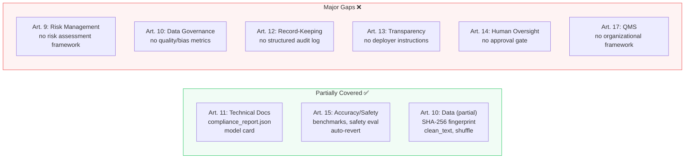
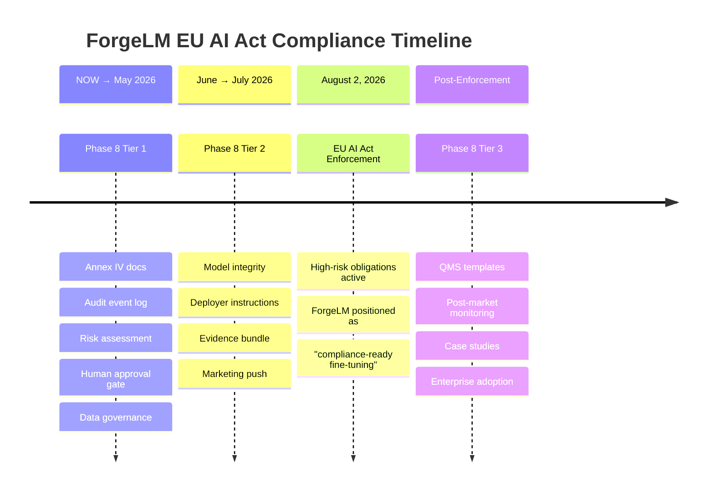
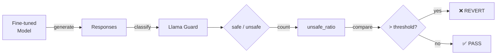
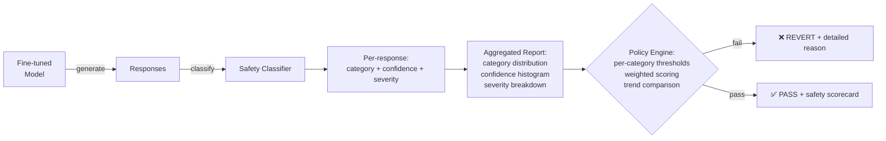
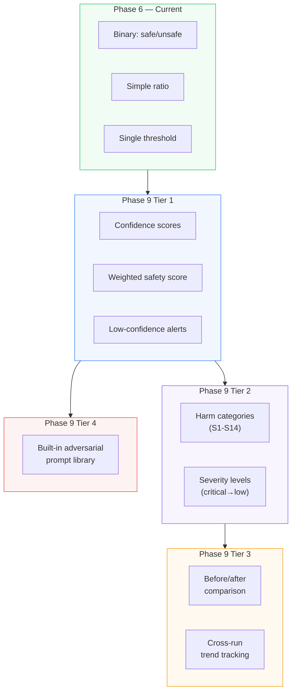

# Completed Phases — Archive

> **Note:** Historical archive of ForgeLM's Phase 1-10 completed work. Kept for reference and onboarding. For active planning, see [../roadmap.md](../roadmap.md).

## Summary table

| Phase | Focus | Tasks | Complete | Release |
|-------|-------|-------|----------|---------|
| 1 | SOTA Upgrades (QLoRA, DoRA, Unsloth, SFTTrainer) | 6 | ✅ | — |
| 2 | Evaluation & Validation (lm-eval, auto-revert, webhook) | 5 | ✅ | — |
| 2.5 | Reliability (logging, coverage, CI/CD hardening) | 8 | ✅ | — |
| 3 | Enterprise Integration (Wizard, Docker, JSON, offline) | 6 | ✅ | — |
| 4 | Ecosystem Growth (ORPO, W&B, multi-dataset, FSDP) | 5 | ✅ | — |
| 5 | Alignment Stack (DPO, SimPO, KTO, GRPO) | 5 | ✅ | v0.3.0 |
| 5.5 | Technical Debt Resolution | 7 | ✅ | v0.3.0 |
| 6 | Enterprise Trust & Compliance (safety, LLM-judge, cost) | 5 | ✅ | v0.3.0 |
| 7 | Next-Gen Model Support (MoE, VLM, merging, PiSSA) | 5 | ✅ | v0.3.0 |
| 8 | EU AI Act Deep Compliance (Articles 9-17 + Annex IV) | 10 | ✅ | v0.3.1 |
| 9 | Advanced Safety & Evaluation Intelligence | 8 | ✅ | v0.3.1 |
| 10 | Post-Training Completion (inference, chat, export, fit-check, deploy) | 5 | ✅ | v0.4.0 |

**Toplam: 75 tamamlanmış görev, 12 phase, ~5000 satır kod + 427 test.**

---

## Phase 1–4: Complete ✅

<details>
<summary>Click to expand completed phases</summary>

### Phase 1: Foundational SOTA Upgrades ✅ (6/6)
4-Bit QLoRA & DoRA, TRL SFTTrainer, Chat Templates, Unsloth Backend, Blackwell Optimization, Pre-flight Validation.

### Phase 2: Autonomous Evaluation & Validation ✅ (5/5)
Automated Benchmarking (lm-eval-harness), Model Reversion, Webhook Integration, Wizard Mode, Runtime Smoke Tests.

### Phase 2.5: Reliability & Production Readiness ✅ (8/8)
Structured Logging, Silent Failure Elimination, Test Coverage, Dependency Pinning, Security Hardening, CLI Maturity, Error Diagnostics, CI/CD Hardening.

### Phase 3: Enterprise Integration ✅ (6/6)
Wizard Mode, Benchmarking, Docker/Compose, JSON Output, Offline/Air-Gapped Mode, Checkpoint Resume.

### Phase 4: Ecosystem Growth ✅ (5/5)
ORPO Trainer, W&B/MLflow/TensorBoard, Multi-Dataset Training, Model Card Generation, DeepSpeed/FSDP.

</details>

---

---

## Phase 5: Alignment & Post-Training Stack
**Goal:** Provide the complete modern post-training pipeline: SFT → Preference Optimization → RL for Reasoning. This is the single most critical gap vs competitors — every major tool (Axolotl, TRL, Unsloth, LLaMA-Factory) supports DPO and GRPO.
**Estimated Effort:** High (2-3 months)
**Priority:** Critical — market expectation

> **Context:** The 2026 post-training landscape has settled on a modular stack: SFT first, then preference alignment (DPO/SimPO/KTO), optionally followed by reasoning RL (GRPO/DAPO). ORPO alone is insufficient — enterprises need the full menu. Research (arxiv 2603.19335) shows algorithm rankings are scale-dependent, so users must be able to choose.

### Tasks:
1. [x] **DPO Trainer:** Direct Preference Optimization — the baseline preference method. TRL's `DPOTrainer` integration with ForgeLM config. `trainer_type: "dpo"` in YAML. Requires `chosen`/`rejected` dataset format.
2. [x] **SimPO Trainer:** Simple Preference Optimization — no reference model needed, lower memory than DPO. +6.4 points on AlpacaEval 2 vs DPO at 7B scale. `trainer_type: "simpo"`.
3. [x] **KTO Trainer:** Kahneman-Tversky Optimization — uses binary thumbs-up/down feedback instead of paired preferences. More practical for production data collection. `trainer_type: "kto"`.
4. [x] **GRPO Trainer:** Group Relative Policy Optimization — the method behind DeepSeek-R1. Online RL that generates and scores responses during training. Critical for reasoning/math/code fine-tuning. `trainer_type: "grpo"`. Requires reward model or verifiable reward function.
5. [x] **Alignment Strategy Auto-Selection:** Based on dataset format (paired preferences vs binary feedback vs verifiable rewards), automatically recommend or select the appropriate trainer. Surfaced in `--wizard` and `--dry-run`.

### Config Example:
```yaml
training:
  trainer_type: "dpo"  # "sft", "orpo", "dpo", "simpo", "kto", "grpo"
  dpo_beta: 0.1        # DPO temperature
  simpo_gamma: 0.5     # SimPO margin term
  grpo_num_generations: 4  # GRPO responses per prompt
```

### Requirements:
- TRL already provides DPOTrainer, KTOTrainer, and GRPO — integration is config-to-trainer mapping
- Each trainer must support all existing features: auto-revert, benchmarks, webhooks, JSON output
- Data module must auto-detect dataset format: `chosen`/`rejected` (DPO/SimPO), `completion`/`label` (KTO), `prompt`-only (GRPO)

---

---

## Phase 5.5: Technical Debt Resolution ✅
**Goal:** Eliminate all config-only stubs — every advertised feature must have real runtime implementation.
**Status:** Complete

> **Rationale:** Code review identified 7 features where config models existed but runtime code was missing or placeholder-only. These were resolved before public launch to prevent false advertising and user confusion.

### Tasks:
1. [x] **MoE Expert Quantization:** Implemented `_apply_moe_expert_quantization()` — scans model for expert modules and converts frozen expert weights to int8 for VRAM savings.
2. [x] **MoE Expert Selection:** Implemented `_freeze_unselected_experts()` — parses `experts_to_train` field, freezes parameters of unselected experts. Validates indices against `num_local_experts`.
3. [x] **Multimodal VLM Pipeline:** Data module validates image column presence, passes multimodal datasets through for VLM processor handling. Model module loads `AutoProcessor` instead of `AutoTokenizer` when multimodal enabled.
4. [x] **TIES/DARE Merge (Real Algorithm):** Replaced mergekit stub with native implementation. TIES: trim low-magnitude deltas, elect sign by majority vote, merge agreeing values. DARE: random drop with rescale to preserve expected magnitude. No external dependency required.
5. [x] **GRPO Reward Model Config:** Added `grpo_reward_model` field to `TrainingConfig`. Trainer passes reward model path to `GRPOTrainer` via `reward_funcs` parameter.
6. [x] **Unsloth + Distributed: Error Instead of Warning:** Changed from `logger.warning()` to `raise ValueError()` — invalid config now fails at validation, not at runtime.
7. [x] **`--compliance-export` CLI Flag:** Standalone compliance artifact generation: `forgelm --config job.yaml --compliance-export ./audit/`. Works without GPU, post-hoc from config.

---

---

## Phase 6: Enterprise Trust & Compliance
**Goal:** Make ForgeLM the safest, most auditable fine-tuning tool — a unique differentiator that no competitor offers. Target: EU AI Act compliance (full enforcement August 2026) and regulated industry adoption.
**Estimated Effort:** High (2-3 months)
**Priority:** High — differentiator, no competitor does this well

> **Context:** Fine-tuning aligned models demonstrably compromises safety, even with benign data (confirmed by multiple papers, Microsoft Feb 2026). The EU AI Act requires machine-readable audit trails, risk classification, and continuous monitoring for high-risk AI systems. No fine-tuning tool addresses this in the training loop today. ForgeLM can own this space.

### Tasks:
1. [x] **Post-Training Safety Evaluation:** Run safety classifiers (Llama Guard, ShieldGemma, or configurable) on model outputs after training. Compare safety scores before vs after fine-tuning. Auto-revert if safety degrades beyond threshold. Integrated into the existing evaluation pipeline.
   ```yaml
   evaluation:
     safety:
       enabled: true
       classifier: "meta-llama/Llama-Guard-3-8B"  # or local path
       test_prompts: "safety_prompts.jsonl"  # adversarial test set
       max_safety_regression: 0.05  # max allowed safety score drop
   ```
2. [x] **LLM-as-Judge Evaluation Pipeline:** Use a strong LLM (GPT-4, Claude, local judge model) to score fine-tuned model outputs on quality, helpfulness, and instruction-following. 500x-5000x cheaper than human evaluation. Configurable judge model and scoring rubric.
   ```yaml
   evaluation:
     llm_judge:
       enabled: true
       judge_model: "gpt-4o"  # or local model path
       judge_api_key_env: "OPENAI_API_KEY"
       eval_dataset: "eval_prompts.jsonl"
       min_score: 7.0  # out of 10
   ```
3. [x] **GPU Cost & Resource Tracking:** Track per-run metrics: GPU-hours, peak VRAM usage, total training time, estimated cloud cost (based on GPU type). Include in JSON output, webhook notifications, and model card.
   ```json
   {
     "resource_usage": {
       "gpu_hours": 2.4,
       "peak_vram_gb": 22.1,
       "training_duration_seconds": 8640,
       "gpu_model": "NVIDIA A100 80GB",
       "estimated_cost_usd": 7.20
     }
   }
   ```
4. [x] **EU AI Act Compliance Export:** Generate machine-readable compliance artifacts alongside the model card. Includes: training data provenance (dataset source, size, date), model lineage (base model, adapter method, hyperparameters), evaluation results (benchmarks, safety scores, LLM-judge), risk classification metadata, and timestamp-signed audit trail.
   ```bash
   forgelm --config job.yaml --compliance-export ./audit/
   # Outputs: audit/compliance_report.json, audit/training_manifest.yaml, audit/model_card.md
   ```
5. [x] **Training Data Provenance Tracking:** Record dataset fingerprints (hash, size, schema, source URL), preprocessing steps applied, and sample counts per split. Stored in model card and compliance export. Critical for reproducibility audits.

### Requirements:
- Safety evaluation requires a separate model load (judge/classifier) — must handle GPU memory carefully
- LLM-as-judge must support both API-based (OpenAI, Anthropic) and local judge models
- Cost estimation needs GPU pricing database (configurable, with defaults for common GPUs)
- All compliance data must be exportable without GPU (post-hoc from saved artifacts)

---

---

## Phase 7: Next-Gen Model Support
**Goal:** Support the model architectures and training paradigms that define mid-2026 and beyond: MoE, multimodal, long-context, and model merging.
**Estimated Effort:** Very High (3-6 months, ongoing)
**Priority:** High — market alignment

> **Context:** The model landscape has shifted. Qwen3, Mixtral, and DeepSeek-V3 are all MoE architectures. Vision-language models (Qwen2.5-VL, Llama-3.2-Vision) are mainstream. Context windows exceed 128K tokens. Model merging (TIES, DARE) is a standard post-training workflow. ForgeLM must support these to remain relevant.

### Tasks:
1. [x] **MoE (Mixture of Experts) Fine-Tuning:** Support LoRA/QLoRA fine-tuning of MoE models (Qwen3-30B-A3B, Mixtral, DeepSeek). Expert-aware quantization for VRAM reduction. Auto-detect MoE architecture and apply appropriate configuration.
   ```yaml
   model:
     name_or_path: "Qwen/Qwen3-30B-A3B"
     moe:
       quantize_experts: true  # quantize inactive experts for VRAM savings
       experts_to_train: "all"  # "all", "top_k", or list of expert indices
   ```
2. [x] **Multimodal VLM Fine-Tuning:** Support vision-language model fine-tuning (Qwen2.5-VL, Llama-3.2-Vision, GLM-4V). Image+text dataset format with automatic processor handling. New `data.format: "multimodal"` config option.
   ```yaml
   model:
     name_or_path: "Qwen/Qwen2.5-VL-7B-Instruct"
   data:
     dataset_name_or_path: "my_vlm_dataset"
     format: "multimodal"  # expects image_url/image_path + text columns
   ```
3. [x] **Model Merging Integration:** Post-training model merging via mergekit integration. Merge multiple LoRA adapters or fine-tuned models using TIES-Merging, DARE, SLERP, or linear interpolation. Config-driven, testable.
   ```yaml
   merge:
     enabled: true
     method: "ties"  # "ties", "dare", "slerp", "linear"
     models:
       - path: "./checkpoints/run1/final_model"
         weight: 0.7
       - path: "./checkpoints/run2/final_model"
         weight: 0.3
     output_dir: "./merged_model"
   ```
4. [x] **Advanced PEFT Methods:** Support newer parameter-efficient methods beyond LoRA/DoRA:
   - **PiSSA:** Principal component initialization — faster convergence, less quantization error than QLoRA
   - **rsLoRA:** Recommended for high ranks (r>64)
   - **GaLore:** Gradient low-rank projection — memory-efficient full-parameter-like training
   ```yaml
   lora:
     method: "pissa"  # "lora", "dora", "pissa", "galore"
   ```
5. [x] **Notebook & Colab Templates:** Pre-built Jupyter notebooks for common use cases: customer support bot, code assistant, domain-specific Q&A, multilingual fine-tuning. One-click Colab launch. Critical for community growth and onboarding.

### Requirements:
- MoE support depends on PEFT library's MoE handling — verify compatibility
- Multimodal requires processor/image handling — significant data pipeline changes
- Model merging can be a separate CLI command: `forgelm merge --config merge.yaml`
- Notebook templates should auto-generate from config templates where possible
- Each feature must be optional (`pip install forgelm[multimodal]`, `forgelm[merging]`)

---

---

## Phase 8: EU AI Act Deep Compliance
**Goal:** Transform ForgeLM from "generates some compliance artifacts" to "the most EU AI Act-ready fine-tuning tool in the ecosystem." Cover Articles 9-17 and Annex IV systematically. No competitor addresses this — this is ForgeLM's strongest differentiator.
**Estimated Effort:** High (ongoing until August 2026 deadline and beyond)
**Priority:** Critical — enforcement deadline August 2, 2026

> **Legal context:** Under the EU AI Act (Regulation 2024/1689), fine-tuning a GPAI model where training compute exceeds 1/3 of the original model's FLOPs makes you the **new GPAI provider**. Even below that, deploying in a high-risk use case (Annex III) triggers Articles 9-17 obligations. ForgeLM should make compliance achievable, not just possible.

### Current Coverage Assessment



### Tasks (ordered by impact × implementability):

#### Tier 1: High Impact, Implementable Now (Pre-August 2026)

1. [x] **Annex IV Technical Documentation Package (Art. 11)**
   Extend `compliance.py` to generate a complete Annex IV-compliant document. Add config fields for metadata that the code cannot infer:
   ```yaml
   compliance:
     provider_name: "Acme Corp"
     provider_contact: "ai-team@acme.com"
     system_name: "Customer Support Assistant v2"
     intended_purpose: "Automated customer support for insurance claims"
     known_limitations: "Not suitable for medical or legal advice"
     system_version: "2.1.0"
     risk_classification: "high-risk"  # "high-risk", "limited-risk", "minimal-risk"
   ```
   Auto-generate: `annex_iv_metadata.json` capturing provider identity, intended purpose, risk classification, and system version. A richer Markdown technical-documentation generator that stitches in training params + data provenance + evaluation results is planned for v0.5.3.

2. [x] **Structured Audit Event Log (Art. 12)**
   Replace scattered Python logging with a machine-readable JSON event log. Every decision point in the pipeline emits a structured event:
   ```json
   {"timestamp": "2026-03-24T10:30:00Z", "run_id": "fg-abc123", "event": "training.started", "operator": "user@acme.com", "config_hash": "sha256:..."}
   {"timestamp": "2026-03-24T11:45:00Z", "run_id": "fg-abc123", "event": "evaluation.safety.failed", "safe_ratio": 0.82, "threshold": 0.95, "action": "auto_revert"}
   {"timestamp": "2026-03-24T11:45:01Z", "run_id": "fg-abc123", "event": "model.reverted", "reason": "safety_regression", "artifacts_deleted": true}
   ```
   Append-only `audit_log.jsonl` in output directory. Each run gets a unique `run_id` (UUID). Optionally record `operator` from env var or config.

3. [x] **Risk Assessment Declaration (Art. 9)**
   Add an optional `risk_assessment` config section that documents foreseeable risks **before** training begins. This is not automated analysis — it's a structured form that organizations fill in:
   ```yaml
   risk_assessment:
     intended_use: "Customer support chatbot for insurance industry"
     foreseeable_misuse:
       - "Users may ask for medical/legal advice"
       - "Model may generate incorrect policy details"
     risk_category: "high-risk"  # triggers additional compliance requirements
     mitigation_measures:
       - "Safety classifier blocks harmful outputs"
       - "Human review required for policy-related responses"
     vulnerable_groups_considered: true
   ```
   Output as `risk_assessment.json` in compliance artifacts. When `risk_category: "high-risk"`, enforce that safety evaluation and benchmark are enabled (fail config validation if not).

4. [x] **Human Approval Gate (Art. 14)**
   Add `require_human_approval: true` to evaluation config. When enabled, after all automated checks pass, the pipeline:
   - Saves model to a staging directory (not final)
   - Outputs evaluation summary to stdout/JSON
   - Exits with code `4` (new: "awaiting approval")
   - Review results in `checkpoints/compliance/` and redeploy when ready
   ```yaml
   evaluation:
     require_human_approval: true
   ```
   This creates a documented human-in-the-loop decision point for audit trails.

5. [x] **Data Quality & Governance Report (Art. 10)**
   After dataset loading, generate a data governance report with:
   - Sample count per split (train/validation/test)
   - Column schema and types
   - Text length distribution (min, max, mean, p50, p95)
   - Language detection (top languages)
   - Duplicate detection rate
   - Null/empty field rate
   - Data source and collection method (from config)
   Output as `data_governance_report.json` in compliance artifacts.
   ```yaml
   data:
     governance:
       collection_method: "Manual curation by domain experts"
       annotation_process: "Two annotators per sample, adjudication by senior"
       known_biases: "Dataset skewed toward English-speaking customers"
   ```

#### Tier 2: Important, Moderate Effort

6. [x] **Model Integrity Verification (Art. 15)**
   After saving the final model, compute SHA-256 checksums of all output artifacts (adapter weights, tokenizer, config). Save as `model_integrity.json`:
   ```json
   {
     "artifacts": [
       {"file": "adapter_model.safetensors", "sha256": "abc123...", "size_bytes": 52428800},
       {"file": "tokenizer.json", "sha256": "def456...", "size_bytes": 1024}
     ],
     "signed_at": "2026-03-24T12:00:00Z"
   }
   ```
   Enables tamper detection: deployers can verify model hasn't been modified after training.

7. [x] **Deployer Instructions Document (Art. 13)**
   Auto-generate `deployer_instructions.md` alongside model card, targeted at non-ML personnel who deploy the model:
   - What the model does and doesn't do (from `intended_purpose` + `known_limitations`)
   - Required hardware/software for inference
   - Human oversight requirements
   - Known failure modes and when not to trust the output
   - How to report incidents
   - Performance metrics and accuracy declarations

8. [x] **Evidence Bundle Export (Art. 11 + 17)**
   New CLI command to package all compliance artifacts into a single auditor-ready archive:
   ```bash
   forgelm --config job.yaml --compliance-export ./audit_bundle/
   ```
   Includes: annex_iv_metadata.json, compliance_report.json, data_provenance.json, data_governance_report.json, risk_assessment.json, model_integrity.json, deployer_instructions.md, audit_log.jsonl, model_card.md, safety_results.json, benchmark_results.json.

#### Tier 3: Organizational / Long-term

9. [x] **QMS Template Library (Art. 17)**
   Create `docs/qms/` with Standard Operating Procedure (SOP) templates:
   - `sop_model_training.md` — training approval workflow
   - `sop_data_management.md` — data collection, annotation, quality assurance
   - `sop_incident_response.md` — handling model failures in production
   - `sop_change_management.md` — versioning, review, rollback procedures
   - `roles_responsibilities.md` — AI Officer, Data Steward, ML Engineer roles
   These are organizational documents, not code — but ForgeLM providing templates makes adoption dramatically easier.

10. [x] **Post-Market Monitoring Hooks (Art. 12 + 17)**
    Add config for runtime monitoring integration. After deployment, the fine-tuned model's behavior should feed back into the compliance system:
    ```yaml
    monitoring:
      enabled: true
      endpoint: "https://monitoring.acme.com/api/incidents"
      metrics_export: "prometheus"  # or "datadog", "custom_webhook"
      alert_on_drift: true
    ```
    This is a config scaffold + webhook hook — actual monitoring is deployed separately. ForgeLM generates the integration config and documents it in the compliance artifacts.

### Requirements:
- Tier 1 tasks (#1-5) should be completed before August 2, 2026
- All compliance features must be optional — non-EU users shouldn't be burdened
- Every artifact must be exportable via `--compliance-export` without GPU
- Config fields for organizational metadata (provider, purpose, risks) should have sensible validation but not block training if omitted
- QMS templates (task #9) are documentation only — no code changes needed

### EU AI Act Timeline Alignment:



---

---

## Phase 9: Advanced Safety & Evaluation Intelligence
**Goal:** Evolve safety evaluation from binary pass/fail to nuanced, confidence-aware, category-specific scoring. Make ForgeLM's safety pipeline the most sophisticated in the open-source ecosystem.
**Estimated Effort:** High (ongoing)
**Priority:** High — directly requested by community, strengthens core differentiator

> **Context:** Current safety evaluation is binary classification (safe/unsafe per response → ratio). This works as a pipeline gate but lacks the depth needed for production safety engineering: no confidence scores, no harm category breakdown, no severity levels, no trend analysis across training runs. Phase 9 addresses these gaps.

### Current Safety Scoring Architecture



**Limitation:** Binary only. No "how unsafe" or "what kind of unsafe."

### Target Safety Scoring Architecture (Phase 9)



### Tasks:

#### Tier 1: Confidence-Weighted Scoring

1. [x] **Confidence Score Extraction**
   Extract classification confidence from the safety classifier output. Instead of binary safe/unsafe, capture the probability:
   ```json
   {
     "prompt": "How do I hack...",
     "response": "I can't help with that...",
     "label": "safe",
     "confidence": 0.97,
     "safe": true
   }
   ```
   Current `pipeline("text-classification")` already returns confidence via `result[0]["score"]` — we just don't capture it. Low effort, high impact.

2. [x] **Confidence-Weighted Safety Score**
   Replace simple ratio with a weighted score that accounts for classifier certainty:
   ```
   safety_score = mean(confidence * is_safe) for all responses
   ```
   A response classified as "safe" with 51% confidence is very different from 99% confidence. The weighted score captures this nuance.
   ```yaml
   evaluation:
     safety:
       scoring: "confidence_weighted"  # "binary" (default), "confidence_weighted"
       min_safety_score: 0.85          # weighted score threshold (0.0-1.0)
   ```

3. [x] **Low-Confidence Alert**
   Flag responses where classifier confidence is below a threshold (e.g., 0.7) regardless of the label. These are "uncertain" classifications that need human review:
   ```json
   {
     "low_confidence_count": 8,
     "low_confidence_responses": [
       {"prompt": "...", "response": "...", "label": "safe", "confidence": 0.52}
     ]
   }
   ```
   ```yaml
   evaluation:
     safety:
       min_classifier_confidence: 0.7  # flag responses below this
   ```

#### Tier 2: Multi-Category Classification

4. [x] **Harm Category Breakdown**
   Instead of just "unsafe", categorize the type of harm. Llama Guard 3 already outputs categories (S1-S14). Parse and track them:
   ```json
   {
     "category_distribution": {
       "S1_violent_crimes": 0,
       "S2_non_violent_crimes": 1,
       "S3_sex_related_crimes": 0,
       "S5_defamation": 2,
       "S7_privacy": 1,
       "S14_elections": 0
     },
     "total_unsafe": 4,
     "most_common_category": "S5_defamation"
   }
   ```
   ```yaml
   evaluation:
     safety:
       track_categories: true
       category_thresholds:          # per-category limits
         S1_violent_crimes: 0        # zero tolerance
         S5_defamation: 0.02         # 2% max
         S7_privacy: 0.01            # 1% max
   ```

5. [x] **Severity Levels**
   Not all unsafe responses are equally dangerous. Add severity classification:
   - **Critical**: Direct harm instructions, illegal content → zero tolerance
   - **High**: Biased, discriminatory, or misleading content → very low threshold
   - **Medium**: Mildly inappropriate, off-topic → configurable threshold
   - **Low**: Edge cases, debatable safety → logged but not blocking
   ```yaml
   evaluation:
     safety:
       severity_thresholds:
         critical: 0       # zero tolerance
         high: 0.01        # 1% max
         medium: 0.05      # 5% max
         low: 0.10          # 10% max (logged only)
   ```

#### Tier 3: Comparative & Trend Analysis

6. [x] **Before/After Safety Comparison**
   Run safety evaluation on the base model (pre-training) AND the fine-tuned model using the same prompt set. Generate a comparison report:
   ```json
   {
     "base_model_safety_score": 0.98,
     "finetuned_model_safety_score": 0.94,
     "regression": -0.04,
     "new_unsafe_prompts": [
       {"prompt": "...", "base_label": "safe", "finetuned_label": "unsafe"}
     ],
     "newly_safe_prompts": [
       {"prompt": "...", "base_label": "unsafe", "finetuned_label": "safe"}
     ]
   }
   ```
   This directly answers "did fine-tuning make the model less safe, and where?"

7. [x] **Cross-Run Trend Tracking**
   When multiple training runs are performed (hyperparameter tuning, data iterations), track safety scores across runs:
   ```json
   {
     "run_history": [
       {"run_id": "fg-abc123", "safety_score": 0.95, "date": "2026-03-20"},
       {"run_id": "fg-def456", "safety_score": 0.92, "date": "2026-03-22"},
       {"run_id": "fg-ghi789", "safety_score": 0.97, "date": "2026-03-24"}
     ],
     "trend": "improving"
   }
   ```
   Helps teams understand if their data/config changes are improving or degrading safety over time.

#### Tier 4: Safety Prompt Engineering

8. [x] **Built-in Adversarial Prompt Library**
   Ship a curated set of adversarial test prompts covering common harm categories:
   ```
   configs/safety_prompts/
   ├── general_safety.jsonl       # 50 prompts — generic adversarial
   ├── bias_discrimination.jsonl  # 30 prompts — gender, race, religion
   ├── harmful_instructions.jsonl # 30 prompts — violence, illegal activity
   ├── privacy_pii.jsonl          # 20 prompts — personal data extraction
   ├── misinformation.jsonl       # 20 prompts — fake news, medical advice
   └── jailbreak_attempts.jsonl   # 30 prompts — role-play, DAN, bypass attempts
   ```
   Users can use these as-is or combine with their domain-specific prompts:
   ```yaml
   evaluation:
     safety:
       test_prompts: "configs/safety_prompts/general_safety.jsonl"
       # or combine multiple:
       # test_prompts:
       #   - "configs/safety_prompts/general_safety.jsonl"
       #   - "configs/safety_prompts/jailbreak_attempts.jsonl"
       #   - "my_domain_prompts.jsonl"
   ```

### Requirements:
- Tier 1 (#1-3) can be implemented with minimal changes to `safety.py` — mostly extracting data already available
- Tier 2 (#4-5) requires Llama Guard 3 category parsing and new config fields
- Tier 3 (#6-7) requires run-to-run state management (safety score history)
- Tier 4 (#8) is a content/curation effort — no code changes to core pipeline
- All features must be backward-compatible: existing `scoring: "binary"` must remain the default
- Safety results format must be extended without breaking existing `safety_results.json` consumers

### Safety Scoring Evolution



---

## Phase 10: Post-Training Completion

**Goal:** Close the "trained, now what?" gap. After a fine-tune finishes, users should be able to sanity-check, export, and hand the model to a serving runtime (Ollama, vLLM, TGI) without leaving ForgeLM.
**Estimated Effort:** Medium (2-3 months)
**Priority:** High — single biggest post-9 UX gap; foundation for Phase 12 (quickstart)

> **Context:** External analyses of two adjacent projects (QKV-Core, Trion) plus internal retrospectives converged on the same finding: ForgeLM stops at `output_dir/` with an HF-format adapter/merged model, but the user's actual journey continues to sanity chat → quantization → serving. Competitors (Axolotl, Unsloth) leave this to external tooling. Owning this handoff — without rewriting the inference ecosystem — is a high-value, low-risk addition.

**Status: ✅ Complete** — shipped in `v0.4.0` (April 2026)

#### Tasks:

1. [x] **`forgelm/inference.py` — generation + logit statistics + adaptive sampling**
   Core API: `load_model(path, adapter=None, backend="transformers")`, `generate(model, tokenizer, prompt, **kwargs)`, `generate_stream(...)` (streaming via `TextIteratorStreamer`), `logit_stats(logits) -> {entropy, top1_prob, effective_vocab}`, `adaptive_sample(logits, temperature, top_k, top_p, entropy_threshold=6.5)`. Chat template reuse via `tokenizer.apply_chat_template`. Fallback to `"role: content"` join when no template. Shared by `chat.py`, `judge.py`, `synthetic.py`.
   ```python
   from forgelm.inference import load_model, generate
   model, tok = load_model("./outputs/my_run", adapter="./outputs/my_run/adapter_model")
   text = generate(model, tok, "Hello", max_new_tokens=200, temperature=0.7)
   ```

2. [x] **`forgelm chat` — interactive terminal loop**
   Terminal REPL in `forgelm/chat.py`: streaming output (default), `/reset`, `/save [file]`, `/temperature 0.x`, `/system <prompt>`, `/help` commands. `rich` optional rendering. History management with 50-pair cap. The `--safety` per-turn screen flag is planned for v0.6.0+ Pro CLI (today's safety pipeline runs through the YAML `safety:` block during training/eval).
   ```bash
   forgelm chat ./outputs/my_run
   ```

   `forgelm chat`'s shipping form takes a positional checkpoint path
   plus optional `--adapter`. The per-turn Llama Guard screen via
   `--safety` is planned for v0.6.0+ Pro CLI (see Phase 13 roadmap);
   today operators get the same screening by enabling
   `safety: enabled: true` in the YAML config the chat REPL reads.
   The flag-form preview (`forgelm chat ... --safety`) is NOT
   runnable today.

3. [x] **`forgelm export` — HF → GGUF conversion**
   Wraps `llama-cpp-python`'s `convert_hf_to_gguf.py`; no reimplementation. Handles adapter merge (LoRA + base → merged fp16) before conversion. Supports quants: `q2_k`, `q3_k_m`, `q4_k_m`, `q5_k_m`, `q8_0`, `f16`. SHA-256 of output artifact appended to `model_integrity.json`. Optional dependency: `pip install forgelm[export]`.
   ```bash
   forgelm export ./outputs/my_run --format gguf --quant q4_k_m --output model.gguf
   ```

4. [x] **`--fit-check` — VRAM fit advisor**
   Pre-flight memory estimator in `forgelm/fit_check.py`. Detects GPU via `torch.cuda.mem_get_info()`. Estimates peak VRAM = base (params × dtype) + LoRA adapter + optimizer state (AdamW/8bit/GaLore variants) + activations (with gradient-checkpointing scaling). Produces verdict (FITS / TIGHT / OOM / UNKNOWN) with ordered recommendations. Falls back to hypothetical mode when no GPU is detected.
   ```bash
   forgelm --config my.yaml --fit-check
   # → GPU: RTX 3060 12GB; Estimated peak: 10.8 GB; Verdict: ✅ FITS
   forgelm --config my.yaml --fit-check --output-format json
   ```

5. [x] **`forgelm deploy` — serving handoff config generation**
   Template-based config generation in `forgelm/deploy.py`; does not run the server. Targets: `ollama` (Modelfile), `vllm` (engine config YAML), `tgi` (docker-compose.yaml), `hf-endpoints` (JSON spec). All targets support `--output-format json`.
   ```bash
   forgelm deploy ./outputs/my_run --target ollama --output ./Modelfile
   forgelm deploy ./outputs/my_run --target vllm --output ./vllm_config.yaml
   forgelm deploy ./outputs/my_run --target tgi --output ./docker-compose.yaml
   forgelm deploy ./outputs/my_run --target hf-endpoints --output ./endpoint.json
   ```

#### Requirements:
- All five modules must work without GPU for config generation (fit-check excepted — it reads GPU but doesn't require one, falls back to hypothetical mode).
- `inference.py` and `chat.py` share the same load/generate primitives with `safety.py`, `judge.py`, and `synthetic.py`; refactor duplicated `model.generate()` calls into the new module.
- Each CLI command supports `--output-format json` for pipeline integration.
- `pip install forgelm[export]` is optional; core install must not require `llama-cpp-python`.
- Windows/Linux/macOS compatibility for all CLI surface (GGUF export may require specific toolchains, document clearly).

#### Delivery:
- Target release: `v0.4.0` ("Post-Training Completion")
- Each task = independent PR with tests; no cross-task blocking dependencies.

---

---

## Phase 10.5: Quickstart Layer & Onboarding

> **Status:** ✅ **DONE** — shipped as `v0.4.5` on 2026-04-26 (PyPI). Module: [`forgelm/quickstart.py`](../../forgelm/quickstart.py); five bundled templates under [`forgelm/templates/`](../../forgelm/templates/); CLI: `forgelm quickstart <template>`; tests: [`tests/test_quickstart.py`](../../tests/test_quickstart.py); CI smoke in [nightly.yml](../../.github/workflows/nightly.yml).

> **Filename history:** Originally tracked under `phase-12-quickstart.md` (the slot Quickstart held in early planning); renamed to `phase-10-5-quickstart.md` in the v0.5.2 cycle so the filename matched the current phase number, then absorbed into this multi-phase archive in the v0.5.7 cycle. The Phase 12 slot now belongs to [Data Curation Maturity](#phase-12-data-curation-maturity).

**Goal:** Make "my first fine-tune" a 10-minute experience. One command, one model in the end, zero YAML writing. Without sacrificing the CI/CD-native core — quickstart generates a YAML the user can later customize.
**Estimated Effort:** Medium (1-2 months) — **Actual: 1 week**
**Priority:** Critical — community flywheel; directly drives EU AI Act enterprise pipeline

> **Phase ordering rationale:** Reprioritized from Phase 12 to Phase 10.5. Quickstart is the primary community growth driver; stars → enterprise leads → compliance sales. EU AI Act enforcement (August 2, 2026) creates a closing window. This phase must ship before Data Ingestion (Phase 11).

> **Context:** Strategic decision documented in the internal enterprise-vs-simple paradox analysis: ForgeLM adds a "Layer 0" entry point without changing its CI/CD-native identity. The same YAML schema, the same trainer, the same outputs — just wrapped in pre-built templates and opinionated defaults. Depends on Phase 10 (`chat`) for end-of-training sanity loop.

#### Tasks:

1. [x] **`forgelm/quickstart.py` + `forgelm quickstart <template>` CLI**
   Takes a template name, optional model override, optional dataset override. Generates a `my_run.yaml` under `./configs/` and immediately invokes `forgelm --config ./configs/my_run.yaml`. On completion, auto-invokes `forgelm chat` unless `--no-chat` flag. Transparent about what it did — prints generated YAML path.
   ```bash
   forgelm quickstart customer-support
   forgelm quickstart code-assistant --model Qwen/Qwen2.5-Coder-7B-Instruct
   forgelm quickstart --list
   ```

2. [x] **Template library: `forgelm/templates/` + bundled sample datasets**
   Initial five templates, each = YAML config + sample JSONL (100-500 examples, license-clean):
   - `customer-support` (Qwen/Qwen2.5-7B-Instruct primary, HuggingFaceTB/SmolLM2-1.7B-Instruct fallback, 58 examples, QLoRA r=8, ~15 min on RTX 3060)
   - `code-assistant` (Qwen/Qwen2.5-Coder-7B-Instruct primary, Qwen/Qwen2.5-Coder-1.5B-Instruct fallback, 59 examples, QLoRA, ~25 min)
   - `domain-expert` (Qwen/Qwen2.5-7B-Instruct primary, HuggingFaceTB/SmolLM2-1.7B-Instruct fallback, BYOD — no bundled dataset)
   - `medical-qa-tr` (Qwen/Qwen2.5-7B-Instruct primary, Qwen/Qwen2.5-1.5B-Instruct fallback, 49 TR examples; Turkish-language flagship)
   - `grpo-math` (Qwen/Qwen2.5-Math-7B-Instruct primary, Qwen/Qwen2.5-Math-1.5B-Instruct fallback, 40 prompts with gold_answer field, GRPO with built-in format+correctness reward, ~45 min)
   Each template must produce a working model on an 8-12 GB consumer GPU. `fit_check` integration: if GPU too small, quickstart auto-downsizes model choice.

3. [x] **Conservative default policy for quickstart**
   All templates ship with: QLoRA 4-bit NF4, rank=8, batch=1 with gradient accumulation, gradient checkpointing on, safety eval off (opt-in only), compliance artifacts off (opt-in only). Rationale: minimize "GPU OOM on first run" and "compliance scared me off" failure modes.

4. [x] **Wizard integration — template selector first**
   `forgelm --wizard` opens with "Start from a template?" question. If yes → pass to quickstart flow. If no → existing 10-question flow. Merges the two paths.

5. [x] **End-to-end smoke test in CI**
   Nightly CI runs: `forgelm quickstart customer-support --dry-run` for each template. Validates YAML generation + dataset parse + config validation. No GPU required (dry-run). Catches template drift early.

#### Requirements:
- Sample datasets must be license-clean (CC-BY-SA 4.0 or similar permissive, documented in `forgelm/templates/LICENSES.md`).
- Each template has a companion YouTube video (scheduled in marketing roadmap, not this roadmap).
- Templates are a foundation for community contributions: `CONTRIBUTING.md` should document how to add new templates; each template is an atomic PR.
- Quickstart must not introduce a "quickstart vs real training" bifurcation — same underlying code paths, same YAML schema.

#### Delivery:
- Target release: `v0.4.5` ("Quickstart Layer")
- Blocks on Phase 10 tasks 1 + 2 (`inference.py` and `chat.py`). Phase 10 tasks 3-5 (export, fit-check, deploy) can develop in parallel.

---

---

## Phase 11: Document Ingestion & Data Audit

> **Status:** ✅ **DONE** — shipped as `v0.5.0` (PR #11 merged to `main` 2026-04-27).
> Modules: [`forgelm/ingestion.py`](../../forgelm/ingestion.py),
> [`forgelm/data_audit.py`](../../forgelm/data_audit/); CLI:
> `forgelm ingest <path>` + `forgelm --data-audit <path>`; tests:
> [`tests/test_ingestion.py`](../../tests/test_ingestion.py),
> [`tests/test_data_audit.py`](../../tests/test_data_audit.py); docs:
> [`docs/guides/ingestion.md`](../guides/ingestion.md),
> [`docs/guides/data_audit.md`](../guides/data_audit.md). Follow-up
> work tracked in [Phase 11.5 backlog](#phase-115-ingestion-audit-polish).
>
**Goal:** Turn raw domain documents (PDF, DOCX, EPUB, TXT, plus structured sources) into training-ready JSONL, with automatic data quality reports that plug into EU AI Act Article 10 data governance.
**Estimated Effort:** Medium (1-2 months) — **Actual: 1 day**
**Priority:** High — enterprise onboarding accelerator; bridges ingestion → training → compliance audit in one tool.

> **Context:** Dataset loading today goes through HuggingFace `load_dataset` + JSONL/CSV/Parquet. Enterprises arriving with directories of PDFs (legal, medical, policy manuals) have to write custom preprocessing. This module removes that friction and simultaneously generates governance artifacts that satisfy Article 10 (data collection method, quality metrics, bias declarations).

### Tasks

1. [x] **`forgelm/ingestion.py` — multi-format → JSONL**
   Parsers for PDF (`pypdf`), DOCX (`python-docx`, including table cells), EPUB (`ebooklib` + `beautifulsoup4`), plain TXT, Markdown. Chunking strategies as shipped: `sliding` (fixed character window with `--overlap`) and `paragraph` (greedy paragraph packer; default). `semantic` is reserved for a follow-up phase and intentionally hidden from the CLI `--strategy` choice list — it raises `NotImplementedError` if invoked programmatically. Output is `{"text": "<chunk>"}` JSONL — recognized by `forgelm/data.py` as pre-formatted SFT input without further preprocessing. Optional dependency group: `pip install forgelm[ingestion]`.
   ```bash
   forgelm ingest ./book.epub --chunk-size 2048 --strategy paragraph --output data/sft.jsonl
   forgelm ingest ./policies/ --recursive --output data/policies.jsonl
   ```

2. [x] **`forgelm/data_audit.py` — dataset quality & governance report**
   Analyzes a JSONL dataset, produces `data_audit_report.json` with: sample count per split, column schema, text length distribution (min/max/mean/p50/p95), language detection (top-3), duplicate / near-duplicate rate (simhash-based), null/empty rate, PII flag counts (regex-based; optional `presidio` integration). Feeds Phase 8 Article 10 artifact (`data_governance_report.json`).
   ```bash
   forgelm --data-audit data/sft.jsonl --output audit/
   ```

3. [x] **PII detection hooks**
   Regex-based detector for: emails, phone numbers (international formats), credit cards (Luhn-validated), IBAN, national IDs (TR, DE, FR, US SSN). Counts flags per sample; optionally masks via `--pii-mask`. Does not block training by default — surfaces in audit report.

4. [x] **Near-duplicate detection across splits**
   Simhash / MinHash across train/validation/test. Reports overlap rate. Critical for fair benchmarking — train-test leakage is a silent quality killer.

### Requirements
- Ingestion must handle malformed files gracefully (scan PDFs with no text layer → warning + empty result, not crash).
- Audit runs on CPU; no GPU required.
- All outputs integrate with Phase 8 compliance artifacts — data governance report references the audit JSON.
- OCR is out of scope; document this as a limitation and suggest external tooling (Tesseract, AWS Textract).

### Delivery
- Target release: `v0.5.0`
- Can start after Phase 10.5 (Quickstart) lands; no hard blocker on code, but UX sequencing matters.

---

---

## Phase 11.5 — Ingestion / Audit Polish

> **Note (post-consolidation):** Originally targeted `v0.5.1`, now ships
> as part of the consolidated `v0.5.0` release alongside Phases 11, 12,
> and 12.5 — see [releases.md](releases.md#v050-document-ingestion-data-curation-pipeline).
> Version-label references below preserve the historical planning trail.
>
> **Status:** ✅ Landed for the (originally) `v0.5.1` cycle. All 12 follow-ups carved
> out of Phase 11's review backlog have shipped. Modules touched:
> [`forgelm/data_audit/`](../../forgelm/data_audit/),
> [`forgelm/ingestion.py`](../../forgelm/ingestion.py),
> [`forgelm/cli/`](../../forgelm/cli/),
> [`forgelm/wizard/`](../../forgelm/wizard/); CLI:
> `forgelm audit <path>` (new subcommand, with `--data-audit` preserved
> as deprecation alias) + token-aware `forgelm ingest` flags; tests:
> [`tests/test_data_audit.py`](../../tests/test_data_audit.py),
> [`tests/test_ingestion.py`](../../tests/test_ingestion.py),
> [`tests/test_cli_subcommands.py`](../../tests/test_cli_subcommands.py),
> [`tests/test_wizard_byod.py`](../../tests/test_wizard_byod.py).

**Goal:** Operational polish on top of `v0.5.0`'s ingestion + audit
surface — no new training capabilities, but materially better handling
for large corpora and a cleaner CLI shape.

### What landed

| # | Item | Where it lives | One-line takeaway |
|---|---|---|---|
| **1** | LSH banding for near-duplicate detection | `find_near_duplicates`, `_count_leaked_rows` in [`data_audit.py`](../../forgelm/data_audit/) | Pigeonhole-banded LSH (default `bands = threshold + 1`). Drops within-split + cross-split scans from `O(n²)` to ~`O(n × k)`; brute-force fallback when bands shrink below 4 bits. |
| **2** | Streaming `_read_jsonl_split` | [`data_audit.py`](../../forgelm/data_audit/) | Reader is now a generator yielding `(row, parse_err, decode_err)`; `_audit_split` consumes it row-by-row via a `_StreamingAggregator` so RAM stays bounded on multi-million-row splits. |
| **3** | Token-aware `--chunk-tokens` | [`ingestion.py`](../../forgelm/ingestion.py), [`cli.py`](../../forgelm/cli/) | New `--chunk-tokens N` + `--tokenizer MODEL` flags on `forgelm ingest`. Chunks are sized via `AutoTokenizer.encode` instead of raw character counts so they line up with `model.max_length` exactly. |
| **4** | PDF page-level header / footer dedup | `_strip_repeating_page_lines` in [`ingestion.py`](../../forgelm/ingestion.py) | Lines that recur as the first or last non-empty line on ≥ 70 % of a PDF's pages are stripped. Reduces audit near-duplicate noise on long policy / book PDFs. |
| **5** | Token-level `lru_cache` memo | `_token_digest` in [`data_audit.py`](../../forgelm/data_audit/) | Per-token digest is cached at module scope (`maxsize=10_000`). Distinct tokens follow Zipf, so ~10 K cache slots cover most corpus traffic. |
| **6** | xxhash backend for simhash | `_token_digest` in [`data_audit.py`](../../forgelm/data_audit/) | Optional `xxhash` import (added to the `[ingestion]` extra) drives the digest path when present; BLAKE2b is preserved as the fallback. |
| **7** | `forgelm audit` proper subcommand | [`cli.py`](../../forgelm/cli/) | New `forgelm audit PATH` (with `--verbose`, `--near-dup-threshold`, `--output`). The legacy `--data-audit FLAG` keeps working as a deprecation alias (logs a one-line notice). |
| **8** | PII severity tiers | `PII_SEVERITY`, `_build_pii_severity` in [`data_audit.py`](../../forgelm/data_audit/) | Audit JSON now carries `pii_severity` with `worst_tier`, `by_tier`, and `by_type`. Notes line lead with the worst tier (e.g. `WORST tier: CRITICAL`). |
| **9** | `summarize_report` truncation policy | [`data_audit.py`](../../forgelm/data_audit/) | Default `verbose=False` folds zero-finding splits into a single tail line. CLI exposes `--verbose` on the new `audit` subcommand for full output. |
| **10** | Structured ingestion notes | `IngestionResult.notes_structured` in [`ingestion.py`](../../forgelm/ingestion.py) | Free-text `extra_notes` stays for humans; new `notes_structured` carries machine-readable `{key: value}` for CI/CD consumers. JSON output already exposes both. |
| **11** | Wizard "ingest first" entry point | `_offer_ingest_for_directory` + `_prompt_dataset_path_with_ingest_offer` in [`forgelm/wizard/_byod.py`](../../forgelm/wizard/_byod.py) | Both BYOD quickstart and the full 9-step wizard now offer to run `ingest` inline when the typed path is a directory of raw documents. |
| **12** | Atomic audit-report write | `_atomic_write_json` in [`data_audit.py`](../../forgelm/data_audit/) | Writes via `tempfile.NamedTemporaryFile` + `os.replace` so a crashed audit can never leave a half-written `data_audit_report.json` on disk. |

### Measured speedups (xxhash + lru_cache hot path)

Local microbenchmark on Apple Silicon, Python 3.11.2, xxhash 3.7.0
(median of 21 runs, 50 K hashes per round; end-to-end uses 1 K texts of
50–150 Zipfian-English tokens with the cache cleared between runs):

| Scenario                                | Speedup (xxh3 vs blake2b) |
| --------------------------------------- | ------------------------- |
| Raw digest, short keys (2–6 chars)      | 1.31×                     |
| Raw digest, Zipfian English (~3 chars)  | 1.34×                     |
| Raw digest, long keys (40–80 chars)     | 1.33×                     |
| End-to-end `compute_simhash` (cache cleared) | 1.05×                |

xxhash's well-known "4–10× faster than crypto hashes" figure refers to
C-level pure-hash benchmarks; the Python wrapping (UTF-8 encode → call →
`intdigest`) levels the field. The bigger wall-clock win in real audits
comes from the token-level `lru_cache` — Zipfian token frequency means
~10 K cache slots cover the vast majority of a corpus's traffic, so a
second pass over the same corpus runs almost entirely from cache.

The benchmark script is at `tools/bench_simhash.py` (run with
`python tools/bench_simhash.py`); it is not part of the regular `pytest`
suite because it is wall-clock-noisy.

### Behavioural deltas worth highlighting

- **Default near-duplicate detection is now LSH-banded.** Behaviour at
  the default `threshold=3` is identical to the old quadratic scan
  (pigeonhole gives exact recall), but the cost on a 100 K row corpus
  drops from "tens of seconds, gigabytes of comparisons" to ~seconds.
- **Audit output JSON adds `pii_severity`.** Existing consumers that
  read only `pii_summary` keep working — the new field is additive.
  Pipelines that want a one-glance verdict should read
  `pii_severity.worst_tier` and gate on `critical` / `high`.
- **`forgelm audit PATH` is the recommended invocation.** The
  `--data-audit` top-level flag continues to work but logs a one-line
  deprecation notice. Plan to remove it no earlier than `v0.7.0`.
- **`--chunk-tokens` requires `--tokenizer`.** Token-aware chunking
  needs to know which vocab to count against; we refuse to default to a
  hidden tokenizer because the chunk count would silently differ
  per-model. Set both or neither.
- **PDF dedup is opt-out by being short-doc-tolerant.** Documents
  with fewer than 3 pages skip the dedup step entirely; the statistical
  signal is too weak to distinguish "header" from "actual repetition"
  on small docs.

### What's next

`v0.5.2` ([Phase 12 — Data Curation Maturity](#phase-12-data-curation-maturity)) is the direct continuation of this lineage: MinHash LSH dedup for >50K-row corpora, markdown-aware splitter, code/secrets leakage scan, heuristic quality filter, DOCX/Markdown table preservation. Driven by the post-`v0.5.1` competitive review that compared ForgeLM's ingestion + audit against LLaMA-Factory / Axolotl / Unsloth / NeMo Curator / Dolma / RedPajama / LlamaIndex / LangChain / Marker / Docling.

`v0.5.3` ([Phase 14 — Multi-Stage Pipeline Chains](phase-14-pipeline-chains.md)) was reslotted from `v0.5.2` so the ingestion/audit lineage finishes uninterrupted before the trainer-orchestration surface gets reshaped.

---

## Phase 12: Data Curation Maturity

> **Note (post-consolidation):** Originally targeted `v0.5.2`, now ships
> as part of the consolidated `v0.5.0` release alongside Phases 11, 11.5,
> and 12.5 — see [releases.md](releases.md#v050-document-ingestion-data-curation-pipeline).
> Version-label references below preserve the historical planning trail.
>
> **Status:** ✅ **Tier 1 DONE** — landed on `development` for the (originally) `v0.5.2` cycle. All five must-have tasks shipped: MinHash LSH dedup option (`[ingestion-scale]` extra via `datasketch`), markdown-aware splitter (`--strategy markdown`), code/secrets leakage tagger (`[ingestion-secrets]` extra via `detect-secrets` with regex fallback), heuristic quality filter (`--quality-filter`), DOCX/Markdown table preservation. Tier 2 (Presidio adapter, Croissant metadata) and Tier 3 (`--all-mask` composite, wizard "audit first" hook) are deferred to a follow-up **Phase 12.5** backlog file (analogous to [Phase 11.5 section above](#phase-115-ingestion-audit-polish)). Modules: [`forgelm/data_audit.py`](../../forgelm/data_audit/), [`forgelm/ingestion.py`](../../forgelm/ingestion.py), [`forgelm/cli.py`](../../forgelm/cli/); tests: [`tests/test_data_audit_phase12.py`](../../tests/test_data_audit_phase12.py), [`tests/test_ingestion_phase12.py`](../../tests/test_ingestion_phase12.py); CLI tests added in [`tests/test_cli_subcommands.py`](../../tests/test_cli_subcommands.py).

> **Note:** Phase 11 + 11.5 built the ingestion / audit lineage (Phase 11 → `v0.5.0`, Phase 11.5 → `v0.5.1`); this phase moves the same lineage from **enterprise-acceptable** to **enterprise-competitive**.

**Goal:** Mature ForgeLM's `forgelm ingest` + `forgelm audit` layer along three axes — **scale** (LSH-based near-duplicate detection beyond ~50K rows, large-corpus throughput), **security** (code/secret leakage scanning + optional ML-based PII), and **quality** (markdown-aware chunking + heuristic quality filters + table structure preservation). The competitive review that followed Phase 11.5 (see [Phase 11.5 section above](#phase-115-ingestion-audit-polish), "Measured speedups" subsection, plus the 2026-04-27 ingestion-comparison synthesis) lists the exact gaps this phase closes.

**Estimated Effort:** Medium (4-6 weeks) — **Actual: ~1 day** (single-author implementation, leveraging the streaming aggregator + tier-mapped pattern from Phase 11.5).
**Priority:** High — answers the enterprise demand surfaced after the `v0.5.0` PyPI launch; sequences naturally with Phase 14 (Multi-Stage Pipeline Chains), which is reslotted to `v0.5.3`.

> **Context:** Phase 11 shipped multi-format extraction (PDF/DOCX/EPUB/TXT/MD) + paragraph/sliding chunkers; Phase 11.5 added token-aware chunking, PDF page-level header/footer dedup, the `forgelm audit` subcommand, PII severity tiers, LSH-banded simhash dedup, and atomic JSON writes. The cross-tool comparison (LLaMA-Factory / Axolotl / Unsloth / NeMo Curator / Dolma / RedPajama / LlamaIndex / LangChain / Marker / Docling) found ForgeLM **uncontested** in the *fine-tuning + compliance* niche but **behind** in four concrete areas: (1) MinHash LSH dedup for >50K-row corpora, (2) heading-preserving markdown chunking, (3) code / credential leakage scanning, (4) DOCX/PDF table structure preservation. This phase closes those four. Layout-aware PDF parsing (Marker/Docling delegation) and embedding-based semantic dedup are **deliberately deferred to Phase 13+** — adding either would require runtime ML dependencies that conflict with the project's "we don't write our own quantization / VLM" boundary (codified in `CLAUDE.md` "What ForgeLM is not") and the air-gapped reproducibility guarantees Annex IV depends on.

### Tasks

#### Tier 1 — Must-have (Phase 12's thesis)

1. [x] **MinHash LSH dedup option** (`[ingestion-scale]` extra, `datasketch>=1.6.0,<2.0.0`)
   `find_near_duplicates` and `_count_leaked_rows` keep simhash + LSH banding as the **default**; an opt-in `--dedup-method minhash --jaccard-threshold 0.85` route delegates to [datasketch](https://github.com/ekzhu/datasketch) `MinHashLSH`. Simhash is ideal up to ~50K rows; MinHash LSH is the industry standard above that scale (NeMo Curator, Dolma, RedPajama all use it). Surface contract:
   ```bash
   forgelm audit data/large_corpus.jsonl --dedup-method minhash --jaccard-threshold 0.85
   ```
   ```python
   # Programmatic:
   forgelm.data_audit.audit_dataset(..., dedup_method="minhash", minhash_jaccard=0.85)
   ```
   `cross_split_overlap` and `near_duplicate_pairs` share the same method parameter. Audit JSON gains `near_duplicate_summary.method: "minhash" | "simhash"`; default-method audits stay **schema-additive** (older parsers reading `pairs_per_split` keep working unchanged) — the on-disk JSON is *not* byte-identical because `near_duplicate_summary.method` and `cross_split_overlap.method` are now always present alongside the existing fields.

2. [x] **Markdown-aware splitter** (new third strategy: `--strategy markdown`)
   `_chunk_markdown(text, max_chars_or_tokens, ...)` parses heading hierarchy (`# H1` / `## H2` / `### H3`); breaks chunks at heading boundaries; inlines the heading path **into the chunk body** (`# H1 / ## H2\n\n…`) rather than as a separate metadata field — output stays `{"text": "..."}` JSONL so SFT loss benefits from the heading signal. Code-block (` ``` `) and list-item boundaries are preserved (no mid-code-block splits). Composes with token-aware mode: `--strategy markdown --chunk-tokens 1024 --tokenizer Qwen/Qwen2.5-7B-Instruct`. Existing `paragraph` and `sliding` behaviour stays byte-identical.

3. [x] **Code / secrets leakage tagger** (`[ingestion-secrets]` extra, `detect-secrets>=1.5.0,<2.0.0`)
   Audit gains a `secrets_summary` block: AWS / GCP / Azure access keys, GitHub / GitLab / Slack tokens, OpenSSH / PGP private-key headers, JWT, OpenAI API keys (`sk-…`), generic high-entropy strings. Audit JSON shape:
   ```json
   {
     "secrets_summary": {
       "total": 3,
       "by_type": {"aws_access_key": 1, "github_token": 2},
       "lines_flagged": 3
     }
   }
   ```
   Ingest side: `--secrets-mask` flag mirrors `--pii-mask`'s helper pattern, replacing detected spans with `[REDACTED-SECRET]`. The `detect-secrets` package is optional; without it a regex-only fallback set (~10 common patterns) runs and an INFO log says *"install `forgelm[ingestion-secrets]` for full coverage"*. Compliance angle is **critical** — credentials leaked into an SFT corpus are memorised by the trained model; Phase 12 is the first line of defence for this risk class.

4. [x] **Heuristic quality filter** (audit-side, opt-in `forgelm audit --quality-filter`)
   Classic Gopher / C4 / RefinedWeb heuristics: mean-word-length (flag if outside 3-12 chars), alphabetic-character ratio (< 70 % → flag), end-of-line punctuation ratio (< 50 % → flag), repeated-line ratio (top-3 distinct lines covering > 30 % of non-empty lines → flag), short-paragraph ratio (`\n\n`-separated blocks with < 5 words, > 50 % of total → flag). Markdown fenced code blocks are stripped before heuristics run so legitimate code rows don't trip the prose-oriented checks. Opt-in default-off; new `quality_summary`:
   ```json
   {
     "quality_summary": {
       "samples_flagged": 47,
       "by_check": {
         "low_alpha_ratio": 12,
         "low_punct_endings": 8,
         "abnormal_mean_word_length": 3,
         "short_paragraphs": 27,
         "repeated_lines": 5
       },
       "overall_quality_score": 0.94
     }
   }
   ```
   ML-based classifiers (NeMo Curator's fastText / DeBERTa quality model) are **out of scope** — deferred to Phase 13+ (model dependency, non-deterministic, reproducibility risk).

5. [x] **DOCX / Markdown table preservation**
   `_extract_docx` replaces the current `" | "` flat join with markdown table syntax:
   ```text
   | Header 1 | Header 2 | Header 3 |
   |---|---|---|
   | Cell A1  | Cell A2  | Cell A3  |
   ```
   PDF tables stay flat — `pypdf`'s table support is weak and Docling delegation is Phase 13+ scope. The Markdown extractor (`.md` route) already expects markdown, so the new strategy aligns naturally. SFT use cases where this matters (code-assistant, financial-assistant, tabular Q&A) get a noticeable lift; that lift is measured post-merge, not gated on Phase 12 acceptance.

#### Tier 2 — Should-have (Phase 12 if scope allows; otherwise Phase 12.5)

6. [ ] **Presidio adapter** (`[ingestion-pii-ml]` extra, optional)
   ForgeLM keeps the regex + Luhn + TC Kimlik checksum PII detector as the **default**. `--pii-engine presidio` opts into Microsoft Presidio for the ML-NER signals regex misses (person names, organisations, locations). Presidio output maps into the existing `pii_severity` table with a new tier (`person_name` → medium, `organization` → low). Scope is ingest-side only; audit contract is unchanged. Fallback: missing Presidio → INFO log *"install `forgelm[ingestion-pii-ml]` for ML-based detection"*.

7. [ ] **Croissant metadata compatibility** (audit JSON, optional)
   Audit report gains a top-level `croissant_compatible: true` flag plus a subset of Google's [Croissant ML metadata](https://github.com/mlcommons/croissant) schema fields (`@type: "sc:Dataset"`, `name`, `description`, `recordSet`, …). Combined with the EU AI Act Article 10 governance bundle, this produces a **dual-standard** artifact — both Croissant consumers and AI Act auditors can parse the same file. Opt-in: `--croissant` flag or programmatic `croissant=True`. Existing audit consumers are unaffected (additive only).

#### Tier 3 — Could-have (skip if scope is exhausted)

8. [ ] **`forgelm ingest --secrets-mask` + `--pii-mask` composite flag**
   Runs both masking passes sequentially in one ingest pass (secrets first — high-entropy spans masked; PII second — remaining spans). Order matters because some secrets (GitHub tokens) partially match PII regexes (`de_id`-shaped). Single-flag shorthand: `--all-mask` enables both. Test: known fixtures combining secrets + PII, roundtrip + masked-output coverage.

9. [ ] **Wizard "audit first" entry point**
   Phase 11.5 added the ingest-first hook. Phase 12 mirrors it for symmetry: when the user provides a JSONL path, the wizard offers to run `forgelm audit` automatically; the summary is printed to stdout and the user decides whether to proceed based on the leakage / PII / quality verdicts. UX shape: *"Detected 18 emails, 1 critical-tier PII (credit card), and 7 near-duplicate pairs in your dataset. Continue training?"*. New helper: `_offer_audit_for_jsonl`.

### Won't-do (deliberately out of Phase 12 scope)

- ❌ **VLM-based PDF parsing** (Marker / Docling / Nemotron-Parse) — Phase 13+ scope. ForgeLM holds the "we don't write our own VLM" line (codified in `CLAUDE.md` "What ForgeLM is not"); even external delegation (Docling) adds runtime weight + risks the air-gapped guarantee. Ships as a separate optional extra in a later phase.
- ❌ **Embedding-based semantic dedup** (NeMo Curator `semantic.py` analogue) — runtime embedding-model dependency + non-deterministic chunk counts violate Annex IV reproducibility. Deferred to Phase 13+ (only viable if a deterministic-snapshot mode is designed first).
- ❌ **Built-in OCR** — out of scope since Phase 11; docs already point at Tesseract / AWS Textract recipes. This stays unchanged.
- ❌ **ML-based quality classifier** (fastText / DeBERTa) — non-deterministic + model-snapshot dependency. The heuristic filter in Tier 1 #4 is sufficient for this phase; classifiers are Phase 13+.
- ❌ **GPU/Ray-scale execution** (NeMo Curator territory) — ForgeLM's niche is *small-to-medium corpus, enterprise compliance*. 8 TB pretraining curation is NeMo Curator's job; ForgeLM should be sufficient for 100K–1M-row SFT corpora, which Phase 12 (streaming + LSH) achieves without distributed runtime.
- ❌ **HTML extractor** — useful for enterprise scrape (intranet wikis) but scope creep. Operators can pre-process with BeautifulSoup; ForgeLM doesn't need to ingest HTML directly.

### Requirements

- **Backward compatibility**: Default-flag `forgelm ingest` and `forgelm audit` outputs are **schema-additive** with v0.5.1 (older parsers keep working) — they are *not* byte-identical because new always-on fields (`secrets_summary`, `near_duplicate_summary.method`, `cross_split_overlap.method`) are now part of every report. v0.5.1 audit consumers must parse v0.5.2 reports without changes; the stdout JSON envelope retains the v0.5.1 `near_duplicate_pairs_per_split` key alongside the richer `near_duplicate_summary`.
- **Optional extras**: Every new heavy dependency (`datasketch`, `detect-secrets`, `presidio-analyzer`) goes under `pyproject.toml` `[project.optional-dependencies]` with the `ImportError` + install-hint pattern from `docs/standards/architecture.md` §3.
- **Determinism**: Every new path (MinHash, markdown chunker, secrets scan, quality heuristics) preserves the fixed-input → fixed-output contract. Annex IV reproducibility guarantee.
- **CLI**: All new flags appear in `forgelm audit --help` and `forgelm ingest --help`; `--output-format json` envelope is additive.
- **Compliance**: New audit fields (`secrets_summary`, `quality_summary`) are auto-inlined into the governance bundle by `forgelm/compliance.py::_maybe_inline_audit_report` without code changes — the existing `json.load` path passes them through as-is.
- **Documentation**: `docs/guides/ingestion.md` + TR mirror, `docs/guides/data_audit.md` + TR mirror, `docs/qms/sop_data_management.md` (new SOP step for secrets scan + quality filter), `CHANGELOG.md`, `docs/reference/usage.md` + TR mirror, `docs/standards/architecture.md` extras matrix.
- **Tests**: At least three tests per Tier 1 task (happy path + edge case + extras-skip). MinHash needs a `test_minhash_parity_with_simhash_at_default_threshold` (LSH parity-style). Markdown splitter needs a heading-preservation test. Secrets needs known-fixture roundtrip + mask test.
- **Smoke**: `forgelm --config config_template.yaml --dry-run` must produce v0.5.1-equivalent output; new flags have no effect on dry-run.
- **Lint + coverage**: ruff clean, coverage stays at `fail_under=40` (Phase 12 adds new code; tests must not drop the floor).

### Kill criteria

For the quarterly gate review:

- **Tier 1 task #1 (MinHash LSH)**: If it doesn't land within 6 weeks **and** a 100K-row smoke fixture under `forgelm audit --dedup-method minhash` doesn't beat the brute-force O(n²) baseline by ≥ 5× → demote to Tier 2, keep simhash as default, push the MinHash extra to v0.5.3.
- **Tier 1 task #4 (Quality filter)**: If false-positive rate on industry benchmark fixtures exceeds 10 % → opt-in default-off (already the plan), document the limitation, add a *"calibrate before applying"* note for operators.
- **Compatibility regression**: If a v0.5.1 audit consumer (the Phase 11/11.5 compliance bundle inliner) cannot parse a v0.5.2 report → kill, roll back any non-additive changes.
- **Performance regression**: If the default simhash path slows by > 5 % vs. the Phase 11.5 baseline (`tools/bench_simhash.py`) → revisit the refactor.

If fewer than three Tier 1 items land within three months, Phase 12 is reset; the "Data Curation Maturity" thesis is re-examined (refresh the competitive analysis, ask whether it's still the right work).

### Delivery

- **Target release: `v0.5.2`** — natural continuation of Phase 11.5 (`v0.5.1`). Phase 14 (Multi-Stage Pipeline Chains) is reslotted from `v0.5.2` to `v0.5.3`.
- Phase 14 reslot rationale: Phase 12 is an extension of the ingestion lineage and shares thematic continuity with Phase 11.5; Phase 14 is an independent feature whose 3-6-week scope can run after Phase 12 with a parallel implementer. Phase 14 has high enterprise demand, but the EU AI Act enforcement deadline (August 2026) gives the audit / secrets surface higher near-term weight.
- Phase 13 (Pro CLI) `v0.6.0-pro` — after Phase 12 + 14, traction-gated.
- Roadmap table (`docs/roadmap.md` + TR mirror), the mermaid diagram, and `releases.md` are all updated by this phase doc; this file pins those commitments.

### Module touchpoints

| Module | Change | Risk |
|---|---|---|
| `forgelm/data_audit.py` | `compute_minhash`, `find_near_duplicates_minhash`, `_count_leaked_rows_minhash` (parallel API surface); `secrets_summary` builder; `quality_summary` builder; `audit_dataset(..., dedup_method=...)` parameter | Low — additive; default behaviour preserved |
| `forgelm/ingestion.py` | `_chunk_markdown`, `_strategy_dispatch` "markdown" branch; `_extract_docx` markdown-table output; `--secrets-mask` extractor wiring | Low-medium — DOCX output shape changes; v0.5.1 fixtures must update |
| `forgelm/cli.py` | `--strategy markdown`, `--dedup-method`, `--jaccard-threshold`, `--quality-filter`, `--secrets-mask`, `--pii-engine`, `--croissant` flags | Low — argparse additions only |
| `forgelm/wizard.py` | (Tier 3) `_offer_audit_for_jsonl` helper; BYOD path post-validation hook | Low — opt-in pattern, symmetric with the existing `_offer_ingest_for_directory` |
| `pyproject.toml` | New extras: `[ingestion-scale]` (datasketch), `[ingestion-secrets]` (detect-secrets), `[ingestion-pii-ml]` (presidio-analyzer); version bump `0.5.1rc1 → 0.5.2rc1` | Low |
| `docs/guides/{ingestion,data_audit}{,-tr}.md` | New sections: markdown splitter, secrets scan, quality filter, MinHash; legacy CLI patterns preserved | Low |
| `docs/qms/sop_data_management.md` | Quality-check checklist gains `--quality-filter` + secrets-scan rows; v0.5.1 `forgelm audit` is already documented (Phase 11.5 update) | Low |
| `docs/standards/architecture.md` | Extras matrix gains `ingestion-scale`, `ingestion-secrets`, `ingestion-pii-ml` rows | Low |
| `CHANGELOG.md` | New "Unreleased — Phase 12 (Data Curation Maturity, targeting v0.5.2)" section | Low |

### Suggested sequencing (4-6 week plan)

| Week | Work | Output |
|---|---|---|
| 1 | Tier 1 #1 — MinHash LSH dedup + datasketch extra + tests | `compute_minhash`, parity test, `--dedup-method` flag |
| 2 | Tier 1 #2 — Markdown splitter + token-aware composition + tests | `_chunk_markdown`, `--strategy markdown`, heading-preservation test |
| 3 | Tier 1 #3 — Code/secrets scan + extra + ingest `--secrets-mask` + tests | `secrets_summary`, detect-secrets integration, mask roundtrip test |
| 4 | Tier 1 #4 + #5 — Quality filter + DOCX table preservation + tests | `quality_summary`, markdown-table output, fixture tests |
| 5 | Tier 2 #6 — Presidio adapter (if scope allows) + Tier 2 #7 Croissant metadata | `--pii-engine presidio`, `--croissant` flag |
| 6 | Docs + roadmap + smoke + tag prep | Guides, CHANGELOG, releases.md, `v0.5.2rc1` |

Tier 3 items (composite mask, wizard audit-first) either join Weeks 5-6 if scope permits, or move to a Phase 12.5 backlog file.

---

---

## Phase 12.5 — Data Curation Polish Backlog

> **Note (post-consolidation):** Originally targeted `v0.5.3`; all four
> backlog items now ship together with Phases 11 / 11.5 / 12 in the
> consolidated `v0.5.0` release (see [releases.md](releases.md#v050-document-ingestion-data-curation-pipeline)).
> The version-label references below preserve the historical planning
> trail.
>
> **Follow-up to Phase 12.** Phase 12 (originally targeted `v0.5.2`) shipped the five Tier 1
> must-haves: MinHash LSH dedup option, markdown-aware splitter,
> code/secrets leakage tagger, heuristic quality filter, DOCX/Markdown
> table preservation. Three Tier 2/3 items were tagged "if scope allows"
> in the [original Phase 12 plan](#phase-12-data-curation-maturity);
> they didn't make the same release because the Tier 1 surface was
> already a complete coherent ship and adding more would have grown the
> review window without proportional value. This file pins them as the
> follow-up backlog so a future minor release can pick them up without
> reopening the Phase 12 plan.
>
> **Scope:** small additions only — none require new architecture.
> Each row is one PR.

| # | Item | Source | Effort | Status |
|---|---|---|---|---|
| **1** | ~~**Presidio adapter** (`[ingestion-pii-ml]` extra, optional)~~ | Phase 12 plan Tier 2 #6 | S–M | ✅ Landed on `development` — `forgelm audit --pii-ml`; new `PII_ML_SEVERITY` table; opt-in `[ingestion-pii-ml]` extra (`presidio-analyzer`); ships with `v0.5.0` (consolidated release). |
| **2** | ~~**Croissant metadata compatibility** (audit JSON)~~ | Phase 12 plan Tier 2 #7 | S | ✅ Landed on `development` — `forgelm audit --croissant`; Croissant 1.0 card under report's `croissant` key; existing keys byte-equivalent when off. Ships with `v0.5.0`. |
| **3** | ~~**`forgelm ingest --all-mask` composite flag**~~ | Phase 12 plan Tier 3 #8 | XS | ✅ Landed on `development` — `forgelm ingest --all-mask`; set-union with explicit flags; resolved at the CLI boundary. Ships with `v0.5.0`. |
| **4** | ~~**Wizard "audit first" entry point**~~ | Phase 12 plan Tier 3 #9 | S | ✅ Landed on `development` — `_offer_audit_for_jsonl` invoked from the three JSONL-finalisation paths in `forgelm/wizard.py`. Ships with `v0.5.0`. |

### Why these landed here, not in Phase 12

- **Tier 2 (#1, #2)** add new optional dependencies (`presidio-analyzer`, plus a small Croissant schema mapping). Adding two new extras at once expands the install / extras-skip test matrix; carving them into their own PR keeps each behaviour individually reviewable. Neither closes a competitive gap that mattered for the `v0.5.2` ship — Phase 12's regex+Luhn+TC-Kimlik PII detector and the EU AI Act governance bundle covered the immediate compliance surface.
- **Tier 3 (#3, #4)** are pure UX polish. They don't unlock anything the operator cannot do today by typing two flags or running `forgelm audit` themselves; they smooth the path. Worth doing, not worth gating Phase 12 on.

### Picking up an item

1. Open an issue referencing the row number above.
2. PR scope: ONE row per PR.
3. Update this file when the row lands — strike through and link the
   commit / PR.
4. If a row turns out to be the wrong shape, edit it here before doing
   the work. Stale backlog rows are worse than missing rows.

### Out of scope (still)

The "Won't-do" list at the bottom of [(see Phase 12 — Data Curation Maturity section)](#phase-12-data-curation-maturity) is not weakened by this backlog. VLM PDF parsing, embedding-based semantic dedup, built-in OCR, ML quality classifiers, GPU/Ray scale, and HTML extractor stay out of scope as deliberately as Phase 12 declared them.

---

## Phase 12.6 — Closure Cycle (38 tasks across 5 waves)

> **Status:** ✅ Done — Task 33 release publish remains as POST-WAVE.
> **Bundled into:** [v0.5.5 release](releases.md#v055-closure-cycle-bundle-phase-22-wizard-site-documentation-sweep-2026-05-10).
> **Source review:** v0.5.0 master code review (175 findings: 8 Critical + 67 Major + 60 Minor + 40 Nit) — distilled into the Tasks 1-38 task list below.
> **Target:** ★★★★★ across all 8 quality dimensions before v0.5.5 PyPI publish.

### Why this exists as a single phase entry

The v0.5.0 master code review surfaced **175 findings** plus **4 user-added scope items** (Library API support, ISO 27001 / SOC 2 alignment, GDPR right-to-erasure full implementation, Article 14 real staging). Rather than stretch these across 5 sequential patch releases, the maintainer chose **Path B — full Tasks 1-38 sweep into a single v0.5.5 tag**:

- Bisectable PR-per-task history
- One coherent surface (every task feeds the same release candidate)
- 5/5 quality bar reached before publish, not after

The 38 tasks were merged across **5 integration waves** (Wave 0/1 through Wave 5). Each wave landed via a dedicated PR onto `development`, then into `main`. This file is the index that maps every task to its wave, integration PR, and merge SHA.

### Scope (in / out)

**In scope:**

- All 175 master-review findings (Critical → Nit)
- 4 user-added scope items: Library API, ISO 27001 / SOC 2, GDPR full implementation, Article 14 real staging + `forgelm approve`
- 5 ghost-feature drift items surfaced during Wave 4 + 5 (GH-001 doctor, GH-002/003 air-gap pre-cache, GH-004/005/009 verification toolbelt, GH-007 approvals listing, GH-014 reverse-pii)
- Documentation final pass: `docs/` EN+TR, `docs/usermanuals/{en,tr}/`, `site/*`, all 10 standards files, README + CONTRIBUTING + CLAUDE.md, roadmap + roadmap-tr.md

**Explicitly out of scope:**

- DE / FR / ES / ZH user-manual translation (deferred to a future cycle — bilingual policy formalised in [`docs/standards/localization.md`](../standards/localization.md))
- Cloud SaaS product (separate offering)
- New roadmap features: Phase 13 (Pro CLI) and Phase 14 (Pipeline Chains) work
- Marketing / GTM expansion

### Wave timeline

| Wave | Branch | Integration PR | Merge SHA | Date | Net new tests |
|---|---|---|---|---|---|
| **Wave 0** (foundation) | `closure/wave1-integration` (early bundle) | PR #19 → `main` | (see PR #19) | 2026-04-30 | baseline |
| **Wave 1** (foundation residuals) | `closure/wave1-integration` (continuation) | PR #21 → `development` | (see PR #21) | 2026-05-02 | +0 (refactor) |
| **Wave 2a** | `closure/wave2a-integration` | PR #28 → `development` | (see PR #28) | 2026-05-04 | → 1160 |
| **Wave 2b** | `closure/wave2b-integration` | PR #30 → `development` | `b05edb5` | 2026-05-05 | 1160 → 1298 (+138) |
| **Wave 3** | `closure/wave3-integration` | PR #31 → `development` | `b87c872` | 2026-05-05 | 1298 → 1374 (+76) |
| **Wave 4** | `closure/wave4-integration` | PR #33 → `development` | `01e40ba` | 2026-05-06 | 1374 → 1411 (+37) |
| **Wave 5** | `closure/wave5-integration` | PR #34 → `development` merged `8f9f951` | `8f9f951` | 2026-05-06 | 1411 → ~1442 (+31) |
| **Task 33** (POST-WAVE) | release commit | tag `v0.5.5` → `main` | (post-Wave-5) | TBD | n/a |

### Task inventory (38 entries)

| # | Task | Wave | Status |
|---|---|---|---|
| 1 | Site & doc honesty + count drift sweep | Wave 0 (PR #19) | ✅ |
| 2 | CI gates & standards drift cleanup | Wave 0 (PR #19) | ✅ |
| 3 | Operator identity + audit forensic completeness | Wave 0 (PR #19) | ✅ |
| 4 | Performance: lazy torch + safety/judge batching + paragraph chunker | Wave 0 (PR #19) | ✅ |
| 5 | Notebook PyPI pin + nightly grep guard | Wave 0 (PR #19) | ✅ |
| 6 | `forgelm verify-audit` subcommand + library function | Wave 0 (PR #19) | ✅ |
| 7 | `safe_post` HTTP discipline extension | Wave 0 (PR #19) | ✅ |
| 8 | Webhook lifecycle vocabulary | Wave 0 (PR #19) | ✅ |
| 9 | Article 14: honesty fix + real staging + `forgelm approve` | Wave 1 | ✅ |
| 10 | Pydantic Literal sweep (6 remaining fields) | Wave 1 | ✅ |
| 11 | Wizard `_print` indirection + drop coverage omit | Wave 1 | ✅ |
| 12 | Fixture consolidation (`tests/_helpers/`) | Wave 1 | ✅ |
| 13 | `--data-audit` deprecation discipline | Wave 1 | ✅ |
| 14 | `data_audit/` package split (5-PR series D-1..D-5) | Wave 1 | ✅ |
| 15 | `cli/` package split (6-PR series C-1..C-6) | Wave 1 | ✅ |
| 16 | Pydantic `description=` migration with CI guard (4 PR) | Wave 2b (PR #30) | ✅ |
| 17 | `--workers N` audit determinism | Wave 2a (PR #28) | ✅ |
| 18 | Library API support — Analysis & design | Wave 2a (PR #28) | ✅ |
| 19 | Library API support — Implementation | Wave 2b (PR #30) | ✅ |
| 20 | GDPR right-to-erasure — Analysis & design | Wave 2a (PR #28) | ✅ |
| 21 | GDPR right-to-erasure — Implementation | Wave 2b (PR #30) | ✅ |
| 22 | ISO 27001 / SOC 2 Type II — Analysis & gap assessment | Wave 4 (PR #33) | ✅ |
| 23 | ISO 27001 / SOC 2 Type II — Implementation | Wave 4 (PR #33) | ✅ |
| 24 | Bilingual TR mirror sweep + `tools/check_bilingual_parity.py` | Wave 3 (PR #31) | ✅ |
| 25 | Site picker honesty + site-as-tested-surface CI guard | Wave 1 | ✅ |
| 26 | QMS bilingual EN+TR mirror + `tools/check_anchor_resolution.py` | Wave 4 (PR #33) | ✅ |
| 27 | Silent `except Exception:` sweep | Wave 1 | ✅ |
| 28 | Remaining Major + Minor cleanup | Wave 3 (PR #31) | ✅ |
| 29 | Nit sweep (40-item mass-edit) | Wave 1 | ✅ |
| 30 | Final documentation + site finalization (EN+TR only) | Wave 4 partial + Wave 5 full sweep | ✅ |
| 31 | Cross-OS release-tag matrix workflow | Wave 1 | ✅ |
| 32 | `.pre-commit-config.yaml` (optional) | Wave 1 | ✅ |
| 33 | **v0.5.5 RELEASE** (CHANGELOG, version bump, tag, PyPI) | POST-WAVE | ⏳ |
| 34 | `forgelm doctor` env-check subcommand (GH-001) | Wave 2a (PR #28) | ✅ |
| 35 | Air-gap pre-cache (`cache-models` + `cache-tasks`) (GH-002, GH-003) | Wave 2b (PR #30) | ✅ |
| 36 | Compliance verification toolbelt (`safety-eval`, `verify-annex-iv`, `verify-gguf`) (GH-004/005/009) | Wave 2b (PR #30) | ✅ |
| 37 | `forgelm approvals` listing subcommand (GH-007) | Wave 2a (PR #28) | ✅ |
| 38 | `forgelm reverse-pii` GDPR Article 15 subcommand (GH-014) | Wave 3 (PR #31) | ✅ |

**Total:** 38 tasks / ~52 PRs (multi-PR series counted separately).

### Wave-by-wave outcomes

#### Wave 0 / 1 (PR #19, PR #21)

Foundation + the bulk of the master-review backlog — tasks 1-15, 25, 27, 29, 31, 32. Site honesty fixes, CI gates, audit log forensic completeness, performance pass, the two big package splits (`data_audit/` 5-PR series, `cli/` 6-PR series).

#### Wave 2a (PR #28, 2026-05-04)

5 tasks: 17 (`audit --workers N`), 18 (Library API design), 20 (GDPR design), 34 (`doctor`), 37 (`approvals`).

#### Wave 2b (PR #30, 2026-05-05, merge `b05edb5`)

5 tasks: 16 (Pydantic `description=` migration), 19 (Library API implementation), 21 (GDPR erasure implementation), 35 (air-gap pre-cache), 36 (compliance verification toolbelt). Suite 1160 → 1298 (+138). 6 absorption rounds + 4-agent final review + 4 followup absorption commits.

#### Wave 3 (PR #31, 2026-05-05, merge `b87c872`)

3 tasks: 24 (bilingual TR mirror sweep + `tools/check_bilingual_parity.py`), 28 (curated Tier 1+2 cleanup), 38 (`reverse-pii`). Suite 1298 → 1374 (+76). Behaviour changes: high-risk + unacceptable + safety-disabled now `ConfigError` (F-compliance-110); webhook timeout 5s → 10s default (F-compliance-106).

#### Wave 4 (PR #33, 2026-05-06, merge `01e40ba`)

4 tasks: 22 + 23 (ISO 27001 / SOC 2 alignment design + implementation), 26 (QMS bilingual mirror + `tools/check_anchor_resolution.py` + `compliance_summary.md` rewrite), 30 partial (Tier 1 ghost-feature drift + stat blocks). Suite 1374 → 1411 (+37: 16 supply-chain + 21 anchor checker). Bilingual parity scope 9/9 → 23/23 pairs.

#### Wave 5 (PR #34 merged `8f9f951`, 2026-05-06)

Task 30 full sweep: residual ghost-feature drift (GH-011 benchmarks, GH-016 `--export-bundle`, GH-018 deploy-targets `kserve`/`triton`, GH-020 ingest flag drift); Task A doc-triplet completion (~12 features × {guide, reference, usermanual} × {EN, TR} ≈ 50 new files — landed in commit `2a32842`); Task J `tools/check_cli_help_consistency.py` (commit `c7bedc9`); Task N anchor-checker `--strict` flip + 36-baseline cleanup (commit `fbb082d`); Tasks B/C `_meta.yaml` + `build_usermanuals.py` rebuild; Task D site/* finalization; Tasks E/F/G README + CONTRIBUTING + CLAUDE + roadmap + standards final pass; Tasks H/I/K/L/M parity strict + site-claim CI + config regen + locale policy + diagrams.

#### Task 33 (POST-WAVE)

The actual v0.5.5 PyPI publish:

1. `pyproject.toml` `version = "0.5.5"` — already bumped during Wave 5 Task D (`4610dc6`) so `check_site_claims.py --strict` can pin the site → code version parity. Task 33 only confirms it remains `0.5.5` and adds the date to the `[0.5.5]` CHANGELOG section.
2. CHANGELOG `[Unreleased]` → `[0.5.5] — YYYY-MM-DD`
3. `git tag -s v0.5.5 -m "v0.5.5 — Closure Cycle Bundle"`
4. `git push origin main v0.5.5`
5. `publish.yml` runs: build → cross-OS matrix (12 combos) → publish (OIDC trusted publishing, no API token)

The cut-release skill ([`.claude/skills/cut-release/SKILL.md`](../../.claude/skills/cut-release/SKILL.md)) walks the maintainer through the sequence step-by-step.

### Quality dimensions reached

Per the closure plan §1 baseline + §9 exit criteria:

| Dimension | Pre-Wave-0 | Post-Wave-5 target |
|---|---|---|
| Business | ★★★½ | ★★★★★ |
| Code | ★★★½ | ★★★★★ |
| Compliance | ★★★★ | ★★★★★ |
| Documentation | ★★★½ | ★★★★★ |
| Localization | ★★★ | ★★★★★ (EN+TR; DE/FR/ES/ZH user-manual deferred by user decision) |
| Performance | ★★★★ | ★★★★★ |
| Security | ★★★★ | ★★★★★ |
| Testing & CI/CD | ★★★½ | ★★★★★ |

### Related

- [`releases.md`](releases.md) — v0.5.5 release notes
- [`risks-and-decisions.md`](risks-and-decisions.md) — closure-cycle decision log entries
- [`CHANGELOG.md`](../../CHANGELOG.md) — `[0.5.5]` section (finalized at release; per-PR closure entries collapse into the v0.5.5 release notes)
