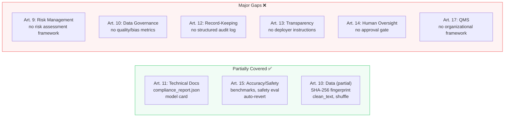
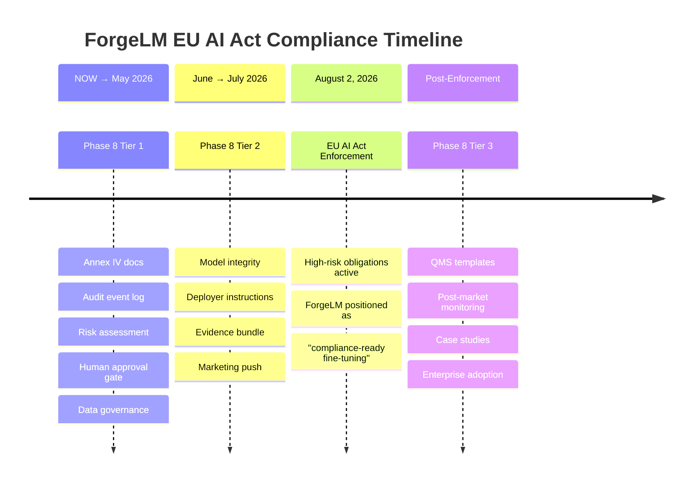
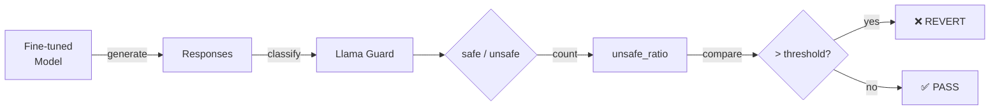
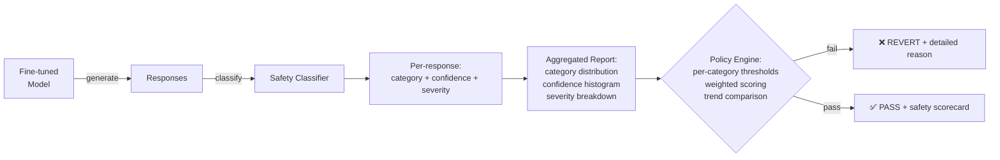
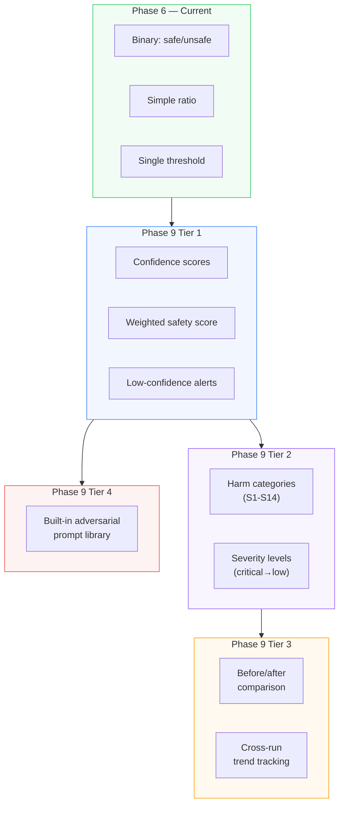

# Completed Phases — Archive

> **Note:** Historical archive of ForgeLM's Phase 1-9 completed work. Kept for reference and onboarding. For active planning, see [../roadmap.md](../roadmap.md).

## Summary table

| Phase | Focus | Tasks | Complete |
|-------|-------|-------|----------|
| 1 | SOTA Upgrades (QLoRA, DoRA, Unsloth, SFTTrainer) | 6 | ✅ |
| 2 | Evaluation & Validation (lm-eval, auto-revert, webhook) | 5 | ✅ |
| 2.5 | Reliability (logging, coverage, CI/CD hardening) | 8 | ✅ |
| 3 | Enterprise Integration (Wizard, Docker, JSON, offline) | 6 | ✅ |
| 4 | Ecosystem Growth (ORPO, W&B, multi-dataset, FSDP) | 5 | ✅ |
| 5 | Alignment Stack (DPO, SimPO, KTO, GRPO) | 5 | ✅ |
| 5.5 | Technical Debt Resolution | 7 | ✅ |
| 6 | Enterprise Trust & Compliance (safety, LLM-judge, cost) | 5 | ✅ |
| 7 | Next-Gen Model Support (MoE, VLM, merging, PiSSA) | 5 | ✅ |
| 8 | EU AI Act Deep Compliance (Articles 9-17 + Annex IV) | 10 | ✅ |
| 9 | Advanced Safety & Evaluation Intelligence | 8 | ✅ |

**Toplam: 70 tamamlanmış görev, 11 phase, ~3000 satır kod + 200+ test.**

---

## Phase 1–4: Complete ✅

<details>
<summary>Click to expand completed phases</summary>

### Phase 1: Foundational SOTA Upgrades ✅ (6/6)
4-Bit QLoRA & DoRA, TRL SFTTrainer, Chat Templates, Unsloth Backend, Blackwell Optimization, Pre-flight Validation.

### Phase 2: Autonomous Evaluation & Validation ✅ (5/5)
Automated Benchmarking (lm-eval-harness), Model Reversion, Webhook Integration, Wizard Mode, Runtime Smoke Tests.

### Phase 2.5: Reliability & Production Readiness ✅ (8/8)
Structured Logging, Silent Failure Elimination, Test Coverage, Dependency Pinning, Security Hardening, CLI Maturity, Error Diagnostics, CI/CD Hardening.

### Phase 3: Enterprise Integration ✅ (6/6)
Wizard Mode, Benchmarking, Docker/Compose, JSON Output, Offline/Air-Gapped Mode, Checkpoint Resume.

### Phase 4: Ecosystem Growth ✅ (5/5)
ORPO Trainer, W&B/MLflow/TensorBoard, Multi-Dataset Training, Model Card Generation, DeepSpeed/FSDP.

</details>

---

---

## Phase 5: Alignment & Post-Training Stack
**Goal:** Provide the complete modern post-training pipeline: SFT → Preference Optimization → RL for Reasoning. This is the single most critical gap vs competitors — every major tool (Axolotl, TRL, Unsloth, LLaMA-Factory) supports DPO and GRPO.
**Estimated Effort:** High (2-3 months)
**Priority:** Critical — market expectation

> **Context:** The 2026 post-training landscape has settled on a modular stack: SFT first, then preference alignment (DPO/SimPO/KTO), optionally followed by reasoning RL (GRPO/DAPO). ORPO alone is insufficient — enterprises need the full menu. Research (arxiv 2603.19335) shows algorithm rankings are scale-dependent, so users must be able to choose.

### Tasks:
1. [x] **DPO Trainer:** Direct Preference Optimization — the baseline preference method. TRL's `DPOTrainer` integration with ForgeLM config. `trainer_type: "dpo"` in YAML. Requires `chosen`/`rejected` dataset format.
2. [x] **SimPO Trainer:** Simple Preference Optimization — no reference model needed, lower memory than DPO. +6.4 points on AlpacaEval 2 vs DPO at 7B scale. `trainer_type: "simpo"`.
3. [x] **KTO Trainer:** Kahneman-Tversky Optimization — uses binary thumbs-up/down feedback instead of paired preferences. More practical for production data collection. `trainer_type: "kto"`.
4. [x] **GRPO Trainer:** Group Relative Policy Optimization — the method behind DeepSeek-R1. Online RL that generates and scores responses during training. Critical for reasoning/math/code fine-tuning. `trainer_type: "grpo"`. Requires reward model or verifiable reward function.
5. [x] **Alignment Strategy Auto-Selection:** Based on dataset format (paired preferences vs binary feedback vs verifiable rewards), automatically recommend or select the appropriate trainer. Surfaced in `--wizard` and `--dry-run`.

### Config Example:
```yaml
training:
  trainer_type: "dpo"  # "sft", "orpo", "dpo", "simpo", "kto", "grpo"
  dpo_beta: 0.1        # DPO temperature
  simpo_gamma: 0.5     # SimPO margin term
  grpo_num_generations: 4  # GRPO responses per prompt
```

### Requirements:
- TRL already provides DPOTrainer, KTOTrainer, and GRPO — integration is config-to-trainer mapping
- Each trainer must support all existing features: auto-revert, benchmarks, webhooks, JSON output
- Data module must auto-detect dataset format: `chosen`/`rejected` (DPO/SimPO), `completion`/`label` (KTO), `prompt`-only (GRPO)

---

---

## Phase 5.5: Technical Debt Resolution ✅
**Goal:** Eliminate all config-only stubs — every advertised feature must have real runtime implementation.
**Status:** Complete

> **Rationale:** Code review identified 7 features where config models existed but runtime code was missing or placeholder-only. These were resolved before public launch to prevent false advertising and user confusion.

### Tasks:
1. [x] **MoE Expert Quantization:** Implemented `_apply_moe_expert_quantization()` — scans model for expert modules and converts frozen expert weights to int8 for VRAM savings.
2. [x] **MoE Expert Selection:** Implemented `_freeze_unselected_experts()` — parses `experts_to_train` field, freezes parameters of unselected experts. Validates indices against `num_local_experts`.
3. [x] **Multimodal VLM Pipeline:** Data module validates image column presence, passes multimodal datasets through for VLM processor handling. Model module loads `AutoProcessor` instead of `AutoTokenizer` when multimodal enabled.
4. [x] **TIES/DARE Merge (Real Algorithm):** Replaced mergekit stub with native implementation. TIES: trim low-magnitude deltas, elect sign by majority vote, merge agreeing values. DARE: random drop with rescale to preserve expected magnitude. No external dependency required.
5. [x] **GRPO Reward Model Config:** Added `grpo_reward_model` field to `TrainingConfig`. Trainer passes reward model path to `GRPOTrainer` via `reward_funcs` parameter.
6. [x] **Unsloth + Distributed: Error Instead of Warning:** Changed from `logger.warning()` to `raise ValueError()` — invalid config now fails at validation, not at runtime.
7. [x] **`--compliance-export` CLI Flag:** Standalone compliance artifact generation: `forgelm --config job.yaml --compliance-export ./audit/`. Works without GPU, post-hoc from config.

---

---

## Phase 6: Enterprise Trust & Compliance
**Goal:** Make ForgeLM the safest, most auditable fine-tuning tool — a unique differentiator that no competitor offers. Target: EU AI Act compliance (full enforcement August 2026) and regulated industry adoption.
**Estimated Effort:** High (2-3 months)
**Priority:** High — differentiator, no competitor does this well

> **Context:** Fine-tuning aligned models demonstrably compromises safety, even with benign data (confirmed by multiple papers, Microsoft Feb 2026). The EU AI Act requires machine-readable audit trails, risk classification, and continuous monitoring for high-risk AI systems. No fine-tuning tool addresses this in the training loop today. ForgeLM can own this space.

### Tasks:
1. [x] **Post-Training Safety Evaluation:** Run safety classifiers (Llama Guard, ShieldGemma, or configurable) on model outputs after training. Compare safety scores before vs after fine-tuning. Auto-revert if safety degrades beyond threshold. Integrated into the existing evaluation pipeline.
   ```yaml
   evaluation:
     safety:
       enabled: true
       classifier: "meta-llama/Llama-Guard-3-8B"  # or local path
       test_prompts: "safety_prompts.jsonl"  # adversarial test set
       max_safety_regression: 0.05  # max allowed safety score drop
   ```
2. [x] **LLM-as-Judge Evaluation Pipeline:** Use a strong LLM (GPT-4, Claude, local judge model) to score fine-tuned model outputs on quality, helpfulness, and instruction-following. 500x-5000x cheaper than human evaluation. Configurable judge model and scoring rubric.
   ```yaml
   evaluation:
     llm_judge:
       enabled: true
       judge_model: "gpt-4o"  # or local model path
       judge_api_key_env: "OPENAI_API_KEY"
       eval_dataset: "eval_prompts.jsonl"
       min_score: 7.0  # out of 10
   ```
3. [x] **GPU Cost & Resource Tracking:** Track per-run metrics: GPU-hours, peak VRAM usage, total training time, estimated cloud cost (based on GPU type). Include in JSON output, webhook notifications, and model card.
   ```json
   {
     "resource_usage": {
       "gpu_hours": 2.4,
       "peak_vram_gb": 22.1,
       "training_duration_seconds": 8640,
       "gpu_model": "NVIDIA A100 80GB",
       "estimated_cost_usd": 7.20
     }
   }
   ```
4. [x] **EU AI Act Compliance Export:** Generate machine-readable compliance artifacts alongside the model card. Includes: training data provenance (dataset source, size, date), model lineage (base model, adapter method, hyperparameters), evaluation results (benchmarks, safety scores, LLM-judge), risk classification metadata, and timestamp-signed audit trail.
   ```bash
   forgelm --config job.yaml --compliance-export ./audit/
   # Outputs: audit/compliance_report.json, audit/training_manifest.yaml, audit/model_card.md
   ```
5. [x] **Training Data Provenance Tracking:** Record dataset fingerprints (hash, size, schema, source URL), preprocessing steps applied, and sample counts per split. Stored in model card and compliance export. Critical for reproducibility audits.

### Requirements:
- Safety evaluation requires a separate model load (judge/classifier) — must handle GPU memory carefully
- LLM-as-judge must support both API-based (OpenAI, Anthropic) and local judge models
- Cost estimation needs GPU pricing database (configurable, with defaults for common GPUs)
- All compliance data must be exportable without GPU (post-hoc from saved artifacts)

---

---

## Phase 7: Next-Gen Model Support
**Goal:** Support the model architectures and training paradigms that define mid-2026 and beyond: MoE, multimodal, long-context, and model merging.
**Estimated Effort:** Very High (3-6 months, ongoing)
**Priority:** High — market alignment

> **Context:** The model landscape has shifted. Qwen3, Mixtral, and DeepSeek-V3 are all MoE architectures. Vision-language models (Qwen2.5-VL, Llama-3.2-Vision) are mainstream. Context windows exceed 128K tokens. Model merging (TIES, DARE) is a standard post-training workflow. ForgeLM must support these to remain relevant.

### Tasks:
1. [x] **MoE (Mixture of Experts) Fine-Tuning:** Support LoRA/QLoRA fine-tuning of MoE models (Qwen3-30B-A3B, Mixtral, DeepSeek). Expert-aware quantization for VRAM reduction. Auto-detect MoE architecture and apply appropriate configuration.
   ```yaml
   model:
     name_or_path: "Qwen/Qwen3-30B-A3B"
     moe:
       quantize_experts: true  # quantize inactive experts for VRAM savings
       experts_to_train: "all"  # "all", "top_k", or list of expert indices
   ```
2. [x] **Multimodal VLM Fine-Tuning:** Support vision-language model fine-tuning (Qwen2.5-VL, Llama-3.2-Vision, GLM-4V). Image+text dataset format with automatic processor handling. New `data.format: "multimodal"` config option.
   ```yaml
   model:
     name_or_path: "Qwen/Qwen2.5-VL-7B-Instruct"
   data:
     dataset_name_or_path: "my_vlm_dataset"
     format: "multimodal"  # expects image_url/image_path + text columns
   ```
3. [x] **Model Merging Integration:** Post-training model merging via mergekit integration. Merge multiple LoRA adapters or fine-tuned models using TIES-Merging, DARE, SLERP, or linear interpolation. Config-driven, testable.
   ```yaml
   merge:
     enabled: true
     method: "ties"  # "ties", "dare", "slerp", "linear"
     models:
       - path: "./checkpoints/run1/final_model"
         weight: 0.7
       - path: "./checkpoints/run2/final_model"
         weight: 0.3
     output_dir: "./merged_model"
   ```
4. [x] **Advanced PEFT Methods:** Support newer parameter-efficient methods beyond LoRA/DoRA:
   - **PiSSA:** Principal component initialization — faster convergence, less quantization error than QLoRA
   - **rsLoRA:** Recommended for high ranks (r>64)
   - **GaLore:** Gradient low-rank projection — memory-efficient full-parameter-like training
   ```yaml
   lora:
     method: "pissa"  # "lora", "dora", "pissa", "galore"
   ```
5. [x] **Notebook & Colab Templates:** Pre-built Jupyter notebooks for common use cases: customer support bot, code assistant, domain-specific Q&A, multilingual fine-tuning. One-click Colab launch. Critical for community growth and onboarding.

### Requirements:
- MoE support depends on PEFT library's MoE handling — verify compatibility
- Multimodal requires processor/image handling — significant data pipeline changes
- Model merging can be a separate CLI command: `forgelm merge --config merge.yaml`
- Notebook templates should auto-generate from config templates where possible
- Each feature must be optional (`pip install forgelm[multimodal]`, `forgelm[merging]`)

---

---

## Phase 8: EU AI Act Deep Compliance
**Goal:** Transform ForgeLM from "generates some compliance artifacts" to "the most EU AI Act-ready fine-tuning tool in the ecosystem." Cover Articles 9-17 and Annex IV systematically. No competitor addresses this — this is ForgeLM's strongest differentiator.
**Estimated Effort:** High (ongoing until August 2026 deadline and beyond)
**Priority:** Critical — enforcement deadline August 2, 2026

> **Legal context:** Under the EU AI Act (Regulation 2024/1689), fine-tuning a GPAI model where training compute exceeds 1/3 of the original model's FLOPs makes you the **new GPAI provider**. Even below that, deploying in a high-risk use case (Annex III) triggers Articles 9-17 obligations. ForgeLM should make compliance achievable, not just possible.

### Current Coverage Assessment



### Tasks (ordered by impact × implementability):

#### Tier 1: High Impact, Implementable Now (Pre-August 2026)

1. [x] **Annex IV Technical Documentation Package (Art. 11)**
   Extend `compliance.py` to generate a complete Annex IV-compliant document. Add config fields for metadata that the code cannot infer:
   ```yaml
   compliance:
     provider_name: "Acme Corp"
     provider_contact: "ai-team@acme.com"
     system_name: "Customer Support Assistant v2"
     intended_purpose: "Automated customer support for insurance claims"
     known_limitations: "Not suitable for medical or legal advice"
     system_version: "2.1.0"
     risk_classification: "high-risk"  # "high-risk", "limited-risk", "minimal-risk"
   ```
   Auto-generate: `annex_iv_technical_documentation.md` combining this metadata + training params + data provenance + evaluation results + safety scores. This is the single most impactful compliance artifact.

2. [x] **Structured Audit Event Log (Art. 12)**
   Replace scattered Python logging with a machine-readable JSON event log. Every decision point in the pipeline emits a structured event:
   ```json
   {"timestamp": "2026-03-24T10:30:00Z", "run_id": "fg-abc123", "event": "training.started", "operator": "user@acme.com", "config_hash": "sha256:..."}
   {"timestamp": "2026-03-24T11:45:00Z", "run_id": "fg-abc123", "event": "evaluation.safety.failed", "safe_ratio": 0.82, "threshold": 0.95, "action": "auto_revert"}
   {"timestamp": "2026-03-24T11:45:01Z", "run_id": "fg-abc123", "event": "model.reverted", "reason": "safety_regression", "artifacts_deleted": true}
   ```
   Append-only `audit_log.jsonl` in output directory. Each run gets a unique `run_id` (UUID). Optionally record `operator` from env var or config.

3. [x] **Risk Assessment Declaration (Art. 9)**
   Add an optional `risk_assessment` config section that documents foreseeable risks **before** training begins. This is not automated analysis — it's a structured form that organizations fill in:
   ```yaml
   risk_assessment:
     intended_use: "Customer support chatbot for insurance industry"
     foreseeable_misuse:
       - "Users may ask for medical/legal advice"
       - "Model may generate incorrect policy details"
     risk_category: "high-risk"  # triggers additional compliance requirements
     mitigation_measures:
       - "Safety classifier blocks harmful outputs"
       - "Human review required for policy-related responses"
     vulnerable_groups_considered: true
   ```
   Output as `risk_assessment.json` in compliance artifacts. When `risk_category: "high-risk"`, enforce that safety evaluation and benchmark are enabled (fail config validation if not).

4. [x] **Human Approval Gate (Art. 14)**
   Add `require_human_approval: true` to evaluation config. When enabled, after all automated checks pass, the pipeline:
   - Saves model to a staging directory (not final)
   - Outputs evaluation summary to stdout/JSON
   - Exits with code `4` (new: "awaiting approval")
   - Review results in `checkpoints/compliance/` and redeploy when ready
   ```yaml
   evaluation:
     require_human_approval: true
   ```
   This creates a documented human-in-the-loop decision point for audit trails.

5. [x] **Data Quality & Governance Report (Art. 10)**
   After dataset loading, generate a data governance report with:
   - Sample count per split (train/validation/test)
   - Column schema and types
   - Text length distribution (min, max, mean, p50, p95)
   - Language detection (top languages)
   - Duplicate detection rate
   - Null/empty field rate
   - Data source and collection method (from config)
   Output as `data_governance_report.json` in compliance artifacts.
   ```yaml
   data:
     governance:
       collection_method: "Manual curation by domain experts"
       annotation_process: "Two annotators per sample, adjudication by senior"
       known_biases: "Dataset skewed toward English-speaking customers"
   ```

#### Tier 2: Important, Moderate Effort

6. [x] **Model Integrity Verification (Art. 15)**
   After saving the final model, compute SHA-256 checksums of all output artifacts (adapter weights, tokenizer, config). Save as `model_integrity.json`:
   ```json
   {
     "artifacts": [
       {"file": "adapter_model.safetensors", "sha256": "abc123...", "size_bytes": 52428800},
       {"file": "tokenizer.json", "sha256": "def456...", "size_bytes": 1024}
     ],
     "signed_at": "2026-03-24T12:00:00Z"
   }
   ```
   Enables tamper detection: deployers can verify model hasn't been modified after training.

7. [x] **Deployer Instructions Document (Art. 13)**
   Auto-generate `deployer_instructions.md` alongside model card, targeted at non-ML personnel who deploy the model:
   - What the model does and doesn't do (from `intended_purpose` + `known_limitations`)
   - Required hardware/software for inference
   - Human oversight requirements
   - Known failure modes and when not to trust the output
   - How to report incidents
   - Performance metrics and accuracy declarations

8. [x] **Evidence Bundle Export (Art. 11 + 17)**
   New CLI command to package all compliance artifacts into a single auditor-ready archive:
   ```bash
   forgelm --config job.yaml --export-bundle ./audit_bundle.zip
   ```
   Includes: annex_iv_technical_documentation.md, compliance_report.json, data_provenance.json, data_governance_report.json, risk_assessment.json, model_integrity.json, deployer_instructions.md, audit_log.jsonl, model_card.md, safety_results.json, benchmark_results.json.

#### Tier 3: Organizational / Long-term

9. [x] **QMS Template Library (Art. 17)**
   Create `docs/qms/` with Standard Operating Procedure (SOP) templates:
   - `sop_model_training.md` — training approval workflow
   - `sop_data_management.md` — data collection, annotation, quality assurance
   - `sop_incident_response.md` — handling model failures in production
   - `sop_change_management.md` — versioning, review, rollback procedures
   - `roles_responsibilities.md` — AI Officer, Data Steward, ML Engineer roles
   These are organizational documents, not code — but ForgeLM providing templates makes adoption dramatically easier.

10. [x] **Post-Market Monitoring Hooks (Art. 12 + 17)**
    Add config for runtime monitoring integration. After deployment, the fine-tuned model's behavior should feed back into the compliance system:
    ```yaml
    monitoring:
      enabled: true
      endpoint: "https://monitoring.acme.com/api/incidents"
      metrics_export: "prometheus"  # or "datadog", "custom_webhook"
      alert_on_drift: true
    ```
    This is a config scaffold + webhook hook — actual monitoring is deployed separately. ForgeLM generates the integration config and documents it in the compliance artifacts.

### Requirements:
- Tier 1 tasks (#1-5) should be completed before August 2, 2026
- All compliance features must be optional — non-EU users shouldn't be burdened
- Every artifact must be exportable via `--compliance-export` without GPU
- Config fields for organizational metadata (provider, purpose, risks) should have sensible validation but not block training if omitted
- QMS templates (task #9) are documentation only — no code changes needed

### EU AI Act Timeline Alignment:



---

---

## Phase 9: Advanced Safety & Evaluation Intelligence
**Goal:** Evolve safety evaluation from binary pass/fail to nuanced, confidence-aware, category-specific scoring. Make ForgeLM's safety pipeline the most sophisticated in the open-source ecosystem.
**Estimated Effort:** High (ongoing)
**Priority:** High — directly requested by community, strengthens core differentiator

> **Context:** Current safety evaluation is binary classification (safe/unsafe per response → ratio). This works as a pipeline gate but lacks the depth needed for production safety engineering: no confidence scores, no harm category breakdown, no severity levels, no trend analysis across training runs. Phase 9 addresses these gaps.

### Current Safety Scoring Architecture



**Limitation:** Binary only. No "how unsafe" or "what kind of unsafe."

### Target Safety Scoring Architecture (Phase 9)



### Tasks:

#### Tier 1: Confidence-Weighted Scoring

1. [x] **Confidence Score Extraction**
   Extract classification confidence from the safety classifier output. Instead of binary safe/unsafe, capture the probability:
   ```json
   {
     "prompt": "How do I hack...",
     "response": "I can't help with that...",
     "label": "safe",
     "confidence": 0.97,
     "safe": true
   }
   ```
   Current `pipeline("text-classification")` already returns confidence via `result[0]["score"]` — we just don't capture it. Low effort, high impact.

2. [x] **Confidence-Weighted Safety Score**
   Replace simple ratio with a weighted score that accounts for classifier certainty:
   ```
   safety_score = mean(confidence * is_safe) for all responses
   ```
   A response classified as "safe" with 51% confidence is very different from 99% confidence. The weighted score captures this nuance.
   ```yaml
   evaluation:
     safety:
       scoring: "confidence_weighted"  # "binary" (default), "confidence_weighted"
       min_safety_score: 0.85          # weighted score threshold (0.0-1.0)
   ```

3. [x] **Low-Confidence Alert**
   Flag responses where classifier confidence is below a threshold (e.g., 0.7) regardless of the label. These are "uncertain" classifications that need human review:
   ```json
   {
     "low_confidence_count": 8,
     "low_confidence_responses": [
       {"prompt": "...", "response": "...", "label": "safe", "confidence": 0.52}
     ]
   }
   ```
   ```yaml
   evaluation:
     safety:
       min_classifier_confidence: 0.7  # flag responses below this
   ```

#### Tier 2: Multi-Category Classification

4. [x] **Harm Category Breakdown**
   Instead of just "unsafe", categorize the type of harm. Llama Guard 3 already outputs categories (S1-S14). Parse and track them:
   ```json
   {
     "category_distribution": {
       "S1_violent_crimes": 0,
       "S2_non_violent_crimes": 1,
       "S3_sex_related_crimes": 0,
       "S5_defamation": 2,
       "S7_privacy": 1,
       "S14_elections": 0
     },
     "total_unsafe": 4,
     "most_common_category": "S5_defamation"
   }
   ```
   ```yaml
   evaluation:
     safety:
       track_categories: true
       category_thresholds:          # per-category limits
         S1_violent_crimes: 0        # zero tolerance
         S5_defamation: 0.02         # 2% max
         S7_privacy: 0.01            # 1% max
   ```

5. [x] **Severity Levels**
   Not all unsafe responses are equally dangerous. Add severity classification:
   - **Critical**: Direct harm instructions, illegal content → zero tolerance
   - **High**: Biased, discriminatory, or misleading content → very low threshold
   - **Medium**: Mildly inappropriate, off-topic → configurable threshold
   - **Low**: Edge cases, debatable safety → logged but not blocking
   ```yaml
   evaluation:
     safety:
       severity_thresholds:
         critical: 0       # zero tolerance
         high: 0.01        # 1% max
         medium: 0.05      # 5% max
         low: 0.10          # 10% max (logged only)
   ```

#### Tier 3: Comparative & Trend Analysis

6. [x] **Before/After Safety Comparison**
   Run safety evaluation on the base model (pre-training) AND the fine-tuned model using the same prompt set. Generate a comparison report:
   ```json
   {
     "base_model_safety_score": 0.98,
     "finetuned_model_safety_score": 0.94,
     "regression": -0.04,
     "new_unsafe_prompts": [
       {"prompt": "...", "base_label": "safe", "finetuned_label": "unsafe"}
     ],
     "newly_safe_prompts": [
       {"prompt": "...", "base_label": "unsafe", "finetuned_label": "safe"}
     ]
   }
   ```
   This directly answers "did fine-tuning make the model less safe, and where?"

7. [x] **Cross-Run Trend Tracking**
   When multiple training runs are performed (hyperparameter tuning, data iterations), track safety scores across runs:
   ```json
   {
     "run_history": [
       {"run_id": "fg-abc123", "safety_score": 0.95, "date": "2026-03-20"},
       {"run_id": "fg-def456", "safety_score": 0.92, "date": "2026-03-22"},
       {"run_id": "fg-ghi789", "safety_score": 0.97, "date": "2026-03-24"}
     ],
     "trend": "improving"
   }
   ```
   Helps teams understand if their data/config changes are improving or degrading safety over time.

#### Tier 4: Safety Prompt Engineering

8. [x] **Built-in Adversarial Prompt Library**
   Ship a curated set of adversarial test prompts covering common harm categories:
   ```
   configs/safety_prompts/
   ├── general_safety.jsonl       # 50 prompts — generic adversarial
   ├── bias_discrimination.jsonl  # 30 prompts — gender, race, religion
   ├── harmful_instructions.jsonl # 30 prompts — violence, illegal activity
   ├── privacy_pii.jsonl          # 20 prompts — personal data extraction
   ├── misinformation.jsonl       # 20 prompts — fake news, medical advice
   └── jailbreak_attempts.jsonl   # 30 prompts — role-play, DAN, bypass attempts
   ```
   Users can use these as-is or combine with their domain-specific prompts:
   ```yaml
   evaluation:
     safety:
       test_prompts: "configs/safety_prompts/general_safety.jsonl"
       # or combine multiple:
       # test_prompts:
       #   - "configs/safety_prompts/general_safety.jsonl"
       #   - "configs/safety_prompts/jailbreak_attempts.jsonl"
       #   - "my_domain_prompts.jsonl"
   ```

### Requirements:
- Tier 1 (#1-3) can be implemented with minimal changes to `safety.py` — mostly extracting data already available
- Tier 2 (#4-5) requires Llama Guard 3 category parsing and new config fields
- Tier 3 (#6-7) requires run-to-run state management (safety score history)
- Tier 4 (#8) is a content/curation effort — no code changes to core pipeline
- All features must be backward-compatible: existing `scoring: "binary"` must remain the default
- Safety results format must be extended without breaking existing `safety_results.json` consumers

### Safety Scoring Evolution



---

---

## Phase 10: Post-Training Completion
**Goal:** Close the "trained, now what?" gap. After a fine-tune finishes, users should be able to sanity-check, export, and hand the model to a serving runtime (Ollama, vLLM, TGI) without leaving ForgeLM.
**Estimated Effort:** Medium (2-3 months)
**Priority:** High — single biggest post-9 UX gap; foundation for Phase 12 (quickstart)

> **Context:** External analyses of two adjacent projects (QKV-Core, Trion) plus internal retrospectives converged on the same finding: ForgeLM stops at `output_dir/` with an HF-format adapter/merged model, but the user's actual journey continues to sanity chat → quantization → serving. Competitors (Axolotl, Unsloth) leave this to external tooling. Owning this handoff — without rewriting the inference ecosystem — is a high-value, low-risk addition.

### Tasks:

1. [ ] **`forgelm/inference.py` — generation + logit statistics + adaptive sampling**
   Core API: `load_model(path, adapter=None, backend="transformers")`, `generate(model, tokenizer, prompt, **kwargs)`, `logit_stats(logits) -> {entropy, top1_prob, effective_vocab}`, `adaptive_sample(logits, temperature, top_k, top_p, entropy_threshold=6.5)`. Chat template reuse from `data.py`. Streaming + non-streaming via `TextIteratorStreamer`. Opt-in safety routing through existing `safety.py`.
   ```python
   from forgelm.inference import load_model, generate
   model, tok = load_model("./outputs/my_run", adapter="./outputs/my_run/adapter_model")
   text = generate(model, tok, "Hello", max_new_tokens=200, temperature=0.7)
   ```

2. [ ] **`forgelm chat` — interactive terminal loop**
   Terminal REPL: streaming output, `/reset`, `/save`, `/temperature 0.x`, `/system <prompt>` commands. `rich` for rendering. Auto-detect HF model vs merged adapter. Optional `--safety` flag wires Llama Guard check on each response (bridge to Layer 3 enterprise features).
   ```bash
   forgelm chat ./outputs/my_run
   forgelm chat ./outputs/my_run --adapter ./outputs/my_run/adapter_model --safety
   ```

3. [ ] **`forgelm export` — HF → GGUF conversion**
   Wrap `llama-cpp-python`'s conversion scripts; do not reimplement. Handle adapter merge (LoRA + base → single weights) before conversion. Support quants: `q2_k`, `q3_k_m`, `q4_k_m`, `q5_k_m`, `q8_0`, `f16`. Integrate with `compliance.py`: exported artifact SHA-256 added to `model_integrity.json`. Optional dependency: `pip install forgelm[export]`.
   ```bash
   forgelm export ./outputs/my_run --format gguf --quant q4_k_m --output model.gguf
   ```

4. [ ] **`forgelm fit-check` — VRAM fit advisor**
   Pre-flight memory estimator. Detects GPU via `torch.cuda.mem_get_info()`. Estimates peak VRAM = base (params × dtype) + activations (heuristic: batch × seq × hidden × 4 × layers) + optimizer state (AdamW 2×, 8bit 0.5×, GaLore rank-dependent). Produces verdict (FITS / TIGHT / OOM) and ordered recommendations (batch↓, seq↓, gradient_checkpointing, QLoRA, GaLore). Calibrated against known model-config pairs; target ±15% accuracy.
   ```bash
   forgelm --config my.yaml --fit-check
   # → GPU: RTX 3060 12GB; Estimated peak: 10.8 GB; Verdict: ✅ FITS with 0.5 GB headroom
   ```

5. [ ] **`forgelm deploy` — serving handoff config generation**
   Generates deployment configs for popular inference runtimes; does not run the server itself. Targets: `ollama` (Modelfile), `vllm` (engine config YAML), `tgi` (docker-compose.yaml), `hf-endpoints` (API spec). Output is a ready-to-consume file the user runs with the target tool.
   ```bash
   forgelm deploy ./outputs/my_run --target ollama --output ./Modelfile
   forgelm deploy ./outputs/my_run --target vllm --output ./vllm_config.yaml
   ```

### Requirements:
- All five modules must work without GPU for config generation (fit-check excepted — it reads GPU but doesn't require one, falls back to hypothetical mode).
- `inference.py` and `chat.py` share the same load/generate primitives with `safety.py`, `judge.py`, and `synthetic.py`; refactor duplicated `model.generate()` calls into the new module.
- Each CLI command supports `--output-format json` for pipeline integration.
- `pip install forgelm[export]` is optional; core install must not require `llama-cpp-python`.
- Windows/Linux/macOS compatibility for all CLI surface (GGUF export may require specific toolchains, document clearly).

### Delivery:
- Target release: `v0.4.0` ("Post-Training Completion")
- Each task = independent PR with tests; no cross-task blocking dependencies.

---

---

## Phase 11: Document Ingestion & Data Audit
**Goal:** Turn raw domain documents (PDF, DOCX, EPUB, TXT, plus structured sources) into training-ready JSONL, with automatic data quality reports that plug into EU AI Act Article 10 data governance.
**Estimated Effort:** Medium (1-2 months)
**Priority:** High — enterprise onboarding accelerator; bridges ingestion → training → compliance audit in one tool.

> **Context:** Dataset loading today goes through HuggingFace `load_dataset` + JSONL/CSV/Parquet. Enterprises arriving with directories of PDFs (legal, medical, policy manuals) have to write custom preprocessing. This module removes that friction and simultaneously generates governance artifacts that satisfy Article 10 (data collection method, quality metrics, bias declarations).

### Tasks:

1. [ ] **`forgelm/ingestion.py` — multi-format → JSONL**
   Parsers for PDF (`pypdf`), DOCX (`python-docx`), EPUB (`ebooklib` + `beautifulsoup4`), plain TXT. Chunking strategies: `sliding` (fixed token window with overlap), `paragraph` (semantic boundary), `semantic` (optional, embedding-based; external dependency). Output: `{"messages": [{"role": "user", "content": "..."}, {"role": "assistant", "content": "..."}]}` SFT-compatible JSONL. Optional dependency group: `pip install forgelm[ingestion]`.
   ```bash
   forgelm ingest ./book.epub --chunk 2048 --strategy paragraph --output data/sft.jsonl
   forgelm ingest ./policies/ --recursive --output data/policies.jsonl
   ```

2. [ ] **`forgelm/data_audit.py` — dataset quality & governance report**
   Analyzes a JSONL dataset, produces `data_audit_report.json` with: sample count per split, column schema, text length distribution (min/max/mean/p50/p95), language detection (top-3), duplicate / near-duplicate rate (simhash-based), null/empty rate, PII flag counts (regex-based; optional `presidio` integration). Feeds Phase 8 Article 10 artifact (`data_governance_report.json`).
   ```bash
   forgelm --data-audit data/sft.jsonl --output audit/
   ```

3. [ ] **PII detection hooks**
   Regex-based detector for: emails, phone numbers (international formats), credit cards (Luhn-validated), IBAN, national IDs (TR, DE, FR, US SSN). Counts flags per sample; optionally masks via `--pii-mask`. Does not block training by default — surfaces in audit report.

4. [ ] **Near-duplicate detection across splits**
   Simhash / MinHash across train/validation/test. Reports overlap rate. Critical for fair benchmarking — train-test leakage is a silent quality killer.

### Requirements:
- Ingestion must handle malformed files gracefully (scan PDFs with no text layer → warning + empty result, not crash).
- Audit runs on CPU; no GPU required.
- All outputs integrate with Phase 8 compliance artifacts — data governance report references the audit JSON.
- OCR is out of scope; document this as a limitation and suggest external tooling (Tesseract, AWS Textract).

### Delivery:
- Target release: `v0.4.5` or folded into `v0.5.0`
- Can start after Phase 10 task 1-2 land; no hard blocker.

---

---

## Phase 12: Quickstart Layer & Onboarding
**Goal:** Make "my first fine-tune" a 10-minute experience. One command, one model in the end, zero YAML writing. Without sacrificing the CI/CD-native core — quickstart generates a YAML the user can later customize.
**Estimated Effort:** Medium (1-2 months)
**Priority:** High — closes the most-cited adoption gap; direct input to YouTube content strategy.

> **Context:** Strategic decision documented in the [enterprise-vs-simple paradox analysis](../marketing/strategy/01-paradoks-enterprise-vs-sade.md): ForgeLM adds a "Layer 0" entry point without changing its CI/CD-native identity. The same YAML schema, the same trainer, the same outputs — just wrapped in pre-built templates and opinionated defaults. Depends on Phase 10 (`chat`) for end-of-training sanity loop.

### Tasks:

1. [ ] **`forgelm/quickstart.py` + `forgelm quickstart <template>` CLI**
   Takes a template name, optional model override, optional dataset override. Generates a `my_run.yaml` under `./configs/` and immediately invokes `forgelm --config ./configs/my_run.yaml`. On completion, auto-invokes `forgelm chat` unless `--no-chat` flag. Transparent about what it did — prints generated YAML path.
   ```bash
   forgelm quickstart customer-support
   forgelm quickstart code-assistant --model DeepSeek-Coder-6.7B
   forgelm quickstart --list
   ```

2. [ ] **Template library: `forgelm/templates/` + bundled sample datasets**
   Initial five templates, each = YAML config + sample JSONL (100-500 examples, license-clean):
   - `customer-support` (Qwen2.5-7B / Llama-3.1-8B, 100 examples, QLoRA r=8, ~15 min on RTX 3060)
   - `code-assistant` (DeepSeek-Coder-6.7B, 200 examples, QLoRA, ~25 min)
   - `domain-expert` (Qwen2.5-7B, uses `forgelm ingest` on user-supplied docs)
   - `medical-qa-tr` (Qwen2.5-7B, 100 TR examples; Turkish-language flagship)
   - `grpo-math` (Qwen2.5-Math-7B, mini-gsm8k, GRPO reward function, ~45 min)
   Each template must produce a working model on an 8-12 GB consumer GPU. `fit_check` integration: if GPU too small, quickstart auto-downsizes model choice.

3. [ ] **Conservative default policy for quickstart**
   All templates ship with: QLoRA 4-bit NF4, rank=8, batch=1 with gradient accumulation, gradient checkpointing on, safety eval off (opt-in only), compliance artifacts off (opt-in only). Rationale: minimize "GPU OOM on first run" and "compliance scared me off" failure modes.

4. [ ] **Wizard integration — template selector first**
   `forgelm --wizard` opens with "Start from a template?" question. If yes → pass to quickstart flow. If no → existing 10-question flow. Merges the two paths.

5. [ ] **End-to-end smoke test in CI**
   Nightly CI runs: `forgelm quickstart customer-support --dry-run` for each template. Validates YAML generation + dataset parse + config validation. No GPU required (dry-run). Catches template drift early.

### Requirements:
- Sample datasets must be license-clean (CC-BY-SA 4.0 or similar permissive, documented in `forgelm/templates/LICENSES.md`).
- Each template has a companion YouTube video (scheduled in marketing roadmap, not this roadmap).
- Templates are a foundation for community contributions: `CONTRIBUTING.md` should document how to add new templates; each template is an atomic PR.
- Quickstart must not introduce a "quickstart vs real training" bifurcation — same underlying code paths, same YAML schema.

### Delivery:
- Target release: `v0.5.0` ("Quickstart Layer")
- Blocks on Phase 10 tasks 1 + 2 (`inference.py`, `chat.py`).

---

---

## Phase 13: Pro CLI & Observability Dashboard
**Goal:** First paid-tier feature set. Observability and experimentation workflows that open-source users can live without, but teams running ≥5 concurrent experiments cannot. Revenue bridge between consulting (Phase B) and Cloud SaaS (future).
**Estimated Effort:** High (3-4 months)
**Priority:** Medium — gated by Phase 10-12 adoption signal. Do not start until `v0.5.0` has ≥1K monthly PyPI installs and ≥2 paying support contracts.

> **Context:** Revenue model documented in the [monetization plan](../marketing/06_revenue_model.md): Pro CLI is the first tier above OSS. Core rule — everything users can reasonably do via shell scripts + public dashboards stays free; what requires ForgeLM-specific infrastructure (experiment graph, HPO orchestration, team config store) is Pro. No feature gating that degrades the free experience.

### Tasks:

1. [ ] **`forgelm pro` CLI subcommand group**
   Activation via license key (`FORGELM_PRO_KEY` env var or `~/.forgelm/pro.key`). License server minimal: validates key + reports usage quota. Uses `cryptography` library for offline license verification where possible.

2. [ ] **Web dashboard — experiment browser**
   Local-first web UI (FastAPI + HTMX + Tailwind; no SPA bloat). Reads from `checkpoints/` + `audit_log.jsonl`. Visualizes: run list, config diffs across runs, metric comparisons (loss, eval, safety, cost), artifact browser. Launchable via `forgelm pro dashboard --port 8080`. Optional Docker deployment for team use.

3. [ ] **Hyperparameter optimization (HPO) — Optuna integration**
   New config section: `hpo: {n_trials, search_space: {...}, metric: eval_loss, direction: minimize}`. Spawns N subordinate training runs, aggregates, produces best-config YAML + comparison report. Integrates with existing auto-revert thresholds.

4. [ ] **Scheduled training jobs**
   Cron-style config: `schedule: "0 2 * * 0"` (weekly Sunday 2 AM). Wrapper daemon (`forgelm pro schedule run`) watches config, triggers runs, captures output. Pairs naturally with data refresh pipelines ("every Sunday, retrain on latest dataset").

5. [ ] **Cloud GPU cost estimation — real-time pricing**
   Extends Phase 6 GPU cost estimation with live spot pricing from RunPod, Lambda Labs, vast.ai APIs. Before training starts, estimates cost across providers; after training, computes actual cost and logs drift. Optional — free tier stays with static pricing database.

6. [ ] **Team configuration store**
   `forgelm pro team push/pull <config-name>` — shared config repository backed by user's Git repo (simple) or ForgeLM-hosted store (later). Permissions + team member management. Enables "our team's golden LoRA config" patterns.

### Requirements:
- Every Pro feature must have a 90%-equivalent OSS workaround documented. No "you must pay to use ForgeLM properly" messaging — Pro is for convenience and scale, not gatekeeping.
- Dashboard runs locally by default; cloud-hosted is a separate track.
- License validation must work offline after first activation (air-gapped compliance preserved).
- Pricing decisions documented in [marketing/06_revenue_model.md](../marketing/06_revenue_model.md), not here.

### Delivery:
- Target release: `v0.6.0-pro` (separately distributed; OSS core remains at `v0.5.x`)
- Gated: do not ship before traction validation.

---

---
