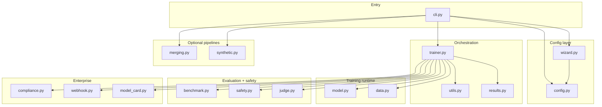

# Architecture Standard

> **Scope:** How ForgeLM's code is organized. What belongs where, and what does not.
> **Enforced by:** Code review + the "anti-patterns" list in this document.

## The one-line architecture

**YAML config → Pydantic validation → Trainer orchestration → HuggingFace/PEFT/TRL primitives → artifacts (model + compliance bundle).**

Everything in `forgelm/` serves one of those stages. Anything that doesn't is out of scope.

## Module topology



Single-file modules — count tracks the table above (≈25 today across Phase 1-11). **No sub-packages inside `forgelm/`.** If a module grows past ~1000 lines and has cohesive subsections, split into `module_name/` package, but keep the public API at `forgelm.module_name.X` so imports don't break.

## Principles

### 1. Each module owns one concern

| Module | Owns | Does not own |
|---|---|---|
| `cli.py` | Argument parsing, top-level dispatch, exit codes | Training, data, evaluation logic |
| `config.py` | Pydantic schemas, validation, YAML load | Runtime behaviour |
| `wizard.py` | Interactive config generation | Config validation (that's `config.py`) |
| `trainer.py` | Orchestrating SFT/DPO/…/GRPO runs | Model loading (delegates to `model.py`) |
| `model.py` | `AutoModelForCausalLM`/PEFT setup | Dataset formatting |
| `data.py` | Dataset load + format detection | Training loops |
| `benchmark.py` | lm-eval-harness wrapping | Safety scoring (that's `safety.py`) |
| `safety.py` | Llama Guard, harm categories, auto-revert | Content generation for scoring (helpers only) |
| `judge.py` | LLM-as-judge evaluation | Safety classification |
| `compliance.py` | Audit log, manifests, provenance, governance artifacts | Runtime policy enforcement |
| `webhook.py` | Slack/Teams lifecycle notifications | Decision-making (just reports) |
| `model_card.py` | HF-compatible README generation | Running the model |
| `merging.py` | TIES/DARE/SLERP/linear | Training |
| `synthetic.py` | Teacher-student distillation | General generation helpers |
| `ingestion.py` | Raw docs (PDF/DOCX/EPUB/TXT) → SFT-ready JSONL; chunking strategies | Audit logic; trainer dispatch |
| `data_audit.py` | Dataset quality + governance audit (length, language, simhash dedup, cross-split leakage, PII regex) | Ingestion logic; trainer dispatch |
| `results.py` | `TrainResult` dataclass | Anything else |
| `utils.py` | HF auth + tiny cross-cutting helpers | Business logic |

If a PR adds code to a module whose concern doesn't match, split it out. Don't grow `trainer.py` into a kitchen sink.

### 2. Config is the one-way contract

CLI parses args and loads YAML → `ForgeConfig` (Pydantic) → passed as a single argument downstream. Modules do **not**:

- Read environment variables directly for training decisions (only for secrets like `HF_TOKEN`, `OPENAI_API_KEY`).
- Accept `**kwargs` pass-throughs that bypass the schema.
- Mutate config at runtime. If a flag is "derived" from others, compute it in a `model_validator` on `ForgeConfig`.

This is why the `--dry-run` smoke path works without GPUs: all behaviour is determined by the validated config.

### 3. Optional dependencies are extras, never silent imports

Heavy deps (`bitsandbytes`, `unsloth`, `deepspeed`, `lm-eval`, `wandb`, `mergekit`) are declared in `pyproject.toml` under `[project.optional-dependencies]` with specific version bounds. At call sites:

```python
try:
    import unsloth  # noqa: F401
except ImportError as e:
    raise ImportError(
        "unsloth backend requires the 'unsloth' extra. "
        "Install with: pip install 'forgelm[unsloth]'"
    ) from e
```

Do **not**:

- Write `try: import X except: X = None` and then sprinkle `if X is not None` everywhere.
- Make a heavy dep a hard requirement of the core package.
- Add a new heavy dep without adding a new extra.

### 4. No global state

Module-level state is limited to:

- Logger objects (`logger = logging.getLogger("forgelm.X")`)
- Constants (`EXIT_SUCCESS = 0`, etc.)
- Immutable registries (tables mapping trainer types to classes)

Runtime state is held by passed-in objects (Pydantic config, trainer instance). **No** module-level mutable state. **No** singletons except the logger.

### 5. CLI is a thin shim

`cli.py` does three things and no more:

1. Parse args (argparse).
2. Load and validate config.
3. Dispatch to one of: trainer, wizard, synthetic, merging, compliance export.

Business logic in `cli.py` is a bug. If you find yourself writing an `if` chain that inspects config values to decide behaviour, that `if` belongs in the dispatched module.

## Adding a new module

Checklist before opening the PR:

1. [ ] Does an existing module already own this concern? If yes, add there.
2. [ ] Can this logic be expressed as a new `BaseModel` in `config.py` + a function in an existing module? If yes, do that.
3. [ ] If a new module is warranted, does it fit the table above? Add a row.
4. [ ] Does it need a new optional dependency? Add an extra in `pyproject.toml`.
5. [ ] Does it have a `tests/test_<module>.py`? See [testing.md](testing.md).
6. [ ] Is it imported by `trainer.py` or `cli.py` behind config? Runtime features must be config-gated.

## The extras matrix

From [`pyproject.toml`](../../pyproject.toml):

| Extra | Purpose | Platform |
|---|---|---|
| `qlora` | bitsandbytes 4-bit | Linux only |
| `unsloth` | Triton-based fast backend | Linux only |
| `eval` | lm-evaluation-harness | Any |
| `tracking` | Weights & Biases | Any |
| `distributed` | DeepSpeed | Linux only |
| `merging` | mergekit | Any |
| `ingestion` | pypdf, python-docx, ebooklib, beautifulsoup4, langdetect, xxhash | Any |
| `ingestion-scale` | datasketch (MinHash LSH dedup; Phase 12, opt-in) | Any |
| `ingestion-pii-ml` | presidio-analyzer (ML-NER for person/organization/location PII; Phase 12.5, opt-in) | Any |
| `export` | llama-cpp-python (GGUF conversion) | Linux/macOS |
| `chat` | rich (terminal rendering) | Any |
| `dev` | pytest, ruff | Any (contributors) |

**The core install must work on all three OSes (Linux/macOS/Windows) with no Linux-only deps.** CI enforces this by running Linux + macOS matrix.

## HTTP discipline

> **Rule:** every outbound HTTP call from `forgelm/` goes through `forgelm/_http.py` (`safe_post` / `safe_get`).  Direct use of `requests.*`, `urllib.request.urlopen`, `httpx.*` etc. outside `forgelm/_http.py` is forbidden.

`forgelm/_http.py` is the single chokepoint that enforces:

- **Scheme allowlist** — only `https://` by default; `http://` requires the caller to pass `allow_insecure_http=True` and is logged.
- **SSRF guard** — pre-resolves hostnames + refuses RFC 1918 / link-local / loopback destinations unless the caller passes `allow_private=True`.
- **Timeout floor** — minimum 5 s connect, 30 s read; callers cannot pass `timeout=0` to disable.
- **Secret masking** — `_mask_secrets_in_text` redacts query-param tokens / `Authorization` headers in error messages so a `URLError(reason=...)` cannot leak `?api_key=ghp_...` into logs.
- **Redirect refusal** — `allow_redirects=False` by default; redirects to a different host require explicit opt-in.

**Why a single chokepoint:** the policy lives in one module so that a future fix (rotate to a stricter allowlist, add a new mask pattern, plug a new metric) lands in one place rather than `N` scattered call sites.  Webhook delivery (`forgelm/webhook.py`), the doctor's HF Hub probe (`forgelm/cli/subcommands/_doctor.py`), and any future telemetry / license / cloud integration all share the same policy.

**Acceptance gate (CI-enforced — see `.github/workflows/ci.yml` `lint-http-discipline` step):**

```bash
! grep -rn -E "(requests\.(get|post|put|delete|patch)|urllib\.request\.urlopen|httpx\.[a-z]+)" forgelm/ \
    --include='*.py' | grep -v "forgelm/_http.py"
```

The gate stays empty.  A new contributor who reaches for `requests.get` directly fails CI immediately and is redirected to `safe_get`.  If `_http.py` itself needs to expand (e.g., add `safe_get` because no helper covers an outbound HEAD probe yet — Phase 34's doctor surfaced this gap), the addition lands inside `_http.py` and gets a corresponding test in `tests/test_http.py`.

**Deliberate exceptions:** `forgelm/compliance.py:1146-1182` (audit-log HMAC verifier) does its own JSONL line-byte parsing because it must hash raw bytes — but it does not perform outbound HTTP.  No HTTP-discipline carve-outs exist today; if one is ever needed (e.g., a cloud provider's SDK that wraps its own HTTP), document it inline + add a `# noqa: forgelm-http-discipline` style marker.

## Things we do not own

Reaffirming [marketing/strategy/05-yapmayacaklarimiz.md](../marketing/strategy/05-yapmayacaklarimiz.md):

- **Inference engine.** We hand off to Ollama / vLLM / TGI / llama.cpp. `forgelm/inference.py` (Phase 10) is a thin client, not a server.
- **Web UI.** Config-driven is the identity. Dashboards live in Pro CLI (Phase 13), not core.
- **Custom model architectures.** HuggingFace owns model code.
- **Custom quantization.** bitsandbytes / AWQ / GPTQ / HQQ own it.
- **GPU marketplace or serving infra.** User brings their own GPU.

If a PR pushes in any of these directions, it gets redirected or rejected.
