# Documentation Standard

> **Scope:** All markdown under [`docs/`](../), plus `README.md`, `CONTRIBUTING.md`, `CHANGELOG.md`, and docstrings in [`forgelm/`](../../forgelm/).
> **Enforced by:** Review + four `--strict` CI guards under [`tools/`](../../tools/):
> - [`tools/check_bilingual_parity.py`](../../tools/check_bilingual_parity.py) — H2/H3/H4 spine sync between `*.md` and `*-tr.md` mirrors (Wave 3 / Faz 24).
> - [`tools/check_anchor_resolution.py`](../../tools/check_anchor_resolution.py) — every relative markdown link with a `#anchor` fragment resolves to a real heading in the target file (Wave 4 / Faz 26; flipped to `--strict` in Wave 5 after the 36-baseline cleanup).
> - [`tools/check_cli_help_consistency.py`](../../tools/check_cli_help_consistency.py) — every flag in CLI `--help` output appears in [`docs/usermanuals/{en,tr}/reference/cli.md`](../usermanuals/en/reference/cli.md) and vice-versa (Wave 5 / Faz 30 Task J).
> - [`tools/check_usermanual_self_contained.py`](../../tools/check_usermanual_self_contained.py) — every link inside `docs/usermanuals/` either targets another in-manual page (via the SPA hash-router form `#/<section>/<page>`) or an external HTTPS URL; cross-directory `../../../guides/...` references fail the gate.
> Every PR runs these gates; passing locally before pushing avoids CI round-trips.

## Directory topology

```
docs/
├── README.md                     # Landing index (create if missing)
├── product_strategy.md / -tr.md  # Top-level vision docs (stay at root)
├── roadmap.md / -tr.md           # Roadmap index (stays at root)
├── roadmap/                      # Detailed phase planning
├── reference/                    # API/config reference for users
├── guides/                       # Task-oriented tutorials
├── design/                       # Design specs (historical + active)
├── standards/                    # This directory — engineering rules
├── qms/                          # Quality management SOPs (EU AI Act Art. 17)
├── analysis/                     # Research, code reviews, external repo analyses
└── marketing/                    # Local-only (gitignored): marketing + strategy
```

**What goes where:**

| Audience | Where | Example |
|---|---|---|
| End user learning ForgeLM | `guides/` | `guides/quickstart.md` |
| End user looking up a flag | `reference/` | `reference/configuration.md` |
| End user deploying in a regulated org | `qms/` | `qms/sop_model_training.md` |
| Contributor writing code | `standards/` | this file |
| Contributor understanding "why" | `design/` | `design/wizard_mode.md` |
| Planner tracking work | `roadmap/` | `roadmap/completed-phases.md` |

If a doc doesn't fit any of these, it probably doesn't belong in `docs/`. Long thinking / drafts / PR-cycle audit notes / external-repo comparisons live under gitignored working-memory directories (`docs/marketing/`, `docs/analysis/`) and **must not be linked from public docs or production code** — see "Working-memory directories" below.

## Working-memory directories

Two directories under `docs/` are gitignored working memory and **never reachable from the public surface**:

| Directory | Contents | Audience |
|---|---|---|
| `docs/marketing/` | Internal product / pricing strategy, marketing roadmap, GTM drafts | Maintainer / project owner only |
| `docs/analysis/` | PR-cycle audit notes, external-repo comparisons, draft research, working-document scratchpads | Whoever ran the audit (review-cycle author) |

These directories exist on the maintainer's local checkout and may also be created by AI agents during research passes. They never appear in fresh clones, so any link pointing into them resolves to a 404 in the public tree.

**Hard rules:**

1. **Never link from public-tree files into `docs/marketing/` or `docs/analysis/`.** That includes:
   - Any markdown file under `docs/` not itself in those directories.
   - Source files under `forgelm/`, `tests/`, `tools/`, `site/`.
   - `README.md`, `CHANGELOG.md`, `CONTRIBUTING.md`, `CLAUDE.md`.
   - Commit messages, PR descriptions, GitHub issue bodies.
2. **Never quote file paths from those directories** as the source of a decision. The decisions distilled from those notes live in `docs/standards/`, `docs/roadmap/`, the CHANGELOG, and inline code comments — those are what reviewers and external users see.
3. **Path filters are exempt.** Production code (e.g. `_SKIP_PATH_FRAGMENTS` in `tools/check_yaml_snippets.py`) may name `docs/analysis/` as a path-string filter — that's not a content reference, it's a directory exclusion to keep the linter from descending into local artefacts.
4. **The CI guard** at `tools/check_no_analysis_refs.py` enforces this rule. It scans the public tree for citations / hyperlinks into `docs/marketing/` or `docs/analysis/` and fails the gauntlet on a violation. Add the offending file's exemption to the guard only with a written justification in the comment block above the exemption list.

**Why?** Working-memory documents are useful drafts but rot fast — they often cite specific commit hashes, line numbers, or features that drift on every refactor. Linking from the stable public tree to a moving target is a documentation-drift sin (see [`coding.md`](coding.md) anti-patterns).

## Markdown structure

Every top-level markdown file (not README.md):

```markdown
# Title

> **One-line summary or scope declaration.**
> Optional: target audience, prerequisites.

## First top-level section

Content...

## Next section

...

## Related

- Link to a sibling doc, e.g. `sibling.md` — one-line reason
- Link to a parent-tree doc, e.g. `../parent.md` — one-line reason
```

Rules:

1. **One H1 per file** (the title line). Use `##` for sections and `###` for subsections.
2. **Blockquote at the top** to state scope. A reader who mis-clicks should bounce immediately.
3. **Code blocks always fenced** with a language identifier. ``` ```python ``` not ``` ``` ```.
4. **Tables over paragraphs** for anything enumerable.
5. **Line length under ~120** for prose. Markdown is wrapped for readability in IDE diffs.

## Linking

**Relative paths from the current file.** Absolute paths break under GitHub rendering for forks:

```markdown
✅ Relative sibling: error-handling.md
✅ Relative parent-tree: ../reference/configuration.md
❌ Absolute repo path: /docs/reference/configuration.md
❌ Full GitHub URL: https://github.com/cemililik/ForgeLM/blob/main/docs/reference/configuration.md
```

**External links:** full HTTPS URL. Prefer stable archives (arxiv.org, github.com) over transient news sites.

**Anchor links:** use GitHub's auto-generated slug format (lowercase, hyphens) — e.g. an anchor `#the-standards` referring back to a heading in the same file. Avoid deep anchors into other files — they break silently when the target's headings change.

## User-manual link discipline (`docs/usermanuals/`)

`docs/usermanuals/{en,tr}/**/*.md` is the source of truth for the static
user-manual viewer shipped on the marketing site (the SPA-style viewer
backed by [`site/guide.html`](../../site/guide.html) and
[`site/js/guide.js`](../../site/js/guide.js); both consume the JS bags
emitted by [`tools/build_usermanuals.py`](../../tools/build_usermanuals.py)).
The viewer **only** knows how to render two kinds of in-content link:

| Form | Example | Resolved by |
|---|---|---|
| SPA hash-router route | `[Audit Log](#/compliance/audit-log)` | `site/js/guide.js` → loads `docs/usermanuals/<lang>/compliance/audit-log.md` |
| External HTTPS URL | `[Phase 13 roadmap](https://github.com/cemililik/ForgeLM/blob/main/docs/roadmap.md)` | The browser, in a new tab |

Any other form — a repo-relative path like `../../../guides/foo.md`, an
intra-manual path like `../concepts/choosing-trainer.md`, or a SPA route
to a page that doesn't exist (e.g. `#/standards/release`) — renders as a
broken link in the SPA because the browser tries to GET it relative to
the viewer's HTML page and 404s.

**The rule:** every link inside `docs/usermanuals/` MUST satisfy one of:

1. SPA hash-router route `#/<section>/<page>` where
   `docs/usermanuals/<lang>/<section>/<page>.md` exists.
2. External HTTPS URL (use this for guides, references, QMS templates,
   source files, roadmap sub-files — anything that lives outside the
   manual but is still public on GitHub).
3. Pure same-file anchor (`#heading-slug`).
4. `mailto:` / `tel:` / `javascript:` (rare; allowed if needed).

**Anti-patterns to avoid** — the bracket / paren pieces are split below
so the anchor-resolution guard does not chase these forward-references
when it scans this standard. Do NOT copy these forms into a usermanual
page; they are shown only as cautionary examples.

- Repo-relative cross-directory link: link text `Configuration`, href
  `../../../reference/configuration.md`. It walks out of the manual
  tree, so the SPA browser GET 404s. **Fix:** if the topic also has an
  in-manual page, use the SPA route `#/reference/configuration`;
  otherwise use the absolute GitHub URL.
- Intra-manual relative path: link text `Choosing a Trainer`, href
  `../concepts/choosing-trainer.md`. The SPA does not intercept these
  click handlers; they resolve as plain browser navigation and 404.
  **Fix:** use the SPA route `#/concepts/choosing-trainer`.
- SPA route to a non-existent page: link text `release.md`, href
  `#/standards/release`. The manual has no `standards/` section.
  **Fix:** the standards live outside the manual; link to the GitHub
  source instead.

The guard [`tools/check_usermanual_self_contained.py`](../../tools/check_usermanual_self_contained.py)
walks every `*.md` under `docs/usermanuals/` and fails on any link that
violates the rule. Run it locally before opening a PR:

```bash
python3 tools/check_usermanual_self_contained.py --strict
```

Fenced code blocks are skipped — sample JSON / shell / YAML output that
literally mentions `docs/...` paths as data (e.g. a `forgelm purge
--check-policy` envelope's `note` field) is not a clickable link and
does not count as a violation.

## Docstrings (in code)

Google style, one-line summary, blank line, optional sections:

```python
def generate_training_manifest(
    config: Any,
    metrics: Dict[str, float],
    final_path: str,
) -> Dict[str, Any]:
    """Build an EU AI Act Annex IV training manifest.

    Args:
        config: Validated ForgeConfig instance.
        metrics: Final training metrics (loss, eval scores).
        final_path: Path to the saved model directory.

    Returns:
        Manifest dict suitable for serializing to YAML.

    Raises:
        FileNotFoundError: If final_path does not exist.
    """
```

**Rules:**

1. **Module docstrings required** — state purpose in one line, optional details below. Compliance modules cite the regulation (see [`forgelm/compliance.py`](../../forgelm/compliance.py)).
2. **Public function docstrings required** unless name + signature make behaviour obvious.
3. **Private functions:** docstring only when behaviour is non-trivial.
4. **Don't repeat the type hints.** `Args: config: A ForgeConfig.` is redundant with a typed signature. Instead describe meaning: `config: Validated user config; must have trainer_type set.`

## Mermaid diagrams

Used throughout this project. Rules:

1. **No nested quotes.** `["My "thing""]` breaks the parser. Drop inner quotes.
2. **Node labels are plain text or use `<br/>` for line breaks.**
3. **Prefer `graph TD` or `graph LR` for component maps; `sequenceDiagram` for flows; `gantt` for timelines.**
4. **Style only meaningfully.** Don't colour everything — use colour to draw attention to the 1-2 important nodes.

Example of a ForgeLM-style component diagram:

```mermaid
graph LR
    CLI[cli.py] --> CONFIG[config.py]
    CONFIG --> TRAINER[trainer.py]
    TRAINER --> MODEL[model.py]
    TRAINER --> DATA[data.py]

    style TRAINER fill:#002244,stroke:#00aaff
```



## Bilingual mirror

See [localization.md](localization.md) for the full rule. Summary:

- User-facing docs in `docs/` root, `docs/reference/`, `docs/roadmap.md`, `docs/qms/`, and `docs/usermanuals/{en,tr}/` have `-tr.md` (or `tr/`-tree) mirrors.
- Internal docs (`standards/`, `marketing/`, `analysis/`, `design/`) are English only.
- Mirrors must stay in **H2 + H3 + H4 structural sync** (Wave 3 / Faz 24 formalisation): every heading at depth 2-4 in the EN file must have a matching same-position heading in the TR file. Cosmetic wording differences inside a section are fine; structural divergence (sections added in one, missing in other; reordered headings) is a bug. The `tools/check_bilingual_parity.py --strict` gate fails CI on any mismatch — bilingual parity scope was expanded from 9/9 to 23/23 file pairs across `docs/qms/` + `docs/reference/` during Wave 4.

## Cross-linking from bilingual content to EN-only docs

`docs/standards/*.md`, `CLAUDE.md`, `CONTRIBUTING.md`, `README.md`, and
`CHANGELOG.md` are EN-only by design (per [localization.md](localization.md)).
User-facing bilingual content (`docs/guides/*.md`, `docs/usermanuals/{en,tr}/*.md`,
`docs/qms/*.md`) may cross-link to these EN-only docs as long as the
context the link sits in is itself bilingual. The convention is:

1. **Prefer a bilingual mirror** when one exists (e.g. `docs/guides/getting-started{,-tr}.md`).
2. **Cross-link to EN-only standards / READMEs** is permitted when no mirror
   exists (e.g. `docs/standards/release.md#deprecation-cadence` referenced
   from CHANGELOG entries). Turkish readers reaching the link see English
   text — that is the explicit trade-off recorded in [localization.md](localization.md)
   for the standards-and-process documentation tier.
3. **Do not** cross-link from EN-only standards files into bilingual mirrors
   asymmetrically (e.g. `release.md` → `docs/guides/foo.md` but not
   `release.md` → `docs/guides/foo-tr.md`). When standards reference user
   guides, link to the EN side only — the TR mirror is reachable through
   the bilingual nav.

The bilingual-parity gate ([`tools/check_bilingual_parity.py`](../../tools/check_bilingual_parity.py))
does not enforce this convention; the anchor-resolution gate
([`tools/check_anchor_resolution.py`](../../tools/check_anchor_resolution.py))
catches broken links regardless of which side they land on.

## CHANGELOG

Keep [`CHANGELOG.md`](../../CHANGELOG.md) in "Keep a Changelog" format:

```markdown
## [0.4.0] — 2026-07-01

### Added
- **Inference module** (`forgelm.inference`) — load model + generate with adaptive sampling.
- **Chat CLI** — `forgelm chat <model_dir>` for sanity REPL.

### Changed
- Webhook timeout increased to 30s by default.

### Fixed
- Race condition in audit log hash chaining when two runs share an output dir.
```

Rules:

1. Every version has a date.
2. Categories: Added / Changed / Fixed / Removed / Deprecated. No others.
3. Entries link to PRs or issues only when useful for readers; not mandatory.
4. Breaking changes explicitly called out in a `### Breaking` section above `Changed`.

## Not-invented-here links

Link generously to:

- Upstream library docs (`transformers`, `peft`, `trl`, `pydantic`)
- Referenced papers (BitNet, DPO, GRPO) on arxiv.org
- EU AI Act articles on eur-lex.europa.eu

Don't copy or paraphrase long sections from other docs — link and summarize in one sentence.

## Anti-patterns

| Anti-pattern | Why rejected | Fix |
|---|---|---|
| Emojis in body text | Distracting, inconsistent | Limit to status icons in tables (✅ ❌ ⚠️) |
| "TL;DR" as section header | Reader already at the top | Use a blockquote intro instead |
| Multi-dialect within one doc (TR + EN mixed) | Cognitive overhead | Pick one; mirror if needed |
| Hypothetical code paths in docs | Future drift | Only document what exists in `main` |
| "See above" / "as mentioned" | Forces re-reading | Be specific, e.g. "see the Error Handling section" with an explicit anchor link to that section's slug |
| "Simply", "just", "obviously" | Dismissive | Remove or rephrase |

## Checklist before merging docs

- [ ] Scope blockquote at top
- [ ] All relative links resolve
- [ ] Code blocks have language tags
- [ ] Tables render correctly (GitHub preview)
- [ ] Mermaid diagrams parse (check in preview)
- [ ] TR mirror updated if file has one
- [ ] No broken links to moved files (check against [`docs/` layout](#directory-topology))
