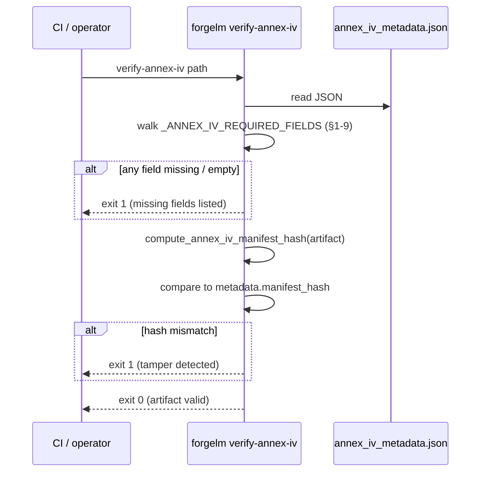

# Verify Annex IV

`forgelm verify-annex-iv` is the read-only verifier paired with the Annex IV technical-documentation artifact (`compliance/annex_iv_metadata.json`). It walks the nine top-level fields the EU AI Act requires for high-risk systems (§1-9), checks that every required category is populated, and recomputes the manifest hash to detect any tampering since the artifact was generated. The producer side — the auto-population of Annex IV from your `compliance:` YAML block — is documented in the [Compliance Overview](#/compliance/overview).

## When to use it

- **Before treating an Annex IV bundle as "audit-ready".** A clean exit is the minimum schema-completeness signal you should give to a regulator or notified body.
- **In the post-training CI gate.** Run after every pipeline that emits Annex IV; fail the release on exit `1`.
- **When receiving an Annex IV from a third-party trainer.** Recompute the manifest hash to detect drift between what they sent and what they signed.
- **Periodically across archived bundles.** A nightly sweep of historical Annex IV files surfaces silent post-archive edits.

## How it works



The verifier shares the canonicalisation routine `forgelm.compliance.compute_annex_iv_manifest_hash` with the writer in `forgelm.compliance.build_annex_iv_artifact` — so a legitimate artefact can never fail its own verifier on a writer/verifier byte drift.

## Quick start

```shell
$ forgelm verify-annex-iv checkpoints/run/compliance/annex_iv_metadata.json
OK: checkpoints/run/compliance/annex_iv_metadata.json
  All Annex IV §1-9 fields populated; manifest hash matches.
```

## Detailed usage

### JSON output for CI consumers

```shell
$ forgelm verify-annex-iv --output-format json \
    checkpoints/run/compliance/annex_iv_metadata.json
{
  "success": true,
  "valid": true,
  "reason": "All Annex IV §1-9 fields populated; manifest hash matches.",
  "missing_fields": [],
  "manifest_hash_actual": "sha256:abcdef…",
  "manifest_hash_expected": "sha256:abcdef…",
  "path": "/abs/path/checkpoints/run/compliance/annex_iv_metadata.json"
}
```

Pipe to `jq` to filter on the `valid` flag without parsing the human-readable text format.

### What "missing field" means

A field is considered missing when the key is absent OR the value is `None`, an empty string, an empty list, or an empty dict. The bar is "operator clearly populated this", not "the key technically exists" — operators forgetting to fill in a placeholder from the auto-generation template is the failure mode the verifier targets.

The nine required keys map onto Annex IV §1-9:

| Top-level key | Annex IV section |
|---|---|
| `system_identification` | §1 — system identification (name, version, provider, intended_purpose). |
| `intended_purpose` | §1 — intended purpose statement. |
| `system_components` | §2 — software / hardware components + supplier list. |
| `computational_resources` | §2(g) — compute resources used during training. |
| `data_governance` | §2(d) — data sources, governance, validation methodology. |
| `technical_documentation` | §3-5 — design + development methodology. |
| `monitoring_and_logging` | §6 — post-market monitoring + audit-log presence. |
| `performance_metrics` | §7 — accuracy / robustness / cybersecurity metrics. |
| `risk_management` | §9 — risk management system reference (Article 9 alignment). |

### What "manifest hash mismatch" means

When the artifact carries a `metadata.manifest_hash` field, the verifier recomputes the SHA-256 of the canonical-JSON representation of the artifact (excluding the metadata block itself) and compares. A mismatch means the file was edited after generation — the regulator-facing signature is no longer valid.

Artifacts without `metadata.manifest_hash` pass the field-completeness check but the verifier flags this in the reason text:

```text
OK: …/annex_iv_metadata.json
  All Annex IV §1-9 fields populated; no manifest_hash present so tampering detection skipped.
```

### Exit-code summary

| Code | Meaning |
|---|---|
| `0` | All §1-9 fields populated AND manifest hash matches (when present). |
| `1` | Missing field, manifest mismatch, malformed JSON, or non-object root (validation failure — `valid=False`). |
| `2` | File not found or unreadable (I/O error — argument or environment mistake). |

## Common pitfalls

:::warn
**Treating ForgeLM's output as a certification.** The toolkit produces evidence; certification is a notified-body activity. The verifier confirms the artifact is structurally complete and untampered — not that it is *correct* for your specific deployment context.
:::

:::warn
**Skipping the human review step on the declaration of conformity.** Annex IV §7 (declaration of conformity) is a legal document. The auto-populated scaffold has no legal effect — a human must review and sign before submission, regardless of what `verify-annex-iv` reports.
:::

:::warn
**Ignoring "no manifest_hash present" in the OK output.** Without the manifest hash, the verifier cannot detect post-generation tampering. Re-export the artifact through a recent `forgelm` build so the writer attaches the hash, or move to a write-once store that gives you tamper-evidence at the storage layer.
:::

:::tip
**Pin the verifier in CI as a hard gate.** Wire `forgelm verify-annex-iv --output-format json` after every pipeline that produces Annex IV; pipe to `jq -e '.valid'` so exit-on-false fails the release without parsing text.
:::

## See also

- [Compliance Overview](#/compliance/overview) — context for the rest of the bundle (manifest, audit log, model card).
- [Audit Log](#/compliance/audit-log) — append-only event log; `compliance.artifacts_exported` (Article 11 + Annex IV) is the production-side counterpart to this verifier.
- [Verify Audit](#/compliance/verify-audit) — companion verifier for the audit log.
- [Verify GGUF](#/deployment/verify-gguf) — companion verifier on the deployment-integrity surface.
- [`verify_annex_iv_subcommand.md`](../../../reference/verify_annex_iv_subcommand.md) — the reference doc with full flag table and library-symbol citations.
