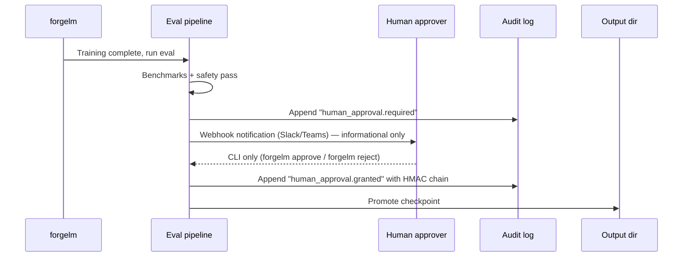

# Human Oversight

EU AI Act Article 14 requires high-risk AI systems to provide for human oversight. ForgeLM implements this as an optional config gate: when `evaluation.require_human_approval: true`, model promotion blocks until a human signs an approval.

## How the gate works



Without the human signature, the checkpoint stays in a "pending" state and the run exits with code 4 (waiting). It's *not* a failure — it's a controlled hold for review.

## Configuration

```yaml
evaluation:
  require_human_approval: true              # canonical activation key — Article 14 gate

webhook:
  url_env: SLACK_WEBHOOK_URL                # optional: notifier fires `approval.required`
  notify_on_success: true                   # this gate is dispatched on the success channel
```

There is **no** `compliance.human_approval` field, no `approval.*` block, no `signature_method`, no `timeout_hours`, no `require_role`, no `quorum`, and no `webhook_url` callback knob — those names appeared in earlier doc drafts but never shipped in `forgelm/config.py`. The canonical activation key is `evaluation.require_human_approval` (a plain `bool`); reviewer identity is recorded from `FORGELM_OPERATOR` at `forgelm approve` / `forgelm reject` time; the audit chain uses HMAC (not ed25519); and there is no built-in timeout — a staged run waits indefinitely until an operator decides.

## Approval mechanism

### CLI (only path)

The trainer halts after eval and prints:

```text
[2026-04-29 14:33:10] Human approval required.
  Run ID: abc123
  Bundle: checkpoints/run/artifacts/

  To approve: forgelm approve abc123 --output-dir checkpoints/run --comment "..."
  To reject:  forgelm reject  abc123 --output-dir checkpoints/run --comment "..."
```

The reviewer runs the approval command from any machine with access to the audit-log + staging directory. ForgeLM resolves their identity from `FORGELM_OPERATOR`, HMAC-chains the decision event, and (on `approve`) renames the staging directory to the canonical `final_model/` path.

### CLI subcommand pair

The supported approval mechanism is the CLI subcommand pair `forgelm approve` / `forgelm reject`. There is no webhook-callback variant — ForgeLM does not expose an approval-resume HTTP endpoint, and there is no JWT-based external-approver path.

```bash
forgelm approvals --pending --output-dir <dir>            # list runs awaiting approval
forgelm approve  <run-id> --output-dir <dir> --comment "..."  # promote staging → final_model
forgelm reject   <run-id> --output-dir <dir> --comment "..."  # discard the staged model
```

**Note:** `approve` and `reject` take a positional `run_id` (not
`--run-id`); `--comment "..."` is the reviewer note that lands in
the `human_approval.granted` / `human_approval.rejected` event.
`--output-dir <dir>` is required and points at the training output
directory containing `audit_log.jsonl` and `final_model.staging/`.

Each invocation requires `FORGELM_OPERATOR` (the approver's identity) and writes a `human_approval.granted` / `human_approval.rejected` event to the chain. Self-service "promote this run" automation is roadmapped for v0.6.0+ Pro CLI (Phase 13 in the public roadmap); until then the CLI gate is the audit-grade interface.

## What's in an approval signature

Every approval (or rejection) appends to `audit_log.jsonl`:

```json
{
  "ts": "2026-04-29T15:18:42Z",
  "seq": 87,
  "event": "human_approval.granted",
  "run_id": "abc123",
  "approver": "ci-reviewer@example",
  "comment": "Reviewed safety report; max_safety_regression 0.04 acceptable for this deployment.",
  "_hmac": "..."
}
```

The `approver` field comes from `FORGELM_OPERATOR` at `forgelm approve` time; the `_hmac` is the per-line chain HMAC (the same HMAC used for every audit event). There is no separate ed25519 artefact signature.

## Multi-reviewer

ForgeLM does **not** ship a built-in quorum gate. There is no `approval.quorum` field. To enforce N-of-M sign-off, layer it at the CI / IdP level — e.g. a GitHub branch-protection rule that requires N reviewer-team approvals before the workflow that calls `forgelm approve` is allowed to run.

## Timeouts

ForgeLM does **not** time out staged runs. There is no `approval.timeout_hours`, no `human_approval.timeout` event, and no auto-fail clock. A staged run waits indefinitely; if the deployer wants to expire stale staging directories, configure `retention.staging_ttl_days` instead — that wires into the GDPR Article 17 retention pipeline (which physically prunes the directory after the configured horizon, not into the approval gate).

## Inspecting pending runs

`forgelm approvals` is the discovery counterpart to `approve` / `reject`. It scans the audit log under `--output-dir` and reports every run whose `human_approval.required` event has no matching terminal decision.

```shell
$ forgelm approvals --pending --output-dir checkpoints/
Pending approvals (2):

RUN_ID            AGE   REQUESTED_AT               STAGING
----------------  ----  -------------------------  -------
fg-abc123def456   3h    2026-04-30T11:33:10+00:00  present
fg-def456abc789   1d    2026-04-29T14:12:55+00:00  present
```

`--output-format json` returns a structured envelope (`{"success": true, "pending": [...], "count": 2}`) so CI can filter the queue programmatically.

```shell
$ forgelm approvals --show fg-abc123def456 --output-dir checkpoints/
Run: fg-abc123def456
Status: pending

Audit chain (oldest first):
  [2026-04-30T11:33:10+00:00] human_approval.required — require_human_approval=true

Staging contents (4 entries):
  - adapter_config.json
  - adapter_model.safetensors
  - tokenizer.json
  - tokenizer_config.json
```

A `--show` against a granted / rejected run prints the full timeline (request → decision) plus the final approver and comment. `--show` against an unknown `run_id` exits 1 with a clear error.

## Common pitfalls

:::warn
**Auto-approving in CI to "unblock the pipeline".** Defeats the purpose of human oversight. If the gate is in your way, you're either over-using it (turn it off for non-high-risk runs) or under-staffing reviewers.
:::

:::warn
**Reviewer rubber-stamping.** A signature must be informed. Display the full artifact summary in the approval flow so the reviewer actually sees what they're signing for.
:::

:::warn
**No quorum for shipping decisions.** For high-risk production deployments, single-reviewer approval is insufficient. Always require quorum >= 2.
:::

:::tip
**Make the approval CLI accessible.** Reviewers shouldn't need to SSH into the training host to approve. Set up the artifacts directory on shared storage so reviewers can run `forgelm approve` from their own machines.
:::

## See also

- [Audit Log](#/compliance/audit-log) — where signatures are recorded.
- [Annex IV](#/compliance/annex-iv) — Section 7 declaration is signed by humans, not the toolkit.
- [Webhooks](#/operations/webhooks) — approval requests can fire Slack/Teams alerts.
