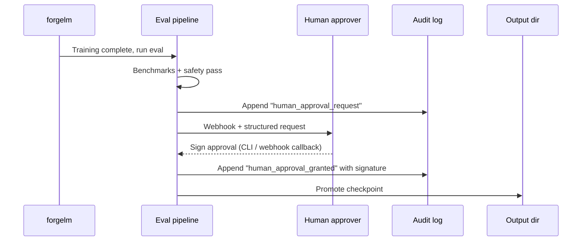

# Human Oversight

EU AI Act Article 14 requires high-risk AI systems to provide for human oversight. ForgeLM implements this as an optional config gate: when `compliance.human_approval: true`, model promotion blocks until a human signs an approval.

## How the gate works



Without the human signature, the checkpoint stays in a "pending" state and the run exits with code 4 (waiting). It's *not* a failure — it's a controlled hold for review.

## Configuration

```yaml
compliance:
  human_approval: true
  approval:
    request_webhook: "${SLACK_WEBHOOK}"      # optional notification
    signature_method: "cli"                   # cli | webhook | api
    timeout_hours: 48                         # auto-fail after this
    require_role: "ml-compliance-lead"        # who can approve
    quorum: 1                                 # required approvers
```

## Signature methods

### CLI (default)

The trainer halts after eval and prints:

```text
[2026-04-29 14:33:10] Human approval required.
  Run ID: abc123
  Bundle: checkpoints/run/artifacts/

  To approve: forgelm approve abc123 --output-dir checkpoints/run --comment "..."
  To reject:  forgelm reject  abc123 --output-dir checkpoints/run --comment "..."
```

The reviewer runs the approval command from any machine with access to the artifacts directory. ForgeLM verifies their identity via SSH key signing or env-set token, signs the audit log, and resumes promotion.

### Webhook callback

For integration with internal approval systems:

```yaml
approval:
  signature_method: "webhook"
  webhook_url: "https://internal.example/approvals/{run_id}/decide"
```

The trainer halts and posts the artifact bundle to your webhook. Your system handles the human review and POSTs back to ForgeLM's resume endpoint with a signed JWT.

### CLI subcommand (canonical)

The supported approval mechanism in v0.5.5 is the CLI subcommand pair `forgelm approve` / `forgelm reject`:

```bash
forgelm approvals --pending                       # list runs awaiting approval
forgelm approve --run-id <run-id>                 # promote staging → final_model
forgelm reject  --run-id <run-id> --reason "..."  # discard the staged model
```

Each invocation requires `FORGELM_OPERATOR` (the approver's identity) and writes a `human_approval.granted` / `human_approval.rejected` event to the chain. Self-service "promote this run" automation is roadmapped for v0.6.0+ Pro CLI (Phase 13 in the public roadmap); until then the CLI gate is the audit-grade interface.

## What's in an approval signature

Every approval (or rejection) appends to `audit_log.jsonl`:

```json
{
  "ts": "2026-04-29T15:18:42Z",
  "seq": 87,
  "event": "human_approval_granted",
  "run_id": "abc123",
  "reviewer": "Cemil Ilik <cemil@example>",
  "role": "ml-compliance-lead",
  "method": "cli",
  "signature": "ed25519:...",
  "comment": "Reviewed safety report; S5 max 0.04 acceptable for this deployment.",
  "artifact_hash": "sha256:..."
}
```

The `signature` is over the artifact bundle's `manifest.json` hash — it certifies the reviewer saw *exactly* what was produced.

## Quorum (multi-reviewer)

For high-risk deployments, require multiple approvers:

```yaml
approval:
  quorum: 2
  require_role: "ml-compliance-lead"
```

Each approver runs the CLI command independently. Promotion happens after the quorum signs (or one of them rejects).

## Timeouts

After `timeout_hours`, an unsigned run auto-fails with exit code 4 + a structured event:

```json
{"event": "human_approval_timeout", "expired_at": "2026-04-30T14:33:10Z"}
```

Default is 48 hours. Set to 0 for "no timeout — wait forever" (not recommended in CI).

## Inspecting pending runs

`forgelm approvals` is the discovery counterpart to `approve` / `reject`. It scans the audit log under `--output-dir` and reports every run whose `human_approval.required` event has no matching terminal decision.

```shell
$ forgelm approvals --pending --output-dir checkpoints/
Pending approvals (2):

RUN_ID            AGE   REQUESTED_AT               STAGING
----------------  ----  -------------------------  -------
fg-abc123def456   3h    2026-04-30T11:33:10+00:00  present
fg-def456abc789   1d    2026-04-29T14:12:55+00:00  present
```

`--output-format json` returns a structured envelope (`{"success": true, "pending": [...], "count": 2}`) so CI can filter the queue programmatically.

```shell
$ forgelm approvals --show fg-abc123def456 --output-dir checkpoints/
Run: fg-abc123def456
Status: pending

Audit chain (oldest first):
  [2026-04-30T11:33:10+00:00] human_approval.required — require_human_approval=true

Staging contents (4 entries):
  - adapter_config.json
  - adapter_model.safetensors
  - tokenizer.json
  - tokenizer_config.json
```

A `--show` against a granted / rejected run prints the full timeline (request → decision) plus the final approver and comment. `--show` against an unknown `run_id` exits 1 with a clear error.

## Common pitfalls

:::warn
**Auto-approving in CI to "unblock the pipeline".** Defeats the purpose of human oversight. If the gate is in your way, you're either over-using it (turn it off for non-high-risk runs) or under-staffing reviewers.
:::

:::warn
**Reviewer rubber-stamping.** A signature must be informed. Display the full artifact summary in the approval flow so the reviewer actually sees what they're signing for.
:::

:::warn
**No quorum for shipping decisions.** For high-risk production deployments, single-reviewer approval is insufficient. Always require quorum >= 2.
:::

:::tip
**Make the approval CLI accessible.** Reviewers shouldn't need to SSH into the training host to approve. Set up the artifacts directory on shared storage so reviewers can run `forgelm approve` from their own machines.
:::

## See also

- [Audit Log](#/compliance/audit-log) — where signatures are recorded.
- [Annex IV](#/compliance/annex-iv) — Section 7 declaration is signed by humans, not the toolkit.
- [Webhooks](#/operations/webhooks) — approval requests can fire Slack/Teams alerts.
