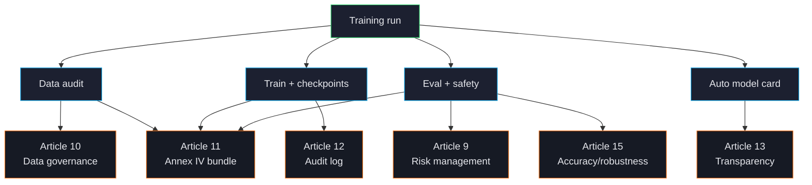

# Compliance Overview

ForgeLM was built for teams that have to defend their training pipeline to a regulator, not just a CTO. Every successful (or failed) run produces a structured evidence bundle that maps cleanly onto EU AI Act Articles 9-17, GDPR Article 5, and ISO 27001 control objectives.



## What gets produced

Every run that has `compliance.annex_iv: true` produces an artifacts directory:

```text
checkpoints/run/artifacts/
├── annex_iv.json                  ← Article 11 — technical documentation
├── audit_log.jsonl                ← Article 12 — append-only event log
├── data_audit_report.json         ← Article 10 — data governance evidence
├── safety_report.json             ← Article 9 + 15 — risk + safety assessment
├── benchmark_results.json         ← Article 15 — accuracy
├── conformity_declaration.md      ← Article 16 — declaration scaffold
└── manifest.json                  ← SHA-256 over every artifact above
```

This bundle is the deliverable for compliance reviews. Every file is hashed in `manifest.json` for tamper-evidence.

## Articles ForgeLM addresses

| Article | Topic | How ForgeLM addresses it |
|---|---|---|
| **9** | Risk management | Auto-revert + threshold gates + trend tracking. |
| **10** | Data governance | `forgelm audit` produces governance evidence per dataset. |
| **11** | Technical documentation | `annex_iv.json` is a populated Annex IV. |
| **12** | Record-keeping | Append-only `audit_log.jsonl` covering training start, eval gates, revert decisions. |
| **13** | Transparency | Auto-generated model card listing capabilities, limitations, training summary. |
| **14** | Human oversight | Optional `compliance.human_approval: true` blocks promotion until a human signs off. |
| **15** | Accuracy & robustness | Benchmark gates + safety eval + cybersecurity (PII / secrets at ingest). |
| **16-17** | Conformity & QMS | Declaration scaffold + QMS SOPs in `docs/qms/`. |

For the full mapping with code references, see the [Compliance page on the public site](compliance.html).

## What ForgeLM doesn't claim

:::warn
ForgeLM **generates** Annex IV-style technical documentation. It does **not** certify your system as a high-risk AI system under the AI Act — that's a notified-body or self-assessment activity, outside any toolkit's scope.

The audit log is append-only by convention and SHA-256-anchored. Real tamper-evidence requires shipping the log to a separate write-once store (S3 Object Lock, ledger DB). The toolkit produces the artefact; chain-of-custody is your operational responsibility.

The PII/secrets regex sets are conservative by design — they prefer false-negatives over false-positives. For high-stakes corpora, pair with manual review before training.
:::

## Enabling compliance artifacts

Set in your YAML:

```yaml
compliance:
  annex_iv: true
  data_audit_artifact: "./audit/data_audit_report.json"
  human_approval: true                # optional Article 14 gate
  intended_purpose: "Customer-support assistant for Turkish telecom"
  risk_classification: "high-risk"    # or "minimal", "limited", etc.
  deployment_geographies: ["TR", "EU"]
  responsible_party: "Acme Corp <compliance@acme.example>"
```

Every field from `compliance:` flows into `annex_iv.json`. Required fields are validated at config load — a missing `intended_purpose` fails `--dry-run`.

## What goes into Annex IV

The Annex IV artifact has eight sections, all populated automatically:

1. **General description** — model name, intended purpose, deployment geography.
2. **Detailed system description** — base model, training paradigm, dataset summary.
3. **Monitoring** — eval thresholds, auto-revert triggers, trend tracking.
4. **Risk management** — risk classification, mitigations, residual risks.
5. **Lifecycle** — training date, version, references to source data.
6. **Standards** — listed compliance frameworks (EU AI Act, GDPR, ISO 27001).
7. **Declaration of conformity** — scaffold; final declaration requires human signature.
8. **Post-market monitoring plan** — pointer to the deployed surveillance config.

See [Annex IV](#/compliance/annex-iv) for the full schema.

## Operational responsibilities (you, not ForgeLM)

The toolkit produces evidence; the people produce certification. Your team is responsible for:

- Reviewing the audit bundle after every run that's bound for production.
- Shipping the audit log to a write-once store for tamper-evidence.
- Conducting the conformity assessment with a notified body where required.
- Maintaining post-market monitoring once the model is deployed.
- Handling data subject requests (GDPR Articles 15-22).

ForgeLM's QMS SOPs in `docs/qms/` cover the operational side — release process, incident response, data-source onboarding.

## See also

- [Annex IV](#/compliance/annex-iv) — full Article 11 artifact spec.
- [Audit Log](#/compliance/audit-log) — Article 12 event log.
- [Human Oversight](#/compliance/human-oversight) — Article 14 gate.
- [Model Card](#/compliance/model-card) — Article 13 transparency.
- [GDPR / KVKK](#/compliance/gdpr) — data protection.
