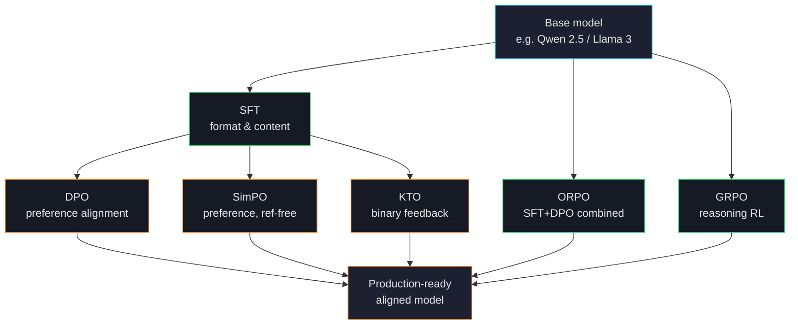
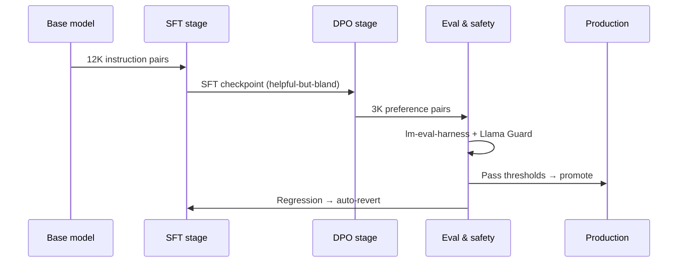

# The Alignment Stack

Modern LLM fine-tuning is no longer a single algorithm — it's a *stack* of post-training paradigms, each addressing a different problem. ForgeLM gives you all six behind one declarative interface so you can pick the right tool without rewriting your pipeline.

## The three problems alignment solves

### Problem 1: Format

A base model can complete text but doesn't follow instructions, doesn't use chat turns, doesn't keep a system prompt, and doesn't know when to stop. **SFT** solves this: train on examples of the format you want.

### Problem 2: Preferences

After SFT, the model produces well-formatted outputs but quality varies — sometimes confident, sometimes evasive, sometimes verbose. **DPO**, **SimPO**, **KTO**, and **ORPO** all align the model towards preferred outputs.

The differences:
- **DPO** — learns from `(chosen, rejected)` pairs against a reference model. Best-studied, most stable.
- **SimPO** — same as DPO but skips the reference model. Lower memory, slightly less stable.
- **KTO** — learns from binary `(prompt, response, good?)` signals. Use when you only have thumbs-up/down feedback.
- **ORPO** — combines SFT and preference loss in a single pass. Faster wall-clock; less flexible than separate stages.

### Problem 3: Reasoning

Some tasks (math, code, multi-step logic) benefit from reinforcement learning over reasoning traces, not just pairwise preferences. **GRPO** trains the model to maximise a reward function on its own outputs, with format and length shaping rewards built in.

## A typical production sequence

Most teams reach production in two stages: SFT to teach format and content, then DPO/SimPO/KTO to sharpen preferences. ORPO collapses both into one stage when you need wall-clock speed and have both kinds of data ready.

## Trade-offs at a glance

| Stage | Data needed | Memory | Stability | When to skip |
|---|---|---|---|---|
| SFT | Prompt-completion pairs | 1× | Stable | Never — almost always needed |
| DPO | Chosen-rejected pairs | 2× | Stable | If you don't have preference data |
| SimPO | Chosen-rejected pairs | 1.2× | Moderate | If you have spare VRAM, prefer DPO |
| KTO | Binary thumbs-up/down | 1.5× | Moderate | If you have paired preferences (use DPO) |
| ORPO | Both pairs and preferences | 1.5× | Stable | If you want SFT and DPO as separate experiments |
| GRPO | Reward function or reward model | 2-3× | Tricky | Non-reasoning tasks |

:::tip
**Don't skip SFT.** Even if you have great preference data, SFT first to teach format, then align with DPO/SimPO/KTO. Skipping SFT and going straight to DPO usually produces an unstable, format-broken model.
:::

## Parameter-efficient methods

All trainers above can be combined with parameter-efficient methods so they fit on commodity GPUs:

- **LoRA / QLoRA / DoRA / PiSSA / rsLoRA** — train low-rank adapters instead of all weights. ~1% trainable parameters, ~10% VRAM, comparable quality on most tasks.
- **GaLore** — gradient projection, full-parameter training in LoRA-level memory.

See [LoRA, QLoRA, DoRA](#/training/lora) and [GaLore](#/training/galore).

## Distributed training

Once your model is bigger than a single GPU's memory, ForgeLM supports:

- **DeepSpeed ZeRO-2 / ZeRO-3** — shard optimiser states / gradients / parameters across GPUs.
- **FSDP** — PyTorch-native fully-sharded data parallelism.
- **Unsloth** — backend that's 2-5× faster on supported architectures (single-GPU only).

See [Distributed Training](#/training/distributed).

## Where to go next

- [Choosing a Trainer](#/concepts/choosing-trainer) — a decision tree for picking among SFT/DPO/SimPO/KTO/ORPO/GRPO.
- [SFT](#/training/sft) — start here for almost any project.
- [Dataset Formats](#/concepts/data-formats) — what each trainer expects in JSONL.
