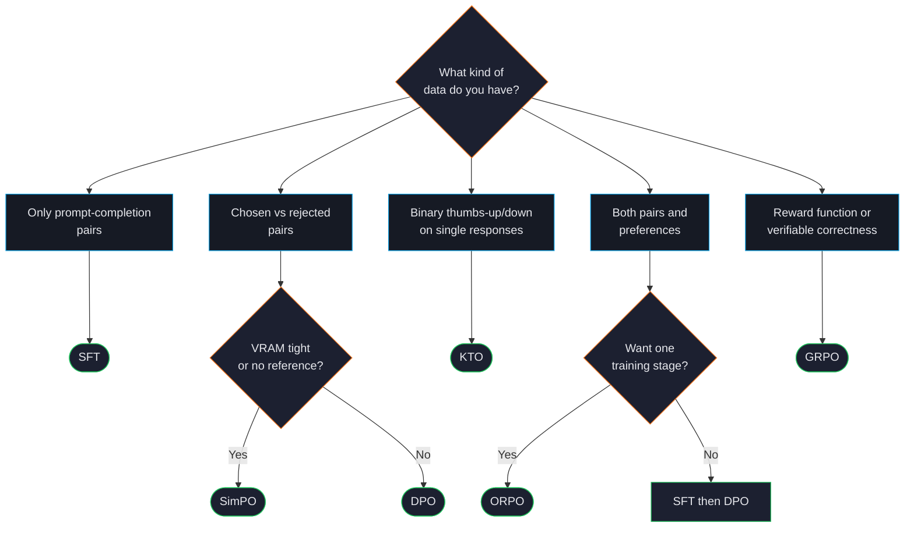

# Choosing a Trainer

The single biggest decision in a fine-tuning project is which trainer to use — and the right answer is almost always determined by your data, not your preferences.

## Decision tree

## What to look at in your data

| Data shape | Recommended trainer |
|---|---|
| `{prompt, completion}` rows only | [SFT](#/training/sft) |
| `{prompt, chosen, rejected}` rows | [DPO](#/training/dpo) (or [SimPO](#/training/simpo) if VRAM-tight) |
| `{prompt, response, label: bool}` rows | [KTO](#/training/kto) |
| Mix of SFT and preference rows | [SFT](#/training/sft) → [DPO](#/training/dpo) sequence, or [ORPO](#/training/orpo) for one-stage |
| Programmatic reward (math grader, code tests) | [GRPO](#/training/grpo) |

## Compute considerations

If you've decided on a trainer based on data, double-check it fits your VRAM:

| Trainer | VRAM (relative to SFT same model + max_length) |
|---|---|
| SFT | 1.0× (baseline) |
| ORPO | 1.5× |
| SimPO | 1.2× |
| KTO | 1.5× |
| DPO | 2.0× — keeps reference model in memory |
| GRPO | 2-3× — also keeps reference + reward components |

:::tip
QLoRA cuts these numbers ~3-4×. A 7B DPO run that needs 22 GB in full precision fits in ~7 GB with QLoRA. See [LoRA, QLoRA, DoRA](#/training/lora).
:::

## Common starting points

These templates ship with `forgelm quickstart` and reflect what most teams use as their first run:

| Goal | Template | Trainer sequence |
|---|---|---|
| Helpful + safe customer-support bot | `customer-support` | SFT → DPO |
| Code-completion model | `code-assistant` | SFT → ORPO |
| Domain expert from your PDFs | `byod-domain-expert` | SFT only |
| Math reasoning | `math-reasoning` | GRPO with format-shaping reward |
| Turkish medical Q&A | `medical-qa-tr` | SFT only |

## Anti-patterns

:::warn
**"DPO without SFT first."** A common mistake — going straight to DPO on a base model. Without SFT to teach format and content, DPO becomes brittle and the resulting model often produces malformed outputs.
:::

:::warn
**"GRPO for everything."** GRPO is powerful for tasks with verifiable correctness (math problems with numerical answers, code with passing tests). For open-ended quality preferences, DPO is more stable and easier to debug.
:::

:::warn
**"Skipping data audit because the data 'looks fine'."** [Audit your data first](#/data/audit) — a leaky train/test split or PII in your dataset is far more likely to ruin your run than picking the "wrong" trainer.
:::

## See also

- [The Alignment Stack](#/concepts/alignment-overview) — broader context of post-training paradigms.
- [Dataset Formats](#/concepts/data-formats) — what JSONL each trainer expects.
