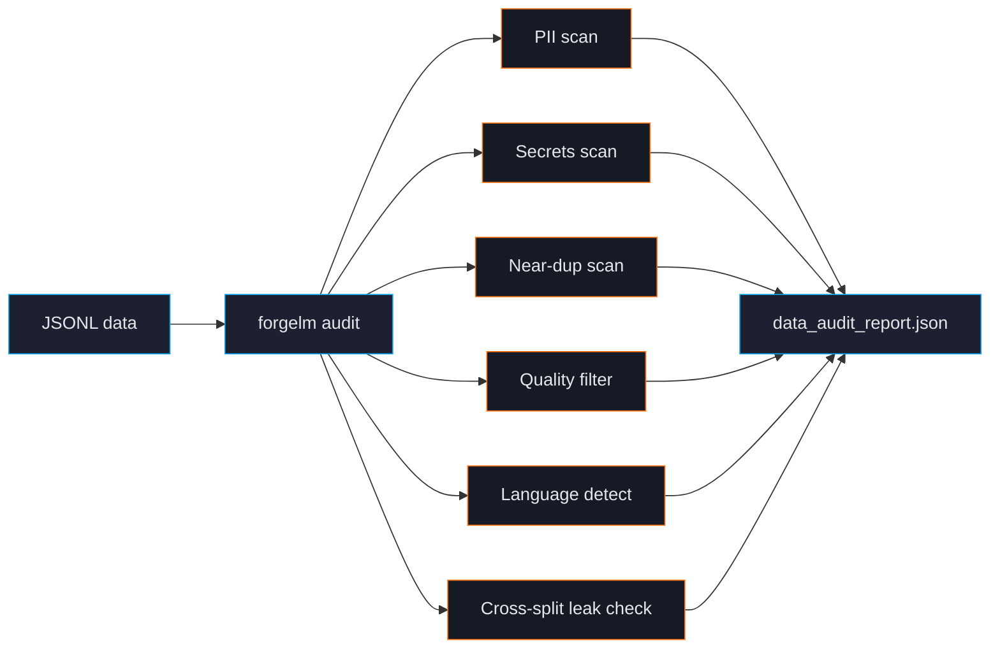

# Dataset Audit

`forgelm audit` is a CPU-only, streaming pre-flight check for your training data. It catches the bugs that make models fail safety review, leak secrets in production, or memorise the test set. Run it before every training job.



## Quick example

```shell
$ forgelm audit data/preferences.jsonl --output ./audit/
✓ format: preference (12,400 rows, 3 splits)
⚠ PII: 12 emails, 3 phone, 1 IBAN (medium severity, see report)
✓ secrets: 0 detected
⚠ near-duplicate pairs: 47 (LSH-banded simhash, threshold 3)
✗ chosen-rejected identical: 12 rows (likely collection bug)
✓ language: 99.2% Turkish, 0.8% English
✓ no cross-split leakage

audit complete — see ./audit/data_audit_report.json
```

The exit code reflects severity:

| Exit | Meaning |
|---|---|
| `0` | Clean. Safe to train. |
| `2` | Warnings. Review the report; training will work but quality may suffer. |
| `3` | Errors. Cross-split leakage or other show-stoppers detected. Fix before training. |

## What audit checks

### PII (personally identifiable information)

Detects emails, phone numbers, credit card numbers (Luhn-validated), IBAN, and national IDs (TR, DE, FR, US-SSN). Tags rows by severity. See [PII Masking](#/data/pii-masking).

### Secrets

Detects AWS keys, GitHub Personal Access Tokens, Slack tokens, OpenAI keys, Google API keys, JWTs, full PEM private-key blocks, Azure storage strings. See [Secrets Scrubbing](#/data/secrets).

### Near-duplicate detection

Two algorithms:
- **LSH-banded simhash** (default) — exact recall, fast, good for <50K rows.
- **MinHash LSH** — approximate, scales to millions of rows.

See [Deduplication](#/data/deduplication) for the trade-offs.

### Quality filter

Heuristics borrowed from Gopher, C4, RefinedWeb research. Flags rows with low alpha ratio, abnormal word lengths, repeated lines, or short paragraphs. Conservative — never silently drops rows. See [Quality Filter](#/data/quality-filter).

### Language detection

Uses `langdetect` to identify the dominant language per row. Reports top-3 across the dataset. Catches the "supposed to be Turkish but 12% slipped in as English" class of bugs. See [Language Detection](#/data/language-detection).

### Cross-split leakage

Compares train vs validation vs test rows for exact and near-duplicate matches. The single most expensive evaluation bug — leakage means your reported metrics are inflated. Audit refuses to certify a leaky split. See [Cross-Split Leakage](#/data/leakage).

### Format-specific checks

For **preference** datasets, audit also flags:
- Rows where `chosen == rejected` (collection bug)
- Rows where `chosen` is shorter than `rejected` by more than 10× (likely accidental swap)
- Empty `chosen` or `rejected`

For **binary** (KTO) datasets:
- Severe class imbalance (>99/1)
- Empty responses
- Non-boolean labels

## CLI flags

| Flag | Description |
|---|---|
| `--output PATH` | Output directory for the audit report (default `./audit/`). |
| `--strict` | Treat warnings as errors. Exit 2 instead of 0 on any flag. |
| `--dedup-algo {simhash,minhash}` | Override default near-dup algorithm. |
| `--dedup-threshold N` | Hamming distance threshold for simhash (default 3). |
| `--skip-pii / --skip-secrets / ...` | Selectively disable individual checks. |
| `--sample-rate FLOAT` | Audit a random subsample (e.g. `0.1` for 10%). For very large datasets. |
| `--quality-filter` | Run heuristic quality checks (Gopher / C4 / RefinedWeb-style). Adds `quality_summary`. See [Quality Filter](#/data/quality-filter). |
| `--pii-ml [--pii-ml-language LANG]` | Layer Presidio NER on top of the regex PII detector — adds `person` / `organization` / `location` categories into the same `pii_summary` block. Requires the `[ingestion-pii-ml]` extra **and** a spaCy NER model. See [ML-NER PII (Presidio)](#/data/pii-ml). |
| `--croissant` | Emit a [Google Croissant 1.0](https://mlcommons.org/croissant/) dataset card under the report's `croissant` key — same JSON file doubles as both the audit and a Croissant-consumer card. See [Croissant 1.0 Dataset Card](#/data/croissant-card). |

## What's in the report

`data_audit_report.json` is structured for both human reading and CI integration:

```json
{
  "format": "preference",
  "row_count": 12400,
  "splits": {"train": 10000, "val": 1200, "test": 1200},
  "pii_summary": {
    "email": 12,
    "phone": 3,
    "iban": 1,
    "severity": "medium"
  },
  "secrets_summary": {"total": 0},
  "near_duplicate_pairs": 47,
  "cross_split_overlap": 0,
  "quality_flags": {
    "short_response": 24,
    "repeated_lines": 0,
    "abnormal_word_length": 12
  },
  "language_distribution": {"tr": 0.992, "en": 0.008},
  "preference_specific": {
    "identical_chosen_rejected": 12,
    "empty_chosen": 0,
    "swapped_likely": 0
  },
  "verdict": "warnings"
}
```

CI integrations parse `verdict` and individual counts to gate merges:

```yaml
# .github/workflows/data.yml
- name: Audit data
  run: forgelm audit data/train.jsonl --strict
```

## Common pitfalls

:::warn
**Skipping audit on "trusted" data.** Even data from your own production logs can have surprises — a recent rotation of API keys leaks into telemetry, a GDPR-deletion request creates dangling IDs. Audit defends against your own future mistakes.
:::

:::warn
**Using `--sample-rate` on a small dataset.** Sampling makes sense for million-row corpora; for <10K rows, audit the whole thing — it takes seconds anyway.
:::

:::tip
**Save audit reports per-version.** Commit `data_audit_report.json` to git alongside your dataset version. Future audits can diff against the historical report and tell you "we had 12 PII flags last time, now we have 47 — what changed in the data pipeline?"
:::

## See also

- [PII Masking](#/data/pii-masking), [Secrets Scrubbing](#/data/secrets), [Deduplication](#/data/deduplication) — individual checks in detail.
- [Annex IV](#/compliance/annex-iv) — how audit reports flow into compliance artifacts.
- [Configuration Reference](#/reference/configuration) — `compliance.data_audit_artifact` field.
