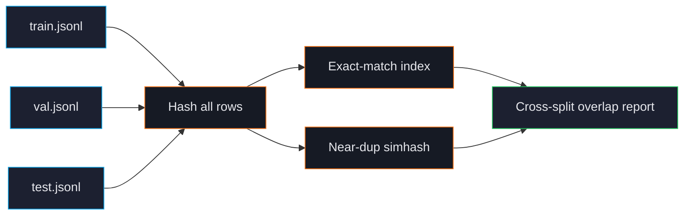

# Cross-Split Leakage

Train rows that also appear in validation or test inflate your evaluation metrics in misleading ways. The model "knows" the test answer because it saw it during training. Reported scores look good; production performance disappoints.

ForgeLM's cross-split leakage check is the single most important audit step. It runs every time you call `forgelm audit` and refuses to certify a leaky split.

## How leakage happens

The usual culprits:

1. **Random shuffling without grouping.** Splitting by row randomly puts duplicate rows on both sides.
2. **Augmentation before splitting.** Generating paraphrases of existing rows, then splitting — the original and paraphrase end up on different sides.
3. **Multiple sources of the same content.** A FAQ in your training corpus and the same FAQ in your eval set, ingested separately.
4. **Web crawls overlapping with benchmarks.** Training data crawled the web; the benchmark publisher also published their test set on the web.

## What the check does



For every train row, ForgeLM checks:
- **Exact match** in val/test (any field that matters: `prompt`, `chosen`, `response`, etc.).
- **Near-duplicate** (Hamming threshold 3 simhash) in val/test.

Any match is reported. If the leakage rate is over the configured threshold, audit exits non-zero.

## Quick example

```shell
$ forgelm audit data/      # audits train.jsonl + val.jsonl + test.jsonl
✗ cross-split overlap detected:
   train ↔ val: 47 exact, 12 near-dup
   train ↔ test: 23 exact, 5 near-dup
   val ↔ test: 0

Audit refuses to certify these splits. The full pair-level report lives in the on-disk audit JSON.

exit code: 3
```

Inspect the per-row pairs that triggered the failure with `jq`:

```shell
$ jq '.cross_split_overlap.pairs[]' audit/data_audit_report.json | head
{"train": 1240, "val": 312, "type": "exact", "text": "How do I cancel..."}
{"train": 4521, "val": 890, "type": "near-dup", "hamming": 2}
```

## How to fix it

1. **Re-split the data**, this time grouping at the source level (don't split paraphrases, group documents). Use the `--group-by` flag in your splitter.
2. **Re-extract** if leakage came from duplicate ingestion (the same FAQ ingested twice).
3. **Remove** the leaked rows from the smaller split manually — the audit JSON envelope's `cross_split_overlap.pairs` map names every offending row id under each split-pair entry (e.g. `cross_split_overlap.pairs["train↔val"]`). Pipe through `jq` to strip them out, then re-run `forgelm audit` to confirm the chain re-passes. There is no auto-remove CLI flag in v0.5.5 — adding one is on the roadmap, but until it ships the explicit `jq` step keeps the deletion auditable.

## Configuration

```yaml
audit:
  leakage_check:
    enabled: true
    threshold: 0                        # zero tolerance — fail audit at any leakage
    near_dup_hamming: 3                 # match threshold
    fields_to_check: ["prompt", "chosen", "response"]
    fail_severity: "error"              # `error` blocks training, `warn` just logs
```

Most teams use the default — zero tolerance. If you have a very large dataset where some leakage is unavoidable, raise `threshold` to a small fraction (e.g. 0.001) but document why.

## Why "near-dup" matters here

Exact-match leakage is rare in modern pipelines because everyone deduplicates. But near-dup leakage is the silent killer:

```text
Train: "How do I cancel my subscription?"
Test:  "How do I cancel my subscription"
```

Different by one character — exact-match misses it; the model treats them as identical at training time anyway. Near-dup catches this.

## Common pitfalls

:::warn
**Splitting after augmentation.** If you generate paraphrases of training data, then random-split, the paraphrase ends up on the other side. Always split *before* augmenting.
:::

:::warn
**Trusting upstream splits.** If your dataset was published with predefined train/val/test splits, audit them. Public datasets sometimes have known leakage that has propagated for years.
:::

:::danger
**Bypassing the leakage check to "ship something today".** The price of a leaky run is reporting good benchmark numbers, deploying, and discovering production performance is much worse. The loss of trust costs more than the delay would have.
:::

## See also

- [Dataset Audit](#/data/audit) — runs leakage check by default.
- [Deduplication](#/data/deduplication) — same simhash backend.
- [Annex IV](#/compliance/annex-iv) — leakage report is part of the compliance bundle.
