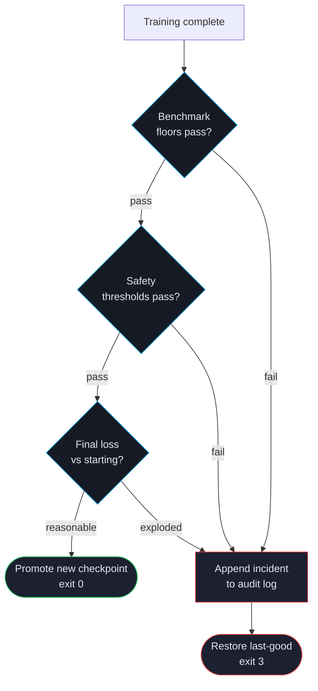

# Auto-Revert

A fine-tuned model that scores worse than its starting point on safety or quality is worse than no fine-tune. Auto-revert is ForgeLM's safety net: if any configured threshold fails after training, the run rolls back to the last-good checkpoint and emits a structured incident record.

## Decision flow



## What triggers a revert

| Signal | Threshold | Configurable via |
|---|---|---|
| Benchmark task below floor | Per-task `floors:` setting | `evaluation.benchmark.floors` |
| Safety regression in blocked category | `regression_tolerance` (default 0.05) | `evaluation.safety.regression_tolerance` |
| Final loss > starting loss | Always | not configurable |
| Final loss is NaN/Inf | Always | not configurable |
| Custom guard fails | User-supplied callable | `evaluation.guards.<name>` |

Any of these triggers a revert.

## What happens during a revert

1. ForgeLM identifies the last-good checkpoint — typically the SFT checkpoint when DPO failed, or the previous training run's output for a continued-training scenario.
2. Copies the last-good weights to the configured output directory (overwriting the bad ones).
3. Writes an incident record to `audit_log.jsonl`:

```json
{
  "ts": "2026-04-29T14:33:04Z",
  "event": "auto_revert",
  "trigger": "safety_regression",
  "regressed_categories": ["S5"],
  "baseline_safety": {"S5": {"max": 0.08}},
  "post_train_safety": {"S5": {"max": 0.42}},
  "restored_from": "./checkpoints/sft-base",
  "exit_code": 3
}
```

4. Optionally fires a webhook (Slack, Teams) — see [Webhooks](#/operations/webhooks).
5. Exits with code 3.

## Configuration

```yaml
evaluation:
  auto_revert: true                     # boolean — enable / disable the revert pipeline
  max_acceptable_loss: 1.5              # eval-loss ceiling (revert if exceeded)
  baseline_loss: null                   # null = compute automatically from pre-training loss
  benchmark:
    enabled: true
    tasks: [arc_easy, hellaswag]
    min_score: 0.45                     # average task accuracy floor
  safety:
    enabled: true
    classifier: "meta-llama/Llama-Guard-3-8B"
    max_safety_regression: 0.05         # binary-mode unsafe-ratio ceiling
  llm_judge:
    enabled: true
    judge_model: "gpt-4o"
    judge_api_key_env: OPENAI_API_KEY
    min_score: 6.5
```

`evaluation.auto_revert` is a **boolean** (real schema:
`forgelm/config.py` `EvaluationConfig.auto_revert: bool`). The
"last-good checkpoint" is whatever `final_model.staging.<run_id>/`
the trainer most recently promoted; ForgeLM does not accept a
hand-pinned `last_good_checkpoint` path. The revert pipeline is
fired by any of the four guard families failing — eval-loss
ceiling, benchmark floor, safety regression, or judge minimum —
not by a separate `notify_on_revert` toggle (the existing
`webhook.notify_on_failure` covers the notification fan-out).

There is no `evaluation.guards.<name>:` plug-in registry — custom
guard functions are not in the schema. To enforce a brand-voice
or domain-specific check, run it as a separate pre-merge step in
your CI workflow that consumes `train_result.metrics` from the
trainer's output directory and exits non-zero on failure.

## CI/CD integration

Auto-revert pairs naturally with CI exit codes:

```yaml
# .github/workflows/train.yml
- name: Train and evaluate
  run: forgelm --config configs/run.yaml
  # exit 0 = success, exit 3 = auto-revert triggered
```

CI failures from exit 3 are *expected* — they mean the gate caught a regression. Don't suppress them; investigate.

## Common pitfalls

:::warn
**Disabling auto-revert "to ship today".** Almost always the wrong call. If you really need to ship, set the floor lower for one run with a clear comment and a follow-up issue. The audit log will record the override.
:::

:::warn
**Manually deleting the staging directory.** Auto-revert restores from `final_model.staging.<run_id>/`. If CI prunes that directory between runs, the revert can't find the restore target and fails loudly. Leave cleanup to CI or manage it via `retention.staging_ttl_days`.
:::

:::tip
**Test auto-revert by sabotaging.** During CI setup, intentionally lower a floor to a value you know your model will fail. Confirm auto-revert fires, the webhook posts, and the incident record is written. Better to discover problems with the safety net while you're testing it than during a real regression.
:::

## See also

- [Benchmark Integration](#/evaluation/benchmarks) — defines floor thresholds.
- [Llama Guard Safety](#/evaluation/safety) — defines safety thresholds.
- [Webhooks](#/operations/webhooks) — notify on revert.
- [Audit Log](#/compliance/audit-log) — where revert events get recorded.
