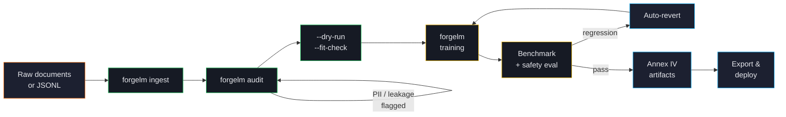

# Welcome to ForgeLM

**ForgeLM is a YAML-driven, enterprise-ready LLM fine-tuning toolkit.** You feed it a configuration file; it returns a fine-tuned model along with the audit trail, safety report, and Annex IV technical documentation a regulator would expect to see.

This user guide covers every feature in detail — concepts, configuration parameters, common pitfalls, and copy-pasteable YAML you can adapt to your own workflows.

## Who this guide is for

ForgeLM is built for three audiences in particular:

- **ML engineers** who need to ship fine-tuned models into regulated production environments and want a reproducible, scriptable workflow.
- **Compliance teams** who need to demonstrate to auditors that the model's training data, evaluation, and deployment follow EU AI Act, GDPR, or sector-specific requirements.
- **Platform/MLOps engineers** who run training as part of CI/CD pipelines and need predictable exit codes, structured logs, and webhook integrations.

If you're brand new to LLM fine-tuning, the [Concepts](#/concepts/alignment-overview) section explains the underlying ideas before we get into configuration.

## How a ForgeLM run actually flows

Every node maps to a `forgelm` command — there's no orchestrator that lives outside the toolkit. CI/CD systems just chain these commands together with the exit codes as gates.

## What you can do with ForgeLM

:::tip
Every capability listed below is opt-in via YAML. You only pay the complexity cost for the features you actually enable.
:::

| Stage | What ForgeLM gives you |
|---|---|
| **Data preparation** | PDF / DOCX / EPUB / TXT / Markdown ingestion, PII masking, secrets scrubbing, near-duplicate detection, quality filtering, language detection, cross-split leakage checks |
| **Training** | Six post-training paradigms (SFT, DPO, SimPO, KTO, ORPO, GRPO), QLoRA / DoRA / GaLore, DeepSpeed ZeRO-2/3, FSDP, Unsloth backend |
| **Evaluation** | `lm-evaluation-harness` integration, LLM-as-judge with OpenAI or local models, Llama Guard safety scoring with auto-revert |
| **Compliance** | EU AI Act Annex IV artifact generation, append-only audit log with SHA-256 manifests, conformity declaration scaffolding |
| **Deployment** | GGUF export with 6 quantization levels, deploy configs for Ollama / vLLM / TGI / HuggingFace Endpoints, model card auto-generation |

## How this guide is organised

The sidebar groups topics by lifecycle stage:

1. **Getting Started** — install ForgeLM, run your first training job, understand the project layout.
2. **Core Concepts** — the alignment stack, choosing a trainer, dataset formats.
3. **Training & Alignment** — every trainer (SFT, DPO, SimPO, KTO, ORPO, GRPO) and every parameter-efficient technique (LoRA, QLoRA, DoRA, GaLore).
4. **Data** — ingestion, audit, masking, deduplication.
5. **Evaluation & Safety** — benchmarks, judges, Llama Guard, auto-revert.
6. **Compliance** — Annex IV, audit logs, GDPR.
7. **Operations** — CI/CD, webhooks, distributed training, air-gap, troubleshooting.
8. **Deployment** — chat, GGUF, deploy targets, model merging.
9. **Reference** — full configuration schema, CLI reference, exit codes.

## Where to start

:::note
**New to ForgeLM?** Read [Installation](#/getting-started/installation) and [Your First Run](#/getting-started/first-run) in order — about 10 minutes of reading.
:::

:::note
**Trying to fine-tune a specific model?** Skip to [Choosing a Trainer](#/concepts/choosing-trainer) — the decision tree there points you at the right configuration.
:::

:::note
**Auditing a deployment for compliance?** Jump to [Compliance Overview](#/compliance/overview) and the [Configuration Reference](#/reference/configuration).
:::

## Conventions used in this guide

- **YAML snippets** show configuration as you'd put it in your config file. Top-level keys are always shown so you can copy them in context.
- **Shell commands** start with `$` to indicate the prompt — don't include the `$` when you copy.
- **`code`** in inline text refers to a CLI flag, configuration key, or file path.
- **Callout boxes** flag information that doesn't fit the main flow:
  - Note — additional context.
  - Tip — recommended practice.
  - Warning — common pitfall.
  - Danger — operational risk; read before proceeding.

:::warn
ForgeLM operates on real models and real data on real GPUs. A misconfigured run can produce a model that fails safety thresholds, leaks PII, or simply costs you a lot in wasted GPU time. The dry-run and fit-check workflows ([Your First Run](#/getting-started/first-run)) exist to catch these problems before they cost you anything — use them.
:::

## A note on technical terms

ForgeLM's documentation keeps technical terms in their original form across all languages — `SFT`, `DPO`, `LoRA`, `QLoRA`, `Annex IV`, `GGUF`, `vLLM`, etc. This is intentional: these are the terms you'll find in research papers, library APIs, and config files, and translating them creates ambiguity. General prose around them is fully translated.
