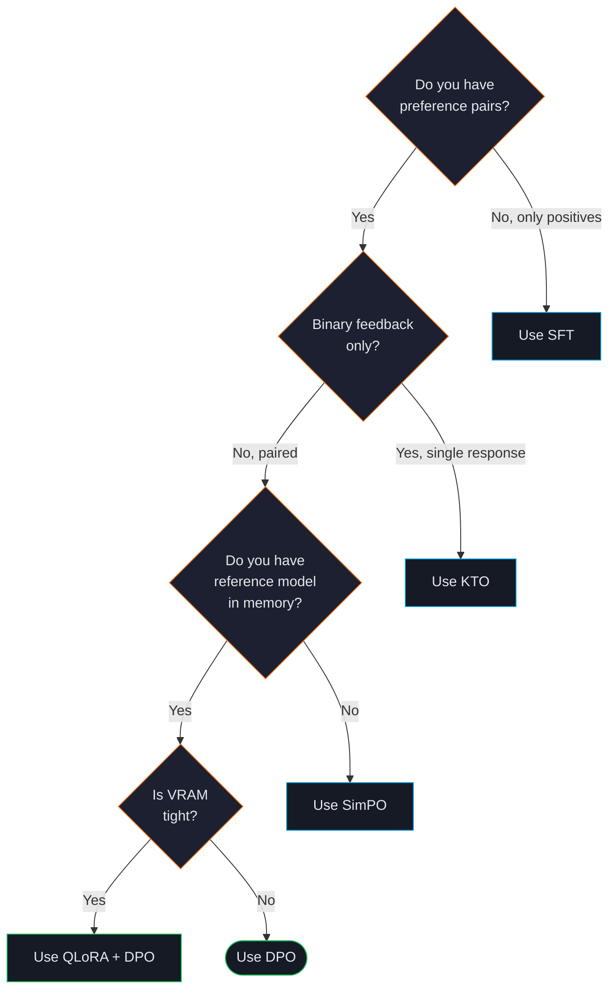
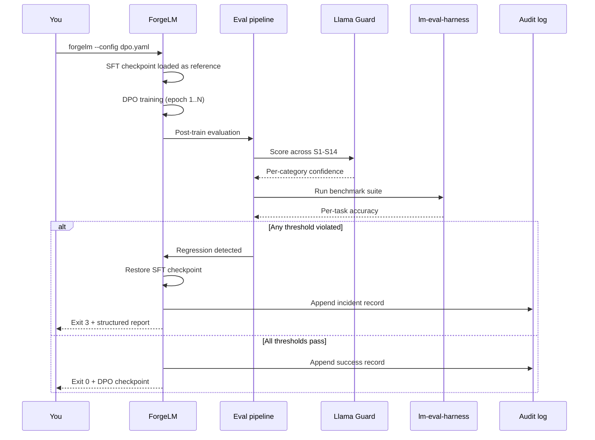

# Direct Preference Optimization (DPO)

DPO trains a model directly on pairs of (chosen, rejected) responses, aligning its outputs with human preferences without the complexity of reinforcement learning or training a separate reward model. It's the most common alignment technique after SFT.

## When to use DPO



| Use DPO when... | Don't use DPO when... |
|---|---|
| You have a dataset of preference pairs (e.g. agent thumbs-up/down). | You only have positive examples. Use [SFT](#/training/sft). |
| You've already done SFT and want to align outputs further. | You don't have a reference model in memory. Use [SimPO](#/training/simpo). |
| You want a stable, well-studied algorithm with predictable behaviour. | Your VRAM is tight — DPO needs ~2× the memory of SFT. |
| You want closed-form gradient estimates (no sampling required). | You have only binary feedback (yes/no on a single response). Use [KTO](#/training/kto). |

:::tip
Most production teams use the recipe **SFT → DPO** in sequence: SFT teaches the model the format and content of correct responses, DPO sharpens preferences between competing responses. ORPO combines both stages but has slightly less flexibility.
:::

## Quick example

A minimal DPO run on a model that's already been SFT-trained:

```yaml
model:
  name_or_path: "./checkpoints/sft-base"   # SFT output, or HF model
  max_length: 4096

lora:
  r: 16
  alpha: 32
  method: "lora"
  target_modules: ["q_proj", "k_proj", "v_proj", "o_proj"]

data:
  dataset_name_or_path: "data/preferences.jsonl"

training:
  trainer_type: "dpo"
  num_train_epochs: 1
  per_device_train_batch_size: 2
  gradient_accumulation_steps: 4
  learning_rate: 5.0e-6                    # ~10× smaller than SFT
  dpo_beta: 0.1                            # KL strength (flat field, not nested under dpo:)
  output_dir: "./checkpoints/dpo"
```

Run it:

```shell
$ forgelm --config configs/dpo.yaml --dry-run
$ forgelm --config configs/dpo.yaml --fit-check
$ forgelm --config configs/dpo.yaml
```

## Dataset format

DPO requires the **preference** format: each row contains a `prompt`, a `chosen` response, and a `rejected` response.

```json
{"prompt": "How do I cancel my subscription?", "chosen": "You can cancel from Settings → Billing → Cancel subscription. Your access continues until the end of the billing period.", "rejected": "Just stop paying lol."}
```

| Field | Type | Required | Notes |
|---|---|---|---|
| `prompt` | string | yes | The user's message or system+user pair. |
| `chosen` | string | yes | The preferred completion. |
| `rejected` | string | yes | The dispreferred completion. |
| `system` | string | no | Optional system prompt; merged into the prompt at training time. |

ForgeLM's data audit (`forgelm audit`) catches preference rows where `chosen` and `rejected` are identical (a common bug in preference collection pipelines). See [Dataset Audit](#/data/audit) for details.

## Configuration parameters

The `training.dpo` block holds DPO-specific knobs.

| Parameter | Type | Default | Description |
|---|---|---|---|
| `beta` | float | `0.1` | KL divergence regularisation strength. Lower = closer to reference model, higher = more aggressive preference shift. |
| `loss_type` | string | `"sigmoid"` | One of `sigmoid` (original DPO), `hinge` (RLHF-style margin), `ipo` (IPO regularisation), `kto` (KTO-style binary loss). |
| `label_smoothing` | float | `0.0` | Smoothing on preference labels; helps when annotations are noisy. |
| `reference_free` | bool | `false` | Skip the reference model entirely (closer to SimPO). Saves memory but trains less stably. |
| `reference_model` | string | (auto) | Path to an explicit reference model. Defaults to the model being trained, frozen. |
| `loss_dpop_lambda` | float | `null` | Enable DPO-Positive (DPOP) regularisation. `0.5` is a sensible starting point. |
| `pref_chosen_weight` | float | `1.0` | Up-weight chosen responses during loss computation; useful when chosen responses are rarer. |

The full set of training-block parameters (epochs, learning rate, scheduler, etc.) applies to DPO too — see [Configuration Reference](#/reference/configuration) for the complete list.

## Memory and compute

DPO is memory-hungry because it keeps both the policy model (the one being trained) and a reference model in VRAM at the same time.

:::warn
**Plan for ~2× the VRAM of an equivalent SFT run.** A 7B model that fits in 12 GB for SFT typically needs 22-24 GB for DPO with the same `max_length`. Workarounds:

- Use **QLoRA + DPO** — both models load in 4-bit. See [LoRA, QLoRA, DoRA](#/training/lora).
- Reduce `max_length` from 4096 to 2048 if your data allows.
- Switch to **SimPO** if your team can accept reference-free training. See [SimPO](#/training/simpo).
- Enable `reference_free: true` (less stable but skips the second model).
:::

Run `forgelm --config X.yaml --fit-check` before submitting a long DPO job — it estimates peak VRAM and reports `FITS / TIGHT / OOM / UNKNOWN` with concrete suggestions if your budget is tight.

## Choosing `beta`

`beta` is the most important DPO hyperparameter and the one most often gotten wrong.

| `beta` value | Behaviour | When to use |
|---|---|---|
| `0.01 – 0.05` | Very gentle preference shift; model stays close to reference. | High-quality, narrow preference signal; large preference dataset. |
| `0.1` | Default. Balanced trade-off between preference adherence and reference fidelity. | Most workflows. **Start here.** |
| `0.3 – 0.5` | Aggressive preference shift; model diverges further from reference. | Coarse preferences, small dataset, willing to trade away some general ability. |
| `> 0.5` | Often unstable; reward hacking risk. | Rarely. Increase only if `0.1` and `0.3` aren't shifting outputs noticeably. |

:::tip
If your training loss decreases but your evaluation metrics regress, you're over-fitting on preferences — *lower* `beta`. If preferences aren't shifting at all, *raise* `beta` or check your dataset for `chosen == rejected` rows.
:::

## Combining DPO with safety evaluation

In production, you almost always run DPO with safety evaluation and auto-revert enabled. A DPO run that increases helpfulness while regressing on the Llama Guard safety check is worse than no run at all.



```yaml
training:
  trainer_type: "dpo"
  dpo_beta: 0.1

evaluation:
  require_human_approval: true                    # Article 14 oversight gate
  auto_revert: true                               # rolls back on regression
  safety:
    enabled: true
    classifier: "meta-llama/Llama-Guard-3-8B"
    track_categories: true                        # tracks all 14 Llama-Guard categories
    severity_thresholds:
      S1: 0.05
      S2: 0.05
      S5: 0.10
      S10: 0.05
  benchmark:
    enabled: true
    tasks: ["truthfulqa_mc1", "hellaswag"]
    min_score: 0.45                               # single floor across averaged tasks
```

If post-train Llama Guard scores show a regression in any blocked category, ForgeLM automatically rolls back to the pre-DPO checkpoint and emits a structured incident record. See [Auto-Revert](#/evaluation/auto-revert) for the gating logic.

## Common pitfalls

:::warn
**Identical `chosen` and `rejected` rows.** Symptom: DPO loss converges immediately near zero. Fix: run `forgelm audit` on your preference dataset; it flags `chosen == rejected` collisions and near-duplicates.
:::

:::warn
**Learning rate too high.** DPO is sensitive to learning rate. Start at `5e-6` for full fine-tunes or `1e-5` for LoRA-on-DPO. SFT learning rates (1e-4 to 5e-4) cause divergence.
:::

:::warn
**Reference model drift.** If you train SFT and DPO with different LoRA adapters, the reference model used for DPO may not match what you think it is. Save the SFT checkpoint and explicitly set `model.name_or_path` to its directory for DPO.
:::

:::danger
**Mixing SFT and DPO in a single dataset.** Don't put SFT-format rows (`{prompt, completion}`) into the same JSONL as DPO-format rows (`{prompt, chosen, rejected}`). The data loader can't unambiguously route them. Use separate files and reference the secondary one via `data.extra_datasets: ["data/sft.jsonl"]` if you genuinely need to mix.
:::

## See also

- [SFT](#/training/sft) — supervised fine-tuning, the usual prerequisite for DPO.
- [SimPO](#/training/simpo) — reference-free preference learning, lower VRAM.
- [ORPO](#/training/orpo) — combines SFT and DPO into one stage.
- [Auto-Revert](#/evaluation/auto-revert) — the safety net for preference training.
- [Configuration Reference](#/reference/configuration) — full list of training parameters.
