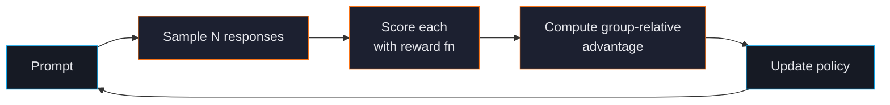

# Group Relative Policy Optimization (GRPO)

GRPO is the reinforcement-learning trainer in ForgeLM. The model generates several responses to each prompt, your reward function scores them, and GRPO updates the policy to favour higher-reward outputs. It's the right choice for tasks with verifiable correctness (math, code) or programmatic quality signals.

## When to use GRPO

| Use GRPO when... | Use DPO/SimPO when... |
|---|---|
| You can write a reward function (math grader, test runner). | Your quality signal is human preferences only. |
| Tasks have a verifiable correct answer. | Tasks are open-ended ("write a marketing email"). |
| You want format-shaping rewards in addition to correctness. | You need stable, well-understood training dynamics. |
| You're building a reasoning model. | You're building a chat assistant. |



## Quick example

```yaml
model:
  name_or_path: "./checkpoints/sft-base"
  max_length: 4096

data:
  dataset_name_or_path: "data/math-prompts.jsonl"

training:
  trainer_type: "grpo"
  num_train_epochs: 1
  per_device_train_batch_size: 1
  learning_rate: 1.0e-6
  grpo_num_generations: 8         # samples per prompt — flat field
  grpo_max_completion_length: 512 # cap per generation
  grpo_reward_model: "my_reward.score"  # importable callable; ForgeLM ships a built-in format/length fallback
  output_dir: "./checkpoints/grpo"
```

Built-in format/length reward shaping is always-on as a fallback (`forgelm/grpo_rewards.py`); set `grpo_reward_model` only when you have a domain-specific scorer. The TRL-side `beta` (KL strength) is governed by TRL's defaults — Phase 28+ backlog tracks surfacing it as a flat field.

```python
# my_reward.py
def score(prompt: str, response: str, ground_truth: str) -> float:
    """Return a scalar; positive for correct, negative for incorrect."""
    answer = parse_number(response)
    if answer is None:
        return -0.5
    return 1.0 if abs(answer - float(ground_truth)) < 1e-6 else -1.0
```

## Built-in format shaping

ForgeLM ships with a default reward shaper that rewards:

- **Format adherence** — output ends with a clear answer in the expected format (e.g. `\boxed{...}` for math).
- **Length compliance** — outputs neither too short nor rambling.
- **Reasoning structure** — chain-of-thought before the final answer.

The shaper composes with your custom reward:

```yaml
training:
  grpo:
    reward_function: "my_reward.score"   # 80% weight
    format_reward: 0.2                   # 20% weight on the shaper
    answer_pattern: '\\boxed\\{(.*?)\\}' # regex for the "final answer"
```

## Configuration parameters

| Parameter | Type | Default | Description |
|---|---|---|---|
| `group_size` | int | `8` | Responses sampled per prompt. Higher = more stable advantage estimates, more compute. |
| `beta` | float | `0.04` | KL regularisation. GRPO's beta is much smaller than DPO's because the gradient signal is amplified. |
| `reward_function` | string | `null` | Dotted path to your reward function. |
| `format_reward` | float | `0.0` | Weight of the built-in format shaper. `0.2` is sensible. |
| `answer_pattern` | string | `null` | Regex for extracting the "final answer". Used by the format shaper. |
| `temperature` | float | `0.9` | Sampling temperature. Higher = more diverse responses. |
| `max_completion_length` | int | `2048` | Cap on generated response length. |

## Compute and memory

GRPO is the heaviest trainer:

- Generates `group_size` responses per prompt (default 8) — that's 8× the inference cost of DPO.
- Keeps a reference model in memory.
- Reward computation may load additional models (judge LLM, reward model).

| Model | LoRA | `group_size` | Approx VRAM (QLoRA) |
|---|---|---|---|
| 7B | yes | 8 | 18 GB |
| 13B | yes | 8 | 28 GB (needs 40 GB) |
| 7B | no | 8 | needs ZeRO-3 |

## Common pitfalls

:::warn
**Reward function with wrong scale.** Rewards in `[0, 1]` (or `[-1, 1]`) work best. Unbounded rewards (e.g. `correct ? 1000 : 0`) cause gradient explosions. Normalise to a sensible bounded range.
:::

:::warn
**`group_size` too small.** With `group_size=2`, GRPO's group-relative advantage estimate has no statistical power. Use 4 minimum, 8+ for stability.
:::

:::warn
**No SFT first.** GRPO from a base model rarely produces useful results — the model can't even output the right format, so almost every sample gets the minimum reward. SFT for format first, GRPO for correctness second.
:::

:::danger
**Reward hacking.** The model will exploit any unintended pattern in your reward function. Common cases:
- Rewarding chain-of-thought length → model writes infinitely.
- Rewarding the exact-string match of a final answer → model outputs nothing else.
- Rewarding "no errors in syntax" → model outputs trivial code that doesn't solve the problem.

Test your reward function against adversarial outputs *before* training. The format shaper helps but isn't a complete defence.
:::

## See also

- [Choosing a Trainer](#/concepts/choosing-trainer) — when GRPO beats DPO.
- [Auto-Revert](#/evaluation/auto-revert) — catch reward-hacking regressions.
- [Configuration Reference](#/reference/configuration) — full parameter list.
