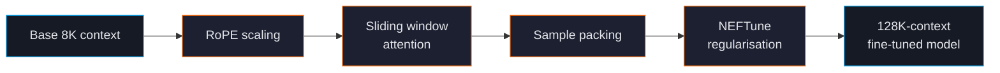

# Long-Context Training

Modern base models often ship with 8K-32K native context, but real-world tasks frequently need more — full books, multi-document RAG, long conversations. ForgeLM supports training (and continued pre-training) on extended contexts up to 128K tokens.

## Techniques in play



| Technique | What it does |
|---|---|
| **RoPE scaling** | Re-scales positional embeddings so the model accepts beyond-trained-length inputs. |
| **Sliding-window attention** | Processes long sequences in overlapping windows for memory efficiency. |
| **Sample packing** | Bin-packs short sequences together so each training step fills the context. |
| **NEFTune** | Adds embedding noise during training; small but consistent gains on long-context tasks. |

## Quick example

```yaml
model:
  name_or_path: "Qwen/Qwen2.5-7B-Instruct"
  max_length: 32768
  rope_scaling:
    type: "linear"
    factor: 4.0                         # 8K base × 4 = 32K
  sliding_window: 4096                  # process in 4K windows
  load_in_4bit: true

training:
  trainer: "sft"
  packing: true                         # critical for throughput
  neftune_noise_alpha: 5.0              # add training-time embedding noise

datasets:
  - path: "data/long-docs.jsonl"
    format: "messages"
```

## RoPE scaling types

| Type | Best for | Notes |
|---|---|---|
| `linear` | Conservative extension (2-4×) | Simple, well-understood, slight quality loss at extreme factors. |
| `dynamic` | Aggressive extension (4-8×) | Adjusts scaling based on input length at inference. |
| `yarn` | Maximum extension (8-32×) | Yarn (Yet another RoPE extensioN) — best quality at extreme contexts. Recommended for >32K. |
| `longrope` | Per-dim scaling | Learns separate scaling per RoPE dimension. Most flexible, most VRAM. |

For most projects pushing 8K → 32K, `linear` with `factor: 4.0` works. For 8K → 128K, use `yarn`.

## Memory budget

Long-context training is VRAM-hungry — attention is `O(N²)` in sequence length.

| Context | 7B model VRAM (QLoRA, packing on) | Notes |
|---|---|---|
| 4K | 8 GB | Standard. |
| 8K | 11 GB | |
| 16K | 16 GB | Sliding window required for some models. |
| 32K | 24 GB | Sliding window strongly recommended. |
| 64K | 40 GB+ | Multi-GPU territory; ZeRO-3 helps. |
| 128K | 80 GB+ | Very few setups support this without aggressive offloading. |

Use `forgelm --fit-check` to confirm before submitting a long-context job. See [VRAM Fit-Check](#/operations/vram-fit-check).

## Sample packing

Packing combines several short examples into one fixed-length sequence at training time:

```text
Without packing: [example1] padding padding padding padding padding
                 [example2] padding padding padding padding padding

With packing:    [example1][example2][example3][example4][example5]
```

Throughput improves 30-50% on instruction-tuning data where most examples are far shorter than `max_length`. Quality is unchanged for SFT; ForgeLM masks loss across example boundaries automatically.

```yaml
training:
  packing: true
  packing_max_length: 32768            # usually = max_length
```

:::warn
Packing assumes examples are independent. If you're training on long documents that should preserve full context (book chapters, source code repos), set `packing: false`.
:::

## NEFTune

Adds Gaussian noise to embeddings during training. Despite the simplicity, it consistently improves long-context generalisation:

```yaml
training:
  neftune_noise_alpha: 5.0    # alpha=5 is the typical sweet spot
```

Higher `alpha` = more regularisation. Above 10 the model starts producing noise itself.

## Common pitfalls

:::warn
**RoPE scaling without retraining.** Setting `rope_scaling.factor: 4.0` and *not* training extends nominal context but the model produces gibberish past native length. You must SFT (even briefly) on long-context data after enabling RoPE scaling.
:::

:::warn
**Forgetting to extend the tokeniser's context.** Some tokenisers cap at the original context length. Verify with `tokenizer.model_max_length` after configuring RoPE.
:::

:::warn
**OOM at evaluation, not training.** Eval often runs without sliding window or packing — it can OOM even when training fits. Set evaluation `max_length` lower if needed:
```yaml
evaluation:
  max_length: 4096   # eval at native context, train at 32K
```
:::

## Continued pre-training

For aggressive context extension (8K → 128K), a dedicated pre-training pass on long documents helps. ForgeLM doesn't ship a pre-training trainer (that's outside scope) but the trained checkpoint can then be SFT-tuned at the extended context for instruction-following.

## See also

- [Configuration Reference](#/reference/configuration) — every long-context flag.
- [Distributed Training](#/training/distributed) — when long context outgrows a single GPU.
- [VRAM Fit-Check](#/operations/vram-fit-check) — check before submitting.
