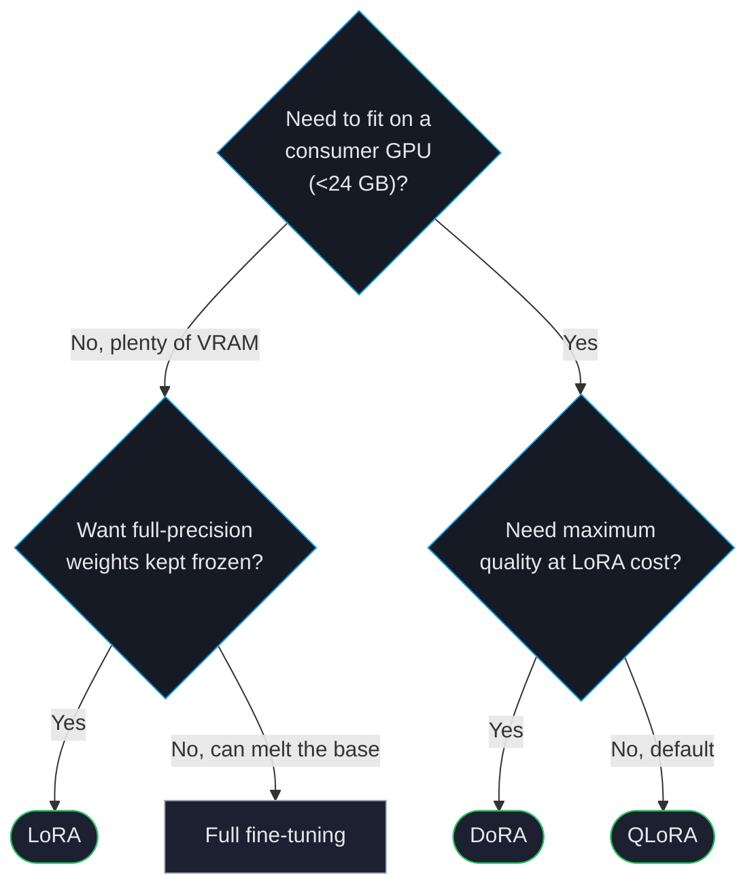

# LoRA, QLoRA, DoRA

Low-Rank Adaptation (LoRA) and its variants let you fine-tune large models on small GPUs. Instead of updating every weight, you train low-rank "adapter" matrices alongside the frozen base model — typically ~1% of the parameters, ~10% of the VRAM, and ~90-95% of the quality of full fine-tuning.

ForgeLM applies LoRA / QLoRA / DoRA to *every* trainer (SFT, DPO, SimPO, KTO, ORPO, GRPO) — it's a property of the optimiser, not the algorithm.

## When to use each variant



## Quick reference

| Variant | What changes | VRAM (relative to full) | When to use |
|---|---|---|---|
| **LoRA** | Adds low-rank matrices alongside attention/MLP weights | 30-40% | Default for full-precision base models. |
| **QLoRA** | LoRA + 4-bit NF4 quantisation of the base model | 10-15% | Default for consumer GPUs. |
| **DoRA** | LoRA decomposed into magnitude × direction | 35-45% | Highest quality at LoRA cost; ~5-10% slower. |
| **PiSSA** | LoRA initialised from the principal singular components | 30-40% | Faster convergence than LoRA on small datasets. |
| **rsLoRA** | LoRA with rank-stabilised scaling | 30-40% | More stable at high ranks (r ≥ 64). |

## Quick example

```yaml
model:
  name_or_path: "Qwen/Qwen2.5-7B-Instruct"
  load_in_4bit: true                    # enables QLoRA
  bnb_4bit_quant_type: "nf4"            # default; alternative is "fp4"
  bnb_4bit_compute_dtype: "bfloat16"

lora:
  r: 16                                  # rank — 8/16/32 typical
  alpha: 32                              # scaling — usually 2× rank
  dropout: 0.05
  use_dora: false                        # set true for DoRA
  target_modules: ["q_proj", "k_proj", "v_proj", "o_proj"]
  modules_to_save: []                    # extra modules trained at full precision

training:
  trainer: "sft"
  learning_rate: 2.0e-4                  # LoRA tolerates higher LR than full FT
```

## Choosing rank `r`

Rank is the single most important hyperparameter for LoRA quality.

| Rank | Trainable params (7B model) | When to use |
|---|---|---|
| 4 | 0.05% | Style transfer, format-only training. Cheap. |
| 8 | 0.1% | Domain adaptation; small dataset (<5K rows). |
| 16 | 0.2% | **Default.** Most use cases. |
| 32 | 0.4% | Larger datasets (50K+); harder tasks. |
| 64 | 0.8% | Approaching full fine-tune quality. |
| 128 | 1.5% | Diminishing returns; usually full FT is better. |

`alpha` typically scales with rank — a common rule is `alpha = 2 × r`.

## Target modules

LoRA only trains the modules you point it at. Defaults are reasonable for most architectures, but you can broaden or narrow the scope:

```yaml
lora:
  target_modules: "all-linear"          # broadest — every Linear layer
  # or specifically:
  target_modules: ["q_proj", "k_proj", "v_proj", "o_proj", "gate_proj", "up_proj", "down_proj"]
  # or just attention:
  target_modules: ["q_proj", "v_proj"]
```

Broader = more capacity but more VRAM. The default (Q/K/V/O projections) is the right balance for most tasks.

## DoRA — when it pays off

DoRA decomposes each weight into a magnitude vector and a direction matrix, training both with low rank. Empirical results: DoRA narrows the gap between LoRA and full fine-tuning, often matching full FT quality.

```yaml
lora:
  r: 16
  alpha: 32
  use_dora: true
```

Trade-off: ~5-10% slower training and ~10% more VRAM than plain LoRA. Use DoRA when:
- You'd otherwise need to step up to full fine-tuning.
- You're seeing LoRA underfit on a hard task.

## Common pitfalls

:::warn
**Setting `r` too high.** Rank 128 LoRA is roughly equivalent in compute and quality to a partial full fine-tune — and usually worse than picking a smaller model and doing full FT. If `r > 64` keeps coming up, reconsider the approach.
:::

:::warn
**Forgetting `modules_to_save` for embedding changes.** If you add new tokens to the tokeniser, the embedding and lm_head need full-precision training:
```yaml
lora:
  modules_to_save: ["embed_tokens", "lm_head"]
```
:::

:::warn
**Loading the wrong base for inference.** When you train QLoRA, the adapter is saved in full precision but the base remains 4-bit. At inference, you must either:
- Re-load the base in 4-bit and apply the adapter, or
- Merge the adapter into a full-precision base for serving.

ForgeLM's `forgelm export` does this correctly; if you're loading manually, watch for type mismatches.
:::

:::tip
**Save adapter only.** Default behaviour: ForgeLM saves only the adapter weights (~50-200 MB) plus a model card pointing at the base. To merge for deployment, run `forgelm export ./checkpoints/run --merge`.
:::

## See also

- [GaLore](#/training/galore) — full-parameter training in LoRA-level memory.
- [Configuration Reference](#/reference/configuration) — every LoRA/quantisation field.
- [Model Merging](#/deployment/model-merging) — combining multiple adapters.
