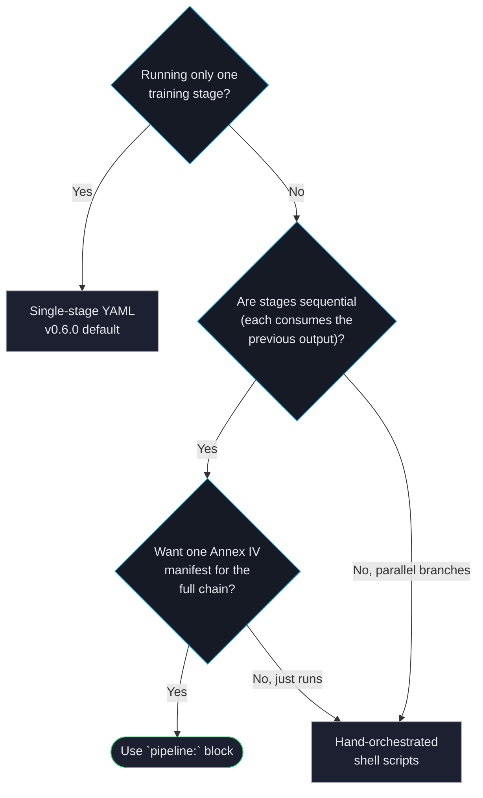

# Multi-Stage Pipelines

A *pipeline* chains 2 or more training stages into a single `forgelm` run. Each stage is a single-stage trainer from the trainer's point of view; only the orchestrator knows there's an outer loop. The output of stage N auto-chains as the input of stage N+1, every stage's compliance artefacts roll up into a chain-level manifest, and the operator only needs one CLI invocation to drive the whole flow.

The canonical chain is **SFT → DPO → GRPO**, but any sequence of supported trainers works (SFT, DPO, SimPO, KTO, ORPO, GRPO).

## When to use a pipeline



Use a `pipeline:` block when **all** of these apply:

- 2 or more sequential training stages (e.g. SFT then DPO).
- Each stage's input model is the previous stage's output.
- You want one Annex IV manifest covering the whole chain.

Don't use a `pipeline:` block if:

- Only one training paradigm is running. Single-stage configs (the v0.6.0 default) remain the canonical path and preserve their pre-Phase-14 behaviour byte-for-byte.
- The stage dependencies aren't linear (DAG-shaped pipelines). Phase 14 ships sequential pipelines only; the schema reserves headroom for a future DAG expansion.
- Parallel stage execution (concurrent independent branches) is needed. Same horizon as DAG support — Wave 2 or later.

## Minimal pipeline config

```yaml
# Root — defaults inherited by stages that don't override them.
model:
  name_or_path: "meta-llama/Llama-3-8B"
lora:
  r: 8
  alpha: 16
training:
  trainer_type: "sft"
  output_dir: "./placeholder"
data:
  dataset_name_or_path: "./placeholder.jsonl"

# The chain itself.
pipeline:
  output_dir: "./pipeline_run"
  stages:
    - name: sft_stage
      training:
        trainer_type: "sft"
        output_dir: "./pipeline_run/stage1_sft"
      data:
        dataset_name_or_path: "./data/sft.jsonl"

    - name: dpo_stage
      training:
        trainer_type: "dpo"
        output_dir: "./pipeline_run/stage2_dpo"
        dpo_beta: 0.1
      data:
        dataset_name_or_path: "./data/preferences.jsonl"

    - name: grpo_stage
      training:
        trainer_type: "grpo"
        output_dir: "./pipeline_run/stage3_grpo"
      data:
        dataset_name_or_path: "./data/math_prompts.jsonl"
```

Each stage's `model.name_or_path` is auto-set to the previous stage's `training.output_dir/final_model` — no hand-editing between stages.

## CLI surface

```bash
# Run the whole chain.
forgelm --config pipeline.yaml

# Validate every stage without GPU allocation — pytest --collectonly style.
forgelm --config pipeline.yaml --dry-run

# Re-run a single named stage in isolation (audit / re-run scenarios).
forgelm --config pipeline.yaml --stage dpo_stage

# Resume from a named stage after a crash; already-completed stages skip.
forgelm --config pipeline.yaml --resume-from dpo_stage

# Operator escape hatch: override the auto-chained input model.
forgelm --config pipeline.yaml --stage dpo_stage --input-model ./other/checkpoint

# Verify the chain-level Annex IV manifest of a finished run.
forgelm verify-annex-iv --pipeline ./pipeline_run
```

## What the orchestrator gives you

- **Auto-chaining**: stage N's `model.name_or_path` is automatically set to stage N-1's `training.output_dir/final_model`.
- **Crash-safe state**: every transition writes `pipeline_state.json` atomically (tmp + rename). `--resume-from` picks up where the chain stopped.
- **Per-stage gates**: auto-revert (eval regression), human approval, and safety eval compose per stage. A failed gate stops the chain; downstream stages skip with `skipped_due_to_prior_revert`.
- **Audit events**: 7 new event names cover every transition — `pipeline.started`, `pipeline.stage_started`, `pipeline.stage_completed`, `pipeline.stage_gated`, `pipeline.stage_reverted`, `pipeline.force_resume`, `pipeline.completed`. Every entry carries the same top-level `run_id` so SIEM-style grouping works on a single field.
- **Annex IV at chain level**: `compliance/pipeline_manifest.json` indexes every per-stage `training_manifest.json` into one verifiable artefact, hashed and timestamped.
- **Webhook integration**: `notify_pipeline_started`, `notify_pipeline_completed`, `notify_pipeline_reverted` fire alongside the existing per-stage `training.*` notifications — pre-existing Slack/Teams dashboards keep working unchanged.

## Inheritance matrix at a glance

| Block | Stage may override? | If stage omits it |
|---|---|---|
| `model` | Yes (wholesale) | Auto-chained from prev stage; root for stage 0 |
| `lora` | Yes (wholesale) | Inherited from root |
| `training` | **`trainer_type` required per stage** | Inherited from root |
| `data` | Yes (recommended per stage) | Inherited from root |
| `evaluation` | Yes (wholesale) | Inherited from root |
| `distributed`, `webhook`, `compliance`, `risk_assessment`, `monitoring`, `retention`, `synthetic`, `merge`, `auth` | **Root-only** — rejected per-stage | Inherited from root |

Section-wholesale semantics: if a stage names a block it *replaces* root's entirely (no deep-merge). The "trainer_type required per stage" rule is an audit-clarity validator; it ensures every stage records which paradigm it ran.

## Limitations (Phase 14 Wave 1)

- No intra-stage checkpoint resume — `--resume-from` works at stage boundaries only.
- Sequential only; no DAG / parallel stage execution.
- No multi-process locking on `pipeline.output_dir` — pick distinct dirs per concurrent run.
- Wizard (CLI + web) does **not** emit `pipeline:` blocks yet; hand-author the YAML or copy the template from `config_template.yaml`. Wizard pipeline support is a future-phase feature.

## See also

- [Multi-Stage Pipelines — operator guide](../../../guides/pipeline.md) — full walkthrough with the 6 design fixtures.
- [Choosing a Trainer](../concepts/choosing-trainer.md) — when to pick which trainer; pipelines come after the per-trainer choice.
- [Annex IV Compliance](../compliance/annex-iv.md) — the per-stage manifest format the chain-level manifest indexes.
