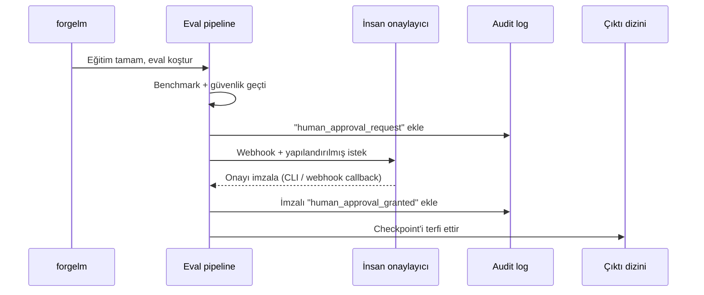

# İnsan Gözetimi

EU AI Act Madde 14, yüksek-riskli AI sistemlerinin insan gözetimi imkânı sağlamasını gerektirir. ForgeLM bunu opsiyonel bir config kapısı olarak uygular: `compliance.human_approval: true` olduğunda model terfisi bir insan onay imzalayana kadar engellenir.

## Kapı nasıl çalışır



İmza olmadan checkpoint "pending" durumda kalır ve koşu exit kodu 4 (bekleme) ile çıkar. Bu bir *başarısızlık değil* — inceleme için kontrollü bir bekletme.

## Konfigürasyon

```yaml
compliance:
  human_approval: true
  approval:
    request_webhook: "${SLACK_WEBHOOK}"      # opsiyonel bildirim
    signature_method: "cli"                   # cli | webhook | api
    timeout_hours: 48                         # sonra otomatik fail
    require_role: "ml-compliance-lead"        # kim onaylayabilir
    quorum: 1                                 # gerekli onaylayıcı sayısı
```

## İmza yöntemleri

### CLI (varsayılan)

Trainer eval'den sonra durur ve yazdırır:

```text
[2026-04-29 14:33:10] İnsan onayı gerekli.
  Run ID: abc123
  Bundle: checkpoints/run/artifacts/

  Onaylamak için: forgelm approve abc123 --output-dir checkpoints/run --comment "..."
  Reddetmek için: forgelm reject  abc123 --output-dir checkpoints/run --comment "..."
```

Reviewer artifacts dizinine erişimi olan herhangi bir makineden onay komutunu çalıştırır. ForgeLM SSH key signing veya env-set token üzerinden kimliği doğrular, audit log'u imzalar ve terfiyi sürdürür.

### Webhook callback

Dahili onay sistemleriyle entegrasyon için:

```yaml
approval:
  signature_method: "webhook"
  webhook_url: "https://internal.example/approvals/{run_id}/decide"
```

Trainer durur ve artifact paketini webhook'unuza POST'lar. Sisteminiz insan incelemesini halleder ve imzalı JWT ile ForgeLM'in resume endpoint'ine geri POST'lar.

### API

Self-servis otomasyon için (ör. dashboard'unuzda "bu koşuyu terfi ettir" düğmesi):

```yaml
approval:
  signature_method: "api"
  resume_token: "${FORGELM_RESUME_TOKEN}"
```

Dashboard'unuz doğrudan ForgeLM'in resume endpoint'ini koşu ID'si ve reviewer kimliğiyle çağırır. İmzalar audit log'a kaydedilir.

## Onay imzasında ne var

Her onay (veya red) `audit_log.jsonl`'a eklenir:

```json
{
  "ts": "2026-04-29T15:18:42Z",
  "seq": 87,
  "event": "human_approval_granted",
  "run_id": "abc123",
  "reviewer": "Cemil Ilik <cemil@example>",
  "role": "ml-compliance-lead",
  "method": "cli",
  "signature": "ed25519:...",
  "comment": "Güvenlik raporunu inceledim; bu deployment için S5 max 0.04 kabul edilebilir.",
  "artifact_hash": "sha256:..."
}
```

`signature` artifact paketinin `manifest.json` hash'i üzerine — reviewer'ın *tam olarak* üretileni gördüğünü tasdik eder.

## Quorum (çoklu reviewer)

Yüksek-riskli deployment'lar için birden çok onaylayıcı isteyin:

```yaml
approval:
  quorum: 2
  require_role: "ml-compliance-lead"
```

Her onaylayıcı CLI komutunu bağımsız çalıştırır. Quorum imzaladıktan (veya biri reddettikten) sonra terfi olur.

## Timeout

`timeout_hours` sonrası imzasız koşu yapılandırılmış olayla exit 4 + auto-fail:

```json
{"event": "human_approval_timeout", "expired_at": "2026-04-30T14:33:10Z"}
```

Varsayılan 48 saat. "Timeout yok — sonsuza kadar bekle" için 0 (CI'da önerilmez).

## Bekleyen koşuları inceleme

```shell
$ forgelm approvals --pending
RUN_ID    REQUESTED_AT          ARTIFACTS                                EXPIRES
abc123    2026-04-29T14:33Z     checkpoints/run/artifacts/                47s sonra
def456    2026-04-29T09:12Z     checkpoints/sft-only/artifacts/           42s sonra
```

```shell
$ forgelm approvals --show abc123
... audit, benchmark'lar, güvenlik, model card dahil tam artifact özeti ...
```

## Sık hatalar

:::warn
**"Pipeline'ı açmak için" CI'da otomatik onaylamak.** İnsan gözetimi amacını yok eder. Kapı yolunuzdaysa ya aşırı kullanıyorsunuz (yüksek-riskli olmayan koşularda kapatın) ya da reviewer'ları yetersiz.
:::

:::warn
**Reviewer'ın kaşeleyici olması.** İmza bilgilendirilmiş olmalı. Reviewer'ın gerçekten ne için imzaladığını görmesi için onay akışında tam artifact özetini gösterin.
:::

:::warn
**Üretim kararları için quorum yok.** Yüksek-riskli üretim deployment'ları için tek-reviewer onayı yetersizdir. Her zaman quorum >= 2 isteyin.
:::

:::tip
**Onay CLI'sını erişilebilir yapın.** Reviewer'lar onay vermek için eğitim host'una SSH'lamak zorunda kalmamalı. Artifacts dizinini paylaşımlı depolamada kurun, reviewer'lar `forgelm approve`'u kendi makinelerinden çalıştırsın.
:::

## Bkz.

- [Audit Log](#/compliance/audit-log) — imzaların kaydedildiği yer.
- [Annex IV](#/compliance/annex-iv) — Bölüm 7 beyanı insanlar tarafından imzalanır, toolkit tarafından değil.
- [Webhook'lar](#/operations/webhooks) — onay istekleri Slack/Teams uyarıları fırlatabilir.
