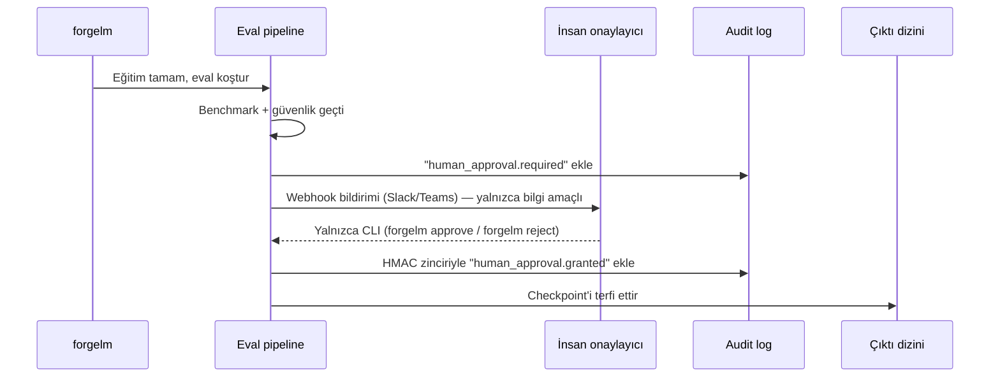

# İnsan Gözetimi

EU AI Act Madde 14, yüksek-riskli AI sistemlerinin insan gözetimi imkânı sağlamasını gerektirir. ForgeLM bunu opsiyonel bir config kapısı olarak uygular: `evaluation.require_human_approval: true` olduğunda model terfisi bir insan onay imzalayana kadar engellenir.

## Kapı nasıl çalışır



İmza olmadan checkpoint "pending" durumda kalır ve koşu exit kodu 4 (bekleme) ile çıkar. Bu bir *başarısızlık değil* — inceleme için kontrollü bir bekletme.

## Konfigürasyon

```yaml
evaluation:
  require_human_approval: true              # canonical activation key — Article 14 gate

webhook:
  url_env: SLACK_WEBHOOK_URL                # optional: notifier fires `approval.required`
  notify_on_success: true                   # this gate is dispatched on the success channel
```

`compliance.human_approval` alanı, `approval.*` bloğu, `signature_method`, `timeout_hours`, `require_role`, `quorum` veya `webhook_url` callback knob'u **yoktur** — bu adlar eski doc taslaklarında geçiyordu ama `forgelm/config.py`'da hiç ship olmadı. Kanonik aktivasyon anahtarı `evaluation.require_human_approval` (düz `bool`); reviewer kimliği `forgelm approve` / `forgelm reject` zamanında `FORGELM_OPERATOR`'dan kaydedilir; audit zinciri HMAC kullanır (ed25519 değil); ve yerleşik timeout yoktur — staged koşum bir operatör karar verene kadar süresiz bekler.

## Onay mekanizması

### CLI (tek yol)

Trainer eval'den sonra durur ve yazdırır:

```text
[2026-04-29 14:33:10] Human approval required.
  Run ID: abc123
  Bundle: checkpoints/run/artifacts/

  To approve: forgelm approve abc123 --output-dir checkpoints/run --comment "..."
  To reject:  forgelm reject  abc123 --output-dir checkpoints/run --comment "..."
```

Reviewer audit-log + staging dizinine erişimi olan herhangi bir makineden onay komutunu çalıştırır. ForgeLM kimliği `FORGELM_OPERATOR`'dan resolve eder, kararı HMAC ile zincirler ve (`approve`'da) staging dizinini kanonik `final_model/` yoluna rename eder.

### CLI subcommand çifti

Desteklenen onay mekanizması CLI subcommand çifti `forgelm approve` / `forgelm reject`'tir. Webhook-callback varyantı yoktur — ForgeLM bir approval-resume HTTP endpoint'i sunmaz ve JWT-tabanlı external-approver yolu yoktur.

```bash
forgelm approvals --pending --output-dir <dir>            # onay bekleyen koşumları listele
forgelm approve  <run-id> --output-dir <dir> --comment "..."  # staging → final_model'e promote
forgelm reject   <run-id> --output-dir <dir> --comment "..."  # staged modeli at
```

**Not:** `approve` ve `reject` positional `run_id` alır (`--run-id`
flag'i yoktur); `--comment "..."` reviewer notunu
`human_approval.granted` / `human_approval.rejected` event'ına yazar.
`--output-dir <dir>` zorunludur ve `audit_log.jsonl` +
`final_model.staging/` içeren training output dizinini gösterir.

Her çağrı `FORGELM_OPERATOR` (onaylayanın kimliği) gerektirir ve zincire `human_approval.granted` / `human_approval.rejected` olayı yazar. Self-servis "bu koşuyu terfi ettir" otomasyonu v0.6.0+ Pro CLI (public roadmap'te Phase 13) için planlanmıştır; o zamana kadar CLI gate audit-grade arayüzdür.

## Onay imzasında ne var

Her onay (veya red) `audit_log.jsonl`'a eklenir:

```json
{
  "ts": "2026-04-29T15:18:42Z",
  "seq": 87,
  "event": "human_approval.granted",
  "run_id": "abc123",
  "approver": "ci-reviewer@example",
  "comment": "Güvenlik raporunu inceledim; bu deployment için max_safety_regression 0.04 kabul edilebilir.",
  "_hmac": "..."
}
```

`approver` alanı `forgelm approve` zamanında `FORGELM_OPERATOR`'dan gelir; `_hmac` per-line zincir HMAC'idir (her audit event için kullanılan aynı HMAC). Ayrı bir ed25519 artefact imzası yoktur.

## Çoklu reviewer

ForgeLM yerleşik bir quorum gate'i **göndermez**. `approval.quorum` alanı yoktur. N-of-M sign-off zorlamak için bunu CI / IdP seviyesinde katmanlandırın — ör. GitHub branch-protection kuralı ile `forgelm approve`'u çağıran workflow çalışmadan önce N reviewer-team approval'ı gerektirin.

## Timeout

ForgeLM staged koşumları **timeout etmez**. `approval.timeout_hours`, `human_approval.timeout` event'i veya auto-fail saati yoktur. Staged koşum süresiz bekler; deployer eski staging dizinlerinin sona ermesini istiyorsa bunun yerine `retention.staging_ttl_days`'i konfigüre edin — bu GDPR Madde 17 retention pipeline'ına bağlanır (yapılandırılan horizon'dan sonra dizini fiziksel olarak prune eder, approval gate'e değil).

## Bekleyen koşuları inceleme

`forgelm approvals`, `approve` / `reject` komutlarının tamamlayıcısıdır: `--output-dir` altındaki audit log'u tarar ve `human_approval.required` event'i için terminal kararı (granted/rejected) bulunmayan tüm koşuları raporlar.

```shell
$ forgelm approvals --pending --output-dir checkpoints/
Pending approvals (2):

RUN_ID            AGE   REQUESTED_AT               STAGING
----------------  ----  -------------------------  -------
fg-abc123def456   3h    2026-04-30T11:33:10+00:00  present
fg-def456abc789   1d    2026-04-29T14:12:55+00:00  present
```

`--output-format json` yapısal bir zarf döner (`{"success": true, "pending": [...], "count": 2}`); CI bu çıktıyla kuyruğu programatik olarak filtreleyebilir.

```shell
$ forgelm approvals --show fg-abc123def456 --output-dir checkpoints/
Run: fg-abc123def456
Status: pending

Audit chain (oldest first):
  [2026-04-30T11:33:10+00:00] human_approval.required — require_human_approval=true

Staging contents (4 entries):
  - adapter_config.json
  - adapter_model.safetensors
  - tokenizer.json
  - tokenizer_config.json
```

Granted / rejected bir koşu üzerinde `--show` çalıştırıldığında tam zaman çizelgesi (talep → karar) ve son onaylayan + yorum yazdırılır. Bilinmeyen bir `run_id` üzerinde `--show` net bir hata mesajıyla 1 koduyla çıkar.

## Sık hatalar

:::warn
**"Pipeline'ı açmak için" CI'da otomatik onaylamak.** İnsan gözetimi amacını yok eder. Kapı yolunuzdaysa ya aşırı kullanıyorsunuz (yüksek-riskli olmayan koşularda kapatın) ya da reviewer'ları yetersiz.
:::

:::warn
**Reviewer'ın kaşeleyici olması.** İmza bilgilendirilmiş olmalı. Reviewer'ın gerçekten ne için imzaladığını görmesi için onay akışında tam artifact özetini gösterin.
:::

:::warn
**Üretim kararları için quorum yok.** Yüksek-riskli üretim deployment'ları için tek-reviewer onayı yetersizdir. Her zaman quorum >= 2 isteyin.
:::

:::tip
**Onay CLI'sını erişilebilir yapın.** Reviewer'lar onay vermek için eğitim host'una SSH'lamak zorunda kalmamalı. Artifacts dizinini paylaşımlı depolamada kurun, reviewer'lar `forgelm approve`'u kendi makinelerinden çalıştırsın.
:::

## Bkz.

- [Audit Log](#/compliance/audit-log) — imzaların kaydedildiği yer.
- [Annex IV](#/compliance/annex-iv) — Bölüm 7 beyanı insanlar tarafından imzalanır, toolkit tarafından değil.
- [Webhook'lar](#/operations/webhooks) — onay istekleri Slack/Teams uyarıları fırlatabilir.
