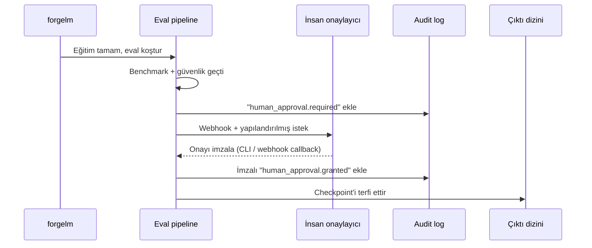

# İnsan Gözetimi

EU AI Act Madde 14, yüksek-riskli AI sistemlerinin insan gözetimi imkânı sağlamasını gerektirir. ForgeLM bunu opsiyonel bir config kapısı olarak uygular: `compliance.human_approval: true` olduğunda model terfisi bir insan onay imzalayana kadar engellenir.

## Kapı nasıl çalışır



İmza olmadan checkpoint "pending" durumda kalır ve koşu exit kodu 4 (bekleme) ile çıkar. Bu bir *başarısızlık değil* — inceleme için kontrollü bir bekletme.

## Konfigürasyon

```yaml
compliance:
  human_approval: true
  approval:
    request_webhook: "${SLACK_WEBHOOK}"      # opsiyonel bildirim
    signature_method: "cli"                   # cli | webhook | api
    timeout_hours: 48                         # sonra otomatik fail
    require_role: "ml-compliance-lead"        # kim onaylayabilir
    quorum: 1                                 # gerekli onaylayıcı sayısı
```

## İmza yöntemleri

### CLI (varsayılan)

Trainer eval'den sonra durur ve yazdırır:

```text
[2026-04-29 14:33:10] İnsan onayı gerekli.
  Run ID: abc123
  Bundle: checkpoints/run/artifacts/

  Onaylamak için: forgelm approve abc123 --output-dir checkpoints/run --comment "..."
  Reddetmek için: forgelm reject abc123 --output-dir checkpoints/run --comment "..."
```

Reviewer artifacts dizinine erişimi olan herhangi bir makineden onay komutunu çalıştırır. ForgeLM SSH key signing veya env-set token üzerinden kimliği doğrular, audit log'u imzalar ve terfiyi sürdürür.

### Webhook callback

Dahili onay sistemleriyle entegrasyon için:

```yaml
approval:
  signature_method: "webhook"
  webhook_url: "https://internal.example/approvals/{run_id}/decide"
```

Trainer durur ve artifact paketini webhook'unuza POST'lar. Sisteminiz insan incelemesini halleder ve imzalı JWT ile ForgeLM'in resume endpoint'ine geri POST'lar.

### CLI subcommand (canonical)

v0.5.5'te desteklenen onay mekanizması CLI subcommand çifti `forgelm approve` / `forgelm reject`:

```bash
forgelm approvals --pending --output-dir <dir>            # onay bekleyen koşumları listele
forgelm approve  <run-id> --output-dir <dir> --comment "..."  # staging → final_model'e promote
forgelm reject   <run-id> --output-dir <dir> --comment "..."  # staged modeli at
```

**Not:** `approve` ve `reject` positional `run_id` alır (`--run-id`
flag'i yoktur); `--comment "..."` reviewer notunu
`human_approval.granted` / `human_approval.rejected` event'ına yazar.
`--output-dir <dir>` zorunludur ve `audit_log.jsonl` +
`final_model.staging/` içeren training output dizinini gösterir.

Her çağrı `FORGELM_OPERATOR` (onaylayanın kimliği) gerektirir ve zincire `human_approval.granted` / `human_approval.rejected` olayı yazar. Self-servis "bu koşuyu terfi ettir" otomasyonu v0.6.0+ Pro CLI (public roadmap'te Phase 13) için planlanmıştır; o zamana kadar CLI gate audit-grade arayüzdür.

## Onay imzasında ne var

Her onay (veya red) `audit_log.jsonl`'a eklenir:

```json
{
  "ts": "2026-04-29T15:18:42Z",
  "seq": 87,
  "event": "human_approval.granted",
  "run_id": "abc123",
  "reviewer": "Cemil Ilik <cemil@example>",
  "role": "ml-compliance-lead",
  "method": "cli",
  "signature": "ed25519:...",
  "comment": "Güvenlik raporunu inceledim; bu deployment için S5 max 0.04 kabul edilebilir.",
  "artifact_hash": "sha256:..."
}
```

`signature` artifact paketinin `manifest.json` hash'i üzerine — reviewer'ın *tam olarak* üretileni gördüğünü tasdik eder.

## Quorum (çoklu reviewer)

Yüksek-riskli deployment'lar için birden çok onaylayıcı isteyin:

```yaml
approval:
  quorum: 2
  require_role: "ml-compliance-lead"
```

Her onaylayıcı CLI komutunu bağımsız çalıştırır. Quorum imzaladıktan (veya biri reddettikten) sonra terfi olur.

## Timeout

`timeout_hours` sonrası imzasız koşu yapılandırılmış olayla exit 4 + auto-fail:

```json
{"event": "human_approval.timeout", "expired_at": "2026-04-30T14:33:10Z"}
```

Varsayılan 48 saat. "Timeout yok — sonsuza kadar bekle" için 0 (CI'da önerilmez).

## Bekleyen koşuları inceleme

`forgelm approvals`, `approve` / `reject` komutlarının tamamlayıcısıdır: `--output-dir` altındaki audit log'u tarar ve `human_approval.required` event'i için terminal kararı (granted/rejected) bulunmayan tüm koşuları raporlar.

```shell
$ forgelm approvals --pending --output-dir checkpoints/
Pending approvals (2):

RUN_ID            AGE   REQUESTED_AT               STAGING
----------------  ----  -------------------------  -------
fg-abc123def456   3h    2026-04-30T11:33:10+00:00  present
fg-def456abc789   1d    2026-04-29T14:12:55+00:00  present
```

`--output-format json` yapısal bir zarf döner (`{"success": true, "pending": [...], "count": 2}`); CI bu çıktıyla kuyruğu programatik olarak filtreleyebilir.

```shell
$ forgelm approvals --show fg-abc123def456 --output-dir checkpoints/
Run: fg-abc123def456
Status: pending

Audit chain (oldest first):
  [2026-04-30T11:33:10+00:00] human_approval.required — require_human_approval=true

Staging contents (4 entries):
  - adapter_config.json
  - adapter_model.safetensors
  - tokenizer.json
  - tokenizer_config.json
```

Granted / rejected bir koşu üzerinde `--show` çalıştırıldığında tam zaman çizelgesi (talep → karar) ve son onaylayan + yorum yazdırılır. Bilinmeyen bir `run_id` üzerinde `--show` net bir hata mesajıyla 1 koduyla çıkar.

## Sık hatalar

:::warn
**"Pipeline'ı açmak için" CI'da otomatik onaylamak.** İnsan gözetimi amacını yok eder. Kapı yolunuzdaysa ya aşırı kullanıyorsunuz (yüksek-riskli olmayan koşularda kapatın) ya da reviewer'ları yetersiz.
:::

:::warn
**Reviewer'ın kaşeleyici olması.** İmza bilgilendirilmiş olmalı. Reviewer'ın gerçekten ne için imzaladığını görmesi için onay akışında tam artifact özetini gösterin.
:::

:::warn
**Üretim kararları için quorum yok.** Yüksek-riskli üretim deployment'ları için tek-reviewer onayı yetersizdir. Her zaman quorum >= 2 isteyin.
:::

:::tip
**Onay CLI'sını erişilebilir yapın.** Reviewer'lar onay vermek için eğitim host'una SSH'lamak zorunda kalmamalı. Artifacts dizinini paylaşımlı depolamada kurun, reviewer'lar `forgelm approve`'u kendi makinelerinden çalıştırsın.
:::

## Bkz.

- [Audit Log](#/compliance/audit-log) — imzaların kaydedildiği yer.
- [Annex IV](#/compliance/annex-iv) — Bölüm 7 beyanı insanlar tarafından imzalanır, toolkit tarafından değil.
- [Webhook'lar](#/operations/webhooks) — onay istekleri Slack/Teams uyarıları fırlatabilir.
