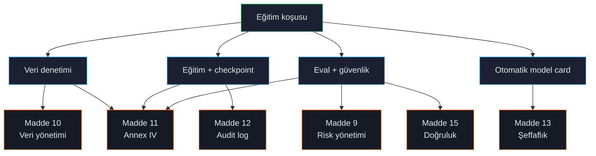

# Uyumluluk Genel Bakış

ForgeLM, eğitim hatlarını sadece bir CTO'ya değil, bir regülatöre savunması gereken ekipler için yapıldı. Her başarılı (veya başarısız) koşu, EU AI Act Madde 9-17'ye, GDPR Madde 5'e ve ISO 27001 kontrol hedeflerine temiz şekilde eşlenen yapılandırılmış bir kanıt paketi üretir.



## Üretilen şeyler

`compliance.annex_iv: true` olan her koşu artifacts dizini üretir:

```text
checkpoints/run/artifacts/
├── annex_iv.json                  ← Madde 11 — teknik dokümantasyon
├── audit_log.jsonl                ← Madde 12 — append-only event log
├── data_audit_report.json         ← Madde 10 — veri yönetimi kanıtı
├── safety_report.json             ← Madde 9 + 15 — risk + güvenlik
├── benchmark_results.json         ← Madde 15 — doğruluk
├── conformity_declaration.md      ← Madde 16 — beyan iskeleti
└── manifest.json                  ← Yukarıdaki her artifact üzerinde SHA-256
```

Bu paket compliance incelemeleri için teslim edilebilir. İçindeki her dosya `manifest.json`'da tamper-evidence için hashlenmiştir.

## ForgeLM'in karşıladığı maddeler

| Madde | Konu | ForgeLM nasıl |
|---|---|---|
| **9** | Risk yönetimi | Otomatik geri alma + eşik kapıları + trend izleme. |
| **10** | Veri yönetimi | `forgelm audit` veri seti başına yönetişim kanıtı üretir. |
| **11** | Teknik dokümantasyon | `annex_iv.json` dolu Annex IV. |
| **12** | Kayıt tutma | Eğitim başlangıcı, eval kapıları, geri alma kararlarını kapsayan append-only `audit_log.jsonl`. |
| **13** | Şeffaflık | Otomatik üretilen model card; yetenekleri, sınırları, eğitim özetini listeler. |
| **14** | İnsan gözetimi | Opsiyonel `compliance.human_approval: true` insan imzalayana kadar terfi engeller. |
| **15** | Doğruluk ve sağlamlık | Benchmark kapıları + güvenlik eval + cybersec (ingest'te PII / sırlar). |
| **16-17** | Uygunluk ve QMS | Beyan iskeleti + `docs/qms/`'deki QMS SOP'ları. |

Tam kod referansları için [Compliance özeti](../../../reference/compliance_summary.md).

## ForgeLM'in iddia *etmediği*

:::warn
ForgeLM Annex IV tarzı teknik dokümantasyon **üretir**. Sisteminizi AI Act kapsamında bir yüksek-riskli AI sistemi olarak **sertifikalandırmaz** — bu, herhangi bir toolkit'in kapsamı dışındaki bir notified-body veya öz-değerlendirme faaliyetidir.

Audit log konvansiyonel olarak append-only ve SHA-256-anchored. Gerçek tamper-evidence için log'u ayrı, write-once depoya (S3 Object Lock, ledger DB) göndermeniz gerekir. Toolkit artifact'ı üretebilir; chain-of-custody operasyonel sorumluluğunuzdur.

PII / sırlar regex setleri tasarım gereği muhafazakar — false-negative'ları false-positive'lara tercih eder. Yüksek riskli corpus için manuel inceleme ile birlikte kullanın.
:::

## Compliance artifact'larını etkinleştir

YAML'da:

```yaml
compliance:
  annex_iv: true
  data_audit_artifact: "./audit/data_audit_report.json"
  human_approval: true                # opsiyonel Madde 14 kapısı
  intended_purpose: "Türk telekom için müşteri-destek asistanı"
  risk_classification: "high-risk"
  deployment_geographies: ["TR", "EU"]
  responsible_party: "Acme Corp <compliance@acme.example>"
```

`compliance:` bloğundan her alan `annex_iv.json`'a akar. Gerekli alanlar config yüklenirken doğrulanır — eksik bir `intended_purpose` `--dry-run`'ı fail eder.

## Annex IV neyi içerir

Annex IV artefact'ının sekiz bölümü vardır; tamamı otomatik doldurulur:

1. **Genel açıklama** — model adı, kullanım amacı, dağıtım coğrafyası.
2. **Detaylı sistem açıklaması** — base model, eğitim paradigması, veri seti özeti.
3. **İzleme** — eval eşikleri, otomatik geri alma tetikleyicileri, trend takibi.
4. **Risk yönetimi** — risk sınıflandırması, azaltıcı önlemler, kalan riskler.
5. **Yaşam döngüsü** — eğitim tarihi, sürüm, kaynak verisine referanslar.
6. **Standartlar** — listelenen uyumluluk çerçeveleri (EU AI Act, GDPR, ISO 27001).
7. **Uyumluluk beyanı** — iskelet; nihai beyan insan imzası gerektirir.
8. **Pazar-sonrası izleme planı** — dağıtılmış gözetim config'ine işaretçi.

Tam şema için bkz. [Annex IV](#/compliance/annex-iv).

## Operasyonel sorumluluklar (siz, ForgeLM değil)

Toolkit kanıt üretir; insanlar sertifikasyonu üretir. Ekibiniz şunlardan sorumlu:

- Üretime giden her koşunun audit paketini incelemek.
- Audit log'u tamper-evidence için write-once depoya göndermek.
- Gerektiğinde notified-body ile uygunluk değerlendirmesi yapmak.
- Model deploy edildikten sonra post-market monitoring'i sürdürmek.
- Veri sahibi taleplerini (GDPR Madde 15-22) ele almak.

`docs/qms/`'deki ForgeLM QMS SOP'ları operasyonel tarafı kapsar.

## Bkz.

- [Annex IV](#/compliance/annex-iv) — Madde 11 artifact spec.
- [Audit Log](#/compliance/audit-log) — Madde 12.
- [İnsan Gözetimi](#/compliance/human-oversight) — Madde 14.
- [Model Card](#/compliance/model-card) — Madde 13.
- [GDPR / KVKK](#/compliance/gdpr).
