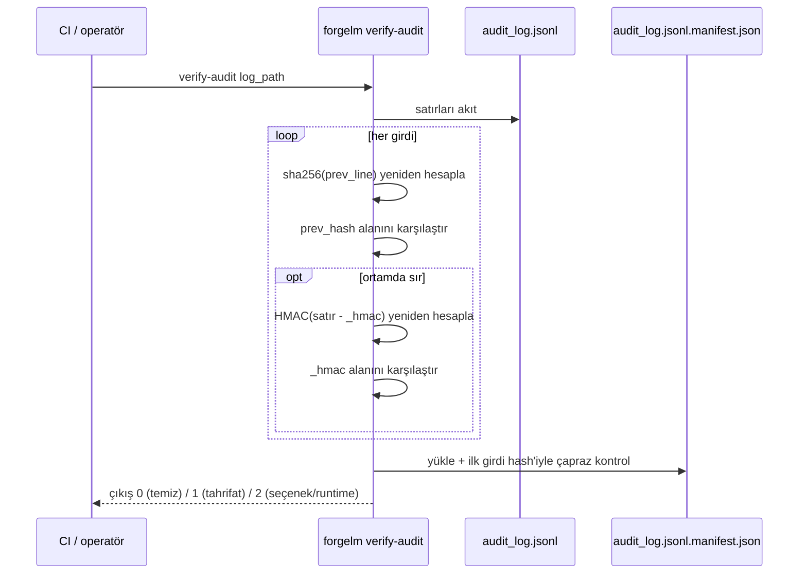

# Audit Log Doğrulama

`forgelm verify-audit`, Madde 12 kayıt-tutma log'unun salt-okunur doğrulayıcısıdır. Eğitim koşunuzun ürettiği `audit_log.jsonl`'un yapısal olarak bütün olduğunu kontrol eder: SHA-256 hash zinciri satır satır doğru ilerliyor, genesis manifest sidecar (varsa) ilk girdiyi çapraz kontrol ediyor ve — ortamda bir operatör sırrı varsa — satır başına HMAC etiketleri yetkilendiriyor. CI pipeline'ları, audit log'u kanıt sayma kararını veren eğitim sonrası adıma bunu bağlar.

## Ne zaman kullanılır

- **Düzenleyiciye veya denetçiye bir audit paketi sunmadan önce.** Temiz bir `verify-audit` çıktısı göndermeniz gereken minimum bütünlük kanıtıdır.
- **CI/CD yayın kapılarında.** Her eğitim pipeline'ından sonra çalıştırın; çıkış `1`'de yayını başarısız sayın.
- **Log'u makineler arasında taşıdıktan sonra.** Aktarımda oluşan herhangi bir bayt-seviyesi bozulma zincir kopması olarak ortaya çıkar.
- **Periyodik uyumluluk taramasının parçası olarak.** Geçmiş log'lar üzerinde gece çalışan bir cron, sessiz tahrifatları erken yakalar.

## Nasıl çalışır



## Hızlı başlangıç

```shell
$ forgelm verify-audit checkpoints/run/compliance/audit_log.jsonl
OK: 87 entries verified
```

HMAC ile yetkilendirilmiş log'lar için önce operatör sırrını set edin:

```shell
$ FORGELM_AUDIT_SECRET="$(cat /run/secrets/audit-secret)" \
    forgelm verify-audit checkpoints/run/compliance/audit_log.jsonl
OK: 87 entries verified (HMAC validated)
```

## Ayrıntılı kullanım

### Regüle CI için sıkı mod

Her kaydın HMAC ile yetkilendirilmiş olması gerektiğinde (kurumsal denetim profili) `--require-hmac`'i geçirin:

```shell
$ FORGELM_AUDIT_SECRET="$(cat /run/secrets/audit-secret)" \
    forgelm verify-audit --require-hmac \
        checkpoints/run/compliance/audit_log.jsonl
```

Sıkı mod iki güvenlik ağını birden devreye sokar:

- Yapılandırılmış env var set değilse, çıkış `2` (seçenek hatası). Pipeline'ı çalıştırmadan önce sırrı yüklemeyi unutan operatörü yakalar.
- Herhangi bir satırda `_hmac` alanı eksikse, çıkış `1` (zincir hatası). HMAC'in koşu ortasında kapatıldığı karışık-mod log'larını yakalar.

### Varsayılan olmayan bir sır değişkenini adlandırma

Çok-kiracılı CI için her kiracının kendi sır env adı vardır:

```shell
$ TENANT_ACME_AUDIT_KEY="$(cat /run/secrets/acme-audit)" \
    forgelm verify-audit --hmac-secret-env TENANT_ACME_AUDIT_KEY \
        artifacts/acme/audit_log.jsonl
```

Değişken adı yapılandırılabilir; varsayılan `FORGELM_AUDIT_SECRET`'tir.

### Hata çıktısını okuma

Bir zincir kopması 1-tabanlı satır numarasını yazar:

```text
FAIL at line 53: prev_hash mismatch — chain break suggests entry was inserted, removed, or reordered
```

Satır numarası olmayan çıplak bir neden, hatanın zincir yürüyüşünden önce meydana geldiğini gösterir (örn. eksik genesis manifest, satır 1'de JSON çözüm hatası):

```text
FAIL: manifest present but unreadable at 'checkpoints/run/compliance/audit_log.jsonl.manifest.json': …
```

Her iki durumda da çıkış kodu `1`'dir. Log'u kanıt saymadan önce inceleyin.

### Çıkış-kodu özeti

| Kod | Anlam |
|---|---|
| `0` | Zincir (ve doğrulandığında HMAC etiketleri) uçtan uca bütün. |
| `1` | Tahrifat / bozulma tespit edildi. |
| `2` | Seçenek hatası (`--require-hmac` sırsız) ya da dosya bulunamadı / okunamadı. |

## Sık hatalar

:::warn
**HMAC doğrulamasını "zincir hash'i yeter" diyerek atlamak.** Zincir hash'i tek-satırlık düzenlemelere ve yeniden sıralamaya karşı savunur; ancak yazma erişimine sahip kararlı bir saldırgan tüm zinciri uçtan uca yeniden yazabilir. HMAC etiketleri çıtayı "operatör sırrını da taklit etmek lazım" seviyesine çıkarır; sır bir HSM'de yaşıyorsa anlamlıdır.
:::

:::warn
**`verify-audit`'i, log'u yazan ana makinede ayrı bir sır olmadan çalıştırmak.** Saldırganın hem yazma erişimi hem HMAC sırrı varsa HMAC ek bir savunma katmaz. Log'u, sırrı emanet altında tutan ayrı bir doğrulayıcı host'a gönderin.
:::

:::warn
**Eksik `<log>.manifest.json`'u zararsız saymak.** Genesis manifest, kesme-ve-devam ettirme tespitçisidir. Uzun-süreli bir deployment'ta eksikse, saldırgan log'u zincir kopması görünmeden "yalnız genesis"e geri sarmış olabilir. Eğitim sonrası artifact paketinizde manifest'in mevcut olduğunu doğrulayın.
:::

:::tip
**Doğrulayıcıyı CI'da herhangi bir sunum adımından önce sabitleyin.** Her eğitim koşusundan sonra `forgelm verify-audit --require-hmac`'i sert bir kapı olarak bağlayın. Çıkış `1` yayını başarısız etmeli; çıkış `2` ön-uçuş kontrolünü başarısız etmeli (operatör sırrı eksik).
:::

## Bkz.

- [Audit Log](#/compliance/audit-log) — bu komutun doğruladığı log'a dair operatör-odaklı kılavuz.
- [Annex IV](#/compliance/annex-iv) — doğrulayıcısı (`forgelm verify-annex-iv`) bu komutun tasarım desenini paylaşan teknik dokümantasyon artifact'ı.
- [GGUF Doğrulama](#/deployment/verify-gguf) — deployment-bütünlük yüzeyindeki kardeş doğrulayıcı.
- [`audit_event_catalog.md`](../../../reference/audit_event_catalog.md) — doğrulanan log'un *içinde* görünen event'ler.
