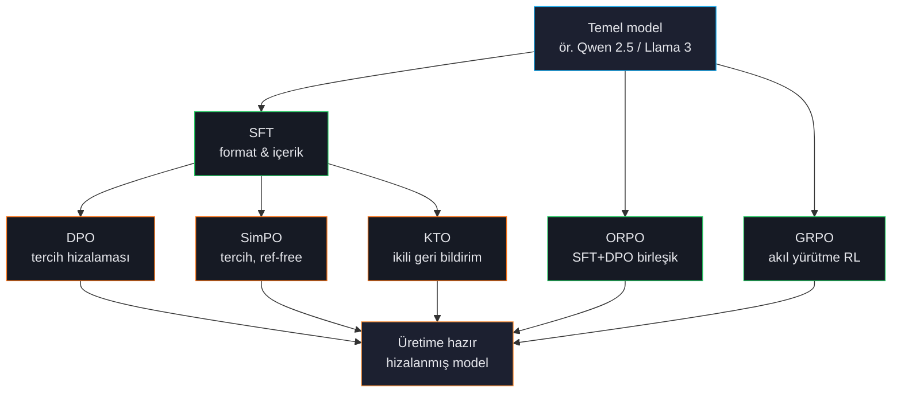
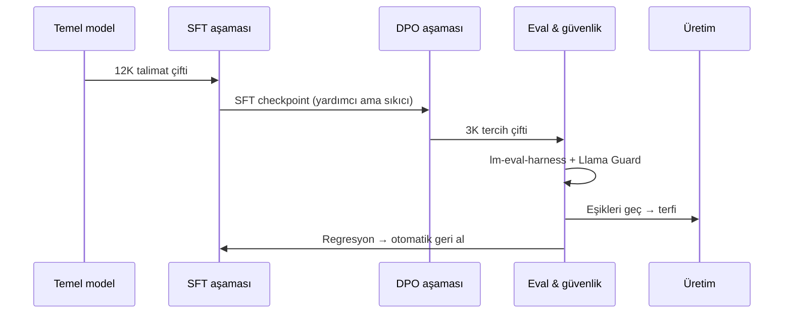

# Alignment Yığını

Modern LLM fine-tuning'i artık tek bir algoritma değil — her biri farklı bir problemi ele alan post-training paradigmaları *yığını*. ForgeLM her altısını tek bir deklaratif arayüzün arkasında sunar; doğru aracı pipeline'ı yeniden yazmadan seçersiniz.

## Alignment'ın çözdüğü üç problem

### Problem 1: Format

Bir base model metni tamamlayabilir ama talimat takip etmez, chat turlarını kullanmaz, system prompt'u korumaz ve ne zaman duracağını bilmez. **SFT** bunu çözer: istediğiniz formatın örnekleriyle eğitin.

### Problem 2: Tercihler

SFT'den sonra model iyi formatta çıktı üretir ama kalite değişken — bazen kendinden emin, bazen kaçamak, bazen ayrıntıya boğulmuş. **DPO**, **SimPO**, **KTO** ve **ORPO** modeli tercih edilen çıktılara hizalar.

Farklar:
- **DPO** — referans modele karşı `(chosen, rejected)` çiftlerinden öğrenir. En çok çalışılmış, en kararlı.
- **SimPO** — DPO ile aynı ama referans modeli atlar. Daha az bellek, biraz daha az kararlılık.
- **KTO** — ikili `(prompt, response, iyi mi?)` sinyallerinden öğrenir. Sadece thumbs-up/down geri bildiriminiz varsa kullanın.
- **ORPO** — SFT ve tercih kaybını tek geçişte birleştirir. Daha hızlı wall-clock; ayrı aşamalardan daha az esneklik.

### Problem 3: Akıl yürütme

Bazı görevler (matematik, kod, çok adımlı mantık) ikili tercihlerden değil akıl yürütme izleri üzerinde RL'den faydalanır. **GRPO** modelin kendi çıktıları üzerinde bir reward fonksiyonunu maksimize etmesini öğretir; format ve uzunluk ödülleri yerleşik.

## Tipik bir üretim sırası

Çoğu ekip iki aşamada üretime ulaşır: format ve içerik için SFT, sonra tercihleri keskinleştirmek için DPO/SimPO/KTO. ORPO, wall-clock hızı gerektiren ve her iki tür veriniz hazır olduğunda ikisini bir aşamaya çöker.

## Bir bakışta ödünleşim

| Aşama | Gerekli veri | Bellek | Kararlılık | Atlama zamanı |
|---|---|---|---|---|
| SFT | Prompt-completion çifti | 1× | Kararlı | Asla — neredeyse her zaman gerekli |
| DPO | Chosen-rejected çifti | 2× | Kararlı | Tercih veriniz yoksa |
| SimPO | Chosen-rejected çifti | 1.2× | Orta | VRAM bolsa, DPO tercih edin |
| KTO | İkili thumbs-up/down | 1.5× | Orta | Eşli tercihiniz varsa (DPO kullanın) |
| ORPO | Hem çiftler hem tercihler | 1.5× | Kararlı | SFT ve DPO'yu ayrı deney olarak istiyorsanız |
| GRPO | Reward fonksiyonu veya reward modeli | 2-3× | Hassas | Akıl yürütme dışı görevler |

:::tip
**SFT'yi atlamayın.** Mükemmel tercih veriniz olsa bile önce SFT formatı öğretsin, sonra DPO/SimPO/KTO hizalasın. SFT atlayıp doğrudan DPO genelde kararsız, formatı bozuk model üretir.
:::

## Parametre-verimli yöntemler

Yukarıdaki tüm trainer'lar commodity GPU'lara sığması için parametre-verimli yöntemlerle birleştirilebilir:

- **LoRA / QLoRA / DoRA / PiSSA / rsLoRA** — tüm ağırlıklar yerine düşük-rank adapter'ları eğitir. ~%1 eğitilebilir parametre, ~%10 VRAM, çoğu görevde karşılaştırılabilir kalite.
- **GaLore** — gradient projeksiyonu, LoRA seviyesi bellekte full-parametre eğitim.

Bkz. [LoRA, QLoRA, DoRA](#/training/lora) ve [GaLore](#/training/galore).

## Dağıtık eğitim

Modeliniz tek bir GPU belleğinden büyük olduğunda ForgeLM şunları destekler:

- **DeepSpeed ZeRO-2 / ZeRO-3** — optimizer state / gradient / parametreleri GPU'lar arası shard.
- **FSDP** — PyTorch-yerli tam-shardlı veri paralelizmi.
- **Unsloth** — desteklenen mimarilerde 2-5× daha hızlı backend (sadece tek GPU).

Bkz. [Dağıtık Eğitim](#/training/distributed).

## Sıraki adım

- [Trainer Seçimi](#/concepts/choosing-trainer) — SFT/DPO/SimPO/KTO/ORPO/GRPO arasında karar ağacı.
- [SFT](#/training/sft) — neredeyse her proje burada başlar.
- [Dataset Formatları](#/concepts/data-formats) — her trainer JSONL'da neyi bekler.
