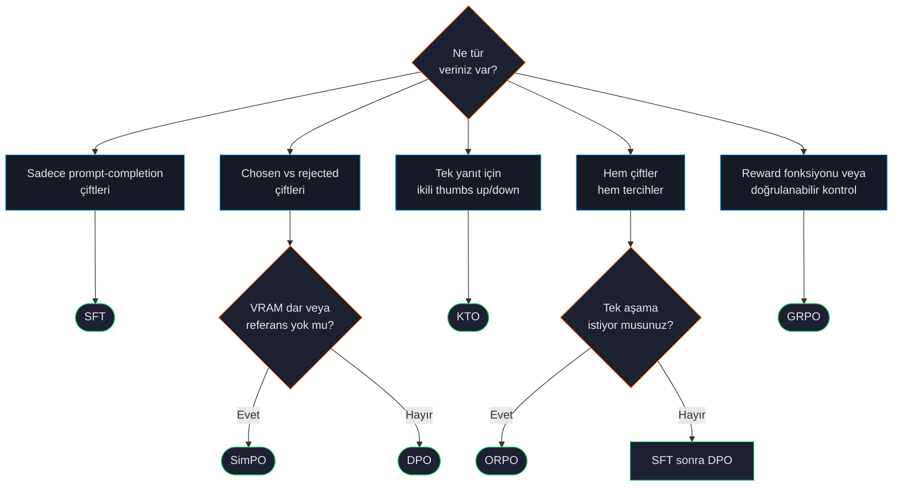

# Trainer Seçimi

Bir fine-tuning projesindeki en büyük tek karar hangi trainer'ı kullanacağınızdır — ve doğru cevap neredeyse her zaman tercihleriniz değil verilerinizdir.

## Karar ağacı

## Veriden ne kadarına bakmalı

| Veri şekli | Önerilen trainer |
|---|---|
| Sadece `{prompt, completion}` satırları | [SFT](#/training/sft) |
| `{prompt, chosen, rejected}` satırları | [DPO](#/training/dpo) (VRAM dar ise [SimPO](#/training/simpo)) |
| `{prompt, response, label: bool}` satırları | [KTO](#/training/kto) |
| SFT ve tercih satırlarının karışımı | [SFT](#/training/sft) → [DPO](#/training/dpo) sıralı, veya tek aşama için [ORPO](#/training/orpo) |
| Programatik reward (math grader, kod testi) | [GRPO](#/training/grpo) |

## Compute hesabı

Veriden trainer seçtikten sonra VRAM'e sığacağını teyit edin:

| Trainer | VRAM (aynı model + max_length ile SFT'e göre) |
|---|---|
| SFT | 1.0× (taban) |
| ORPO | 1.5× |
| SimPO | 1.2× |
| KTO | 1.5× |
| DPO | 2.0× — referans modeli bellekte tutar |
| GRPO | 2-3× — referans + reward bileşenleri de |

:::tip
QLoRA bu sayıları ~3-4× düşürür. Full precision'da 22 GB isteyen 7B DPO koşusu QLoRA ile ~7 GB'a sığar. Bkz. [LoRA, QLoRA, DoRA](#/training/lora).
:::

## Sık başlangıç noktaları

`forgelm quickstart` ile gelen şablonlar; çoğu ekibin ilk koşusu şunlardır:

| Hedef | Şablon | Trainer dizisi |
|---|---|---|
| Yardımsever + güvenli müşteri destek botu | `customer-support` | SFT → DPO |
| Kod-tamamlama modeli | `code-assistant` | SFT → ORPO |
| PDF'lerinizden alan uzmanı | `domain-expert` | Sadece SFT |
| Matematik akıl yürütme | `grpo-math` | format-shaping reward'lı GRPO |
| Türkçe medikal Q&A | `medical-qa-tr` | Sadece SFT |

Yukarıdaki "→" işaretli satırlar için, iki ayrı YAML yazıp elle orkestre etmek yerine aşamaları bir `pipeline:` config bloğuyla zincirleyin. Bkz. [Çok Aşamalı Pipeline'lar](#/training/pipelines).

## Anti-pattern'ler

:::warn
**"SFT'siz DPO."** Sık yapılan bir hata — base modele direkt DPO. Format ve içerik öğreten SFT olmadan DPO kırılgandır ve sonuç model genelde bozuk format çıkarır.
:::

:::warn
**"Her şeye GRPO."** GRPO doğrulanabilir doğruluk olan görevler için güçlü (sayısal cevaplı matematik, geçen testli kod). Açık uçlu kalite tercihleri için DPO daha kararlı ve hata ayıklaması kolaydır.
:::

:::warn
**"Veri 'iyi görünüyor' diye audit'i atlamak."** [Önce verinizi denetleyin](#/data/audit) — sızdıran train/test split'i veya veri setinizdeki PII, "yanlış" trainer seçmekten çok daha olası şekilde koşunuzu mahveder.
:::

## Bkz.

- [Alignment Yığını](#/concepts/alignment-overview) — daha geniş bağlam.
- [Dataset Formatları](#/concepts/data-formats) — her trainer'ın beklediği JSONL.
- [Çok Aşamalı Pipeline'lar](#/training/pipelines) — iki veya daha fazla trainer'ı tek config-tabanlı koşuda zincirle.
