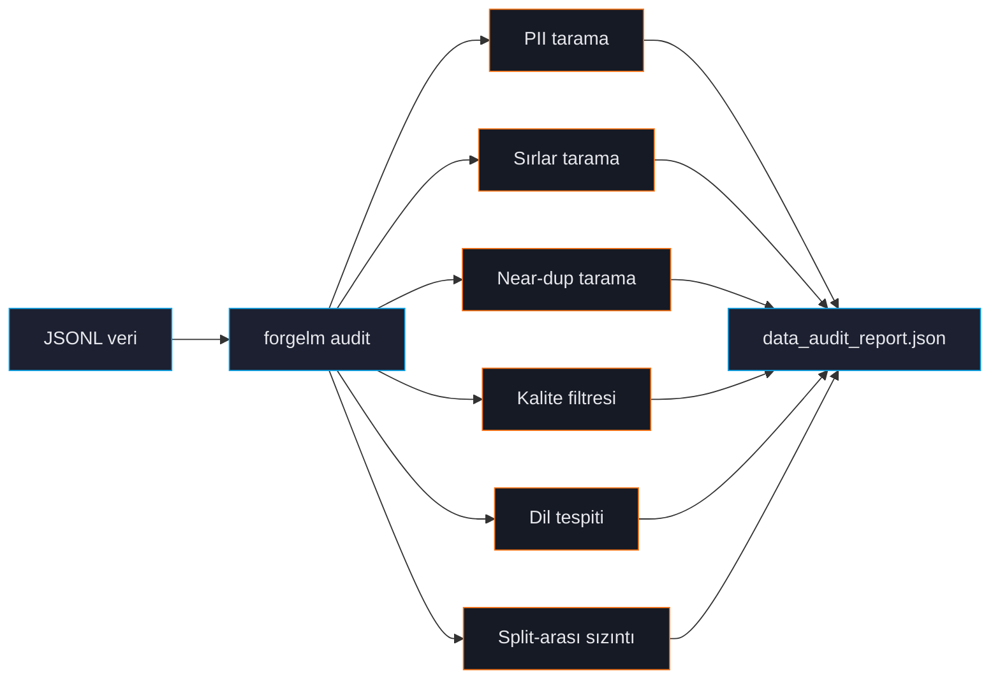

# Veri Seti Denetimi

`forgelm audit`, eğitim verinizin CPU-only, streaming ön uçuş kontrolüdür. Modeli safety review'dan geçemeyen, üretimde sırları sızdıran veya test setini ezberleyen bug'ları yakalar. Her eğitim öncesi koşturun.



## Hızlı örnek

```shell
$ forgelm audit data/preferences.jsonl --output ./audit/
✓ format: preference (12,400 satır, 3 split)
⚠ PII: 12 e-posta, 3 telefon, 1 IBAN (orta seviye, raporu görün)
✓ sırlar: 0 tespit
⚠ near-duplicate çift: 47 (LSH-banded simhash, eşik 3)
✗ chosen-rejected aynı: 12 satır (toplama bug'ı)
✓ dil: %99.2 Türkçe, %0.8 İngilizce
✓ split-arası sızıntı yok

audit tamamlandı — bkz. ./audit/data_audit_report.json
```

Exit kodu ciddiyeti yansıtır:

| Exit | Anlam |
|---|---|
| `0` | Temiz. Eğitim güvenli. |
| `2` | Uyarı. Raporu inceleyin; eğitim çalışır ama kalite düşebilir. |
| `3` | Hata. Split-arası sızıntı veya başka kritik sorun. Düzelt. |

## Audit'in kontrol ettikleri

### PII

E-posta, telefon, kredi kartı (Luhn doğrulamalı), IBAN ve ulusal kimlik (TR, DE, FR, US-SSN) tespit eder. Bkz. [PII Maskeleme](#/data/pii-masking).

### Sırlar

AWS anahtarları, GitHub PAT'ler, Slack token'lar, OpenAI/Google API key'leri, JWT'ler, tam PEM özel anahtar blokları, Azure storage string'leri. Bkz. [Sırların Temizlenmesi](#/data/secrets).

### Near-duplicate tespiti

İki algoritma:
- **LSH-banded simhash** (varsayılan) — kesin recall, hızlı, <50K satır için iyi.
- **MinHash LSH** — yaklaşık, milyonlara ölçeklenir.

Bkz. [Tekrar Tespiti](#/data/deduplication).

### Kalite filtresi

Gopher, C4, RefinedWeb araştırmasından heuristik. Düşük alfa, anormal kelime uzunluğu, tekrarlayan satırlar veya kısa paragraflar olan satırları flagler. Muhafazakar — sessizce satır düşürmez. Bkz. [Kalite Filtresi](#/data/quality-filter).

### Dil tespiti

Satır başına dominant dili belirlemek için `langdetect`. Bkz. [Dil Tespiti](#/data/language-detection).

### Split-arası sızıntı

Train vs validation vs test satırları arasında kesin ve near-duplicate eşleşmeleri karşılaştırır. En pahalı değerlendirme bug'ı. Audit sızdıran split'i onaylamaz. Bkz. [Split-arası Sızıntı](#/data/leakage).

### Format-özgü kontroller

**Preference** dataset'leri için ayrıca:
- `chosen == rejected` satırlar (toplama bug'ı)
- `chosen` `rejected`'tan 10× kısa (yanlışlıkla swap)
- Boş `chosen` veya `rejected`

**Binary** (KTO):
- Aşırı sınıf dengesizliği (>%99/1)
- Boş yanıtlar
- Boolean olmayan label

## CLI bayrakları

| Bayrak | Açıklama |
|---|---|
| `--output PATH` | Audit raporu çıktı dizini (varsayılan `./audit/`). |
| `--strict` | Uyarıları hata olarak işle. Herhangi bir flag'te exit 2. |
| `--dedup-algo {simhash,minhash}` | Varsayılan algoritma override. |
| `--dedup-threshold N` | simhash için Hamming eşiği (varsayılan 3). |
| `--skip-pii / --skip-secrets / ...` | Tek tek kontrolleri kapat. |
| `--sample-rate FLOAT` | Rastgele alt-örnek (`0.1` = %10). Çok büyük dataset için. |
| `--quality-filter` | Heuristik kalite kontrolleri (Gopher / C4 / RefinedWeb stili). `quality_summary` ekler. Bkz. [Kalite Filtresi](#/data/quality-filter). |
| `--pii-ml [--pii-ml-language LANG]` | Regex PII detector'ın üzerine Presidio NER katmanı ekler — aynı `pii_summary` bloğuna `person` / `organization` / `location` kategorileri ekler. `[ingestion-pii-ml]` extra'sını **ve** bir spaCy NER modelini gerektirir. Bkz. [ML-NER PII (Presidio)](#/data/pii-ml). |
| `--croissant` | Raporun `croissant` anahtarı altına bir [Google Croissant 1.0](https://mlcommons.org/croissant/) dataset card emit eder — aynı JSON dosyası hem audit hem Croissant-tüketicisi card görevi görür. Bkz. [Croissant 1.0 Dataset Kartı](#/data/croissant-card). |

## Rapor içeriği

`data_audit_report.json` hem insan okuması hem CI entegrasyonu için yapılandırılmış:

```json
{
  "format": "preference",
  "row_count": 12400,
  "splits": {"train": 10000, "val": 1200, "test": 1200},
  "pii_summary": {"email": 12, "phone": 3, "iban": 1, "severity": "medium"},
  "secrets_summary": {"total": 0},
  "near_duplicate_pairs": 47,
  "cross_split_overlap": 0,
  "quality_flags": {...},
  "language_distribution": {"tr": 0.992, "en": 0.008},
  "preference_specific": {"identical_chosen_rejected": 12, ...},
  "verdict": "warnings"
}
```

CI entegrasyonları `verdict` ve sayıları parse ederek merge'i kontrol eder:

```yaml
- name: Audit data
  run: forgelm audit data/train.jsonl --strict
```

## Sık hatalar

:::warn
**"Güvenilen" veride audit'i atlamak.** Kendi üretim log'larınız bile sürpriz içerebilir — son API anahtarı rotasyonu telemetry'ye sızar, GDPR-silme isteği dangling ID yaratır. Audit kendi gelecek hatanıza karşı savunma.
:::

:::warn
**Küçük dataset'te `--sample-rate`.** Sample milyon-satır corpus için anlamlı; <10K satır için hepsini denetle — saniyeler sürer.
:::

:::tip
**Sürüm başına audit raporu sakla.** `data_audit_report.json`'u dataset versiyonuyla birlikte git'e commit'le. Gelecek audit'ler tarihsel rapora karşı diff alıp "geçen sefer 12 PII flag vardı, şimdi 47 — pipeline'da ne değişti?" cevabı verebilir.
:::

## Bkz.

- [PII Maskeleme](#/data/pii-masking), [Sırlar](#/data/secrets), [Tekrar](#/data/deduplication) — tek tek kontroller.
- [Annex IV](#/compliance/annex-iv) — audit raporu compliance artifact'lara akar.
- [Konfigürasyon Referansı](#/reference/configuration) — `compliance.data_audit_artifact`.
