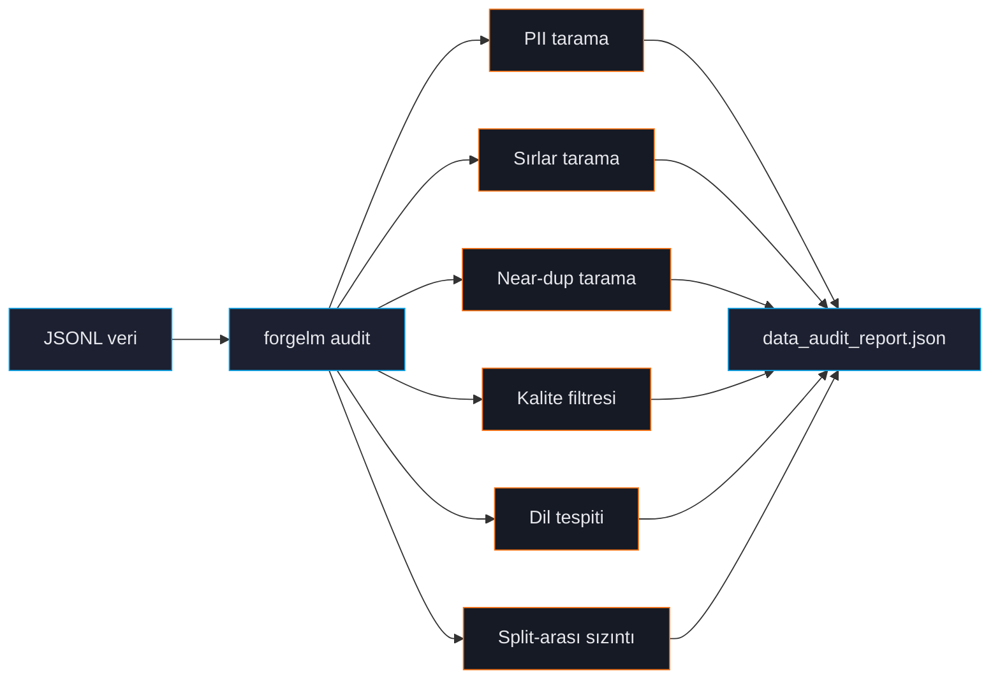

# Veri Seti Denetimi

`forgelm audit`, eğitim verinizin CPU-only, streaming ön uçuş kontrolüdür. Modeli safety review'dan geçemeyen, üretimde sırları sızdıran veya test setini ezberleyen bug'ları yakalar. Her eğitim öncesi koşturun.



## Hızlı örnek

```shell
$ forgelm audit data/preferences.jsonl --output ./audit/
✓ format: preference (12,400 satır, 3 split)
⚠ PII: 12 e-posta, 3 telefon, 1 IBAN (orta seviye, raporu görün)
✓ sırlar: 0 tespit
⚠ near-duplicate çift: 47 (LSH-banded simhash, eşik 3)
✗ chosen-rejected aynı: 12 satır (toplama bug'ı)
✓ dil: %99.2 Türkçe, %0.8 İngilizce
✓ split-arası sızıntı yok

audit tamamlandı — bkz. ./audit/data_audit_report.json
```

Exit kodu ciddiyeti yansıtır:

| Exit | Anlam |
|---|---|
| `0` | Temiz. Eğitim güvenli. |
| `2` | Uyarı. Raporu inceleyin; eğitim çalışır ama kalite düşebilir. |
| `3` | Hata. Split-arası sızıntı veya başka kritik sorun. Düzelt. |

## Audit'in kontrol ettikleri

### PII

E-posta, telefon, kredi kartı (Luhn doğrulamalı), IBAN ve ulusal kimlik (TR, DE, FR, US-SSN) tespit eder. Bkz. [PII Maskeleme](#/data/pii-masking).

### Sırlar

AWS anahtarları, GitHub PAT'ler, Slack token'lar, OpenAI/Google API key'leri, JWT'ler, tam PEM özel anahtar blokları, Azure storage string'leri. Bkz. [Sırların Temizlenmesi](#/data/secrets).

### Near-duplicate tespiti

İki algoritma:
- **LSH-banded simhash** (varsayılan) — kesin recall, hızlı, <50K satır için iyi.
- **MinHash LSH** — yaklaşık, milyonlara ölçeklenir.

Bkz. [Tekrar Tespiti](#/data/deduplication).

### Kalite filtresi

Gopher, C4, RefinedWeb araştırmasından heuristik. Düşük alfa, anormal kelime uzunluğu, tekrarlayan satırlar veya kısa paragraflar olan satırları flagler. Muhafazakar — sessizce satır düşürmez. Bkz. [Kalite Filtresi](#/data/quality-filter).

### Dil tespiti

Satır başına dominant dili belirlemek için `langdetect`. Bkz. [Dil Tespiti](#/data/language-detection).

### Split-arası sızıntı

Train vs validation vs test satırları arasında kesin ve near-duplicate eşleşmeleri karşılaştırır. En pahalı değerlendirme bug'ı. Audit sızdıran split'i onaylamaz. Bkz. [Split-arası Sızıntı](#/data/leakage).

### Format-özgü kontroller

**Preference** dataset'leri için ayrıca:
- `chosen == rejected` satırlar (toplama bug'ı)
- `chosen` `rejected`'tan 10× kısa (yanlışlıkla swap)
- Boş `chosen` veya `rejected`

**Binary** (KTO):
- Aşırı sınıf dengesizliği (>%99/1)
- Boş yanıtlar
- Boolean olmayan label

## CLI bayrakları

Yetkili kaynak: `forgelm/cli/_parser.py::_add_audit_subcommand`.

| Bayrak | Açıklama |
|---|---|
| `input_path` (pozisyonel) | JSONL dosyası ya da split JSONL'lerini içeren dizin (`train.jsonl`, `validation.jsonl`, `test.jsonl`). |
| `--output DIR` | `data_audit_report.json` çıktı dizini (varsayılan `./audit/`). |
| `--verbose` | Sıfır-bulgulu split'ler dahil her split'i text özette göster. JSON çıktıyı etkilemez. |
| `--near-dup-threshold N` | simhash near-duplicate detection için Hamming-mesafesi eşiği (varsayılan 3 ≈ %95 benzerlik). `--dedup-method=minhash` altında yok sayılır. |
| `--dedup-method {simhash,minhash}` | Near-duplicate algoritması. Varsayılan `simhash` (Phase 11.5 yolu); `minhash` opsiyonel `forgelm[ingestion-scale]` extra'sı (datasketch) üzerinden LSH-banded MinHash'e geçer. |
| `--jaccard-threshold X` | `--dedup-method=minhash` için Jaccard eşiği (varsayılan 0.85). `--dedup-method=simhash` ile yok sayılır. |
| `--quality-filter` | Heuristik kalite kontrolleri (mean word length, alphabetic-character ratio, end-of-line punctuation ratio, repeated-line ratio, short-paragraph ratio). Rapora `quality_summary` ekler. Bkz. [Kalite Filtresi](#/data/quality-filter). |
| `--croissant` | Raporun `croissant` anahtarı altına bir [Google Croissant 1.0](https://mlcommons.org/croissant/) dataset card emit eder. Bkz. [Croissant 1.0 Dataset Kartı](#/data/croissant-card). |
| `--pii-ml` | Regex detector'ın üzerine Presidio'nun ML-NER PII tespitini katmanlar. Opsiyonel `forgelm[ingestion-pii-ml]` extra'sını **ve** bir spaCy NER modelini (örn. `python -m spacy download en_core_web_lg`) gerektirir. Bkz. [ML-NER PII (Presidio)](#/data/pii-ml). |
| `--pii-ml-language LANG` | `--pii-ml` için spaCy NLP dili kodu (varsayılan `en`). Türkçe corpus için örn. `tr` set edin VE eşleşen spaCy modelinin kurulu olduğundan emin olun. |
| `--workers N` | Split-düzeyi pipeline için worker process sayısı (varsayılan 1, sıralı). Multi-split corpus'larda 2-4'e set ederek near-linear hızlanma sağlanır. Audit JSON worker sayısından bağımsız byte-identical (determinism contract). |
| `--output-format {text,json}` | Stdout renderer. `json` modu makine-okunabilir bir özet, `text` varsayılan insan-okunabilir formdur. |

> **Kaldırılan flag'lar (hiç ship olmadı).** Bu sayfanın eski sürümleri `--strict`, `--dedup-algo`, `--dedup-threshold`, `--skip-pii`, `--skip-secrets`, `--skip-quality`, `--skip-leakage`, `--sample-rate`, `--remove-duplicates`, `--remove-cross-split-overlap`, `--output-clean`, `--show-leakage`, `--minhash-jaccard`, `--minhash-num-perm` ve `--add-row-ids` flag'larını belgeliyordu. Bunların hiçbiri parser'da yok. Yukarıdaki kanonik adları kullanın; "uyarıları → non-zero exit" gibi audit-as-gate davranışı istiyorsanız `--output-format json` zarfını CI'da kendi `jq` tabanlı gate'inizle sarmalayın.

## Rapor içeriği

`data_audit_report.json` hem insan okuması hem CI entegrasyonu için yapılandırılmış:

```json
{
  "format": "preference",
  "row_count": 12400,
  "splits": {"train": 10000, "val": 1200, "test": 1200},
  "pii_summary": {"email": 12, "phone": 3, "iban": 1, "severity": "medium"},
  "secrets_summary": {"total": 0},
  "near_duplicate_pairs": 47,
  "cross_split_overlap": 0,
  "quality_flags": {
    "short_response": 24,
    "repeated_lines": 0,
    "abnormal_word_length": 12
  },
  "language_distribution": {"tr": 0.992, "en": 0.008},
  "preference_specific": {
    "identical_chosen_rejected": 12,
    "empty_chosen": 0,
    "swapped_likely": 0
  },
  "verdict": "warnings"
}
```

CI entegrasyonları `verdict` ve sayıları parse ederek merge'i kontrol eder. `--strict` flag'i yoktur (yukarıdaki "Kaldırılan flag'lar"a bakın) — JSON zarfını `jq` ile sarın:

```yaml
- name: Audit data
  run: |
    forgelm audit data/train.jsonl --output-format json > audit.json
    jq -e '.verdict != "errors" and .pii_summary.severity != "high"' audit.json
```

## Sık hatalar

:::warn
**"Güvenilen" veride audit'i atlamak.** Kendi üretim log'larınız bile sürpriz içerebilir — son API anahtarı rotasyonu telemetry'ye sızar, GDPR-silme isteği dangling ID yaratır. Audit kendi gelecek hatanıza karşı savunma.
:::

:::warn
**`--sample-rate` kullanmaya çalışmak.** Bu flag hiç ship olmadı (yukarıdaki "Kaldırılan flag'lar"a bakın). Audit her zaman tüm corpus üzerinde koşar; milyon-satır corpus için bunun yerine `--workers N` ile paralelleştirin. <10K satır için tam audit saniyeler alır — sampling gerekmez.
:::

:::tip
**Sürüm başına audit raporu sakla.** `data_audit_report.json`'u dataset versiyonuyla birlikte git'e commit'le. Gelecek audit'ler tarihsel rapora karşı diff alıp "geçen sefer 12 PII flag vardı, şimdi 47 — pipeline'da ne değişti?" cevabı verebilir.
:::

## Bkz.

- [PII Maskeleme](#/data/pii-masking), [Sırlar](#/data/secrets), [Tekrar](#/data/deduplication) — tek tek kontroller.
- [Annex IV](#/compliance/annex-iv) — audit raporu compliance artifact'lara akar.
- [Konfigürasyon Referansı](#/reference/configuration) — `compliance.data_audit_artifact`.
