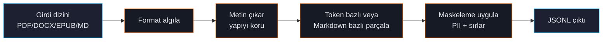

# Doküman Ingest'i

Çoğu fine-tuning veri seti JSONL olarak başlamaz — PDF'ler, sözleşmeler, EPUB'lar veya dağınık Markdown notları olarak başlar. `forgelm ingest` girdi dizininizi gezer, metni format-bilinçli şekilde çıkarır ve SFT-hazır JSONL üretir.



## Hızlı örnek

```shell
$ forgelm ingest ./policies/ \
    --recursive \
    --strategy markdown \
    --max-tokens 1024 \
    --all-mask \
    --output data/policies.jsonl
✓ 47 dosya tarandı (12 PDF, 8 DOCX, 27 MD)
✓ 12,240 chunk çıkarıldı (ortalama 743 token)
✓ 18 PII eşleşmesi maskelendi, 0 sır
✓ data/policies.jsonl yazıldı (8.2 MB)
```

`--all-mask`, `--secrets-mask --pii-mask`'in doğru sıradaki belgelenen
kısayoludur. Tam davranış ve set-union semantiği için
[Birleşik Maskeleme](#/data/all-mask)'ye bakın.

## Desteklenen formatlar

| Format | Çıkarıcı | Notlar |
|---|---|---|
| **PDF** | `pypdf` | Header/footer dedup, tablo çıkarma (best-effort). |
| **DOCX** | `python-docx` | Tablolar Markdown tablo olarak; başlık hiyerarşisini korur. |
| **EPUB** | `ebooklib` | Navigasyon/içindekileri çıkarır; bölüm yapısını korur. |
| **TXT** | yerleşik | Tek doküman olarak işlenir; `--max-tokens` ile parçalanır. |
| **Markdown** | yerleşik | Markdown-bilen splitter başlık hiyerarşisine saygı duyar. |

Ingestion extra'larını kurun: `pip install 'forgelm[ingestion]'`. Bkz. [Kurulum](#/getting-started/installation).

## Parçalama stratejileri

| Strateji | Davranış | En iyi |
|---|---|---|
| `tokens` | Chunk başına `--max-tokens` sınırı; cümle sınırlarında bölmeye çalışır. | Düz metin, karışık içerik. |
| `markdown` | Markdown başlıklarına (h1/h2/h3) göre böler, hiyerarşiye saygı duyar. | Dokümantasyon, yapılandırılmış corpus. |
| `paragraph` | Paragraf başına bir chunk (veya sığacak şekilde birleştirilmiş paragraflar). | Kitaplar, prose. |
| `sentence` | Cümle başına bir chunk (nadir; çok ince taneli veri için). | NLI görevleri, kısa Q&A. |

Çoğu ekip dokümantasyon için `markdown`, geri kalan her şey için `tokens` seçer.

## Çıktı formatları

Varsayılan olarak `forgelm ingest` sentetik prompt'larla `instructions` formatı üretir:

```json
{"prompt": "Şu pasajı özetle.", "completion": "Politikanın 4.2 bölümü...", "metadata": {"source": "policy.pdf", "chunk": 17}}
```

Domain-uzmanı SFT için genelde `--format raw` istersiniz; bu chunk'ı olduğu gibi çıkarır ve prompt üretimini sonraya bırakır (veya sürdürülen ön eğitim için kullanır):

```json
{"text": "Bölüm 4.2: Tüm ödeme işlemleri PCI-DSS standartlarına uymalıdır...", "metadata": {"source": "policy.pdf", "chunk": 17}}
```

Q&A datasetleri için prompt-üreten LLM ile `--format qa`:

```yaml
ingestion:
  format: "qa"
  qa_generator:
    model: "openai:gpt-4o-mini"
    prompts_per_chunk: 3
```

## CLI bayrakları

| Bayrak | Açıklama |
|---|---|
| `--recursive` | Alt dizinlere yürü. |
| `--strategy {tokens,markdown,paragraph,sentence}` | Parçalama stratejisi. |
| `--max-tokens N` | Chunk başına token sınırı (varsayılan 1024). |
| `--overlap N` | Chunk'lar arası kayar-pencere örtüşmesi (varsayılan 0). |
| `--pii-mask` | E-posta, telefon, ID, IBAN'ı yazmadan önce maskele. Bkz. [PII Maskeleme](#/data/pii-masking). |
| `--secrets-mask` | AWS anahtarları, GitHub PAT'ler, JWT'leri vb. redakte et. Bkz. [Sırlar](#/data/secrets). |
| `--language LANG` | Bir dili zorla (varsayılan: chunk başına otomatik algıla). |
| `--include "*.pdf,*.md"` | Dahil edilecek glob pattern'leri. |
| `--exclude "drafts/*"` | Hariç tutulacak glob pattern'leri. |
| `--output PATH` | Çıktı dosyası (`.jsonl`). |

## Sık hatalar

:::warn
**`--pii-mask`'i unutmak.** Varsayılan *maskelememe*; "verinizi sessizce değiştirmeyiz" prensibinden. Gerçek corpus için açıkça etkinleştirin. Audit aşaması ([Veri Seti Denetimi](#/data/audit)) PII'yi her halükarda flagler ama ingest'te maskelemek daha iyidir.
:::

:::warn
**Saf-resim PDF'ler.** ForgeLM OCR yayınlamıyor. PDF'leriniz taranmış görüntüyse önce Tesseract veya ticari bir OCR'dan geçirin.
:::

:::warn
**`--max-tokens`'i modelin context'inden büyük yapmak.** `model.max_length`'ten uzun chunk'lar eğitim zamanında kuyruktan kesilir. `--max-tokens`'i eğitim context'iyle eşleştirin.
:::

:::tip
**Ingest'ten sonra her zaman audit yapın.** Temiz ingest temiz dataset anlamına gelmez. Split-arası sızıntı, near-duplicate ve maskelemenin kaçırdığı PII için `forgelm audit data/output.jsonl` koşturun.
:::

## Bkz.

- [Veri Seti Denetimi](#/data/audit) — ingest'ten sonraki adım.
- [PII Maskeleme](#/data/pii-masking) — maskelemenin nasıl çalıştığı.
- [Dataset Formatları](#/concepts/data-formats) — her çıktı formatı.
