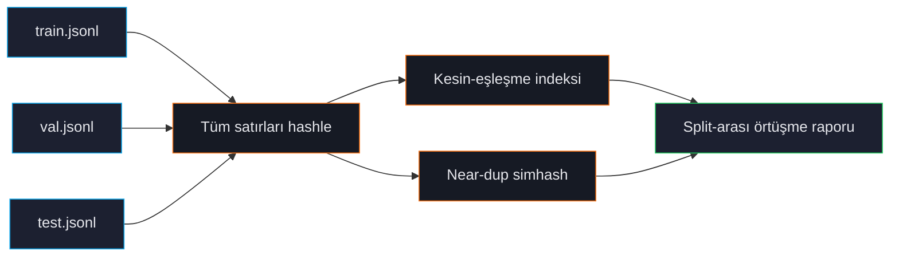

# Split-Arası Sızıntı

Validation veya test'te de görünen train satırları değerlendirme metriklerinizi yanıltıcı şekilde şişirir. Model test cevabını "biliyor" çünkü eğitim sırasında gördü. Raporlanan puanlar iyi görünür; üretim performansı hayal kırıklığı yaratır.

ForgeLM'in split-arası sızıntı kontrolü tek başına en önemli audit adımıdır. `forgelm audit` her çağrısında koşar ve sızdıran split'i onaylamayı reddeder.

## Sızıntı nasıl olur

Olağan suçlular:

1. **Gruplama olmadan rastgele karıştırma.** Satır başı rastgele bölmek tekrar satırları her iki tarafa da koyar.
2. **Bölme öncesi augmentasyon.** Mevcut satırlardan parafraz üretmek, sonra bölmek — orijinal ve parafraz farklı taraflarda biter.
3. **Aynı içeriğin birden çok kaynağı.** Eğitim corpus'unuzdaki bir FAQ ve eval setinizdeki aynı FAQ, ayrı ingest edilmiş.
4. **Web crawl'lar benchmark'larla örtüşür.** Eğitim verisi web'i taradı; benchmark yayıncısı da test setini web'e koydu.

## Kontrol ne yapar



Her train satırı için ForgeLM kontrol eder:
- Val/test'te **kesin eşleşme** (önemli her alan: `prompt`, `chosen`, `response` vb.).
- Val/test'te **near-duplicate** (Hamming eşiği 3 simhash).

Herhangi bir eşleşme raporlanır. Sızıntı oranı konfigüre eşiği geçerse audit sıfır olmayan exit verir.

## Hızlı örnek

```shell
$ forgelm audit data/      # train.jsonl + val.jsonl + test.jsonl'ı denetler
✗ split-arası örtüşme tespit edildi:
   train ↔ val: 47 kesin, 12 near-dup
   train ↔ test: 23 kesin, 5 near-dup
   val ↔ test: 0

Audit bu split'leri onaylamayı reddeder. Çift seviyesinde tam rapor disk üzerindeki audit JSON'da.

exit kodu: 3
```

Hatayı tetikleyen satır seviyesindeki çiftleri `jq` ile inceleyin:

```shell
$ jq '.cross_split_overlap.pairs[]' audit/data_audit_report.json | head
{"train": 1240, "val": 312, "type": "exact", "text": "Aboneliği nasıl iptal..."}
{"train": 4521, "val": 890, "type": "near-dup", "hamming": 2}
```

## Nasıl düzeltirsiniz

1. **Veriyi yeniden bölün**, bu sefer kaynak seviyesinde gruplayarak (parafraz'ları bölmeyin, dokümanları gruplayın). Splitter'ınızda `--group-by` bayrağı kullanın.
2. **Yeniden çıkarma** sızıntı tekrar ingest'ten geliyorsa (aynı FAQ iki kez ingest edilmiş).
3. **Kaldırma** küçük split'ten sızdıran satırları manuel olarak (audit JSON zarfının `leakage.cross_split_overlap` dizisi her duplicate satır id'sini adlandırır). `jq` ile süzüp çıkarın, sonra `forgelm audit`'i yeniden koşturarak zincirin temiz geçtiğini doğrulayın. v0.5.5'te otomatik kaldırma knob'u yoktur — yol haritasında bulunsa da gelene kadar açık `jq` adımı silmeyi denetlenebilir tutar.

## Konfigürasyon

```yaml
audit:
  leakage_check:
    enabled: true
    threshold: 0                        # sıfır tolerans — herhangi sızıntıda audit fail
    near_dup_hamming: 3                 # eşleşme eşiği
    fields_to_check: ["prompt", "chosen", "response"]
    fail_severity: "error"              # `error` eğitimi engeller, `warn` sadece loglar
```

Çoğu ekip varsayılanı kullanır — sıfır tolerans. Bir miktar sızıntının kaçınılmaz olduğu çok büyük dataset'iniz varsa `threshold`'ı küçük bir orana yükseltin (ör. 0.001) ama nedenini belgeleyin.

## "Near-dup" neden önemli

Kesin-eşleşme sızıntı modern pipeline'larda nadirdir; çünkü herkes deduplike eder. Ama near-dup sızıntı sessiz katildir:

```text
Train: "Aboneliği nasıl iptal ederim?"
Test:  "Aboneliği nasıl iptal ederim"
```

Bir karakter farklı — kesin-eşleşme bunu kaçırır; model her halükarda eğitim zamanında bunları aynı sayar. Near-dup yakalar.

## Sık hatalar

:::warn
**Augmentasyondan sonra bölme.** Eğitim verisinden parafraz üretip sonra rastgele bölerseniz parafraz diğer tarafta biter. Her zaman augmentasyondan *önce* bölün.
:::

:::warn
**Yukarıdan gelen split'lere güvenmek.** Dataset'iniz önceden tanımlanmış train/val/test split'leriyle yayınlandıysa, onları denetleyin. Kamuya açık dataset'lerin yıllardır yayılan bilinen sızıntıları olabilir.
:::

:::danger
**"Bugün üretime girmek için" sızıntı kontrolünü atlatmak.** Sızdıran koşunun fiyatı, iyi benchmark numaraları raporlamak, deploy etmek ve üretim performansının çok daha kötü olduğunu keşfetmektir. Güven kaybı, gecikmenin maliyetinden fazlasına mal olur.
:::

## Bkz.

- [Veri Seti Denetimi](#/data/audit) — sızıntı kontrolü varsayılan koşar.
- [Tekrar Tespiti](#/data/deduplication) — aynı simhash backend.
- [Annex IV](#/compliance/annex-iv) — sızıntı raporu compliance paketinin parçası.
