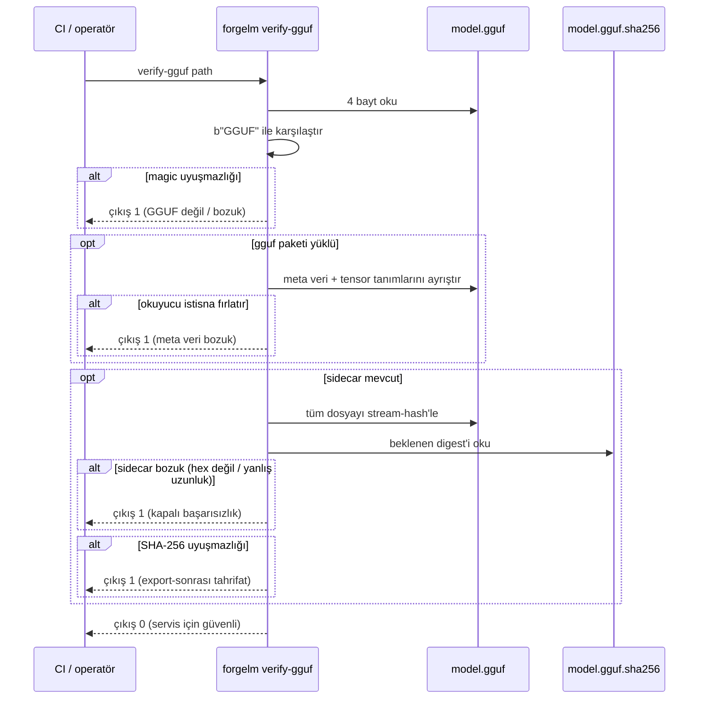

# GGUF Doğrulama

`forgelm verify-gguf`, GGUF export adımıyla eşleşen salt-okunur doğrulayıcıdır. Bir GGUF model dosyası üzerinde üç katmanlı bütünlük kontrolü yapar: 4-baytlık `GGUF` magic header, isteğe bağlı `gguf` Python paketi yüklüyse meta veri bloğu ve mevcutsa `<path>.sha256` sidecar'ına karşı SHA-256 karşılaştırması. Bozulmuş veya tahrif edilmiş bir GGUF'un asla `llama.cpp`, Ollama, vLLM ya da LM Studio'ya ulaşmaması için son ön-servis kapısı olarak kullanın.

## Ne zaman kullanılır

- **Bir GGUF'u servis runtime'ına yüklemeden önce.** Temiz bir `verify-gguf` çıkışı, dosyanın exporter'ın yazdığı şey olduğuna dair minimum sinyaldir.
- **GGUF export sonrası CI/CD yayın kapılarında.** Her `forgelm export` adımından sonra çalıştırın; çıkış `1`'de yayını başarısız sayın.
- **Üçüncü-taraf bir trainer'dan veya model hub'ından GGUF alındığında.** Gönderilen ile imzalanan arasındaki sapmayı tespit etmek için magic + meta veri + SHA-256 katmanlarını yeniden hesaplayın.
- **Bir GGUF'u makineler arasında taşıdıktan sonra.** Aktarımda oluşan herhangi bir bayt-seviyesi bozulma SHA-256 uyuşmazlığı olarak ortaya çıkar.

## Nasıl çalışır



## Hızlı başlangıç

```shell
$ forgelm verify-gguf checkpoints/run/exports/model-q4_k_m.gguf
OK: checkpoints/run/exports/model-q4_k_m.gguf
  GGUF magic OK, metadata parsed, SHA-256 sidecar match
    magic_ok: True
    metadata_parsed: True
    sidecar_present: True
    sidecar_match: True
    tensor_count: 291
    sha256_actual: a4c1f2…
    sha256_expected: a4c1f2…
```

## Ayrıntılı kullanım

### CI tüketicileri için JSON çıktı

```shell
$ forgelm verify-gguf --output-format json \
    checkpoints/run/exports/model-q4_k_m.gguf
{
  "success": true,
  "valid": true,
  "reason": "GGUF magic OK, metadata parsed, SHA-256 sidecar match",
  "checks": {
    "magic_ok": true,
    "metadata_parsed": true,
    "sidecar_present": true,
    "sidecar_match": true,
    "tensor_count": 291,
    "sha256_actual": "a4c1f2…",
    "sha256_expected": "a4c1f2…"
  },
  "path": "/abs/path/checkpoints/run/exports/model-q4_k_m.gguf"
}
```

İnsan-okunur metin formatını ayrıştırmadan `valid` bayrağına filtrelemek için `jq`'ya boruyla bağlayın.

### Üç katman

| Katman | Ne zaman çalışır | Başarısızlık ne anlama gelir |
|---|---|---|
| **Magic header** | Her zaman. | Dosya GGUF değil (operatör yanlış yol verdi ya da indirme bayt 0'da bozuk). |
| **Meta veri bloğu** | İsteğe bağlı `gguf` Python paketi yüklüyse. | Yazıcı yarıda çöktü ya da dosya kesildi — tensor tablosu artık kendi içinde tutarlı değil. |
| **SHA-256 sidecar** | Dosyanın yanında `<path>.sha256` mevcutsa. | Ya dosya export sonrası değiştirildi YA DA sidecar'ın kendisi bozuk (hex değil / yanlış uzunluk / `TODO` placeholder). Doğrulayıcı bozuk sidecar'da kapalı başarısız olur; böylece bozuk bir manifest asla "doğrulanmış" gibi sessizce maskelenemez. |

Exporter sidecar'ı varsayılan olarak yazar. Üçüncü taraftan bir GGUF aldığınızda yanında sidecar'ı da talep edin; sidecar olmazsa yalnızca magic + meta veri katmanları çalışır.

### İsteğe bağlı bağımlılık: `gguf` paketi

Meta veri ayrıştırması üst kaynak `gguf` Python paketini kullanır. Paket yüklü değilse katman sessizce atlanır — magic + sidecar kontrolleri yük taşımaya devam eder:

```shell
$ pip uninstall -y gguf
$ forgelm verify-gguf checkpoints/run/exports/model-q4_k_m.gguf
OK: checkpoints/run/exports/model-q4_k_m.gguf
  GGUF magic OK, SHA-256 sidecar match
    magic_ok: True
    metadata_parsed: False
    sidecar_present: True
    sidecar_match: True
```

Meta veri katmanını geri eklemek için `pip install gguf` ile yükleyin. Bu, projenin isteğe bağlı bağımlılık politikasıyla uyumludur: `gguf` çekirdek bir ForgeLM bağımlılığı değildir.

### Hata çıktısını okuma

| Hata | Sebep |
|---|---|
| `Magic header mismatch: expected b'GGUF', got b'PK\x03\x04'` | Dosya ZIP, GGUF değil. |
| `GGUF metadata block could not be parsed: struct.error: …` | Dosya kesilmiş ya da yazıcı export ortasında çökmüş. |
| `SHA-256 sidecar mismatch — file modified after export` | Exporter sidecar'ı yazdıktan sonra biri dosyayı düzenlemiş. |
| `Malformed SHA-256 sidecar: expected a 64-character hex digest, got …` | Sidecar hex olmayan bir placeholder içeriyor, kesilmiş ya da farklı bir algoritma kullanılmış. |

### Çıkış-kodu özeti

| Kod | Anlam |
|---|---|
| `0` | Magic tamam VE (`gguf` yüklüyse) meta veri ayrıştırılıyor VE (sidecar mevcutsa) SHA-256 eşleşiyor. |
| `1` | Magic uyuşmazlığı, meta veri bozulması, bozuk sidecar, SHA-256 uyuşmazlığı VEYA regular file olmayan bir path (operatör yanlış argüman geçirdi). |
| `2` | Gerçek bir dosyayı okurken I/O hatası (permission denied, okuma sırasında disk hatası). |

## Sık hatalar

:::warn
**"Sidecar yok"u zararsız saymak.** SHA-256 sidecar olmadan doğrulayıcı export-sonrası değişiklikleri tespit edemez. Her zaman sidecar ile export edin (varsayılan) ve transfer ederken sidecar'ı GGUF'un yanında gönderin.
:::

:::warn
**Farklı bir dosyaya ait sidecar'ı yeniden kullanmak.** Sidecar GGUF'a içerik ile değil, isim (`<path>.sha256`) ile bağlıdır. Başka bir modele ait sidecar'ı yanlış dizine kopyalamak, mükemmel sağlam bir dosyada kafa karıştırıcı bir SHA-256 uyuşmazlığına yol açar. Şüpheniz varsa `sha256sum model.gguf > model.gguf.sha256` ile yeniden oluşturun.
:::

:::warn
**`gguf`'u yüklememekle CI'da meta veri katmanını atlamak.** Meta veri ayrıştırması, sadece magic-header kontrolünün yakalayamayacağı kesilmeleri yakalar. SHA-256 sidecar elbette herhangi bir bayt değişikliğini — kesilme dahil — bayraklar; ancak yalnızca *kesilmeden sonra* üretilmişse. Orijinal tam dosyadan üretilen bir sidecar hâlâ diskte durabilir ve saldırgan kesilmiş bir yüklemeye karşı yeniden kullanabilir; magic header tek başına bunu yakalamaz. Sidecar'dan bağımsız olarak meta veri okuyucu bozuk/kesilmiş dosyaları reddedebilsin diye CI imajınıza `gguf`'u kurun.
:::

:::tip
**Doğrulayıcıyı CI'da sert bir kapı olarak sabitleyin.** Her `forgelm export`'tan sonra `forgelm verify-gguf --output-format json`'u bağlayın; metin ayrıştırmadan yayını başarısız etmek için `jq -e '.valid'`'e boruyla bağlayın.
:::

## Bkz.

- [GGUF Export](#/deployment/gguf-export) — bu doğrulayıcının tükettiği sidecar'ı yazan üretim tarafı.
- [Audit Log Doğrulama](#/compliance/verify-audit) — uyumluluk yüzeyindeki kardeş doğrulayıcı.
- [Annex IV Doğrulama](#/compliance/annex-iv) — teknik dokümantasyon artifact'ı için kardeş doğrulayıcı.
- [`verify_gguf_subcommand.md`](../../../reference/verify_gguf_subcommand.md) — tam bayrak tablosu ve kütüphane-sembol atıfları içeren referans doc.
