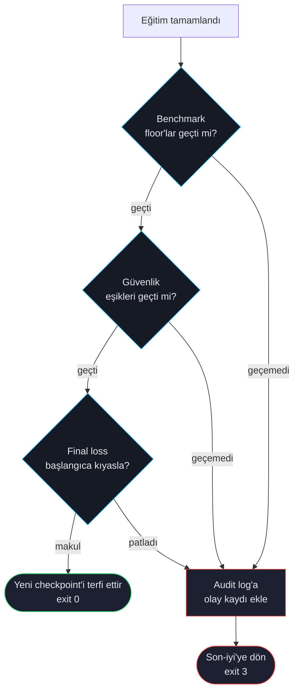

# Otomatik Geri Alma

Başlangıç noktasından daha kötü güvenlik veya kalite skoru alan bir fine-tuned model, hiç fine-tune etmemekten beterdir. Otomatik geri alma ForgeLM'in güvenlik ağıdır: konfigüre edilmiş bir eşik eğitimden sonra başarısız olursa koşu son-iyi checkpoint'e döner ve yapılandırılmış bir olay kaydı bırakır.

## Karar akışı



## Hangi sinyal geri almayı tetikler

| Sinyal | Eşik | Konfigüre edilen alan |
|---|---|---|
| Benchmark görevi floor altında | Görev başı `floors:` ayarı | `evaluation.benchmark.floors` |
| Bloklu kategoride güvenlik gerilemesi | `regression_tolerance` (vars. 0.05) | `evaluation.safety.regression_tolerance` |
| Final loss > başlangıç loss | Her zaman | konfigüre edilemez |
| Final loss NaN/Inf | Her zaman | konfigüre edilemez |
| Özel guard başarısız | Kullanıcı verdiği callable | `evaluation.guards.<isim>` |

Bunlardan herhangi biri geri almayı tetikler.

## Geri alma sırasında ne olur

1. ForgeLM son-iyi checkpoint'i belirler — DPO başarısız olduğunda genelde SFT checkpoint'i, ya da sürdürülen-eğitim senaryosunda önceki koşunun çıktısı.
2. Son-iyi ağırlıkları konfigüre çıktı dizinine kopyalar (kötü olanların üzerine yazar).
3. `audit_log.jsonl`'a olay kaydı yazar:

```json
{
  "ts": "2026-04-29T14:33:04Z",
  "event": "auto_revert",
  "trigger": "safety_regression",
  "regressed_categories": ["S5"],
  "baseline_safety": {"S5": {"max": 0.08}},
  "post_train_safety": {"S5": {"max": 0.42}},
  "restored_from": "./checkpoints/sft-base",
  "exit_code": 3
}
```

4. Opsiyonel olarak webhook fırlatır (Slack, Teams) — bkz. [Webhook'lar](#/operations/webhooks).
5. Exit kodu 3 ile çıkar.

## Konfigürasyon

```yaml
evaluation:
  auto_revert: true                     # boolean — revert pipeline'ını aç/kapat
  max_acceptable_loss: 1.5              # eval-loss tavanı (aşılırsa revert)
  baseline_loss: null                   # null = pre-training loss'tan otomatik hesapla
  benchmark:
    enabled: true
    tasks: [arc_easy, hellaswag]
    min_score: 0.45                     # ortalama task accuracy alt sınırı
  safety:
    enabled: true
    classifier: "meta-llama/Llama-Guard-3-8B"
    max_safety_regression: 0.05         # binary-mode unsafe-ratio tavanı
  llm_judge:
    enabled: true
    judge_model: "gpt-4o"
    judge_api_key_env: OPENAI_API_KEY
    min_score: 6.5
```

`evaluation.auto_revert` bir **boolean**'dır (gerçek şema:
`forgelm/config.py` `EvaluationConfig.auto_revert: bool`).
"Last-good checkpoint", trainer'ın en son promote ettiği
`final_model.staging.<run_id>/`'dir; ForgeLM elle pin'lenmiş
bir `last_good_checkpoint` yolu kabul etmez. Revert pipeline'ı
dört guard ailesinden herhangi birinin başarısız olmasıyla
tetiklenir — eval-loss tavanı, benchmark alt sınırı, safety
regression veya judge minimum — ayrı bir `notify_on_revert`
toggle'ı yoktur (mevcut `webhook.notify_on_failure` bildirim
fan-out'unu karşılar).

`evaluation.guards.<name>:` plug-in registry'si yoktur — özel
guard fonksiyonları şemada değil. Marka-sesi veya domain-özel
bir kontrol uygulamak için, CI workflow'unuzda trainer'ın çıktı
dizininden `train_result.metrics`'i tüketen ve başarısızlıkta
non-zero exit veren ayrı bir pre-merge adım çalıştırın.

## CI/CD entegrasyonu

Otomatik geri alma CI exit kodlarıyla doğal eşleşir:

```yaml
# .github/workflows/train.yml
- name: Eğit ve değerlendir
  run: forgelm --config configs/run.yaml
  # exit 0 = başarı, exit 3 = otomatik geri alma tetiklendi
```

Exit 3'ten gelen CI başarısızlıkları *beklenen* — kapı bir gerilemeyi yakalamış demektir. Bastırmayın; araştırın.

## Sık hatalar

:::warn
**"Bugün üretime girmek için" otomatik geri almayı kapatmak.** Neredeyse her zaman yanlış karar. Gerçekten göndermeniz gerekiyorsa floor'u tek koşu için açık bir yorumla ve takip issue'sıyla düşürün. Audit log override'ı kaydeder.
:::

:::warn
**Staging dizinini elle silmek.** Trainer revert sırasında
`final_model.staging.<run_id>/`'i orijinal model olarak kullanır.
Eğitim arasında staging'i silerseniz, revert restore hedefini
bulamadığında yüksek sesle başarısız olur. Cleanup'ı CI'ye
bırakın veya `retention.staging_ttl_days` ile yönetin.
:::

:::tip
**Otomatik geri almayı sabote ederek test edin.** CI kurulumunda bilerek bir floor'u modelinizin geçemeyeceğini bildiğiniz değere düşürün. Otomatik geri almanın tetiklendiğini, webhook'un postaladığını ve olay kaydının yazıldığını teyit edin. Güvenlik ağını test ederken sorunları keşfetmek, gerçek bir gerilemede keşfetmekten daha iyidir.
:::

## Bkz.

- [Benchmark Entegrasyonu](#/evaluation/benchmarks) — floor eşiklerini tanımlar.
- [Llama Guard Güvenliği](#/evaluation/safety) — güvenlik eşiklerini tanımlar.
- [Webhook'lar](#/operations/webhooks) — geri almada bildir.
- [Audit Log](#/compliance/audit-log) — geri alma olaylarının kaydedildiği yer.
