# İlk Koşunuz

Bu sayfa sıfır `pip install`'tan denetim artifact'larıyla bitmiş bir checkpoint'e kadar tam bir eğitim koşusunda yürür. ~5 dakika okuma ve ~30 dakika GPU zamanı planlayın.

```mermaid
flowchart LR
    A[pip install] --> B[forgelm doctor]
    B --> C[forgelm quickstart]
    C --> D[--dry-run]
    D --> E[--fit-check]
    E --> F[Eğitim]
    F --> G[Eval + Annex IV]
    G --> H[forgelm chat]
    classDef setup fill:#1c2030,stroke:#0ea5e9,color:#e6e7ec
    classDef validate fill:#1c2030,stroke:#eab308,color:#e6e7ec
    classDef run fill:#1c2030,stroke:#22c55e,color:#e6e7ec
    class A,B,C setup
    class D,E validate
    class F,G,H run
```



## 1. Ortamı doğrula

Her şeyden önce Python, PyTorch, CUDA ve opsiyonel bağımlılıkların doğru bağlandığını kontrol etmek için `forgelm doctor` çalıştırın:

```shell
$ forgelm doctor
forgelm doctor — environment check

  [✓ pass] python.version          Python 3.11.4 (CPython).
  [✓ pass] torch.cuda              torch 2.4.0 with CUDA 12.4.
  [✓ pass] gpu.inventory           1 GPU(s) — GPU0: NVIDIA RTX 4090 (24.0 GiB).
  [✓ pass] extras.qlora            Installed (module bitsandbytes, purpose: 4-bit / 8-bit QLoRA training).
  [✓ pass] extras.unsloth          Installed (module unsloth, purpose: Unsloth-accelerated training (Linux GPUs only)).
  [! warn] extras.deepspeed        Optional extra missing — install with: pip install 'forgelm[deepspeed]' (purpose: DeepSpeed ZeRO + offload distributed training).
  [✓ pass] hf_hub.reachable        HuggingFace Hub reachable (HTTP 200).
  [✓ pass] disk.workspace          Workspace /home/me/forgelm — 387.0 GiB free of 500.0 GiB.
  [! warn] operator.identity       FORGELM_OPERATOR not set; audit events will fall back to 'me@workstation'. Pin FORGELM_OPERATOR=<id> for CI / pipeline runs.

Summary: 7 pass, 2 warn, 0 fail.
```

`--output-format json` yapısal bir zarf döner (`{"success": bool, "checks": [...], "summary": {...}}`); CI ayrı ayrı probe sonuçlarını tabloyu parse etmeden filtreleyebilir. `--offline` HF Hub ağ probe'unu atlar ve onun yerine yerel cache'i inceler — air-gap dağıtımları için faydalı.

:::tip
`forgelm doctor` bir sorun raporlarsa (eksik CUDA, sürüm uyumsuzluğu, GPU yok), önce onu düzeltin. Diğer her ForgeLM komutu kafa karıştırıcı şekillerde patlar. Bkz. [Sorun Giderme](#/operations/troubleshooting).
:::

## 2. Yerleşik bir şablon seç

ForgeLM, gerçek-dünya fine-tuning senaryolarının çoğunu kapsayan beş başlangıç şablonuyla gelir. Listele:

```shell
$ forgelm quickstart --list
  customer-support     Multi-turn helpful + safe (SFT + DPO)
  code-assistant       Code-completion fine-tune (SFT + ORPO)
  domain-expert        PDF/DOCX corpus → domain Q&A (SFT)
  medical-qa-tr        Turkish medical Q&A (SFT)
  grpo-math            Step-by-step reasoning (GRPO)
```

İlk koşunuz için `customer-support` seçin — küçük, 12 GB GPU'da ~30 dakikada biter ve her özelliği egzersiz eder (SFT, DPO, eval, güvenlik, audit):

```shell
$ forgelm quickstart customer-support
Wrote configs/quickstart-customer-support.yaml
```

Üretilen YAML sizin — saklayın, düzenleyin, version-control'e alın. Açın.

## 3. Konfigürasyonu doğrula (`--dry-run`)

Eğitimden önce daima doğrulayın. `--dry-run` YAML'ınızı parse eder, her referans verilen dosyanın varlığını kontrol eder, model ve tokeniser metadata'sını indirir, yapısal sorunları raporlar — tek GPU saniyesi harcamadan:

```shell
$ forgelm --config configs/quickstart-customer-support.yaml --dry-run
✓ config validates
✓ datasets reachable
✓ tokenizer downloadable
✓ output directory writable
```

:::warn
Başarısız `--dry-run` bir konfigürasyon problemidir, eğitim problemi değil. Daha ileri gitmeden düzeltin. "Eğitim step 0'da çöktü" raporlarının çoğu atlanmış dry-run'lara dayanır.
:::

## 4. VRAM tahmini (`--fit-check`)

Farklı modeller, farklı `max_length`, farklı LoRA rank'leri peak memory'i değiştirir. `--fit-check` statik analiz çalıştırır ve işinizin sığıp sığmayacağını raporlar:

```shell
$ forgelm --config configs/quickstart-customer-support.yaml --fit-check
FITS  est. peak 11.4 GB / 12 GB available
```

Olası verdict'ler:

| Verdict | Anlamı |
|---|---|
| `FITS` | VRAM bütçesi rahat. Devam edin. |
| `TIGHT` | Bütçe içinde ama activation patlamaları için pay yok. `max_length` veya batch size'ı düşürün. |
| `OOM` | Sığmayacak. Önerilen düzeltmeler basılır (ör. QLoRA aç, batch size düşür). |
| `UNKNOWN` | Mimari GPU profil veritabanında yok — muhafazakar koşun veya bildirin. |

## 5. Eğit

```shell
$ forgelm --config configs/quickstart-customer-support.yaml
[2026-04-29 14:01:32] config validated
[2026-04-29 14:01:33] auditing data/customer-support.jsonl (12,400 rows, 3 splits)
[2026-04-29 14:01:35] PII flags: 0 critical, 5 medium · cross-split overlap: 0
[2026-04-29 14:01:37] SFT epoch 1/3 · loss=2.31 → 1.42
[2026-04-29 14:18:55] DPO preference pass · β=0.1 · KL=4.2
[2026-04-29 14:32:11] benchmark hellaswag=0.62 truthfulqa=0.48
[2026-04-29 14:33:02] Llama Guard S1-S14: clean
[2026-04-29 14:33:04] Annex IV → checkpoints/customer-support/artifacts/annex_iv_metadata.json
[2026-04-29 14:33:04] ✔ finished, exit 0
```

## 6. Modeli dene

```shell
$ forgelm chat ./checkpoints/customer-support
forgelm> aboneliği nasıl iptal ederim?
Aboneliğinizi Ayarlar → Faturalandırma → Aboneliği İptal Et adımlarıyla iptal edebilirsiniz.
Erişiminiz mevcut faturalama döneminin sonuna kadar devam eder…
```

## Diskte ne var

```text
checkpoints/customer-support/
├── artifacts/
│   ├── annex_iv_metadata.json              ← Article 11 teknik dokümantasyon
│   ├── audit_log.jsonl            ← Article 12 append-only event log
│   ├── data_audit_report.json     ← Article 10 veri yönetimi kanıtı
│   ├── safety_report.json         ← Llama Guard verdict
│   ├── benchmark_results.json     ← Görev başı doğruluk
│   └── manifest.json              ← Her artifact üzerinde SHA-256
├── README.md                      ← Article 13 model card
├── config_snapshot.yaml           ← Bu koşunun kullandığı tam YAML
└── adapter_model.safetensors      ← LoRA ağırlıkları (veya birleştirilmiş checkpoint)
```

O `artifacts/` dizini compliance incelemeleri için teslim edilebilirdir. İçindeki her dosya `manifest.json`'da tamper-evidence için hashlenmiştir.

## Sonraki adımlar

- [Proje Yapısı](#/getting-started/project-layout) — ForgeLM şeyleri nereye ve neden koyar.
- [Trainer Seçimi](#/concepts/choosing-trainer) — `customer-support`'tan kendi kullanım senaryonuza geçiş.
- [Konfigürasyon Referansı](#/reference/configuration) — her YAML alanı detayıyla.
