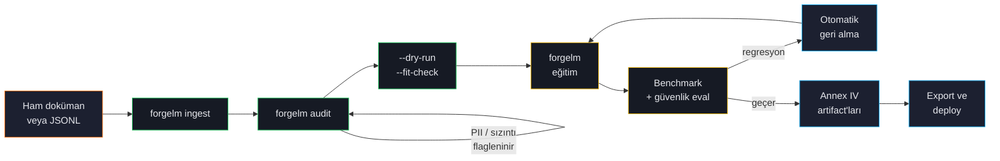

# ForgeLM'e Hoş Geldiniz

**ForgeLM, YAML temelli, kurumsal seviyede bir LLM fine-tuning araç setidir.** Konfigürasyon dosyası girersiniz; size fine-tuned model, denetim kayıtları, güvenlik raporu ve regülatörün görmek isteyeceği Annex IV teknik dokümantasyonu döner.

Bu kullanım rehberi her özelliği detayıyla anlatır — kavramlar, konfigürasyon parametreleri, sık yapılan hatalar ve kendi iş akışlarınıza uyarlayabileceğiniz kopyala-yapıştır YAML örnekleri.

## Bu rehber kimin için

ForgeLM özellikle üç kitle için yapıldı:

- **ML mühendisleri** — fine-tuned modelleri regülasyonlu üretime alması gereken, yeniden üretilebilir, scriptlenebilir bir iş akışı isteyen.
- **Compliance ekipleri** — modelin eğitim verisi, değerlendirmesi ve deploymentının EU AI Act, KVKK / GDPR veya sektör-özgü gereklere uygun olduğunu denetçiye gösterebilmesi gereken.
- **Platform / MLOps mühendisleri** — eğitimi CI/CD hatlarının parçası olarak çalıştıran; tahmin edilebilir exit kodlar, yapılandırılmış log ve webhook entegrasyonu isteyen.

LLM fine-tuning'e yeniyseniz [Temel Kavramlar](#/concepts/alignment-overview) bölümü konfigürasyona geçmeden önce arkadaki fikirleri açıklar.

## ForgeLM ile neler yapılır

:::tip
Aşağıdaki her yetenek YAML üzerinden opt-in. Karmaşıklık maliyetini sadece etkinleştirdiğiniz özellikler için ödersiniz.
:::

| Aşama | ForgeLM'in size sunduğu |
|---|---|
| **Veri hazırlığı** | PDF / DOCX / EPUB / TXT / Markdown ingest'i, PII maskeleme, sırların temizlenmesi, near-duplicate tespiti, kalite filtresi, dil tespiti, split-arası sızıntı kontrolü |
| **Eğitim** | Altı post-training paradigması (SFT, DPO, SimPO, KTO, ORPO, GRPO), QLoRA / DoRA / GaLore, DeepSpeed ZeRO-2/3, FSDP, Unsloth backend |
| **Değerlendirme** | `lm-evaluation-harness` entegrasyonu, OpenAI veya yerel modelle LLM-as-judge, otomatik geri alma ile Llama Guard güvenlik skorlaması |
| **Uyumluluk** | EU AI Act Annex IV artifact üretimi, SHA-256 manifest'li append-only audit log, uygunluk beyanı şablonları |
| **Deployment** | 6 kuantizasyon seviyesi ile GGUF export, Ollama / vLLM / TGI / HuggingFace Endpoints için deployment config, otomatik model card üretimi |

## Bir ForgeLM koşusu nasıl akar

Her node bir `forgelm` komutuna karşılık gelir — toolkit dışında yaşayan bir orkestratör yok. CI/CD sistemleri bu komutları exit kodlarıyla kapı olarak zincirler.

## Bu rehber nasıl düzenlendi

Sol menü konuları yaşam döngüsü aşamasına göre gruplar:

1. **Başlarken** — kurulum, ilk eğitim koşusu, proje yapısı.
2. **Temel Kavramlar** — alignment yığını, trainer seçimi, veri seti formatları.
3. **Eğitim ve Alignment** — her trainer (SFT, DPO, SimPO, KTO, ORPO, GRPO) ve her parametre-verimli yöntem (LoRA, QLoRA, DoRA, GaLore).
4. **Veri** — ingest, denetim, maskeleme, dedup.
5. **Değerlendirme ve Güvenlik** — benchmark, judge, Llama Guard, otomatik geri alma.
6. **Uyumluluk** — Annex IV, audit log, KVKK / GDPR.
7. **Operasyon** — CI/CD, webhook, dağıtık eğitim, air-gap, sorun giderme.
8. **Deployment** — chat, GGUF, deploy hedefleri, model birleştirme.
9. **Referans** — tam konfigürasyon şeması, CLI referansı, exit kodları.

## Nereden başlamalı

:::note
**ForgeLM'e yeniyseniz?** [Kurulum](#/getting-started/installation) ve [İlk Koşunuz](#/getting-started/first-run) sıralı okuyun — yaklaşık 10 dakikalık okuma.
:::

:::note
**Belirli bir modeli fine-tune etmeye mi çalışıyorsunuz?** Doğrudan [Trainer Seçimi](#/concepts/choosing-trainer) bölümüne atlayın — oradaki karar ağacı sizi doğru konfigürasyona yönlendirir.
:::

:::note
**Bir deployment'i compliance açısından mı denetliyorsunuz?** [Uyumluluk Genel Bakış](#/compliance/overview) ve [Konfigürasyon Referansı](#/reference/configuration)'na bakın.
:::

## Bu rehberdeki kullanım kuralları

- **YAML kod blokları** konfigürasyon dosyanıza koyacağınız hâliyle gösterilir. Kapsamı görebilmek için üst seviye anahtarlar her zaman gösterilir.
- **Shell komutları** istemi belirtmek için `$` ile başlar — kopyalarken `$`'ı dâhil etmeyin.
- **`code`** satır içi metinde bir CLI bayrağına, konfigürasyon anahtarına veya dosya yoluna işaret eder.
- **Callout kutuları** ana akışa sığmayan bilgileri öne çıkarır:
  - Note — ek bağlam.
  - Tip — önerilen pratik.
  - Warning — sık yapılan hata.
  - Danger — operasyonel risk; ilerlemeden önce okuyun.

:::warn
ForgeLM gerçek modeller, gerçek veriler ve gerçek GPU'lar üzerinde çalışır. Yanlış konfigüre edilmiş bir koşu güvenlik eşiklerini geçemeyen, PII sızdıran veya sadece çok GPU saati harcayan bir model üretebilir. Dry-run ve fit-check iş akışları ([İlk Koşunuz](#/getting-started/first-run)) bu sorunları size hiçbir maliyet çıkarmadan yakalamak için var — kullanın.
:::

## Teknik terimler hakkında bir not

ForgeLM'in dokümantasyonu teknik terimleri tüm dillerde orijinal hâlinde tutar — `SFT`, `DPO`, `LoRA`, `QLoRA`, `Annex IV`, `GGUF`, `vLLM` vb. Bilinçli bir tercih: bunlar araştırma makalelerinde, kütüphane API'lerinde ve config dosyalarında kullandığınız terimler; çevirmek belirsizlik yaratır. Çevresindeki düz prose tamamen çevrilir.
