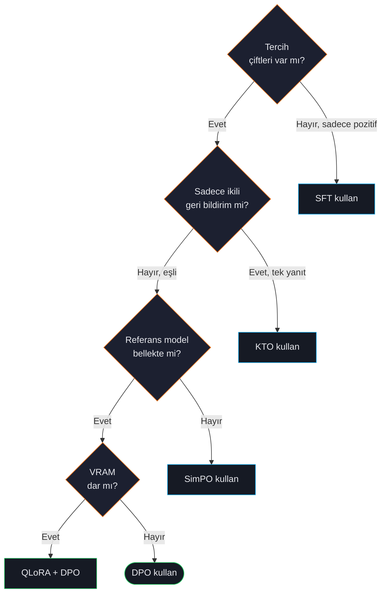
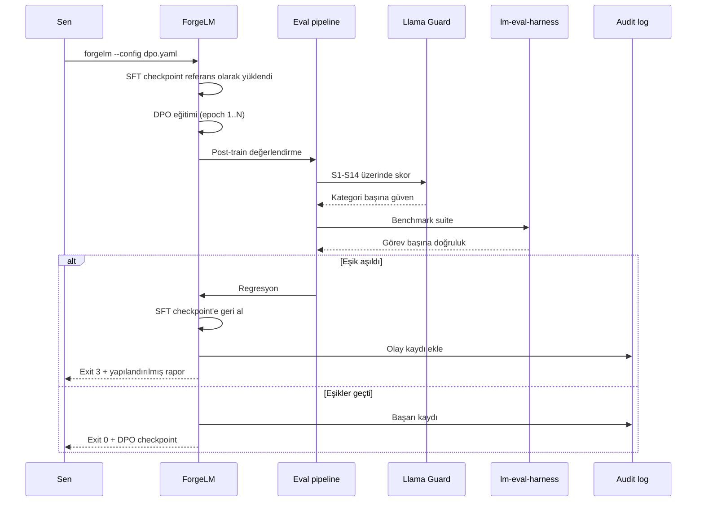

# Direct Preference Optimization (DPO)

DPO, modeli doğrudan (chosen, rejected) yanıt çiftleriyle eğitir; reinforcement learning'in karmaşıklığı veya ayrı bir reward model eğitmek gerekmeden çıktıları insan tercihleriyle hizalar. SFT'den sonra en yaygın alignment tekniğidir.

## Ne zaman DPO



| DPO kullan: | Kullanma: |
|---|---|
| Tercih çiftleri (ör. agent thumbs-up/down) var. | Sadece pozitif örnek var. [SFT](#/training/sft). |
| SFT yaptınız, çıktıları hizalamak istiyorsunuz. | Bellekte referans model yok. [SimPO](#/training/simpo). |
| Kararlı, çalışılmış algoritma. | VRAM dar — DPO ~2× SFT belleği. |
| Closed-form gradient (sampling yok). | Sadece tek-yanıt ikili geri bildirim. [KTO](#/training/kto). |

:::tip
Çoğu üretim ekibi sıralı **SFT → DPO** kullanır: SFT format ve içerik, DPO yanıtlar arası tercihleri keskinleştirir. ORPO ikisini birleştirir ama biraz daha az esnek.
:::

## Hızlı örnek

```yaml
model:
  name_or_path: "./checkpoints/sft-base"   # SFT çıktısı ya da HF model
  max_length: 4096

lora:
  r: 16
  alpha: 32
  method: "lora"
  target_modules: ["q_proj", "k_proj", "v_proj", "o_proj"]

data:
  dataset_name_or_path: "data/preferences.jsonl"

training:
  trainer_type: "dpo"
  num_train_epochs: 1
  per_device_train_batch_size: 2
  gradient_accumulation_steps: 4
  learning_rate: 5.0e-6                    # SFT'in ~10× küçüğü
  dpo_beta: 0.1                            # KL gücü (düz field — `dpo:` altında nested değil)
  output_dir: "./checkpoints/dpo"
```

Çalıştır:

```shell
$ forgelm --config configs/dpo.yaml --dry-run
$ forgelm --config configs/dpo.yaml --fit-check
$ forgelm --config configs/dpo.yaml
```

## Veri formatı

Preference formatı: her satırda `prompt`, `chosen` yanıt, `rejected` yanıt.

```json
{"prompt": "Aboneliği nasıl iptal ederim?", "chosen": "Ayarlar → Faturalandırma…", "rejected": "Sadece ödemeyi durdur."}
```

ForgeLM audit `chosen == rejected` satırları flagler — preference toplamada sık bug.

## Konfigürasyon parametreleri

DPO'ya özel knob'lar `training:` altında flat alanlardır (nested `training.dpo:` bloğu DEĞİL — bkz. `forgelm/config.py` `TrainingConfig`):

| Parametre | Tip | Vars. | Açıklama |
|---|---|---|---|
| `training.dpo_beta` | float | `0.1` | DPO sıcaklığı / KL düzenlemesi. Düşük = referans modele yakın, yüksek = agresif tercih kayması. |
| `training.trainer_type` | string | `"sft"` | DPO eğitim yolunu açmak için `"dpo"` olarak set edin. |

ForgeLM `loss_type` / `label_smoothing` / `reference_free` / `reference_model` / `loss_dpop_lambda` / `pref_chosen_weight`'ı yapılandırılabilir alan olarak **sunmaz** — TRL'in `DPOTrainer`'ı kütüphane varsayılanlarıyla çalışır (sigmoid loss, label smoothing yok, otomatik dondurulmuş referans model). Bu knob'lara ihtiyacınız varsa trainer'ı fork edin.

## Bellek ve compute

DPO bellek-aç. Hem policy hem referans modeli VRAM'de aynı anda tutar.

:::warn
**Eşdeğer SFT'in ~2× VRAM'i.** 12 GB SFT'e sığan 7B model, aynı `max_length` ile DPO için 22-24 GB ister. Çözümler:
- **QLoRA + DPO** — her ikisi 4-bit. Bkz. [LoRA](#/training/lora).
- `max_length` 4096 → 2048.
- **SimPO**'ya geç. Bkz. [SimPO](#/training/simpo).
- `reference_free: true`.
:::

Her zaman uzun DPO öncesi `--fit-check` çalıştırın.

## `beta` seçimi

`beta` en önemli DPO hyperparam'ıdır.

| `beta` | Davranış | Kullan |
|---|---|---|
| `0.01 – 0.05` | Çok yumuşak; referansa yakın. | Yüksek-kalite, dar tercih sinyali; büyük dataset. |
| `0.1` | Varsayılan. Dengeli. | Çoğu iş akışı. **Buradan başla.** |
| `0.3 – 0.5` | Agresif kayma. | Kaba tercihler, küçük dataset. |
| `> 0.5` | Genelde kararsız. | Nadir. |

:::tip
Eğitim loss'u düşüyor ama eval metrikleri geriliyorsa tercihlere over-fit oluyorsunuz — `beta`'yı *düşür*. Tercihler hiç kaymıyorsa `beta`'yı *yükselt* veya `chosen == rejected` kontrol et.
:::

## Güvenlik değerlendirmesiyle DPO



```yaml
training:
  trainer_type: "dpo"
  dpo_beta: 0.1

evaluation:
  require_human_approval: true                    # Madde 14 gözetim kapısı
  auto_revert: true                               # regresyonda geri alır
  safety:
    enabled: true
    classifier: "meta-llama/Llama-Guard-3-8B"
    track_categories: true                        # 14 Llama-Guard kategorisinin hepsini izler
    severity_thresholds:
      S1: 0.05
      S2: 0.05
      S5: 0.10
      S10: 0.05
  benchmark:
    enabled: true
    tasks: ["truthfulqa_mc1", "hellaswag"]
    min_score: 0.45                               # ortalama görevler üzerinde tek taban
```

Post-train Llama Guard puanları bloklu kategorilerde regresyon gösterirse ForgeLM otomatik olarak DPO öncesi checkpoint'e döner.

## Sık hatalar

:::warn
**Aynı `chosen` ve `rejected`.** Belirti: DPO loss anında ~0'a yakınsar. Çözüm: `forgelm audit` koşturun.
:::

:::warn
**Çok yüksek learning rate.** DPO learning rate'e duyarlı. Full fine-tune için 5e-6, LoRA-on-DPO için 1e-5'ten başlayın. SFT learning rate'leri (1e-4 - 5e-4) sapmaya yol açar.
:::

:::warn
**Referans model drift.** SFT ve DPO'yu farklı LoRA adapter'larıyla eğitirseniz DPO'nun referans modeli istediğiniz olmayabilir. SFT checkpoint'ini açık olarak `model.name_or_path`'a verin.
:::

:::danger
**Tek dataset'te SFT ve DPO karıştırmak.** SFT-format satırlarını (`{prompt, completion}`) DPO-format satırlarıyla (`{prompt, chosen, rejected}`) aynı JSONL'a koymayın. Veri loader yönlendiremez. Ayrı dosyalar kullanın.
:::

## Bkz.

- [SFT](#/training/sft) — DPO'nun olağan ön gereksinimi.
- [SimPO](#/training/simpo) — referans modelsiz, daha az VRAM.
- [ORPO](#/training/orpo) — SFT ve DPO'yu birleştirir.
- [Otomatik Geri Alma](#/evaluation/auto-revert) — tercih eğitiminin güvenlik ağı.
