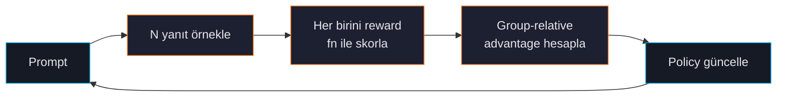

# Group Relative Policy Optimization (GRPO)

GRPO, ForgeLM'in reinforcement-learning trainer'ıdır. Model her prompt için birkaç yanıt üretir, reward fonksiyonunuz onları skorlar, GRPO yüksek-reward çıktıları desteklemek için policy'i günceller. Doğrulanabilir doğruluğu olan görevler (matematik, kod) veya programatik kalite sinyalleri için doğru seçim.

## Ne zaman GRPO

| GRPO kullan: | DPO/SimPO kullan: |
|---|---|
| Reward fonksiyonu yazabiliyorsunuz (math grader, test runner). | Kalite sinyali sadece insan tercihleri. |
| Görevlerin doğrulanabilir doğru cevabı var. | Açık uçlu görevler ("pazarlama maili yaz"). |
| Doğruluk dışında format-shaping reward istiyorsunuz. | Kararlı, çalışılmış eğitim dinamiği. |
| Reasoning model kuruyorsunuz. | Chat asistanı kuruyorsunuz. |



## Hızlı örnek

```yaml
model:
  name_or_path: "./checkpoints/sft-base"
  max_length: 4096

lora:
  r: 16
  alpha: 32
  method: "lora"
  target_modules: ["q_proj", "k_proj", "v_proj", "o_proj"]

data:
  dataset_name_or_path: "data/math-prompts.jsonl"

training:
  trainer_type: "grpo"
  num_train_epochs: 1
  per_device_train_batch_size: 1
  learning_rate: 1.0e-6
  grpo_num_generations: 8         # prompt başına örnek — düz field
  grpo_max_completion_length: 512 # üretim başına üst sınır
  grpo_reward_model: "my_reward.score"  # import edilebilir callable; ForgeLM yerleşik format/length fallback'i ship eder
  output_dir: "./checkpoints/grpo"
```

Yerleşik format/length reward shaping fallback olarak her zaman aktiftir (`forgelm/grpo_rewards.py`); `grpo_reward_model`'i yalnızca domain-spesifik bir scorer'ınız varsa set edin. TRL-tarafı `beta` (KL gücü) TRL varsayılanlarına bağlı — Phase 28+ backlog'u bunu düz field olarak yüzeylemeyi takip ediyor.

```python
# my_reward.py
def score(prompt: str, response: str, ground_truth: str) -> float:
    answer = parse_number(response)
    if answer is None:
        return -0.5
    return 1.0 if abs(answer - float(ground_truth)) < 1e-6 else -1.0
```

## Yerleşik format shaping

ForgeLM şunları ödüllendiren varsayılan reward shaper ile gelir:
- **Format uyumu** — çıktı beklenen formatla biten net cevapla bitiyor (ör. matematik için `\boxed{...}`).
- **Uzunluk uyumu** — ne çok kısa ne dağılarak uzun.
- **Akıl yürütme yapısı** — son cevaptan önce chain-of-thought.

Yerleşik shaper `grpo_reward_model` ile otomatik kompoze olur — ikisi birden mevcut olduğunda kullanıcı-tedarikli reward baskındır ve format/length shaper küçük her-zaman-açık fallback sinyali sağlar. Yapılandırılabilir `format_reward` ağırlığı veya `answer_pattern` knob'u yoktur (bunlar `forgelm/grpo_rewards.py` içinde yaşar). Format-eşleştirme regex setini genişletmek için o modülü fork edin.

## Parametreler

GRPO knob'ları `training:` altında flat alanlardır (nested `training.grpo:` bloğu YOK — bkz. `forgelm/config.py` `TrainingConfig`):

| Parametre | Tip | Vars. | Açıklama |
|---|---|---|---|
| `training.grpo_num_generations` | int | `4` | Prompt başına örneklenen yanıt. Yüksek = daha kararlı advantage tahmini, daha fazla compute. |
| `training.grpo_max_completion_length` | int | `512` | Üretilen yanıt uzunluğu sınırı (legacy alias `grpo_max_new_tokens` kabul edilir). |
| `training.grpo_reward_model` | `Optional[str]` | `null` | Dotted-path callable VEYA HF Hub reward model ID. `null` iken yerleşik `forgelm/grpo_rewards.py` format/length shaper tek reward sinyali olarak kullanılır. |
| `training.trainer_type` | string | `"sft"` | GRPO eğitim yolunu açmak için `"grpo"` olarak set edin. |

ForgeLM `group_size` (gerçeği `grpo_num_generations`), `beta`, `reward_function`, `format_reward`, `answer_pattern` veya `temperature`'ı yapılandırılabilir GRPO field'ı olarak **sunmaz**. KL `beta` ve sampling `temperature` TRL varsayılanlarıyla yönetilir; bunları yüzeylemek Phase 28+ backlog'unda.

## Bellek

GRPO en ağır trainer:
- Prompt başına `grpo_num_generations` yanıt üretir (varsayılan 4) — DPO'nun 4× inference maliyeti.
- Bellekte referans model tutar.
- Reward computation ek model yükleyebilir.

| Model | LoRA | `grpo_num_generations` | VRAM (QLoRA) |
|---|---|---|---|
| 7B | evet | 8 | 18 GB |
| 13B | evet | 8 | 28 GB (40 GB gerekir) |
| 7B | hayır | 8 | ZeRO-3 gerekir |

## Sık hatalar

:::warn
**Yanlış ölçekte reward.** `[0, 1]` (veya `[-1, 1]`) en iyi çalışır. Sınırsız reward (ör. `correct ? 1000 : 0`) gradient patlamasına yol açar. Mantıklı sınırlı aralığa normalize edin.
:::

:::warn
**Çok küçük `grpo_num_generations`.** `grpo_num_generations=2` ile GRPO'nun group-relative advantage tahmininin istatistiksel gücü yok. En az 4, kararlılık için 8+.
:::

:::warn
**Önce SFT yok.** Base modelde GRPO nadir yararlı sonuç verir — model formatı bile çıkaramaz, neredeyse her örnek minimum reward alır. Önce format için SFT, sonra doğruluk için GRPO.
:::

:::danger
**Reward hacking.** Model reward fonksiyonunuzdaki istem dışı pattern'leri sömürür. Sık vakalar:
- Chain-of-thought uzunluğunu ödüllendirme → model sonsuz yazar.
- Son cevabın tam-string eşleşmesini ödüllendirme → model başka şey çıkarmaz.
- "Sözdizim hatası yok"u ödüllendirme → model problemi çözmeyen trivial kod çıkarır.

Eğitimden *önce* reward fonksiyonunuzu adversarial çıktılara karşı test edin. Format shaper yardımcı olur ama tam savunma değildir.
:::

## Bkz.

- [Trainer Seçimi](#/concepts/choosing-trainer) — GRPO ne zaman DPO'yu yener.
- [Otomatik Geri Alma](#/evaluation/auto-revert) — reward-hacking regresyonlarını yakala.
- [Konfigürasyon Referansı](#/reference/configuration).
