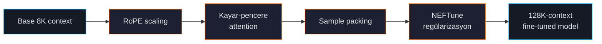

# Uzun Bağlam Eğitimi

Modern base modeller genelde 8K-32K yerel context ile gelir; gerçek-dünya görevleri ise sıklıkla daha fazlasını ister: kitap uzunluğunda dokümanlar, çok-dokümanlı RAG, uzun konuşmalar. ForgeLM 128K token'a kadar eğitimi (ve sürdürülen ön eğitimi) destekler.

## Devreye giren teknikler



| Teknik | Yaptığı |
|---|---|
| **RoPE scaling** | Pozisyon embedding'lerini yeniden ölçeklendirir; model eğitilenden uzun girdileri kabul eder. |
| **Kayar-pencere attention** | Uzun dizileri bellek-verimli şekilde, üst üste binen pencerelerde işler. |
| **Sample packing** | Kısa dizileri birleştirerek her eğitim adımının context'i doldurmasını sağlar. |
| **NEFTune** | Eğitim sırasında embedding'lere gürültü ekler; uzun-context görevlerinde küçük ama tutarlı kazanımlar. |

## Hızlı örnek

```yaml
model:
  name_or_path: "Qwen/Qwen2.5-7B-Instruct"
  max_length: 32768
  rope_scaling:
    type: "linear"
    factor: 4.0                         # 8K base × 4 = 32K
  sliding_window: 4096                  # 4K pencerelerde işle
  load_in_4bit: true

training:
  trainer: "sft"
  packing: true                         # throughput için kritik
  neftune_noise_alpha: 5.0              # eğitim-zamanı embedding gürültüsü

datasets:
  - path: "data/long-docs.jsonl"
    format: "messages"
```

## RoPE scaling tipleri

| Tip | En iyi kullanım | Notlar |
|---|---|---|
| `linear` | Muhafazakar uzatma (2-4×) | Basit, iyi anlaşılan; aşırı faktörlerde hafif kalite kaybı. |
| `dynamic` | Agresif uzatma (4-8×) | Inference'ta girdi uzunluğuna göre ölçeği ayarlar. |
| `yarn` | Maksimum uzatma (8-32×) | YaRN — uç bağlamlarda en iyi kalite. >32K için önerilir. |
| `longrope` | Boyut başına ölçekleme | Per-dim ölçeği öğrenir. En esnek, en çok VRAM. |

8K → 32K için çoğu projede `linear` ve `factor: 4.0` yeterli. 8K → 128K için `yarn` kullanın.

## Bellek bütçesi

Uzun-bağlam eğitimi VRAM-aç — attention dizi uzunluğunda `O(N²)`.

| Context | 7B model VRAM (QLoRA, packing açık) | Notlar |
|---|---|---|
| 4K | 8 GB | Standart. |
| 8K | 11 GB | |
| 16K | 16 GB | Bazı modellerde kayar-pencere gerekli. |
| 32K | 24 GB | Kayar-pencere kuvvetle önerilir. |
| 64K | 40 GB+ | Çoklu-GPU bölgesi; ZeRO-3 yardımcı olur. |
| 128K | 80 GB+ | Agresif offload olmadan çok az kurulum destekler. |

Uzun-bağlam işi göndermeden önce `forgelm --fit-check` ile teyit edin.

## Sample packing

Packing eğitim zamanında birkaç kısa örneği tek sabit-uzunluk diziye toplar:

```text
Packing'siz: [örnek1] padding padding padding padding padding
             [örnek2] padding padding padding padding padding

Packing'li:  [örnek1][örnek2][örnek3][örnek4][örnek5]
```

Çoğu örneğin `max_length`'ten çok kısa olduğu talimat-ayarı verisinde throughput %30-50 artar. SFT için kalite değişmez; ForgeLM örnek sınırları arasında loss'u otomatik maskeler.

```yaml
training:
  packing: true
  packing_max_length: 32768            # genelde = max_length
```

:::warn
Packing örneklerin bağımsız olduğunu varsayar. Tam bağlamı koruması gereken uzun dokümanlarda (kitap bölümleri, kaynak kod repo'ları) `packing: false` ayarlayın.
:::

## NEFTune

Eğitim sırasında embedding'lere Gauss gürültüsü ekler. Sadeliğine rağmen uzun-bağlam genellemesini tutarlı şekilde iyileştirir:

```yaml
training:
  neftune_noise_alpha: 5.0    # alpha=5 tipik tatlı nokta
```

Yüksek `alpha` = daha çok regülarizasyon. 10'un üzerinde model kendisi gürültü üretmeye başlar.

## Sık hatalar

:::warn
**Yeniden eğitim olmadan RoPE scaling.** `rope_scaling.factor: 4.0` ayarlayıp eğitim *yapmamak* nominal context'i uzatır ama model yerel uzunluğu geçtiğinde anlamsız çıktı üretir. RoPE scaling'i etkinleştirdikten sonra (kısa süreli olsa bile) uzun-bağlam verisinde SFT yapmalısınız.
:::

:::warn
**Tokenizer'ın context'ini uzatmayı unutmak.** Bazı tokenizer'lar orijinal context uzunluğuna sınırlanır. RoPE'u konfigüre ettikten sonra `tokenizer.model_max_length` ile doğrulayın.
:::

:::warn
**Eğitimde değil, eval'de OOM.** Eval genelde kayar-pencere veya packing olmadan koşar — eğitim sığsa bile OOM verebilir. Gerekirse eval `max_length`'ini düşürün:
```yaml
evaluation:
  max_length: 4096   # eval yerel context'te, eğitim 32K'da
```
:::

## Sürdürülen ön eğitim

Agresif context uzatma (8K → 128K) için uzun dokümanlar üzerinde özel bir ön-eğitim aşaması yardımcı olur. ForgeLM ön-eğitim trainer'ı yayınlamıyor (kapsam dışı), ancak eğitilen checkpoint sonrasında uzatılmış context'te talimat-takibi için SFT-tune edilebilir.

## Bkz.

- [Konfigürasyon Referansı](#/reference/configuration) — her uzun-bağlam bayrağı.
- [Dağıtık Eğitim](#/training/distributed) — uzun bağlam tek GPU'yu aştığında.
- [VRAM Fit-Check](#/operations/vram-fit-check) — göndermeden önce kontrol.
