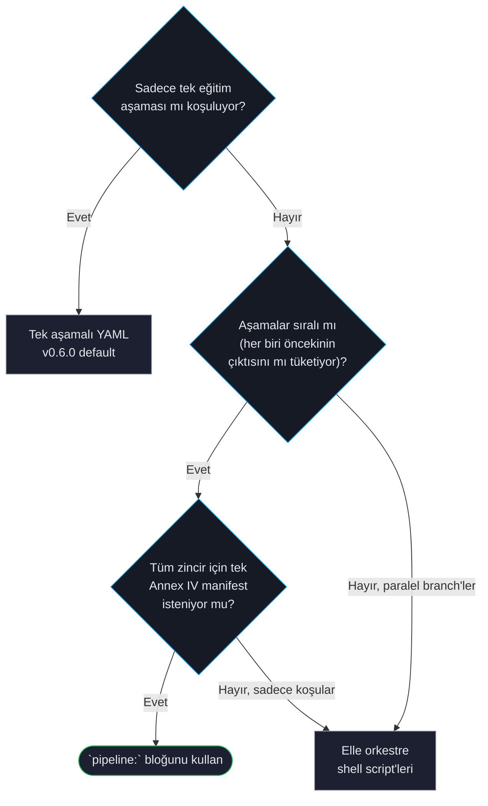

# Çok Aşamalı Pipeline'lar

Bir *pipeline*, 2 veya daha fazla eğitim aşamasını tek bir `forgelm` koşusunda zincirler. Her aşama trainer'ın bakış açısından tek aşamalı bir trainer'dır; sadece orkestratör dış döngünün varlığından haberdardır. Aşama N'in çıktısı otomatik olarak aşama N+1'in girdisi olur, her aşamanın uyumluluk artefactları zincir-seviyesi bir manifeste toplanır ve operatörün tüm akışı sürmek için tek bir CLI çağrısı yeterlidir.

Kanonik zincir **SFT → DPO → GRPO**'dur, ancak desteklenen herhangi bir trainer dizisi (SFT, DPO, SimPO, KTO, ORPO, GRPO) çalışır.

## Pipeline ne zaman kullanılır



`pipeline:` bloğunu **tüm** aşağıdaki koşullar geçerliyse kullanın:

- Sıralı olarak 2 veya daha fazla eğitim aşaması (örn. SFT sonrası DPO).
- Her aşamanın giriş modeli, önceki aşamanın çıkış modelidir.
- Tüm zinciri kapsayan tek bir Annex IV manifest istiyorsunuz.

`pipeline:` bloğunu kullanmayın eğer:

- Sadece tek bir eğitim paradigması koşturuyorsanız. Tek aşamalı config'ler (v0.6.0 default'u) kanonik yol olarak kalır ve Phase-14 öncesi davranışlarını byte-byte korur.
- Aşama bağımlılıkları doğrusal değilse (DAG-şekilli pipeline'lar). Phase 14 sadece sıralı pipeline'lar gönderir; şema ileriki bir DAG genişlemesi için yer ayırıyor.
- Paralel aşama yürütmesi (eş zamanlı bağımsız dallar) gerekiyorsa. DAG desteğiyle aynı zaman ufkunda — Wave 2 veya sonrası.

## Minimal pipeline config

```yaml
# Root — aşmadığı sürece aşamaların miras aldığı varsayılanlar.
model:
  name_or_path: "meta-llama/Llama-3-8B"
lora:
  r: 8
  alpha: 16
training:
  trainer_type: "sft"
  output_dir: "./placeholder"
data:
  dataset_name_or_path: "./placeholder.jsonl"

# Zincir.
pipeline:
  output_dir: "./pipeline_run"
  stages:
    - name: sft_stage
      training:
        trainer_type: "sft"
        output_dir: "./pipeline_run/stage1_sft"
      data:
        dataset_name_or_path: "./data/sft.jsonl"

    - name: dpo_stage
      training:
        trainer_type: "dpo"
        output_dir: "./pipeline_run/stage2_dpo"
        dpo_beta: 0.1
      data:
        dataset_name_or_path: "./data/preferences.jsonl"

    - name: grpo_stage
      training:
        trainer_type: "grpo"
        output_dir: "./pipeline_run/stage3_grpo"
      data:
        dataset_name_or_path: "./data/math_prompts.jsonl"
```

Her aşamanın `model.name_or_path`'ı önceki aşamanın `training.output_dir/final_model`'ına otomatik ayarlanır — aşamalar arasında elle düzenleme gerekmez.

## CLI yüzeyi

```bash
# Tüm zinciri koş.
forgelm --config pipeline.yaml

# Her aşamayı GPU tahsisi yapmadan doğrula — pytest --collectonly tarzı.
forgelm --config pipeline.yaml --dry-run

# Tek bir adlı aşamayı yalıtılmış olarak yeniden koştur (audit / re-run senaryoları).
forgelm --config pipeline.yaml --stage dpo_stage

# Bir crash sonrası adlı aşamadan itibaren devam et; tamamlanmış aşamalar atlanır.
forgelm --config pipeline.yaml --resume-from dpo_stage

# Operatör kaçış kapısı: otomatik zincirlenen giriş modelini override et.
forgelm --config pipeline.yaml --stage dpo_stage --input-model ./other/checkpoint

# Biten bir koşunun zincir-seviyesi Annex IV manifesti doğrula.
forgelm verify-annex-iv --pipeline ./pipeline_run
```

## Orkestratörün size sağladıkları

- **Otomatik zincirleme**: aşama N'in `model.name_or_path`'ı otomatik olarak aşama N-1'in `training.output_dir/final_model`'ına ayarlanır.
- **Crash-safe state**: her geçiş `pipeline_state.json`'ı atomik olarak yazar (tmp + rename). `--resume-from`, zincirin durduğu yerden devam alır.
- **Aşama bazında kapılar**: auto-revert (eval regresyonu), insan onayı ve güvenlik değerlendirmesi aşama başına kompoze olur. Başarısız bir kapı zinciri durdurur; alt aşamalar `skipped_due_to_prior_revert` ile atlanır.
- **Audit olayları**: 7 yeni olay adı her geçişi kapsar — `pipeline.started`, `pipeline.stage_started`, `pipeline.stage_completed`, `pipeline.stage_gated`, `pipeline.stage_reverted`, `pipeline.force_resume`, `pipeline.completed`. Her girdi aynı top-level `run_id`'yi taşır, böylece SIEM-tarzı gruplama tek alan üzerinde çalışır.
- **Zincir-seviyesi Annex IV**: `compliance/pipeline_manifest.json` her aşama bazındaki `training_manifest.json`'ı tek doğrulanabilir artefactta indeksler, hash'lenmiş ve zaman damgalı.
- **Webhook entegrasyonu**: `notify_pipeline_started`, `notify_pipeline_completed`, `notify_pipeline_reverted` mevcut aşama bazındaki `training.*` bildirimleriyle yan yana ateşlenir — mevcut Slack/Teams dashboard'ları değişmeden çalışmaya devam eder.

## Miras matrisi tek bakışta

| Blok | Aşama override edebilir mi? | Aşama atlarsa |
|---|---|---|
| `model` | Evet (toptan) | Önceki aşamadan otomatik zincirlenir; aşama 0 için root |
| `lora` | Evet (toptan) | Root'tan miras alınır |
| `training` | **`trainer_type` her aşamada zorunlu** | Root'tan miras alınır |
| `data` | Evet (aşama başına önerilir) | Root'tan miras alınır |
| `evaluation` | Evet (toptan) | Root'tan miras alınır |
| `distributed`, `webhook`, `compliance`, `risk_assessment`, `monitoring`, `retention`, `synthetic`, `merge`, `auth` | **Sadece root** — aşamada reddedilir | Root'tan miras alınır |

Section-wholesale semantiği: bir aşama bir bloğu adıyla anarsa root'unkini *tamamen* değiştirir (deep-merge yok). "Aşama başına trainer_type zorunlu" kuralı bir audit-clarity validator'ıdır; her aşamanın hangi paradigmayı koştuğunu kaydetmesini garanti eder.

## Sınırlamalar (Phase 14 Wave 1)

- Aşama içi checkpoint resume yok — `--resume-from` sadece aşama sınırlarında çalışır.
- Sadece sıralı; DAG / paralel aşama yürütmesi yok.
- `pipeline.output_dir` üzerinde çoklu-süreç kilidi yok — eş zamanlı koşular için ayrı dizinler seçin.
- Wizard (CLI + web) henüz `pipeline:` blokları üretmiyor; YAML'ı elle yazın veya `config_template.yaml`'dan şablonu kopyalayın. Wizard pipeline desteği gelecek-faz özelliği.

## Ayrıca bakınız

- [Trainer Seçimi](#/concepts/choosing-trainer) — hangi trainer ne zaman seçilir; pipeline'lar trainer seçiminden sonra gelir.
- [Annex IV Uyumluluk](#/compliance/annex-iv) — zincir-seviyesi manifestin indekslediği aşama-bazında manifest formatı.
